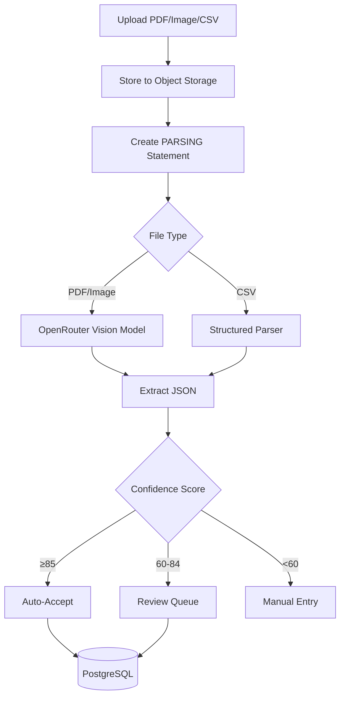

# Document Extraction Domain Model

> **Core Definition**: Parsing financial statements using vision models with confidence scoring.

## Data Flow

## Confidence Scoring

| Factor | Weight | Criteria |
|--------|--------|----------|
| Balance Check | 40% | opening + Σtxn ≈ closing (±0.1) |
| Field Completeness | 30% | Required fields present |
| Format Consistency | 20% | Valid date/amount formats |
| Transaction Count | 10% | Reasonable (1-500) |

**Thresholds**:
- ≥85: Auto-accept
- 60-84: Review queue
- <60: Manual entry required

## Supported Institutions

| Institution | Format | Tier |
|-------------|--------|------|
| DBS/POSB | PDF | v1 |
| CMB (China Merchants Bank) | PDF | v1 |
| Maybank | PDF | v1 |
| Wise | PDF/CSV | v1 |
| Brokerage (generic) | PDF/CSV | v1 |
| Insurance (generic) | PDF | v1 |
| OCBC | PDF | Extended |
| MariBank | PDF | Extended |
| GXS | PDF | Extended |

## Data Integrity

To prevent floating-point errors:

1. **AI Output**: LLM prompt requests monetary values as numbers or strings
2. **Pydantic Validation**: **NEVER** use `float` for `amount` fields. **MUST** use `Decimal`
3. **Database Storage**: Stored as `DECIMAL(18,2)`

## Parsing Resilience

- **Bucket auto-create**: storage ensures the bucket exists before upload
- **Orphan cleanup**: if DB persistence fails after upload, the uploaded object is deleted
- **Stuck job supervisor**: statements stuck in `parsing` longer than 30 minutes are marked `rejected`

## Source Files

- **Models**: `src/models/statement.py`
- **Schemas**: `src/schemas/extraction.py`
- **Logic**: `src/services/extraction.py`
- **Validation**: `src/services/validation.py`
- **Storage**: `src/services/storage.py`
