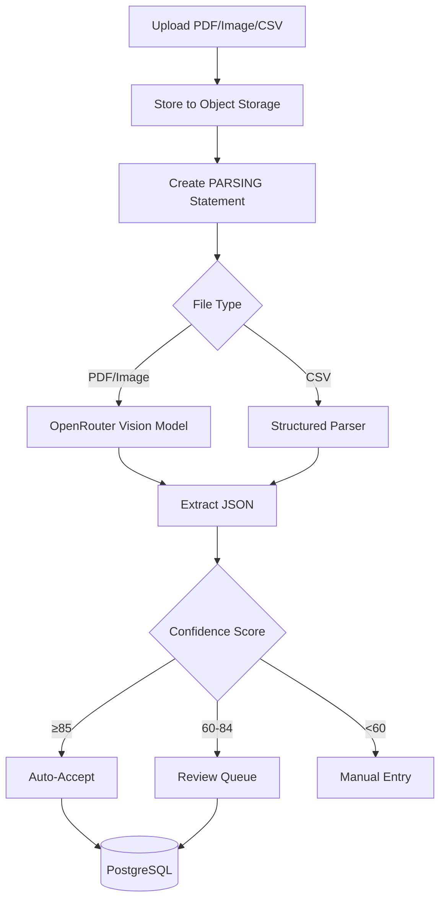

# Document Extraction Domain Model

> **Core Definition**: Parsing financial statements using vision models with confidence scoring.

## Data Flow

```mermaid
flowchart TB
    A[Upload PDF/Image/CSV] --> S[Store to Object Storage]
    S --> P[Create PARSING Statement]
    P --> B{File Type}
    B -->|PDF/Image| C["OpenRouter Vision Model"]
    B -->|CSV| D[Structured Parser]
    C --> E[Extract JSON]
    D --> E
    E --> F{Confidence Score}
    F -->|≥85| G[Auto-Accept]
    F -->|60-84| H[Review Queue]
    F -->|<60| I[Manual Entry]
    G --> J[(PostgreSQL)]
    H --> J
```

## Confidence Scoring (SSOT V2 weights)

Authoritative weights live in `apps/backend/src/extraction/base/validation.py::compute_confidence_score`:

| Factor | Weight | Criteria |
|--------|--------|----------|
| Balance Check | 35% | opening + Σtxn ≈ closing (±0.1); partial credit for small diffs |
| Field Completeness | 25% | Required fields present |
| Format Consistency | 15% | Valid date/amount formats |
| Transaction Count | 10% | Reasonable (1-500) |
| Balance Progression | 10% | `balance_after` chain is arithmetically consistent: `balance_after[n] == balance_after[n-1] ± amount[n]` (±0.10) |
| Currency Consistency | 5% | Single/expected currency across lines |

**Thresholds**:
- ≥85: Auto-accept
- 60-84: Review queue
- <60: Manual entry required

## Supported Institutions

Two distinct support tiers — do not conflate them:

- **Tier-1 structured CSV parsers** (deterministic, in `extraction.py`): DBS,
  POSB, Wise, OCBC, UOB, Standard Chartered, Citibank.
- **AI-detected via prompt hints** (`src/prompts/statement.py`, PDF/image, no
  deterministic parser): DBS, CMB, Maybank, Wise, Moomoo, Futu, IBKR, GXS,
  MariBank, plus generic brokerage and insurance.

Any other institution falls back to generic AI auto-detection. Treat this list
as illustrative — the prompt-hint and CSV-parser source files are authoritative.

## Data Integrity

To prevent floating-point errors:

1. **AI Output**: LLM prompt requests monetary values as numbers or strings
2. **Pydantic Validation**: **NEVER** use `float` for `amount` fields. **MUST** use `Decimal`
3. **Database Storage**: Stored as `DECIMAL(18,2)`

## Parsing Resilience

- **Bucket auto-create**: storage ensures the bucket exists before upload
- **Orphan cleanup**: if DB persistence fails after upload, the uploaded object is deleted
- **Stuck job supervisor**: statements stuck in `parsing` longer than 30 minutes are marked `rejected`

## Source Files

- **Models**: `apps/backend/src/models/statement_summary.py`
- **Schemas**: `apps/backend/src/schemas/extraction.py`
- **Logic**: `apps/backend/src/extraction/` (moved from `services/extraction.py` in the package cutover, #1421)
- **Validation**: `apps/backend/src/extraction/extension/statement_validation.py`
- **Storage**: `apps/backend/src/runtime/extension/storage.py`
