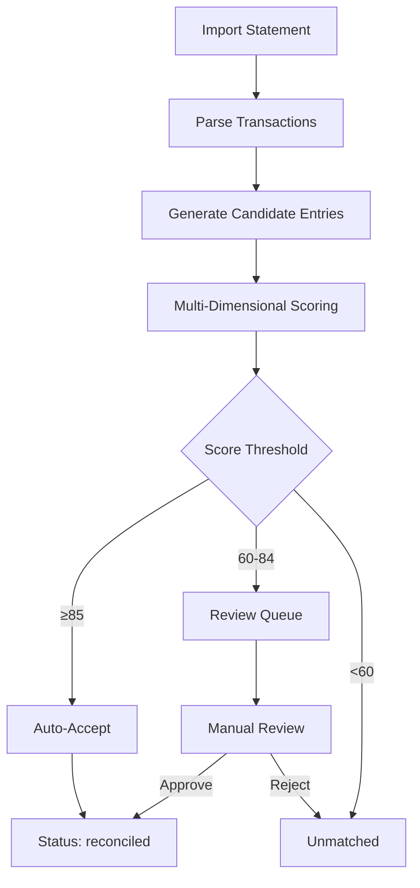
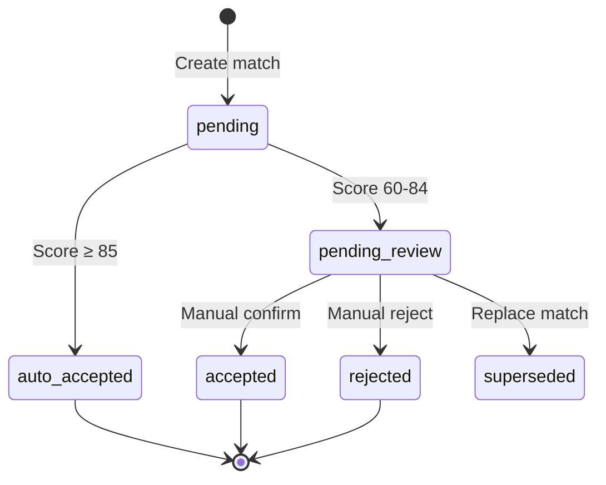

# Reconciliation Engine Domain Model

> **Core Definition**: Bank reconciliation matching algorithm, confidence scoring, and state machine.

## Reconciliation Flow



## State Machine



## Multi-Dimensional Match Scoring

### Scoring Weight Configuration

```yaml
scoring:
  weights:
    amount: 0.40      # Amount matching
    date: 0.25        # Date proximity
    description: 0.20 # Description similarity
    business: 0.10    # Business logic
    history: 0.05     # Historical pattern

  thresholds:
    auto_accept: 85   # Auto-accept
    pending_review: 60 # Enter review queue
    
  tolerances:
    amount_percent: 0.005  # Amount tolerance 0.5%
    amount_absolute: 0.10  # Amount absolute tolerance $0.10
    date_days: 7           # Date tolerance days
```

## Design Constraints

### ✅ Recommended Patterns

- **Pattern A**: Auto-matches must record `score_breakdown` for audit
- **Pattern B**: One-to-many matches must verify amount totals
- **Pattern C**: Cross-period matches extend date tolerance to ±7 days
- **Pattern D**: Review queue updates use row-level locking and increment `version`
- **Pattern E (Performance)**: Pre-fetch candidates for entire statement period

### ⛔ Prohibited Patterns

- **NEVER** mark as matched without scoring
- **NEVER** delete rejected match records (preserve audit trail)

## Standard Operating Procedures

### SOP-001: Handle Unmatched Transactions

1. Check if there's a delayed corresponding record
2. Try expanding date range to re-match
3. Manually create entry and link

### SOP-002: Batch Review

1. Filter pending review records with same counterparty, similar amounts
2. Sample verify 10% of matches for correctness
3. Batch accept or reject

### SOP-003: Handle Fee Discrepancies

1. Identify difference < tolerance threshold
2. Auto-suggest creating fee entry
3. Link as combined match

## Source Files

- **Logic**: `apps/backend/src/services/reconciliation.py`
- **Config**: `apps/backend/config/reconciliation.yaml`
- **Models**: `apps/backend/src/models/reconciliation.py`
