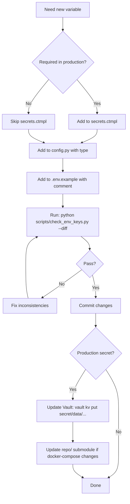

# Secrets & Environment Management

> **Core Philosophy**: Three-layer SSOT for environment variables — Vault (production truth) → config.py (type definitions) → .env.example (documentation).

---

## 1. The Three-Layer SSOT

```
┌─────────────────────────────────────────────────────────────────┐
│ Layer 1: secrets.ctmpl (Vault Template)                         │
│ - Production/Staging SSOT                                        │
│ - Renders secret/data/{project}/{env}/{component}               │
│ - CI validates this matches config.py                           │
└─────────────────────────────────────────────────────────────────┘
                            │
                            ▼
┌─────────────────────────────────────────────────────────────────┐
│ Layer 2: config.py (Backend Code SSOT)                          │
│ - Pydantic Settings with type hints                             │
│ - Default values for local dev                                  │
│ - Validation rules (Field constraints)                          │
└─────────────────────────────────────────────────────────────────┘
                            │
                            ▼
┌─────────────────────────────────────────────────────────────────┐
│ Layer 3: .env.example (Documentation SSOT)                      │
│ - [VAULT] markers for production-managed vars                   │
│ - Comments explaining purpose                                   │
│ - Safe default values for local dev                             │
└─────────────────────────────────────────────────────────────────┘
```

### Validation Chain

```bash
# CI runs this on every PR
python scripts/check_env_keys.py --diff

# Checks:
# 1. secrets.ctmpl variables ⊆ config.py fields
# 2. config.py fields ⊆ .env.example variables
# 3. No orphaned variables in any layer
```

---

## 2. Environment Strategy

| Environment | Purpose | Secrets Source | Container Names | Health Check |
|-------------|---------|----------------|-----------------|--------------|
| **Local** | Development | `.env` file or defaults | `finance-report-*` | Optional |
| **CI** | Automated tests | GitHub Secrets | `finance-report-*` | Required |
| **PR Test** | Deployment validation | Dokploy ENV + Vault | `finance-report-*-pr-{N}` | Required |
| **Staging** | Pre-production | Vault (`staging` path) | `finance-report-*-staging` | Required |
| **Production** | Live system | Vault (`production` path) | `finance-report-*` | Required |

### Vault Path Convention

```
secret/data/{project}/{environment}/{component}
           └─────┬─────┘ └────┬─────┘ └───┬───┘
              Project       ENV        Service
              
Examples:
  secret/data/finance_report/production/app
  secret/data/finance_report/staging/postgres
  secret/data/finance_report/pr-47/app  (ephemeral)
```

---

## 3. Variable Classification

### Required Variables (secrets.ctmpl)

**MUST be in Vault for production/staging**:

```python
# Backend (apps/backend/src/config.py)
DATABASE_URL           # PostgreSQL connection string
REDIS_URL              # Redis connection (prod/staging only)
S3_ENDPOINT            # MinIO/S3 endpoint
S3_ACCESS_KEY          # S3 credentials
S3_SECRET_KEY
S3_BUCKET              # Bucket name
OPENROUTER_API_KEY     # AI features (can be empty to disable)
SECRET_KEY             # JWT signing key
CORS_ORIGINS           # Allowed origins

# Observability (optional but recommended)
OTEL_EXPORTER_OTLP_ENDPOINT
OTEL_SERVICE_NAME
OTEL_RESOURCE_ATTRIBUTES
```

### Optional Variables (config.py defaults)

**Have sensible defaults, rarely need override**:

```python
DEBUG=false                          # Never true in prod
BASE_CURRENCY=SGD                    # Base accounting currency
PRIMARY_MODEL=google/gemini-2.0-flash-exp:free
FALLBACK_MODELS=qwen/...,nvidia/...
OPENROUTER_DAILY_LIMIT_USD=2
JWT_ALGORITHM=HS256
ACCESS_TOKEN_EXPIRE_MINUTES=1440     # 24 hours
```

### Infrastructure Variables (direnv managed)

**NOT in application config**:

```bash
# Managed by direnv (.envrc) or CI secrets
DOKPLOY_API_KEY        # Deployment automation
DOKPLOY_URL
VAULT_ADDR             # Vault server URL
VAULT_ROOT_TOKEN       # Admin operations only
VAULT_APP_TOKEN        # Per-service read-only
VPS_HOST               # Production server
```

---

## 4. Frontend Variables (Next.js)

### Critical Rule: NEXT_PUBLIC_ Must Be Baked

```dockerfile
# apps/frontend/Dockerfile
ARG NEXT_PUBLIC_API_URL=""
ARG NEXT_PUBLIC_APP_URL="http://localhost:3000"

ENV NEXT_PUBLIC_API_URL=${NEXT_PUBLIC_API_URL}
ENV NEXT_PUBLIC_APP_URL=${NEXT_PUBLIC_APP_URL}

RUN npm run build  # Values are frozen into static files here
```

**Why**: Next.js embeds `NEXT_PUBLIC_*` at **build time**, not runtime.

### Backend Reference to Frontend

```python
# config.py
next_public_app_url: str = Field(
    default="http://localhost:3000",
    validation_alias="NEXT_PUBLIC_APP_URL",
)
```

Backend reads this when it needs to generate links back to the frontend (e.g., OAuth redirects, email links).

---

## 5. Vault Integration

### Vault Agent Flow (Production)

```
┌─────────────┐
│  Vault KV   │  secret/data/finance_report/production/app
└──────┬──────┘
       │
       ▼
┌─────────────────┐
│  vault-agent    │  Sidecar container
│  (template)     │  - Reads secrets.ctmpl
└──────┬──────────┘  - Renders to /etc/vault/secrets
       │
       ▼
┌─────────────────┐
│  Application    │  Reads from /etc/vault/secrets (env file)
│  Container      │  or directly from Vault via VAULT_APP_TOKEN
└─────────────────┘
```

### secrets.ctmpl Template Syntax

```hcl
{{ with secret (printf "secret/data/finance_report/%s/app" (env "ENV")) }}
DATABASE_URL={{ with .Data.data.DATABASE_URL }}{{ printf "%q" . }}{{ else }}""{{ end }}
REDIS_URL={{ with .Data.data.REDIS_URL }}{{ printf "%q" . }}{{ else }}""{{ end }}
S3_ACCESS_KEY={{ with .Data.data.S3_ACCESS_KEY }}{{ printf "%q" . }}{{ else }}""{{ end }}
{{ end }}
```

**Key Points**:
- `(env "ENV")` reads container ENV var (set by Dokploy: `production`, `staging`, `pr-47`)
- `{{ printf "%q" . }}` quotes values (handles special chars)
- `{{ else }}""{{ end }}` provides fallback for missing keys

### Vault Token Types

| Token Type | Purpose | Scope | Storage |
|------------|---------|-------|---------|
| `VAULT_ROOT_TOKEN` | Admin operations | All paths, write access | 1Password (`op://Infra2/.../Token`) |
| `VAULT_APP_TOKEN` | Runtime secret reading | Read-only, service-specific | Dokploy ENV per service |

**Security Rule**: Never use `VAULT_ROOT_TOKEN` in application containers. Only for `invoke vault.setup-tokens` and manual admin tasks.

---

## 6. Workflow: Adding a New Variable

### Step-by-Step



### Example: Adding FEATURE_FLAG_X

```bash
# 1. Determine classification
# Optional feature toggle → Not required in secrets.ctmpl

# 2. Add to config.py (with type and default)
cat >> apps/backend/src/config.py <<'EOF'
    # Feature Flags
    feature_flag_x: bool = Field(
        default=False,
        validation_alias="FEATURE_FLAG_X",
    )
EOF

# 3. Add to .env.example (with documentation)
cat >> .env.example <<'EOF'
# Feature Flags
# Optional: Enable experimental feature X
FEATURE_FLAG_X=false
EOF

# 4. Validate consistency
python scripts/check_env_keys.py --diff

# 5. If all checks pass, commit
git add apps/backend/src/config.py .env.example
git commit -m "feat: add FEATURE_FLAG_X configuration"
```

---

## 7. Multi-Environment Isolation

### Container Naming Pattern

```python
# Deterministic naming prevents cross-environment conflicts
def get_container_name(service: str, env: str) -> str:
    if env == "production":
        return f"finance-report-{service}"
    elif env == "staging":
        return f"finance-report-{service}-staging"
    elif env.startswith("pr-"):
        return f"finance-report-{service}-{env}"
    else:  # local/ci
        return f"finance-report-{service}"
```

**Critical**: In Dokploy shared network, container names ARE hostnames. Use unique names to prevent routing conflicts.

### Database Isolation

```bash
# Local test isolation (per-branch)
export BRANCH_NAME=$(git branch --show-current)
export WORKSPACE_ID=$(echo $PWD | sha256sum | cut -c1-8)

moon run :test
# Creates container: finance-report-db-fix-auth-abc12345
# Binds to port: 5400-5999 (deterministic from branch name)
```

---

## 8. Debugging Environment Issues

### Check Variable Sources

```bash
# 1. Local: Check .env file
cat .env | grep DATABASE_URL

# 2. Dokploy: Check service ENV
python scripts/check_dokploy.py | jq '.env'

# 3. Vault: Check secret
export VAULT_ADDR=https://vault.zitian.party
vault kv get secret/data/finance_report/production/app

# 4. Container: Check runtime ENV
docker exec finance-report-backend env | grep DATABASE
```

### Common Issues

| Symptom | Likely Cause | Fix |
|---------|--------------|-----|
| Variable not found | Missing in secrets.ctmpl | Add to template + update Vault |
| Type error | Wrong type in config.py | Fix type hint + validation |
| Vault render failed | `ENV` not set in container | Add `ENV=production` to Dokploy |
| NEXT_PUBLIC_ empty | Not in Dockerfile ARG | Add ARG + ENV in Dockerfile |
| CORS error | CORS_ORIGINS mismatch | Update in Vault + redeploy |

### Validation Script

```bash
# Full environment validation (runs env_smoke_test.py)
moon run :dev -- --check

# Critical-only check (for CI)
moon run :dev -- --check -- --critical-only

# What it tests:
# - Database connectivity
# - S3/MinIO access
# - Redis connection (if REDIS_URL set)
# - AI API key validity (if OPENROUTER_API_KEY set)
```

---

## 9. Security Best Practices

### DO

✅ Use `[VAULT]` markers in `.env.example` for production secrets  
✅ Provide safe defaults in `config.py` for local dev  
✅ Validate all variables at startup (Pydantic Settings)  
✅ Use `Field(validation_alias=...)` for case variations  
✅ Store secrets in Vault, never in `.env.example`  
✅ Use per-service `VAULT_APP_TOKEN` (read-only)  
✅ Rotate `SECRET_KEY` and `VAULT_ROOT_TOKEN` regularly  

### DON'T

❌ Commit `.env` files to git (add to `.gitignore`)  
❌ Use `VAULT_ROOT_TOKEN` in application containers  
❌ Hardcode secrets in `config.py` defaults  
❌ Share `VAULT_APP_TOKEN` across services  
❌ Use generic container names in shared networks  
❌ Skip CI validation (`check_env_keys.py`)  
❌ Modify Vault secrets without updating `secrets.ctmpl`  

---

## 10. Reference Files

| File | Purpose | SSOT |
|------|---------|------|
| `apps/backend/src/config.py` | Backend configuration (type definitions) | Code SSOT |
| `.env.example` | Variable documentation | Documentation SSOT |
| `repo/finance_report/finance_report/10.app/secrets.ctmpl` | Vault template for app | Vault SSOT |
| `repo/finance_report/finance_report/01.postgres/secrets.ctmpl` | Vault template for DB | Vault SSOT |
| `scripts/check_env_keys.py` | Consistency validation script | CI gate |
| `scripts/env_smoke_test.py` | Runtime environment testing | Validation |

---

## 11. Operational Playbooks

### Change Production Secret

```bash
# 1. SSH to VPS or use Vault CLI locally
export VAULT_ADDR=https://vault.zitian.party
export VAULT_ROOT_TOKEN=$(op read 'op://Infra2/.../Token')

# 2. Update secret in Vault
vault kv put secret/data/finance_report/production/app \
  DATABASE_URL="postgresql://..." \
  S3_ACCESS_KEY="new-key" \
  S3_SECRET_KEY="new-secret"

# 3. Restart service (vault-agent auto-renders)
python scripts/dokploy_deploy.sh finance-report production

# 4. Verify
python scripts/debug.py logs backend --env production --tail 20
# Should see: "Starting server on 0.0.0.0:8000"
```

### Add New Environment (e.g., `qa`)

```bash
# 1. Create Vault path
vault kv put secret/data/finance_report/qa/app \
  DATABASE_URL="..." \
  SECRET_KEY="..."

# 2. Update Dokploy compose
# Set ENV=qa in service environment

# 3. Deploy
ENV=qa python scripts/dokploy_deploy.sh finance-report qa

# 4. Container will render secrets from secret/data/finance_report/qa/app
```

### Rotate JWT Secret

```bash
# 1. Generate new secret
python3 -c "import secrets; print(secrets.token_urlsafe(64))"

# 2. Update Vault
vault kv patch secret/data/finance_report/production/app \
  SECRET_KEY="<new-secret>"

# 3. Rolling restart (to avoid downtime)
# Old tokens valid until ACCESS_TOKEN_EXPIRE_MINUTES
python scripts/dokploy_deploy.sh finance-report production

# 4. Verify
curl -H "Authorization: Bearer <old-token>" https://report.zitian.party/api/accounts
# Should still work for ~24 hours
```

---

## 12. Integration with CI/CD

### GitHub Actions Workflow

```yaml
# .github/workflows/ci.yml
- name: Check env keys consistency
  run: |
    echo "🔍 Checking secrets.ctmpl ↔ config.py consistency..."
    python scripts/check_env_keys.py --diff
```

**Blocks merge if**:
- Variable in `secrets.ctmpl` missing from `config.py`
- Variable in `config.py` missing from `.env.example`
- Type mismatch between layers

### PR Test Environment

```yaml
# .github/workflows/pr-test.yml
- name: Deploy Test Environment
  env:
    ENV: pr-${{ github.event.pull_request.number }}
  run: |
    # Dokploy creates ephemeral containers
    # Vault path: secret/data/finance_report/pr-47/app
    python scripts/dokploy_deploy.sh finance-report $ENV
```

---

## 13. Troubleshooting Checklist

### Application won't start

- [ ] Check `docker logs finance-report-backend` for missing vars
- [ ] Verify `ENV` variable is set in container (`docker exec ... env | grep ^ENV=`)
- [ ] Confirm Vault path exists (`vault kv get secret/data/finance_report/{env}/app`)
- [ ] Validate secrets.ctmpl syntax (`vault-agent -config vault-agent.hcl -dry-run`)

### Variable not updating

- [ ] Vault was updated but container not restarted
- [ ] `vault-agent` sidecar not running
- [ ] Cached ENV in Dokploy (clear and redeploy)
- [ ] Wrong `ENV` value (check container env: `docker exec ... env | grep ^ENV=`)

### Cross-environment pollution

- [ ] Container names are unique per environment
- [ ] Database names/ports are isolated
- [ ] Redis key prefixes include environment
- [ ] S3 buckets are environment-specific

---

## The Proof (Verification)

```bash
# 1. Consistency validation
python scripts/check_env_keys.py --diff
# Expected: ✅ All checks passed

# 2. Runtime validation
moon run :dev -- --check
# Expected: ✅ Database OK, ✅ S3 OK, ✅ Redis OK (if set)

# 3. Production check
python scripts/debug.py status backend --env production
# Expected: Container running, healthy

# 4. Vault read test
vault kv get secret/data/finance_report/production/app
# Expected: All keys present, no empty values

# 5. Frontend build test (NEXT_PUBLIC_ baked)
cd apps/frontend
npm run build
grep -r "NEXT_PUBLIC_APP_URL" .next/static
# Expected: Actual URL, not placeholder
```

---

## External References

- [Vault Agent Templates](https://developer.hashicorp.com/vault/docs/agent-and-proxy/agent/template)
- [Pydantic Settings](https://docs.pydantic.dev/latest/concepts/pydantic_settings/)
- [Next.js Environment Variables](https://nextjs.org/docs/app/building-your-application/configuring/environment-variables)
- [SSOT: Development](../../../docs/ssot/development.md)
- [SSOT: Observability](../../../docs/ssot/observability.md)
