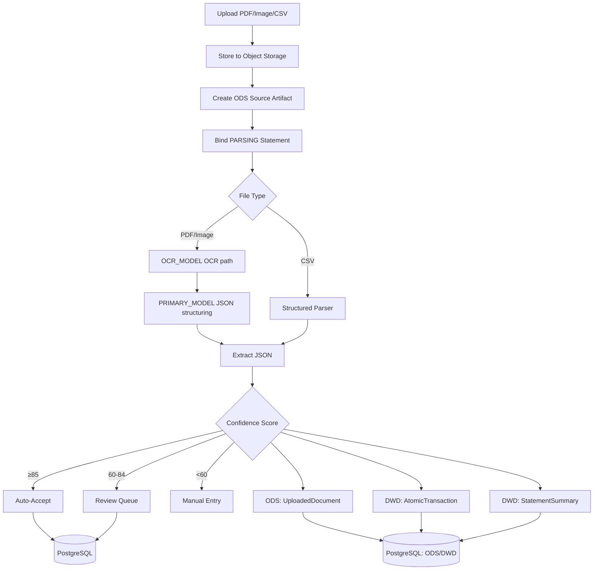

# `extraction` — statement parsing bounded context

> One package owning the whole document-extraction concept: the **prose SSOT for
> the extraction pipeline** (this file) **and**, after the code cutover (#1421),
> the conforming implementation. This readme is the single registered owner of
> the extraction-pipeline rationale, the confidence-scoring tiers
> ([§Confidence Scoring](#confidence-scoring)), and the audit-failed case
> registry policy — internalized here from the retired `docs/ssot/extraction.md`
> per the package-migration standard
> ([`../meta/migration-standard.md`](../meta/migration-standard.md), step 3 "SSOT
> internalized").
>
> The machine-readable audit-failed case registry is a sibling data file:
> [`audit-failed-cases.yaml`](./audit-failed-cases.yaml). The conforming backend
> implementation lives at
> [`apps/backend/src/extraction/`](../../apps/backend/src/extraction)
> and its siblings (the code cutover #1421 homes them under the package shape).

This document defines the Single Source of Truth for the document extraction feature.

## Overview

### Bounded-context decision

`extraction` owns the source-document-to-fact boundary: ingestion, parsing,
validation, review disposition, correction, and provenance. It consumes audit
value/evidence ports, identity's user language, ledger command ports, the LLM
facade, observability language, platform composition, and runtime storage ports
without taking ownership of those concerns. It does not own final ledger facts,
provider configuration, valuation resolution, reconciliation matching, or
report presentation. The machine-readable boundary and relationships are in
[`contract.py`](./contract.py).

The extraction pipeline parses financial statements (PDFs, images, CSVs) with the configured AI provider. PDF/image uploads use `OCR_MODEL` (default `glm-4.6v`) as the OCR-capable model. When `OCR_MODEL` is a separate model from `VISION_MODEL`, the service uses the provider layout parser first, then structures Markdown with `PRIMARY_MODEL` (default `glm-5.1`). When `OCR_MODEL` equals `VISION_MODEL`, the service skips layout parsing and uses the shared vision OCR path directly. Z.AI PDF vision extraction renders the uploaded PDF bytes into a bounded set of in-memory PNG `image_url` payloads; short-lived external URLs are used only when no bytes are available. Inline base64 PDF payloads are reserved for dedicated layout parsing and non-Z.AI compatibility. JSON extraction disables GLM thinking by default and caps output tokens to keep provider latency bounded. Uploads immediately create a `parsing` record, and a background worker updates the statement once parsing completes.

## Statement ingestion application boundary

`StatementIngestionUseCase` is the only production owner of load -> extract ->
persist -> review/promotion -> posting sequencing. The API fallback and Prefect
flow are transport adapters around the same object. The app composition root
constructs it with immutable ports for the session maker, source-content loader,
reconciliation transfer facts, FX lookup, brokerage review, and clock; importing
`src.main` or mutating a package-global provider is never part of worker startup.

The upload transaction first persists one ODS `UploadedDocument`, binds it to the
`StatementSummary`, and materializes its source-evidence node before it dispatches
asynchronous parsing. Parsing enriches the same artifact with its typed result and
resolved bank/brokerage type; it never creates a second source document or relies
on transient attributes of the DWD summary for a file path or display filename.

Only a typed extraction/source failure may move a statement to `rejected`.
Missing composition, storage/database failures, and unexpected application
exceptions raise typed ingestion errors so durable execution can retry without
misrepresenting infrastructure failure as bad user data. Retrying finalization
is idempotent by statement and atomic-transaction identity.

## Extraction Result And Economic Disposition

Every transport receives the same `StatementExtractionResult`; it is the
versioned source-to-fact record, not an ORM tuple. Its result identity and
content digest anchor ODS/DWD projection and audit trace records. `source_type`
states the institution class (bank or brokerage), while `evidence_type` states
the required source shape (`transaction_ledger` or `position_snapshot`): this
single entity owns the missing-fact and review-only decision. A brokerage cash
ledger therefore never requires positions, and a position snapshot never
manufactures cash balances. Schema-v1 metadata remains readable; schema-v2
writes require explicit `evidence_type`. A source may truthfully omit facts:
transaction-only CSV is `manual_trusted`, settlement-note lot/fee/dividend
ingestion is currently a declared `gap`, and bank/brokerage statement extraction
is `supported`. Capability declarations describe product semantics only;
test-node coverage belongs to `common/testing`.

`DispositionPolicy` is the only extraction-owned statement-to-ledger semantic
boundary. It consumes one typed `IntentProposal`, a reviewed counter-account,
and accepted-transfer context, then returns either a balanced command, an
already-covered transfer decision, or a review reason. Each proposal records
its closed origin: a reviewed deterministic rule, a live LLM proposal, or an
accepted reconciliation fact. Trace authority derives only from that origin;
economic intent and cash direction never imply either economic meaning or
authority. Income, expense, refund, and loan-interest may affect P&L; transfer,
investment purchase/sale, loan principal, and card repayment require their
matching asset/liability context and cannot be converted into income or expense
by fallback. `off`, `observe`, and `enforce` calculate the same versioned
decision; only `enforce` applies a command. Composition resolves the closed
`STATEMENT_DISPOSITION_MODE` once; it is not a per-route boolean override.
Every decision also captures an immutable `StatementDispositionPolicySnapshot`:
the policy/mode, machine and P&L confidence gates, unknown/ambiguous-review
routes, live-proposal state, and deployment commit. Trace records bind that exact
snapshot, while reporting receives the same published value object for frozen
package disclosure instead of rebuilding policy facts from configuration.

## Upload-First Product Contract

The user-facing input model is upload-first: users provide supported source
documents and exports, and the system converts them into reviewed records before
ledger/report use. Supported upload classes include bank statements, brokerage
statements or settlement notes, CSV exports, ESOP/RSU grant or vesting
documents, property appraisals, insurance or liability statements, and other
future document types registered through the schema and AC workflow.

Extraction owns parsing, source metadata, validation results, and lineage back
to the original file. Downstream automation such as market-data refresh,
portfolio valuation, ESOP schedule presentation, recurring accrual treatment,
and report preparation is delegated to the owning SSOT documents and must not
weaken extraction confidence or balance-validation rules.

## Source Coverage Matrix

Supported source classes, proof levels, review requirements, and traceability
targets are owned by
[`source_coverage_matrix`](../../common/testing/data/source-coverage-matrix.yaml). This document
explains extraction behavior; source-class changes must land through the matrix
and its EPIC -> AC -> test anchors.

## Data Flow



## Data Models

### Ingestion Writes (EPIC-011)

Ingestion writes the ODS/DWD tables directly. A successful parse persists one
`UploadedDocument` (ODS), the deduplicated `AtomicTransaction` rows (DWD), a
`StatementExtractionResultRecord` append-only snapshot, and a `StatementSummary`
effective envelope (DWD). `parse_document` returns one immutable, versioned
`StatementExtractionResult`: source digest/type, exact balance facts,
transactions, positions, confidence, warnings/review reasons, and provenance.
The summary points only to the current immutable result; reparse advances that
pointer instead of overwriting prior source evidence. The persisted ODS/DWD rows
are its explicit projection; callers that need those rows read them by result
identity rather than receiving hidden ORM objects in a tuple. No pre-persistence
metadata is hidden on transient ORM attributes. There
is no legacy `BankStatement` write path and no dual-write flag.

The upload, in-process worker, and durable Prefect worker share one frozen
`ParseJob` value object. Only `ParseJob.to_prefect_params()` crosses the Prefect
boundary, and `from_prefect_params()` reconstructs typed UUIDs in the worker;
raw bytes and database sessions never enter the durable parameter payload.
`DocumentSource` similarly resolves storage path, content, URL, content hash,
and display filename once before `parse_document` dispatches to separate CSV or
vision extraction paths. The parser and Layer-2 writer accept typed
`AsyncSession` seams, and failure handling uses one explicit call contract
rather than runtime signature reflection.

**ODS: Raw Documents (`UploadedDocument`)**
- Stores immutable metadata for every uploaded file
- Maps to `DocumentType`: `bank_statement`, `brokerage_statement`, `esop_grant`, `property_appraisal`
- Status tracking: `uploaded` → `processing` → `completed`

**DWD: Atomic Data (`AtomicTransaction`, `AtomicPosition`)**
- Deduplicated via SHA256 hash of core fields
  (`SHA256(user_id|date|amount|direction|description|reference|disambiguator)`).
  The disambiguator is the persisted statement running balance (`balance_after`)
  when the model supplies it, else a per-occurrence `#occurrence_index` fallback
  (`DeduplicationService.calculate_transaction_hash`). Either way two real but
  otherwise-identical transactions stay distinct, while a genuine duplicate
  extraction of the same row collapses onto the existing record. `balance_after`
  is persisted on the row so the hash is reproducible on re-import.
- Per-transaction fields (`txn_date`, `amount`, `direction`, `description`,
  `reference`, `currency`, `balance_after`) live on `AtomicTransaction`. Atomic
  rows are source-pure: they carry no per-transaction status, confidence, or
  raw OCR text.
- `source_documents` (JSONB) tracks lineage (which files contributed this record)
- Immutable once written (except for appending sources)

**DWD: Statement Envelope (`StatementSummary`)**
- One effective envelope per parsed statement, carrying period, opening/closing
  balances, institution metadata, `file_hash`, the resolved custody `account_id`,
  and a pointer to the current immutable source result.
- Carries review/workflow state: `status`, `stage1_status`,
  `balance_validation_result`, `stage1_reviewed_at`, and `manual_opening_balance`.
- Multi-currency statements (Wise / IBKR / Futu) additionally carry
  `currency_balances` (JSONB `[{currency, opening, closing}]`) so each currency
  has its own opening/closing pair. This is additive: the scalar
  `opening_balance` / `closing_balance` stay populated for the single-currency
  case, and reconciliation runs **per currency** (never summing across
  currencies). See
  [common/reconciliation/readme.md#per-currency-balance-reconciliation](../reconciliation/readme.md#per-currency-balance-reconciliation).
  (#1123 AC1; FX pairing / transfer net-worth / FX P&L deferred as #1123
  AC2/AC3/AC4.)
- A multi-currency **brokerage position snapshot** never turns market values into
  cash opening/closing balances. `currency_balances` is persisted only when the
  source declares exact per-currency balance facts; otherwise the snapshot remains
  review-only evidence. Declared multi-currency balances reconcile independently
  and are never cross-summed. (#1139 AC-B3 / EPIC-017 AC17.4.13.)
- Enums `BankStatementStatus` and `Stage1Status` live in
  `src/extraction/orm/statement_enums.py`.

When a parsed statement fails balance validation, `balance_validation_result`
must preserve the mismatch note from the Decimal balance check. The statement
must remain reviewable instead of silently hiding the reason it cannot be
trusted for auto-accept.

CSV transaction exports that do not contain source statement opening and closing
balances remain missing those source facts. They cannot be auto-approved or
silently completed from a zero/net-flow calculation; a reviewer must confirm the
custody currency, source period, and opening/closing facts before approval.

### Reviewed statement envelope

`ReviewedStatementEnvelope` is an append-only reviewer fact, never a mutation
of `StatementExtractionResult`. `POST /api/statements/{id}/review/envelope`
accepts one complete, typed command pinned to the current result digest: a
user-owned asset account, ISO currency, ordered period, Decimal opening/closing
balances, and a rationale. The service verifies the exact result version,
account currency, and the source transaction balance chain before it materializes
the effective `StatementSummary` projection. It appends a review trace whose
parent is the exact source-result observation.

An identical retry returns the existing review fact. A different command for the
same source result conflicts; after reparse, the prior review is not current and
a new command appends an explicit successor. No parser default, transaction-date
range, JSON sidecar, or in-place source edit can stand in for this decision.
PostgreSQL triggers reject direct updates and deletes of both fact tables; their
statement references are restrictive, so deletion requires an explicit owning
domain purge rather than an implicit cross-domain cascade.
Only a transaction-ledger result missing solely currency, period, or balances
is envelope-reviewable. Position or transaction-currency gaps remain blocked
for the source-specific review path; the API exposes this capability so clients
never present a cash-envelope form for facts it cannot prove.
Stage-1 approval rechecks that the mutable projection still equals the current
complete source result or its current reviewed envelope, so no route or worker
can promote a diverged projection.

### Package-facing statement contributions (#1681)

`resolve_statement_contribution()` and `list_statement_contributions()` are
the only extraction interfaces a report package may use for statement source
facts. A `ResolvedStatementContribution` contains the exact immutable current
`StatementExtractionResult`, persisted source-result id, immutable
uploaded-document reference when one is present, input refs, and current
promotion or reviewed-envelope `TraceRecord` decision. It carries transaction
and position facts exactly as persisted; it never reconstructs a cassette or
exposes `StatementSummary`, `AtomicTransaction`, or `AtomicPosition` rows to a
consumer.

The contribution is `authoritative` only when its exact source version has its
current target-matching decision. A missing, non-authoritative, stale,
cross-tenant, or target-mismatched decision returns `unproven`. Source type,
parser confidence, import time, and provenance remain display/diagnostic facts,
not an authority shortcut. Report assembly freezes the contribution's ids and
digest; it never resolves a replacement after reopen or export.

`StatementExtractionResult` separately preserves a scalar statement-declared currency.
For a transaction ledger, a scalar declaration or an exact source-declared balance
bucket is required; an individual transaction currency can never fill that gap. A
multi-currency position snapshot does not require a scalar statement currency when
each position declares its own.

## <a id="confidence-scoring"></a>Confidence Scoring

| Factor | Weight |
|--------|--------|
| Balance validation | 35% |
| Field completeness | 25% |
| Format consistency | 15% |
| Transaction count | 10% |
| Balance progression | 10% |
| Currency consistency | 5% |

**Thresholds**:
- ≥85: Auto-accept only after balance validation, account mapping, and source-period uniqueness pass
- 60-84: Review queue
- <60: Manual entry required

**The ~90 ceiling.** The Balance Progression component (10%) is only awarded
when transactions carry a per-line running `balance_after` chain. Statements
that omit per-line balances (most bank/brokerage PDFs) therefore top out near 90
even when every other factor is perfect. This is an inherent ceiling of the
weighting, not a scoring defect — a higher score requires source data that
exposes the running balance per row.

**Under-extraction guard.** A brokerage statement that yields fewer than
`BROKERAGE_MIN_PLAUSIBLE_TXNS` (2) transactions is a strong under-capture signal
— comparable brokerage statements extract ~10 rows. `compute_confidence_score`
caps such parses at `UNDER_EXTRACTION_SCORE_CAP` (60) so under-capture never
presents as high confidence.

If a high-confidence statement fails any Stage 1 posting guard, the parser must
preserve the extracted statement and transactions, set the statement to parsed
pending review, and expose the guard reason for human correction.

**CSV without source balances never auto-approves.** A CSV export that carries
no source statement opening/closing balances is parsed with
`balance_source = missing_from_csv_export`; the parser forces the statement to
`parsed` (review) with `balance_validated = false`, and the confidence score
excludes the balance-validation component (`balance_proof_available = false`).
No inferred `0 + transactions = closing` value is source proof or an approval
precondition.

## API Endpoints

| Method | Path | Description |
|--------|------|-------------|
| POST | `/api/statements/upload` | Upload document and enqueue parsing (202 Accepted) |
| GET | `/api/statements` | Statement list |
| GET | `/api/statements/{id}` | Get statement with transactions |
| GET | `/api/statements/{id}/transactions` | Transaction list |
| GET | `/api/statements/pending-review` | List parsed items needing review, including legacy parsed rows with no `stage1_status` |
| GET | `/api/accounts/coverage` | Account-level latest confirmed source date, stale status, and statement period continuity issues |
| POST | `/api/statements/{id}/review/envelope` | Append a version-pinned reviewer confirmation for missing/corrected envelope facts |
| POST | `/api/statements/{id}/review/approve` | Stage 1 approve with balance-chain validation (canonical) |
| POST | `/api/statements/{id}/review/reject` | Stage 1 reject (canonical) |
| POST | `/api/statements/{id}/approve` | Deprecated compatibility endpoint (proxies to Stage 1 approve) |
| POST | `/api/statements/{id}/reject` | Deprecated compatibility endpoint (proxies to Stage 1 reject) |
| GET | `/api/llm/catalog` | Configured AI provider model catalog for UI selection (EPIC-023; supersedes the retired `/api/ai/models`) |

## Supported Institutions

| Institution | Format | Tier | Notes |
|-------------|--------|------|-------|
| DBS/POSB | PDF | v1 | Singapore bank, GIRO/PayNow |
| CMB (China Merchants Bank) | PDF | v1 | Chinese statements |
| Maybank | PDF | v1 | Malaysia bank |
| Wise | PDF/CSV | v1 | Fintech wallet |
| Brokerage (generic) | PDF/CSV | v1 | Covers Moomoo/IBKR style |
| Insurance (generic) | PDF | v1 | Policy statements |
| OCBC | PDF | Extended | Singapore bank |
| MariBank | PDF | Extended | Digital bank |
| GXS | PDF | Extended | Digital bank |
| Futu (Futu Holdings) | PDF | Extended | HK brokerage |

## Brokerage Position Import

Brokerage extraction feeds Layer 2 `AtomicPosition` through `apps/backend/src/extraction/extension/brokerage_positions.py`.

### Producer routing & positions output schema (#1139)

The single parsing prompt path is `ExtractionService.extract_financial_data` ->
`get_parsing_prompt`. The default bank `SYSTEM_PROMPT` schema is balance/transaction-only
(`institution`/`currency`/`opening_balance`/`closing_balance`/`transactions[]`) and has **no**
positions field, so a brokerage statement parsed through it can never emit a holdings table —
the consumer-side import (`_iter_structured_positions` -> `import_positions`) has nothing to
consume.

Routing to the brokerage prompt is therefore decided **before** the model call
(`looks_like_brokerage_document(filename, institution)`), reusing the same broker keyword
detection (`detect_broker`) as the post-parse `looks_like_brokerage_payload`. When the upload
filename or institution matches a known broker, `get_parsing_prompt(..., document_kind="brokerage")`
returns `BROKERAGE_POSITIONS_PROMPT`, which adds a top-level `positions[]` array. The bank prompt
is left unchanged for bank documents.

Each position item uses the shape the consumer already understands: an identifier
(`symbol`/`ticker`/`isin`/`asset_identifier`), a `quantity`, a scalar `market_value`, and optional
`price` (closing unit price), `currency`, `asset_type`, `sector`, and `geography`. Cash activity
rows, when present, remain in `transactions[]` (bank shape); positions are the primary output. When
a recognized brokerage document yields **zero** positions, the parsed statement is surfaced as a
visible review flag — it carries a `validation_error` note **and** is routed to the Stage-1
`pending_review` queue (`stage1_status = PENDING_REVIEW`) instead of silently settling with no
holdings.

**Scope note (#1139 vs #1123):** this slice emits a scalar `market_value` per position. A
per-currency NAV / balance array is owned by issue #1123 and is intentionally **not** added here,
to avoid colliding with that parallel slice. The scalar `opening_balance`/`closing_balance`
representation is unchanged.

### Post-parse routing (intentional difference vs bank statements)

Routing after parsing depends on the document class, on purpose (#981):

- **Bank statements** route via `route_by_threshold(confidence, balance_valid)`:
  - **Balance invalid** → `parsed` (review) regardless of confidence (#1141). The statement
    parsed but its running balance does not reconcile, so it enters review carrying a
    `validation_error` and `stage1_status = pending_review`. It never auto-approves and is
    **never** parked in `uploaded`.
  - **Balance valid + confidence ≥ 85** → can auto-approve (`approved`).
  - **Balance valid + confidence ≥ 60** → `parsed` (review).
  - **Balance valid + confidence < 60** → `uploaded` (genuinely low-signal parse → manual entry).
  - CSV exports without source statement balances take the inferred-balance path
    (`has_inferred_csv_balances`), which forces `parsed`/review with `balance_valid = False`.
- **Brokerage statements** always route to `parsed` (review) regardless of `balance_valid`,
  because they reconcile via `AtomicPosition` position snapshots rather than a running-balance
  chain — `balance_valid` is not a meaningful gating signal for them.

So the "balance invalid" outcome now lands **both** a (non-CSV) bank statement and a brokerage
statement in `parsed`/review — a single deterministic, reviewable terminal state (#1141, folding
#1085). `uploaded` is reserved for genuinely low-signal valid-balance parses, not for
parsed-but-unreconciled statements. Owner: `ExtractionService` status selection
(`BankStatementStatus.PARSED if is_brokerage_payload else route_by_threshold(...)`).

### Balance-mismatch lifecycle invariants (#1141)

The single balance-mismatch terminal state (`parsed`, `stage1_status = pending_review`,
`validation_error` set) is consistent across the lifecycle:

- **Retry**: the retry endpoint (`POST /statements/{id}/retry`) accepts `parsed` (alongside
  `rejected`/`parsing`), so a balance-mismatch statement is retriable. `uploaded` remains
  non-retriable, which is now safe because balance-mismatch statements no longer rest there.
- **Reporting authority**: a balance-invalid statement stays visible in extraction review, but
  cannot contribute to a trusted `PackageDocument` until a current authoritative decision
  establishes the exact input. Visibility is not authority.
- **CSV intake** (#1087): CSV parsing cannot auto-detect the institution, so the upload route
  rejects a CSV with a missing institution **synchronously** with HTTP 400 (actionable message)
  instead of accepting (202) and rejecting asynchronously inside the parse worker. PDF/image
  uploads keep institution optional (vision auto-detect).

Parsing priority:
1. Prefer structured `positions`, `holdings`, or `securities` arrays from OCR/LLM output.
2. For Moomoo, recover money-market fund snapshots from subscription rows when no holdings table is available.
3. For Futu, preserve aggregate securities valuation as `FUTU_STOCK_AND_OPTIONS` when the statement only exposes a portfolio total.
4. For Interactive Brokers, consume structured position rows from CSV/PDF extraction payloads.

Import entry points:
- Automatic: successful statement background parsing stores brokerage OCR output in `BankStatement.extraction_metadata`, inspects the structured extraction payload, and imports positions when it contains brokerage `positions`, `holdings`, or `securities`, or when broker detection recognizes the filename/institution/content. The parser calls `BrokeragePositionImportService` with the current statement ID as `source_document_id`.
- Statement-scoped manual: `POST /statements/{id}/brokerage/import` first reads the persisted `BankStatement.extraction_metadata` payload, then falls back to Layer 1 `UploadedDocument.extraction_metadata`, and finally reconstructs cash events from parsed statement transactions. This keeps structured holdings importable even when a brokerage PDF has no bank-style transaction rows.
- Manual/API: `POST /portfolio/brokerage/import` remains available for parsed payload backfills and tests.

Import behavior:
- Creates immutable `AtomicPosition` rows with dedup hash `SHA256(user_id|snapshot_date|asset_identifier|broker)`.
- Re-running the same payload is idempotent and does not create duplicate atomic rows. Automatic background parse import and statement-scoped manual import may overlap for the same statement; the second writer must be counted as an existing atomic position instead of surfacing a duplicate-key 500.
- Brokerage payloads still run entry balance validation. When brokerage cash rows do not reconcile like a bank statement, the statement keeps `balance_validated=false` and a validation note, but routes to `parsed` so position import and asset reporting can continue.
- Reconciliation runs after import to refresh portfolio's `ManagedPosition` projection with latest quantity, market value, currency, and snapshot metadata; extraction hosts its schema-preserving storage representation but does not own the investment-position aggregate.
- A successful statement-scoped brokerage import must make the imported position visible through `GET /portfolio/holdings` and through the balance sheet's broker market valuation adjustment for the same as-of date.
- Import failures do not discard the parsed statement; the statement remains visible and receives a sanitized `validation_error` noting that brokerage positions were not imported.

## Configuration

Required environment variables:
```bash
AI_PROVIDER=zai
ZAI_API_KEY=<YOUR_ZAI_API_KEY>
AI_BASE_URL=https://api.z.ai/api/coding/paas/v4
AI_CHAT_COMPLETIONS_PATH=/chat/completions
AI_LAYOUT_PARSING_PATH=/layout_parsing
AI_MODEL_CATALOG_SOURCE=configured
PRIMARY_MODEL=glm-5.1
OCR_MODEL=glm-4.6v
VISION_MODEL=glm-4.6v
FALLBACK_MODELS=glm-5-turbo,glm-5
VISION_FALLBACK_MODELS=glm-4.5v
AI_JSON_TIMEOUT_SECONDS=360
AI_JSON_MAX_TOKENS=8192
AI_JSON_DISABLE_THINKING=true
STATEMENT_DISPOSITION_MODE=enforce
# Optional; off by default. Only set for seed-supporting models (e.g. GLM-5.1) —
# glm-4.6v rejects `seed` with HTTP 400.
AI_JSON_SEED=
AI_DAILY_LIMIT_USD=2
S3_ENDPOINT=http://localhost:9000
S3_ACCESS_KEY=minio
S3_SECRET_KEY=<YOUR_S3_SECRET_KEY>
S3_BUCKET=statements
S3_REGION=us-east-1
S3_PUBLIC_ENDPOINT=https://s3.zitian.party
S3_PUBLIC_BUCKET=statements
S3_PRESIGN_EXPIRY_SECONDS=300
```

## Parsing Resilience

- **Deterministic decoding**: JSON extraction pins `temperature=0` and
  `do_sample=false` so the same statement decodes reproducibly, keeping
  `balance_validated`, `confidence_score`, and Stage-1 routing from flipping
  between uploads of the same source (#989). An optional fixed request `seed`
  (`AI_JSON_SEED`) can further pin decoding, but it is **off by default**: Z.AI/GLM
  validates request params strictly and `seed` is rejected by some models
  (notably `glm-4.6v`, the default vision/OCR model, returns HTTP 400), so it is
  only safe to set for seed-supporting models such as GLM-5.1.
- **Balance-aware self-consistency re-extract**: when a bank statement's
  running-balance chain fails to reconcile, `_extract_with_balance_retry`
  re-extracts up to `AI_EXTRACT_MAX_ATTEMPTS` times (each with a varied seed —
  configured seed, then +1, +2 …) and keeps the first parse that reconciles before
  routing to `uploaded` (#989 Step B). Brokerage payloads are never retried; if no
  attempt reconciles, the smallest-difference result is kept so routing is
  unchanged. Only failing parses retry, so average cost is bounded; set
  `AI_EXTRACT_MAX_ATTEMPTS=1` to disable.
- **Running-balance chain-break detection + repair pass** (#1140 / AC-extraction.120):
  bank-statement *under-extraction* (a dropped or misparsed row) is caught by the
  per-currency self-check (`opening + ΣIN − ΣOUT ≠ closing`), but the underlying
  cause is **recall**, which is probabilistic (LLM). Around that soft metric the
  system runs a deterministic seam: `detect_balance_chain_break`
  (`src/extraction/base/validation.py`) walks the ordered transactions' running
  `balance_after` chain and returns the exact index where
  `balance_after[i-1] + signed_amount[i] != balance_after[i]` (within
  `BALANCE_TOLERANCE`), pinpointing where a row went missing. When the
  whole-document re-extract still does not reconcile, `repair_under_extraction`
  (`src/extraction/extension/chain_repair.py`) fires the **repair-pass hook** once: it only
  triggers when the self-check fails *and* the detector finds a region, then asks
  an **injectable** `RegionReExtractor` backend to re-extract just that region,
  keeping the repaired payload only if it reconciles (else the original is kept,
  so routing is unchanged). The detector and decision logic are pure and
  `Decimal`-based (never `float`); the re-extraction backend is injected so CI
  exercises the trigger logic without a live model, and the hook is a safe no-op
  when no backend is wired. **Extraction recall is a SOFT metric** — tracked and
  logged, with **no hard CI gate** — while the balance self-check guard and these
  deterministic chain-break / repair seams stay hard-tested.
- **Bucket auto-create**: storage ensures the bucket exists before upload.
- **Orphan cleanup**: if DB persistence fails after upload, the uploaded object is deleted.
- **Periodic orphan sweep**: old statement storage objects without matching DB records are deleted by
  `src/runtime/extension/storage_sweep.py`; EPIC-003 AC3.8 owns the behavior tests. The grace period
  (`STORAGE_SWEEP_GRACE_PERIOD_HOURS`, default 24h) and run interval
  (`STORAGE_SWEEP_INTERVAL_SECONDS`, default 86400s = daily) are config-driven (issue #356);
  objects younger than the grace period are never deleted.
- **JSON-repair retry**: when a model returns an otherwise-valid object wrapped in
  a markdown code fence or padded with prose, `_extract_json_with_models` performs
  one deterministic repair pass (strip the fence, extract the outermost balanced
  `{...}` object, tracking string literals) before counting a `json_parse` failure.
  This keeps a single malformed-but-recoverable response from rejecting an
  otherwise-valid upload (#982). The repair never invents data and falls back to the
  existing model-chain failure path when no object can be recovered.
- **Stuck job supervisor**: statements stuck in `parsing` longer than 30 minutes are marked `rejected`
  with a validation error so users can retry.
- **Error handler rollback-first**: `_handle_parse_failure` calls `db.rollback()` before re-fetching
  the statement, preventing `PendingRollbackError` cascades from leaving statements stuck.
- **`account_last4` sanitization**: `_sanitize_account_last4()` strips non-alphanumeric characters
  and takes the last 4, preventing `StringDataRightTruncationError` from the VARCHAR(4) column.

## Audit-Failed Case Registry

LLM/OCR is the polymorphic extraction layer for statement formats. The system
does not expand deterministic parser rules just because one provider output or
source layout fails audit. Instead, failed cases are captured in
[`extraction_failed_case_registry`](./audit-failed-cases.yaml) with
sanitized evidence and one of the approved failure categories:

- `parse_schema_failure`
- `balance_mismatch`
- `low_confidence`
- `ambiguous_account_mapping`
- `model_timeout`
- `provider_shape_changed`
- `unsupported_layout`
- `user_review_rejected`

Real source documents, PII, credentials, and full raw statements must not be
committed. A registry case can drive later prompt tuning, model selection,
review workflow changes, or parser work only after a separate EPIC -> AC -> test
slice is registered.

## Model Selection

- **Default**: Uses `OCR_MODEL=glm-4.6v` on the vision OCR path. Dedicated layout parsing is used only when `OCR_MODEL` differs from `VISION_MODEL`.
- **Upload model field**: optional for PDF/image uploads. If omitted, the OCR-first pipeline is used.
- **Manual override**: a selected image-capable model bypasses the default OCR path and is used directly as a vision chat model. Selecting the shared `OCR_MODEL` uses the same vision OCR model.
- **Retry**: `/api/statements/{id}/retry` accepts a model override; omitted uses OCR-first mode.
- **Catalog**: `/api/llm/catalog` returns the configured provider catalog for UI dropdowns (filterable by modality). _(EPIC-023: supersedes the retired `/api/ai/models`.)_
- **Fallback models (text path)**: `FALLBACK_MODELS` (default `glm-5-turbo,glm-5`) are attempted after OCR text extraction when `PRIMARY_MODEL` fails. These structure OCR Markdown and are text-only.
- **Fallback models (vision path)**: `VISION_FALLBACK_MODELS` (default `glm-4.5v`) are appended after the primary OCR/vision model on the vision/image path, deduplicated and order-preserving. Because the vision request carries image content, these fallbacks must be vision-capable; the text-only `FALLBACK_MODELS` are intentionally **not** reused here. A non-retryable failure of the primary vision model (e.g. a provider `400`) therefore falls through to a secondary vision model before the upload is rejected with `ERR_EXT_003` (#1034). Set `VISION_FALLBACK_MODELS` empty to keep the prior single-model behavior.

## Data Integrity & Typing

The monetary-Decimal rule (never `float` for amounts) is owned by
[ledger readme #decimal-rule](../ledger/readme.md#decimal-rule);
extraction restates it for its parse boundary. See:
common/ledger/readme.md#decimal-rule.

To prevent floating-point errors (e.g. `0.1 + 0.2 != 0.3`), the system enforces strict typing:

1.  **AI Output**: The LLM prompt must request a strict JSON object (no markdown or extra text).
2.  **Pydantic Validation**:
    -   **NEVER** use `float` for `amount` fields.
    -   Use `Decimal` with strict mode or string coercion. See: `apps/backend/tests/accounting/test_decimal_safety.py`
    -   Example: `amount: Decimal = Field(decimal_places=2)`
3.  **Database Storage**: Stored as `DECIMAL(18,2)`.
4.  **String Field Sanitization**: AI-extracted string fields with DB length constraints (e.g. `account_last4 VARCHAR(4)`)
    are sanitized before persistence to prevent truncation errors.

> **Float Ban**: Any code found using `float` for currency calculation will be rejected by CI.

## Statement Account Mapping

Automatic journal posting from imported statements must never use a generic
fallback account. Before Stage 1 approval creates posted journal entries, the
statement must resolve to a user-owned asset account by one of these paths:

1. The statement already has an explicit `account_id` selected by the user, and
   that account is user-owned, active, `ASSET`, and in the statement currency.
2. A previous approved statement for the same user has exactly one account
   matching `institution`, `account_last4`, and `currency`.
3. The user explicitly confirms first-upload account creation during Stage 1
   approval; the created asset account is bound to the statement before posted
   journal entries are created.

If no confident match exists, or multiple accounts match the same metadata, the
approval flow must block posting with a clear account-mapping action item. Draft
candidate entries may still use legacy defaults in manual workflows, but posted
entries cannot silently use `Bank - Main`.

Before posted entries are created, the statement must also have a complete
`period_start`/`period_end` source range that does not duplicate or overlap any
approved statement for the same account and currency. High-confidence statements
that fail account or source-period eligibility remain in Stage 1 review instead
of posting automatically.

## Account Coverage Contract

Approved statements are the only source for account-level statement coverage.
`GET /api/accounts/coverage` returns one row per active account/currency pair
with the latest confirmed source date, latest confirmed closing balance, stale
status, and period-level continuity issues.

Coverage checks compare monthly statement periods within each account/currency:

- adjacent monthly statements must have `previous.closing_balance ==
  current.opening_balance` within `BALANCE_TOLERANCE`;
- gaps, overlaps, and duplicate monthly periods are emitted as issues before a
  dashboard can treat the account as complete;
- one-day broker snapshots may override the latest confirmed source date and
  balance without requiring daily statement continuity.

## Files

| File | Purpose |
|------|---------|
| `src/extraction/orm/` (`layer1.py`-`layer3.py`, `evidence.py`, `correction.py`, `statement_enums.py`, `statement_summary.py`) | Package-owned SQLAlchemy fact family + statement envelope (#1675 D5c-D6); reporting owns the former Layer-4 snapshot; cross-domain references are bare FK id columns / registered read-model ports, never `relationship()` or a direct cross-domain import |
| `src/schemas/extraction.py` | Pydantic schemas |
| `src/extraction/extension/` (`service.py`, `_ocr.py`, `_llm_led_gate.py`, …) | Core extraction logic |
| `src/extraction/base/validation.py` | Validation, confidence scoring, running-balance chain-break detector (`detect_balance_chain_break`) |
| `src/extraction/extension/chain_repair.py` | Under-extraction repair-pass hook (`repair_under_extraction`, injectable `RegionReExtractor`) |
| `src/runtime/extension/storage.py` | Object storage uploads + presigned URLs |
| `src/extraction/extension/prompts/statement.py` | Parsing prompt templates |
| `common/testing/fixtures/llm_cassettes/*.json` | Frozen LLM responses for cassette replay (synthetic; the single retained extraction-test mechanism) |
