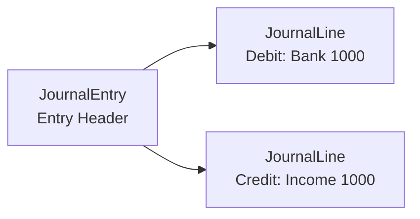
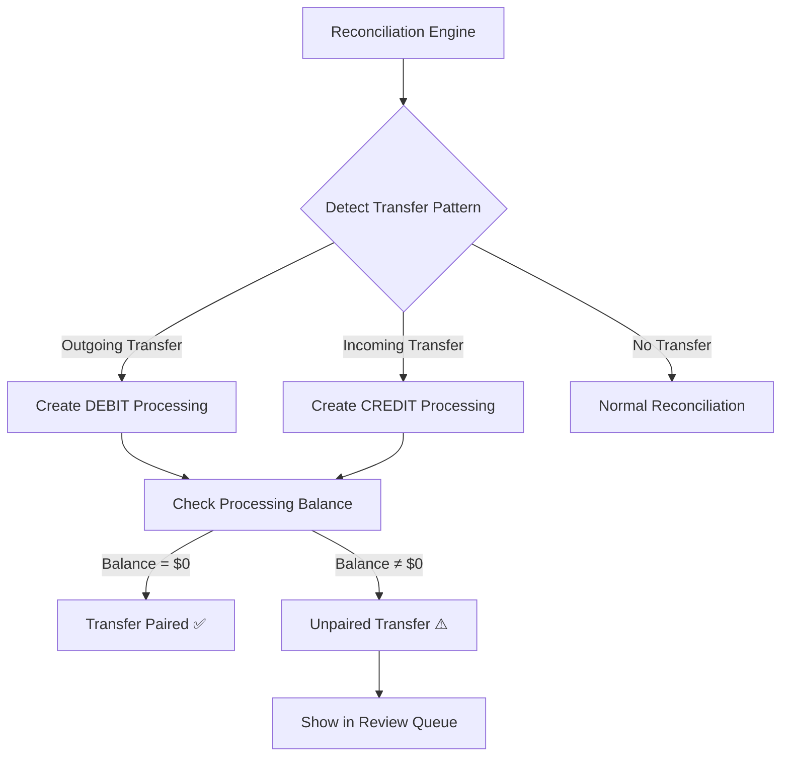
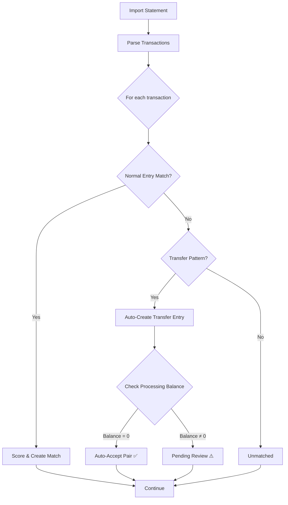

# `ledger` — double-entry bookkeeping bounded context

> One package owning the whole ledger concept: the **prose SSOT for double-entry
> bookkeeping and the processing (in-transit) account** (this file) **and**, after
> the code cutover (#1420), the conforming implementation. This readme is the
> single registered owner of the double-entry vocabulary and invariants — the
> accounting equation, account classification, entry structure, multi-currency
> journal balance, the posted-ledger DB floor, and the `processing_account`
> in-transit model — internalized here from the retired `docs/ssot/accounting.md`
> and `docs/ssot/processing_account.md` per the package-migration standard
> ([`../meta/migration-standard.md`](../meta/migration-standard.md), step 3 "SSOT
> internalized").
>
> The **money/currency/FX value kernel is owned by [`common/audit/money`](../audit/money/readme.md)**,
> not by ledger; a `Leg` carries a `Money` from that shared kernel. The Money value
> types (`#money-type`) were internalized into the money package in the same slice.
>
> The conforming backend implementation lives at
> [`apps/backend/src/ledger/`](../../apps/backend/src/ledger/) (the code cutover
> #1420 homes the double-entry units under the package shape; this readme-only
> slice does not move code or tests).

---

# Double-Entry Bookkeeping Domain Model SSOT

> **SSOT Key**: `accounting`
> **Core Definition**: Accounting equation, account classification, and entry rules for double-entry bookkeeping.

---

## 1. Source of Truth

| Dimension | Physical Location (SSOT) | Description |
|-----------|--------------------------|-------------|
| **Bookkeeping Logic** | `apps/backend/src/ledger/extension/accounting.py` | Core business |
| **Model Definition** | `apps/backend/src/ledger/orm/journal.py` | ORM |
| **Validation Rules** | `apps/backend/src/schemas/journal.py` | Pydantic |

`ConfidenceTier` and `worst_confidence_tier` are co-owned here with journal
provenance. The rollup fails closed: unknown tier strings rank below every known
tier, while callers choose their explicit empty-input default (`None` for a
report aggregation or `DETERMINISTIC` for advisor context).

---

## 2. Architecture Model

<a id="accounting-equation"></a>

### Accounting Equation

```
Assets = Liabilities + Equity + (Income - Expenses)
```

**At any moment, all `posted` entries must satisfy this equation.**

### Account Classification and Debit/Credit Rules

| Type | Debit Increases | Credit Increases | Normal Balance |
|------|-----------------|------------------|----------------|
| Asset | ✓ | | Debit |
| Liability | | ✓ | Credit |
| Equity | | ✓ | Credit |
| Income | | ✓ | Credit |
| Expense | ✓ | | Debit |

### Entry Structure



### Multi-Currency Journal Balance

Journal entry balance is measured in the configured base currency (`SGD` by default), not by raw nominal line amounts. A non-base-currency line must carry `fx_rate`, where:

```
base_amount = line.amount * line.fx_rate
```

Debit and credit totals are valid only when their converted base amounts differ by no more than `0.01`.

Account-balance projections make their currency space explicit in the function
name: `calculate_account_balances` returns nominal amounts in each account's own
currency, while `calculate_account_balances_in_base_currency` performs FX
conversion for equation/reporting checks. No boolean flag can silently change
the meaning of the returned `dict[account_id, Decimal]`.

### Posted Ledger Database Floor

Application services validate drafts before posting, but the database is the
final boundary for posted/reconciled ledger facts. Direct writes that bypass
services must still be rejected when they would create a posted or reconciled
entry with fewer than two lines, unbalanced base-currency debit/credit totals,
or non-base lines without a positive `fx_rate`.

Posted and reconciled entries are immutable ledger facts. They must not be
updated or deleted directly; the only supported correction is a void transition
that preserves an immutable reversal relationship. Draft entries remain editable
and deletable until posting.

Ledger immutability protects accounting facts: entry ownership/date/memo/source
identity, status correction path, and all journal-line amounts, directions,
accounts, currencies, and FX rates. The only non-fact metadata update allowed on
a posted/reconciled entry is the source-type-priority promotion from
`auto_parsed` or `auto_matched` to `user_confirmed`, with `source_id` and every
accounting fact unchanged. The same promotion is allowed when the entry moves
from `posted` to `reconciled`. (The immutability trigger's text guard also
retains the retired legacy value `bank_statement` — see migration 0040 / #896 —
so any historical row in that state can still be promoted, though no write path
produces it anymore.)

---

## 3. Design Constraints (Dos & Don'ts)

> **SSOT**: The rules in this section are the single authoritative definitions.
> Other files that mention these rules should reference:
> `See: common/ledger/readme.md#<anchor>`

### ✅ Recommended Patterns

- **Pattern A**: Each entry has at least 2 lines, debit/credit balanced
- **Pattern B**: Use Decimal for precise calculations, tolerance < 0.01
- **Pattern C**: Posted entries can only be voided, not directly modified
- **Pattern D**: Multi-currency entries validate debit/credit balance after base-currency conversion.
- **Pattern E**: Journal line account authorization is a domain invariant. Accounting services must validate that every `JournalLine.account_id` belongs to the same `user_id` as the `JournalEntry`; HTTP middleware is not sufficient because service calls and background tasks can write ledger records without a request object.
- **Pattern F**: Posted/reconciled ledger invariants are enforced at both service and database boundaries.
- **Pattern G**: Posted/reconciled source-type promotion may only increase trust from auto/statement-derived provenance to `user_confirmed`; it must not change source identity or accounting facts.

### ⛔ Prohibited Patterns

<a id="decimal-rule"></a>

- **Anti-pattern A**: **NEVER** use FLOAT to store, calculate, or transfer monetary amounts.
    -   **Reason**: IEEE 754 floating point arithmetic causes precision errors (e.g., `0.1 + 0.2 != 0.3`).
    -   **Enforcement**: All Pydantic models use `Decimal`. API clients parse JSON numbers as strings or Decimals, never floats.
    -   **Guardrail**: `apps/backend/tests/accounting/test_decimal_safety.py` fuzzes models with float inputs to ensure strictness.

- **Rule A2 — Canonical money rounding**: Currency amounts are quantized to **2 decimal places using banker's rounding (`ROUND_HALF_EVEN`)**. This is the single project-wide rounding mode for money.
    -   **Enforcement**: round money through the one helper `src.audit.money.to_money()` (the backend money module; mirrored from `common/audit/money`). Do not hand-roll `quantize(Decimal("0.01"), rounding=ROUND_HALF_UP)` for currency.
    -   **Scope**: currency amounts only. Intentionally **out of scope** (they keep their own quantization/rounding): typed `ExchangeRate` values, security prices (6 dp), `Quantity` values (6 dp), and percentages / performance ratios (XIRR, TWR, MWR, allocation %).
    -   **Guardrail**: `apps/backend/tests/audit/money/test_money.py`.

> The **money value types** (`Money` / `Currency` / `ExchangeRate` / `convert` /
> `CurrencyBalances`) that make these rules type-enforced are the money Shared
> Kernel, owned by [`common/audit/money/readme.md#money-type`](../audit/money/readme.md#money-type).
> A `Leg` carries a `Money` from that kernel; ledger does not redefine money.

<a id="entry-balance"></a>

- **Anti-pattern B**: **NEVER** allow unbalanced debit/credit entries. See: `apps/backend/tests/accounting/test_accounting_integration.py::test_post_unbalanced_entry_rejected`
- **Anti-pattern C**: **NEVER** skip validation when writing posted status. See: `apps/backend/tests/accounting/test_accounting_integration.py::test_post_journal_entry_already_posted_fails`
- **Anti-pattern E**: **NEVER** validate a multi-currency journal entry by comparing raw original-currency nominal amounts.
- **Anti-pattern F**: **NEVER** create, post, or aggregate journal lines across user boundaries. Balance queries must require both `Account.user_id == user_id` and `JournalEntry.user_id == user_id`.
- **Anti-pattern G**: **NEVER** directly update or delete posted/reconciled/void ledger facts. Use the void/reversal workflow.
- **Anti-pattern H**: **NEVER** downgrade `source_type` or change `source_id` after posting/reconciliation. Provenance corrections must use the explicit source-type promotion path only.

<a id="async-tx-boundary"></a>

- **Anti-pattern D**: **NEVER** call `db.commit()` in service-layer methods that receive a `db: AsyncSession` from a router.
    -   **Rule**: Services use `flush()` to assign IDs and validate constraints. Routers call `commit()` to finalize the transaction.
    -   **Documented Exceptions**:
        1. **Background tasks** with own sessions (via `session_maker()`/`session_factory()`): These create their own `AsyncSession` and ARE the transaction boundary. Example: `statement_parsing.py::parse_statement_background()`, `statement_parsing_supervisor.py::reset_stale_parsing_jobs()`, `market_data_scheduler.py::run_daily_market_data_sync()`.
        2. **Streaming generators** that outlive the router response: When a router returns `StreamingResponse`, the async generator runs after the router has returned. The generator must own the final `commit()` for data written during streaming. Example: `ai_advisor.py::_stream_and_store()` commits the assistant message after streaming completes.
    -   **Enforcement**: `apps/backend/tests/ai/test_commit_boundary.py` verifies flush-only behavior in AI advisor service methods.

---

## 4. Standard Operating Procedures (Playbooks)

### SOP-001: Create Manual Entry

```python
def create_manual_entry(user_id, date, memo, lines: list[dict]) -> JournalEntry:
    # 1. Validate debit/credit balance
    total_debit = sum(l["amount"] for l in lines if l["direction"] == "DEBIT")
    total_credit = sum(l["amount"] for l in lines if l["direction"] == "CREDIT")
    if abs(total_debit - total_credit) > Decimal("0.01"):
        raise ValidationError("Debit/credit not balanced")
    
    # 2. Create entry header
    entry = JournalEntry(
        user_id=user_id,
        entry_date=date,
        memo=memo,
        source_type="manual",
        status="draft"
    )
    
    # 3. Create lines
    for line in lines:
        entry.lines.append(JournalLine(**line))
    
    return entry
```

### SOP-002: Post Entry

```python
def post_entry(entry: JournalEntry) -> None:
    # 1. Re-validate balance
    validate_balance(entry)
    
    # 2. Validate accounts are active
    for line in entry.lines:
        if not line.account.is_active:
            raise ValidationError(f"Account {line.account.name} is disabled")
    
    # 3. Update status
    entry.status = "posted"
    entry.updated_at = datetime.utcnow()
```

### SOP-003: Void Entry

```python
def void_entry(entry: JournalEntry, reason: str) -> JournalEntry:
    # 1. Can only void posted entries
    if entry.status != "posted":
        raise ValidationError("Can only void posted entries")
    
    # 2. Create reversal entry
    reverse_entry = JournalEntry(
        user_id=entry.user_id,
        entry_date=date.today(),
        memo=f"Void: {entry.memo} ({reason})",
        source_type="system",
        status="posted"
    )
    
    for line in entry.lines:
        reverse_entry.lines.append(JournalLine(
            account_id=line.account_id,
            direction="CREDIT" if line.direction == "DEBIT" else "DEBIT",
            amount=line.amount,
            currency=line.currency
        ))
    
    # 3. Mark original entry
    entry.status = "void"
    
    return reverse_entry
```

---

## 5. Verification & Testing (The Proof)

| Behavior | Verification Method | Status |
|----------|---------------------|--------|
| Entry debit/credit balance | Unit test `test_journal_balance` | ⏳ Pending |
| Accounting equation | Integration test `test_accounting_equation` | ⏳ Pending |
| Multi-currency base balance | Unit test `test_AC2_12_1_multicurrency_entry_balances_in_base_currency` | ✅ Implemented |
| Accounting equation base conversion | Integration test `test_AC2_12_2_accounting_equation_uses_base_currency_balances` | ✅ Implemented |
| User-scoped line ownership | Integration tests `test_AC2_13_1_*`, `test_AC2_13_2_*`, `test_AC2_13_3_*` | ✅ Implemented |
| Database ledger invariant floor | Direct DB-bypass tests `test_AC2_14_*` | ✅ Implemented |
| Void logic | Unit test `test_void_entry` | ⏳ Pending |

---

# Processing Virtual Account SSOT

> **SSOT Key**: `processing_account`
> **Core Definition**: Virtual clearing account for in-transit funds during inter-account transfers.

The processing (in-transit) account is part of the ledger bounded context: it is a
system-managed `Account` with special semantics, posted to only through ledger
entries. Reconciliation/reporting consume it **by id/event**, never via a shared
cross-domain transaction or foreign key.

---

## P1. Source of Truth

| Dimension | Physical Location (SSOT) | Description |
|-----------|--------------------------|-------------|
| **Processing Logic (verbs)** | `apps/backend/src/ledger/extension/processing.py` | Core business — acquire/post/project/pair (impure edge) |
| **Processing Policy (pure)** | `apps/backend/src/ledger/base/processing.py` | Account identity + transfer detection, amount/date scoring, and ledger weights (pure core); description similarity is supplied by reconciliation's one kernel |
| **Published Interface** | `apps/backend/src/ledger` (`from src.ledger import ...`) | The only surface consumers (reconciliation/reporting) import |
| **Transfer Detection** | `apps/backend/src/reconciliation/extension/matching.py` | Calls the ledger published interface (by id/event) |

---

## P2. Problem Statement (Vision Context)

From the `vision.md` `decision-5-processing-account` anchor:

**Problem**: Bank A transfers out on Day 1, Bank B receives on Day 3. Where are the funds on Day 2?

**Without Processing Account**:
```
Day 1: Bank A balance decreases by $10,000
Day 2: Total assets = Bank A + Bank B = $X - $10,000  ❌ (funds "disappeared")
Day 3: Bank B balance increases by $10,000
```

**With Processing Account**:
```
Day 1: 
  DEBIT Processing $10,000
  CREDIT Bank A $10,000
  Total assets = Bank A + Bank B + Processing = $X  ✅ (equation holds)

Day 3:
  DEBIT Bank B $10,000
  CREDIT Processing $10,000
  Total assets = Bank A + Bank B + Processing = $X  ✅ (equation holds)
```

**Key Insight**: Processing account balance represents **unconfirmed in-transit funds**. When Processing balance ≠ 0, there are unpaired transfers.

**Visibility Rule**: Processing is hidden from normal user-managed account lists, but it must remain visible through the Advanced Processing drill-down and as a dashboard status card. The dashboard card shows the signed current Processing Account balance. Any non-zero current balance must produce a workflow readiness blocker and Advanced/app-shell attention indicator; the Processing drill-down and dashboard card must show the signed balance and warning context.

---

## P3. Architecture Model

### Account Classification

Processing is a **system-managed Asset account** with special properties:

| Property | Value | Reason |
|----------|-------|--------|
| **Type** | ASSET | Holds value temporarily (like a bank account) |
| **Owner** | System (user_id=NULL initially, then per-user) | Auto-created, not user-editable |
| **Name** | "Processing - [User Email]" | Per-user instance |
| **Code** | "1199" | Asset subgroup (following 11xx pattern for current assets) |
| **Normal Balance** | Debit (ideally $0) | Should self-cancel when transfers pair |
| **Visibility** | Hidden from normal account lists and standard reports; visible in dedicated Processing UI and dashboard status | Internal clearing mechanism with explicit in-transit warning |

### Transfer Detection Flow



### Transfer Matching Logic

**Pattern Recognition**:

| Signal | Weight | Detection Logic |
|--------|--------|-----------------|
| **Amount Match** | 40% | Exact or within 0.5% (accounting for forex/fees) |
| **Description Match** | 30% | Keywords: "transfer", "payment", "withdrawal" → "deposit", "receive" |
| **Date Proximity** | 20% | Within 7 days (T+3 is common) |
| **Account Pair History** | 10% | Same account pair has transfer history |

**Auto-Pairing Threshold**: ≥85 score → automatically create paired entries

**Manual Review**: 60-84 score → show in review queue with suggested pair

Both transfer directions construct the same typed `Entry.transfer` value and
persist it through ledger's `post_entry` front door. They cannot hand-roll a
`POSTED` ORM row or bypass balance, ownership, FX-rate, and posting validation.
The effective Processing currency is mandatory at every processing API boundary;
the delivery layer passes the configured owner value, and ledger has no hidden
`SGD` default.

---

## P4. Data Model

### Schema Change (Migration)

No new table needed. Processing account is a regular `Account` with special semantics.

**System Initialization** (on user registration):

```sql
INSERT INTO accounts (
    id, 
    user_id, 
    name, 
    type, 
    code, 
    currency, 
    is_active,
    is_system,  -- New column: boolean flag
    description
) VALUES (
    gen_random_uuid(),
    :user_id,
    'Processing - ' || :user_email,
    'ASSET',
    '1199',
    :base_currency,  -- Explicit effective base currency from config
    true,
    true,  -- Mark as system account
    'Virtual clearing account for in-transit funds between accounts'
);
```

**New Model Field**:

```python
# apps/backend/src/ledger/orm/account.py
class Account(Base):
    # ... existing fields ...
    is_system: Mapped[bool] = mapped_column(Boolean, default=False, nullable=False)
    # System accounts are hidden from user-facing account lists
```

### Journal Entry Pattern

**Outgoing Transfer (Bank A sends $10k)**:

```python
JournalEntry(
    entry_date=date(2026, 1, 1),
    memo="Transfer OUT to Bank B",
    source_type="bank_statement",
    source_id=atomic_txn_id,
    status="posted",
    lines=[
        JournalLine(account=processing, direction="DEBIT", amount=10000),  # Processing +10k
        JournalLine(account=bank_a, direction="CREDIT", amount=10000)      # Bank A -10k
    ]
)
```

**Incoming Transfer (Bank B receives $10k)**:

```python
JournalEntry(
    entry_date=date(2026, 1, 3),
    memo="Transfer IN from Bank A",
    source_type="bank_statement",
    source_id=atomic_txn_id,
    status="posted",
    lines=[
        JournalLine(account=bank_b, direction="DEBIT", amount=10000),      # Bank B +10k
        JournalLine(account=processing, direction="CREDIT", amount=10000)  # Processing -10k
    ]
)
```

**Result**: Processing balance returns to $0 when paired.

---

## P5. Design Constraints (Dos & Don'ts)

### ✅ Recommended Patterns

- **Pattern A**: Processing account balance SHOULD be $0 under normal circumstances
  - Non-zero balance indicates unpaired transfers requiring review
  
- **Pattern B**: Auto-pair transfers when confidence ≥85
  - Same amount within 0.5%
  - Date within 7 days
  - Description keywords match
  
- **Pattern C**: One Processing account per user
  - Simplifies balance tracking
  - Clear ownership for multi-user scenarios

- **Pattern D**: Hide Processing from default reports
  - Balance Sheet: Show in notes or collapsed by default
  - Income Statement: N/A (Asset account)
  - User-facing account lists: Exclude `is_system=true` accounts

### ⛔ Prohibited Patterns

- **Anti-pattern A**: **NEVER** allow manual journal entries to debit/credit Processing
  - **Reason**: Defeats the purpose of automatic transfer detection
  - **Enforcement**: API validation rejects entries with Processing account unless `source_type='system'`
  
- **Anti-pattern B**: **NEVER** delete unpaired entries to "fix" Processing balance
  - **Reason**: Loses audit trail of in-transit funds
  - **Solution**: Force user to review and either pair or explain discrepancy

- **Anti-pattern C**: **NEVER** assume Processing balance = error
  - **Reason**: Legitimate 2-3 day transfer lag is normal
  - **Alert Threshold**: Only flag if balance ≠ 0 for >7 days

---

## P6. Standard Operating Procedures (Playbooks)

### SOP-001: Auto-Detect and Pair Transfers

```python
def reconcile_with_transfer_detection(
    summary: StatementSummary,
    transactions: list[AtomicTransaction]
) -> list[ReconciliationMatch]:
    matches = []

    # Custody account is resolved from DWD (statement_summaries), not from ODS.
    custody_account_id = resolve_custody_account_id(summary)

    for txn in transactions:
        # 1. Try normal reconciliation first
        journal_matches = find_journal_entry_candidates(txn)
        if journal_matches:
            matches.append(create_match(txn, journal_matches))
            continue
        
        # 2. Detect transfer pattern
        if is_transfer_pattern(txn):
            processing_account = get_processing_account(user_id)
            
            if txn.direction == "OUT":
                # Create outgoing transfer entry
                entry = create_transfer_out_entry(
                    txn, 
                    source_account=custody_account_id,
                    processing_account=processing_account
                )
            else:  # direction == "IN"
                # Create incoming transfer entry
                entry = create_transfer_in_entry(
                    txn,
                    dest_account=custody_account_id,
                    processing_account=processing_account
                )
            
            matches.append(create_match(txn, [entry]))
    
    return matches

def is_transfer_pattern(txn: AtomicTransaction) -> bool:
    keywords = ["transfer", "payment to", "fund transfer", "withdrawal", 
                "paynow", "fast", "giro"]
    description_lower = txn.description.lower()
    return any(kw in description_lower for kw in keywords)
```

### SOP-002: Review Unpaired Transfers

**Query for Unpaired Transfers**:

```sql
-- Find non-zero Processing balance entries.
-- The source transaction is an AtomicTransaction (DWD); atomic rows carry no
-- per-transaction status, so reconciliation state is read from the
-- reconciliation_matches envelope keyed on atomic_txn_id.
SELECT 
    je.entry_date,
    je.memo,
    jl.direction,
    jl.amount,
    je.source_id,
    (SELECT status FROM reconciliation_matches WHERE atomic_txn_id = je.source_id
       ORDER BY version DESC LIMIT 1) as match_status
FROM journal_entries je
JOIN journal_lines jl ON je.id = jl.journal_entry_id
JOIN accounts a ON jl.account_id = a.id
WHERE a.code = '1199'  -- Processing account
  AND je.status = 'posted'
  AND je.user_id = :user_id
ORDER BY je.entry_date DESC;
```

**Manual Review Workflow**:

1. Identify the unpaired side (DEBIT or CREDIT in Processing)
2. Search other user accounts for matching amount + date range
3. Options:
   - **Pair with existing entry**: Link as reconciliation match
   - **Create manual entry**: If missing from statement
   - **Mark as exception**: If truly unresolved (refunds, errors)

### SOP-003: Handle Failed Auto-Pairing

**Scenarios**:

| Scenario | Cause | Resolution |
|----------|-------|------------|
| **Amount mismatch** | Forex spread, fees | Create fee entry for difference, then pair |
| **Date > 7 days** | Delayed transfer | Extend search window, manual review |
| **Description no match** | Generic labels | Use amount + date only, confirm manually |
| **Duplicate transfers** | Same amount, same day | Require manual disambiguation |

---

## P7. Integration Points

### Integration with Reconciliation Engine

**Modified Reconciliation Flow**:



### Integration with Reporting

**Balance Sheet Adjustments**:

```python
def generate_balance_sheet(user_id: UUID, as_of: date) -> BalanceSheet:
    # ... normal balance calculation ...
    
    # Calculate Processing balance
    processing_account = get_processing_account(user_id)
    processing_balance = calculate_account_balance(processing_account, as_of)
    
    if processing_balance != Decimal("0"):
        # Add as footnote or separate line item
        report["assets"]["current"]["in_transit_funds"] = processing_balance
        report["notes"].append(
            f"In-transit funds: ${processing_balance:,.2f} representing unpaired transfers"
        )
    
    return report
```

---

## P8. Verification & Testing (The Proof)

### Test Cases

| Behavior | Test Method | File | Priority |
|----------|-------------|------|----------|
| **Processing account auto-created on user registration** | Integration test | `test_processing_account.py::test_auto_create_on_registration` | P0 |
| **Transfer OUT creates DEBIT Processing** | Unit test | `test_processing_account.py::test_transfer_out_journal_entry` | P0 |
| **Transfer IN creates CREDIT Processing** | Unit test | `test_processing_account.py::test_transfer_in_journal_entry` | P0 |
| **Paired transfers zero out Processing balance** | Integration test | `test_processing_account.py::test_paired_transfer_zeroes_balance` | P0 |
| **Unpaired transfers leave non-zero balance** | Integration test | `test_processing_account.py::test_unpaired_transfer_nonzero_balance` | P0 |
| **Manual entries cannot use Processing account** | Validation test | `test_processing_account.py::test_reject_manual_processing_entry` | P0 |
| **Auto-pairing with 85+ confidence** | Reconciliation test | `test_reconciliation.py::test_auto_pair_transfers` | P0 |
| **Processing hidden from default account list** | API test | `test_accounts_router.py::test_system_accounts_hidden` | P1 |

### Accounting Equation Validation

```python
def test_accounting_equation_with_processing():
    """Verify equation holds during transfer lag period"""
    user = create_test_user()
    bank_a = create_account(user, "Bank A", type="ASSET", balance=10000)
    bank_b = create_account(user, "Bank B", type="ASSET", balance=5000)
    processing = get_processing_account(user.id)
    
    # Day 1: Transfer OUT from Bank A
    transfer_out(bank_a, amount=1000)  # Creates DEBIT Processing, CREDIT Bank A
    
    # Verify equation after Day 1
    assets_day1 = sum_account_balances(user, type="ASSET")  # 9k + 5k + 1k = 15k
    assert assets_day1 == Decimal("15000")  # Equation holds ✅
    
    # Day 3: Transfer IN to Bank B
    transfer_in(bank_b, amount=1000)  # Creates DEBIT Bank B, CREDIT Processing
    
    # Verify equation after Day 3
    assets_day3 = sum_account_balances(user, type="ASSET")  # 9k + 6k + 0k = 15k
    assert assets_day3 == Decimal("15000")  # Equation still holds ✅
    assert get_balance(processing) == Decimal("0")  # Processing cleared ✅
```

---

## P9. Migration Strategy

### Phase 1: Add `is_system` Column (Week 1)

```python
# Alembic migration
def upgrade():
    op.add_column('accounts', sa.Column('is_system', sa.Boolean(), nullable=False, server_default='false'))
```

### Phase 2: Create Processing Accounts (Week 1)

```python
# Data migration: Backfill for existing users
def backfill_processing_accounts():
    users = session.query(User).all()
    for user in users:
        processing = Account(
            user_id=user.id,
            name=f"Processing - {user.email}",
            type="ASSET",
            code="1199",
            currency="SGD",
            is_active=True,
            is_system=True,
            description="Virtual clearing account for in-transit funds"
        )
        session.add(processing)
    session.commit()
```

### Phase 3: Enable Transfer Detection (Week 2)

```python
# Feature flag in config.py
ENABLE_TRANSFER_DETECTION = env.bool("ENABLE_TRANSFER_DETECTION", default=False)

# Gradual rollout via environment variable
```

### Phase 4: Validation Period (Week 3)

- Monitor Processing account balances across all users
- Review any balance > $0 for >7 days
- Tune matching algorithm based on false positives/negatives

---

## P10. Related Documents

- **Vision**: [Project Vision](../../vision.md) decision 5
- **Reconciliation**: [reconciliation.md](../../common/reconciliation/reconciliation.md) - Matching algorithm
- **Schema rationale**: [schema.md](../../common/meta/schema.md) - data-layer and migration guardrails
- **Generated schema inventory**: [Generated DB Schema Reference](../../docs/reference/db-schema.md) - current account and ledger table structure

---

## P11. Open Questions

### Q1: What currency should Processing account use?
**Answer**: Use the effective base currency passed explicitly from application
configuration. Multi-currency transfers are handled via FX conversion at the
destination account; ledger never substitutes a currency default.

### Q2: Should Processing be visible in account balance totals?
**Answer**: Yes in raw totals, but with explanatory footnote. Hide in user-facing summaries unless balance ≠ 0.

### Q3: How to handle transfer fees?
**Answer**: Create separate "Transfer Fee" expense entry. Do NOT adjust Processing balance directly.

Example:
```
// Bank A charges $5 fee, transfers $1000
Entry 1 (Transfer OUT):
  DEBIT Processing $1000
  CREDIT Bank A $1000

Entry 2 (Fee):
  DEBIT Transfer Fee Expense $5
  CREDIT Bank A $5
```

### Q4: What if user manually transfers between own accounts?
**Answer**: Same mechanism applies. Manual transfer = 2 journal entries (OUT + IN) routed through Processing.

---

*Historical FAQ snapshot captured: February 23, 2026*

---

## Used by

- [schema.md](../../common/meta/schema.md)
- [reconciliation.md](../../common/reconciliation/reconciliation.md)
- [confirmation-workflow.md](../extraction/confirmation-workflow.md)
