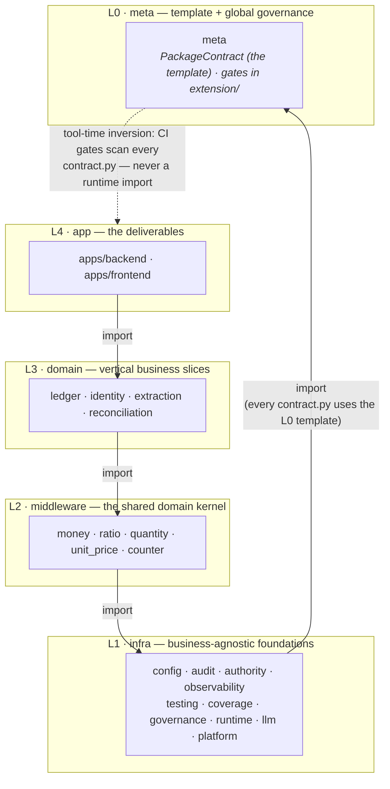

<a id="package-model"></a>

# Package model — a package is a DDD bounded context

> SSOT for **what a package is** and **how packages are governed**. This is the
> prose of the `meta` package (the meta-package about packages) — the model self-hosts: the package
> that defines what a package is is itself a package
> ([`contract.py`](./contract.py), [`todo.md`](./todo.md)), discovered and checked
> by the very gate it ships. This owns the *term* "package" and the contract every
> package speaks; it does not own any single package's goal (that is the package's
> `readme.md`) or the product direction (vision.md).
>
> First worked example: [`common/counter`](../counter/readme.md) (spec) +
> [`apps/backend/src/counter`](../../apps/backend/src/counter) (implementation).
> The first `domain`-layer (L3) bounded context on the model is
> [`common/ledger`](../ledger/readme.md) (spec) +
> [`apps/backend/src/ledger`](../../apps/backend/src/ledger) (implementation).

## What a package is

A **package = a DDD bounded context**. It is the unit of ownership and
governance. Its authoritative form lives in `common/<pkg>/`; the running code is
a conforming *implementation* the contract points at. Every package is exactly
these parts:

1. **`readme.md`** (`common/<pkg>/readme.md`) — prose: the *ubiquitous language*,
   why the package exists, a usage example, and what is public vs internal. (The
   review surface.)
2. **`contract.py`** (`common/<pkg>/contract.py`) — a machine-checkable
   `PackageContract` (a pydantic model): the package's `status`, `klass`
   (its layer, resolved from the central `PACKAGE_LAYER` map — not self-claimed),
   `units` (its DDD building blocks, each carrying its `kind` → layer; `roles` is
   the legacy form), `implementations`, published `interface`, emitted `events`,
   the `invariants` it guarantees, and its `roadmap` (the ACs it owns).
3. **`todo.md`** (`common/<pkg>/todo.md`) — the package's own worklist.
4. **Implementations** — the conforming code under `apps/backend/src/<pkg>`
   (`implementations["be"]`) and/or `apps/frontend/src/lib/<pkg>`
   (`implementations["fe"]`). Files converge by **role**, not by feature:
   - `types/` — domain **nouns** + events (the value language; pure, no I/O).
   - `ops/` — domain **verbs** (the edges in the project DAG; depend on a store
     *port*, never a concrete store or the ORM).
   - `store/` — persistence: a `Protocol` **port** + a concrete adapter (the only
     role that touches the ORM/session).
   - `api/` — the boundary (in-process verbs, or a thin transport adapter).
5. **Published language** — the implementation's `__init__.__all__` is the
   *entire* public surface; everything else is internal. `contract.interface`
   must equal that `__all__`.

The role folders above are the legacy convergence. The forward model converges by
the **DDD building block → layer** table (`base` / `extension` / `data`): each
`unit`'s `kind` decides its layer (`KIND_LAYER`), a repository splits into a base
port + an extension adapter, and `data` is the read-model sink. See
[`migration-standard.md`](./migration-standard.md#internal-layering-replaces-kernelplatformcore-and-typesopsstoreapi)
for the full table and the three cycle-breaking mechanisms; `meta` itself is the
live exemplar.

So `common/<pkg>/` is the **spec + high-level review surface**;
`apps/backend/src/<pkg>` and `apps/frontend/src/lib/<pkg>` are conforming
**implementations**.

## The five-layer topology

Every package sits in one of five ordered layers — `meta < infra < middleware <
domain < app`. Placement is **global topology**, so it is owned here in L0 as
the central `PACKAGE_LAYER` map ([`base/layering.py`](./base/layering.py)): a
package's `contract.py` does not self-claim a `klass`; the model resolves it
from the map (a declared value must agree with the map; only packages outside
the map — synthetic/test contracts — declare one).

The dependency rule is **never up, never sideways-cyclic**: a package may never
import a *higher* layer, and may import a *same-layer* package only when it
declares it in `depends_on` **and** the overall graph stays acyclic. (Enforced
by `check_package_contract`: the upward guard + a global cycle check.) So a
cohesive family — the value types — can share one layer and depend on each
other acyclically.



Two edge *phases* keep the picture acyclic:

- the **template edge** is import-time and points down: every `contract.py`
  imports `PackageContract` from L0;
- the **governance edge** is tool-time and points up: `meta`'s `extension/`
  gates scan every package's contract in CI, outside the runtime import DAG.
  Wherever a lower layer must know about a higher one, the edge is inverted
  through exactly two legal forms — a port in the lower layer's `base` with the
  adapter registered from above (import-time), or a declaration in the upper
  package's contract scanned by the lower package's `extension` at tool-time.

| layer | what it is | examples |
|-------|-----------|----------|
| `meta` (L0) | the template every package follows + the global governance gates; governs only at package granularity (`contract.py`), never implementations | `meta` |
| `infra` (L1) | business-agnostic foundations — L1 does not know what money is | `config`, `audit`, `authority`, `observability`, `testing`, `coverage`, `runtime`, `llm`, `platform` |
| `middleware` (L2) | the shared domain kernel: the value language + generic capabilities | `money`, `ratio`, `quantity`, `unit_price`, `counter` |
| `domain` (L3) | vertical business slices | `ledger`, `identity`, `extraction` |
| `app` (L4) | the deliverables | `apps/backend`, `apps/frontend` |

## Governance is computed, not authored

The only **authored horizontal doc is `vision.md`** (the "why"). Everything else
about a package is *derived from its contract*:

- `tools/check_package_contract.py` (logic in
  [`extension/check_package_contract.py`](./extension/check_package_contract.py))
  discovers every package by scanning `common/*/contract.py` for a
  `CONTRACT = PackageContract(...)` and asserts, per package:
  - **(a)** `contract.interface == __init__.__all__` of the BE implementation
    (`implementations["be"]`) — contract and published language agree;
  - **(b)** every `invariants[].test` and `roadmap[].test` (a `"path::func"`
    reference) resolves to a real test function (an unproven invariant is not an
    invariant);
  - **(c)** no implementation module imports a **higher-class** registered
    package or an undeclared dependency (the DAG rule, mirroring
    `tests/tooling/test_ledger_module.py`);
  - **(d)** for a package that adopts the `base/extension/` split: `base` stays
    pure (A), each declared `unit` sits in its `kind`'s layer + a repository splits
    port/adapter (B), and `data` is a sink nothing imports — additive, so legacy
    role-folder packages keep passing.
- The AC registry sources a package's ACs **directly from its `roadmap`**:
  `common/meta/extension/generate_ac_registry.py` reads `common/*/contract.py` roadmaps
  additively (alongside the EPIC tables), so a package's ACs live in its contract
  and are **never mirrored** into an EPIC table.

Because governance reads the contract, adding a package adds no central index to
edit: a new package is governed the moment it ships a `common/<pkg>/contract.py`.

That additive discovery has a blind spot: a directory with **no** `contract.py`
is invisible to `check_package_contract`, not rejected — exactly how
`common/ci`, `common/shell`, and `common/ssot` accumulated as undeclared junk
drawers before being dissolved back into real packages (#1564-#1568, #1430).
`tools/check_package_directory_coverage.py` (logic in
[`extension/check_package_directory_coverage.py`](./extension/check_package_directory_coverage.py))
closes that gap from the other direction: every directory directly under
`common/` must ship a `contract.py` **or** be a documented, reasoned entry in
`UNGOVERNED_EXCEPTIONS` (now empty after the migration cleanup) — so a new junk
drawer fails the gate instead of silently accumulating.

## Examples

- **`meta`** (`platform`, the meta-package) — self-hosts the model **and** is the
  live example of a project-level shared (meta-model) package — the building-block
  layering it governs, applied to itself. Its
  [`contract.py`](./contract.py) publishes `PackageContract` / `ACRecord` /
  `Invariant` / `Kind` / `Unit` / `contract_index`, declares its `units` (the
  `PackageContract` aggregate + value objects in `base/`, the gate as a
  `domain-service` in `extension/`, `contract_index` as a `projection` in
  `data/`), and its invariants + `AC-meta.*` roadmap pin to the governance-gate
  tests, so the model proves itself.
- **`counter`** (`platform`) — the first full worked example: per-(user, key)
  tallies for insight reports. `CounterKey`/`Count` value objects (`types`),
  `increment`/`get_count` verbs (`ops`) over a `CounterRepository` port (`store`),
  a thin async `read_count` boundary (`api`), and a `PackageContract` whose
  `roadmap` owns `AC-counter.1.1`–`AC-counter.1.4`. See its
  [`readme.md`](../counter/readme.md) and
  [`contract.py`](../counter/contract.py).
- **`ledger`** (`core`) — the double-entry bounded context; the first `core`
  domain cut over to the building-block layering (`base`/`extension`/`data` with
  the balance invariant as a type, the journal `Repository` split as a base port +
  extension adapter, and the account-balance projection as a `data` sink). See its
  [`readme.md`](../ledger/readme.md) and [`contract.py`](../ledger/contract.py).

## Migrating a module into the package model

The recipe for moving a module (and its EPIC-table ACs) into the package model.
**`counter` is the canonical worked example — copy its
[`contract.py`](../counter/contract.py).** One PR per package; `base=main`.

1. **Name the bounded context and its axes.** Pick the package `name` (its
   `common/<name>/` dir), its **layer** — add the package to `PACKAGE_LAYER` in
   [`base/layering.py`](./base/layering.py) (`meta < infra < middleware <
   domain < app`; placement is L0-owned global topology, so the contract does
   not self-claim a klass) — and the authority **tier**
   ([`base/authority_matrix.py`](./base/authority_matrix.py): CODE-ONLY/CODE-LED/LLM-LED/LLM-ONLY — how
   the module is built; the tier model is module-level on `PackageContract`,
   not a standalone package). If the tier is genuinely undecided, ship `status="draft"`
   with `tier=None` and resolve it before going `active` (the shipped-package
   rule). **One package = one tier**; a module mixing deterministic + LLM-emitted
   behavior is two packages.

2. **Write `contract.py`.** One `PackageContract(...)` with `name`,
   `status`, `tier`, `depends_on` (down-only edges), `units` (the DDD building
   blocks, each `Unit(kind=…, module=…)`; `roles` is the legacy form) — no
   `klass`: the model resolves it from `PACKAGE_LAYER` —
   `implementations` (`be`/`fe` paths), `interface` (must equal the BE
   `__init__.__all__`), `events`, `invariants`, `roadmap`.

3. **Domain ACs → `roadmap`.** Each `ACRecord(id, statement, test, priority,
   status)` with a **package-scoped id `AC-{package}.{group}.{seq}`** (e.g.
   `AC-counter.1.1`). The AC inherits the package tier; `proof_kind` defaults to
   the tier's canonical kind — set it explicitly only when different, and it MUST
   satisfy the tier→proof matrix (LLM-LED/LLM-ONLY may never be `exact`).

4. **Structural guarantees → `invariants`, NOT `roadmap`.** interface==`__all__`,
   converges-by-layer (base/extension/data), layer purity, "passes its own gate"
   carry no tier and are not matrix-constrained. (Keeping them out of `roadmap` is what lets an LLM-LED/LLM-ONLY
   package's structural `exact` tests stay valid — see counter's 7 invariants.)

5. **Anchor every `test` to a real test.** Each `roadmap[].test` /
   `invariants[].test` is a `"path::func"` the gate resolves. Put
   `@ac_proof(ac_ids=["AC-<pkg>.x.y"])` on the **domain-AC** tests only;
   **structural/invariant tests do NOT carry `@ac_proof`** — they are governed
   via `invariants[].test`, not the AC critical-proof matrix (a structural test
   tagged with a domain AC id is a stale anchor — see counter's cleanup).

6. **Renumber the migrated AC to the package-scoped `AC-<pkg>.x.y`** — that id
   form is the target (the package owns its ACs). Renumbering is a cross-repo
   rename, so REPOINT every reference to the old numeric id in the SAME change,
   or the lint cross-checks fire:
   - **floor baselines** — if the old id is in `ac-score-baseline.jsonl` /
     `protection-floor.json` (raise-only), migrate that entry too, else Gate B
     reds on the net-deleted id. (Grep both first; most legacy ids are tracked.)
   - **other EPIC docs** — repoint cross-references (`lint_doc_consistency`
     check4 `epic_to_registry`; e.g. EPIC-008's e2e map pointed at `AC26.x`).
   - **test references** — update the id in the test docstrings/`@ac_proof`
     (check5 `registry_to_tests` scans test-file text for the dotted id).

7. **Delete the EPIC table ROW, but keep the EPIC REFERENCING the new ids.**
   Remove the `| ACx.y.z | … |` definition row (else `check_epic_package_dual`
   fails — no AC defined in two places), and replace the section with a
   disclaimer that **lists every homed `AC-<pkg>.x.y` id** — a registry AC must
   still be *referenced* by an EPIC doc (`lint_doc_consistency` check3
   `registry_to_epic`); a prose mention satisfies it, a table row would re-trip
   `check_epic_package_dual`. (See EPIC-025/EPIC-026 for the pattern.)

8. **Register & classify.** Register any new concept in
   [`MANIFEST.yaml`](data/MANIFEST.yaml) (owner path + `family`+`kind`) —
   `docs/ssot/` is retired (#1823); the owner is always a package file
   (`common/<pkg>/readme.md`, `contract.py`, or a `data/` gate-data file);
   classify tooling tests in
   [`traceability-exceptions.md`](../../docs/project/traceability-exceptions.md).

9. **Run the gates locally before pushing:** `check_package_contract`,
   `check_package_directory_coverage`, `generate_ac_registry --check`,
   `check_ac_proof_kind`, `check_tier_ast_literal`, `check_epic_package_dual`,
   `check_draft_packages`, `check_tier_imports`, `check_authority_reconcile`, and
   `lint_doc_consistency`. The untagged-debt ratchet shrinks automatically as the
   moved ACs leave the EPIC source.

---

# Authority tiers (folded in from the `authority` package)

> The CODE↔LLM authority-tier vocabulary + gates were the `authority` package;
> they are a form-governance concern (a package/AC attribute), so they now live
> in `meta`. Gates: `common/meta/extension/{authority_classifier,check_ac_proof_kind,
> check_ac_tier_baseline,check_tier_ast_literal,check_tier_imports,check_authority_reconcile}.py`.


> One package owning the whole authority-tier concept: the **prose SSOT for the
> *meaning* of the tiers** (this file) **and** the machine implementation +
> enforcement (the matrix, classifier, and gates under `common/meta` (base for the matrix, extension for the gates)). This
> readme is the single registered owner of the tier vocabulary, the cross-tier
> MUST rules, and the tier→proof matrix — internalized here from the retired
> `docs/ssot/authority-tiers.md` per the package-migration standard
> ([`../meta/migration-standard.md`](../meta/migration-standard.md), step 3 "SSOT
> internalized").

## What a tier is

This package owns the **authority-tier** vocabulary: the attribute that records
**how a module is built along one axis — who produces its result and how tightly
code constrains the LLM**. The tier is a **module-design property**, declared once
on a package's [`PackageContract`](../meta/package_contract.py); every AC the
package owns *inherits* it.

| tier | who produces the result |
|------|-------------------------|
| `CODE-ONLY` | code, no LLM |
| `CODE-LED` | code; the LLM only assists within strict code constraints |
| `LLM-LED` | the LLM emits; code validates/guards, never produces |
| `LLM-ONLY` | the LLM emits, no validation |

(`HU` = "undecided" — a draft package with `tier=None`, not a permanent tier.)

> **A tier is NOT a per-record confidence.** "How confident are we in *this one*
> extracted row?" is a runtime number on a result, handled by reconciliation /
> review flows. "How is this *module* built?" is its tier. They are different
> axes — do not conflate them.

The payoff is direct: **a module's tier dictates what KIND of proof is valid for
its ACs.** Tying the testing strategy to authority stops us from demanding a
bit-exact golden assertion for an LLM-owned mapping (impossible) or accepting a
smoke test for a money calculation (unsafe).

## The axis and the four permanent tiers

There is **one axis**: how much of the result the LLM produces, and how tightly
code boxes it in. Two binary cuts — *does code or the LLM produce the used
result* (hard vs soft) × *how strong is the code discipline* — give four
permanent tiers:

| Code | Name | Produces the result | Reproducible? | Typical modules |
|------|------|---------------------|---------------|-----------------|
| **CODE-ONLY** | pure-code | **Code**, no LLM | Bit-level, fully reproducible | money/accounting, dedup, validation, persistence, reporting-calc, **recording a human decision/label** |
| **CODE-LED** | code-primary | **Code**; the LLM only assists within strict code constraints on the I/O and decisions | Reproducible once the config/knobs are pinned | model/strategy selection feeding a deterministic parser; LLM-tuned thresholds with deterministic scoring |
| **LLM-LED** | LLM-primary | **The LLM**; code validates its format/invariants and may reject, never produces | Not reproducible but DETECTABLE | extraction, OCR, classification, brokerage CSV→canonical mapping |
| **LLM-ONLY** | pure-LLM | **The LLM**, with no validation | Not required | advisor narrative, chat answer/suggestion text |

The **hard/soft** cut (who produces the used artifact) falls between CODE-LED and LLM-LED —
the same "who emits" test as before: code computes it and the LLM only turned
knobs → **CODE-LED**; the LLM emits it and code only validates/constrains → **LLM-LED**.

### HU is not a permanent tier — it is "undecided"

The legacy vocabulary had a fifth code, **HU** (human-adjudicated). In the module-design
model it is **not a peer tier**: it means *the module's tier has not been decided
yet*. It is represented by a `draft` package with `tier=None` and **MUST resolve
to one of CODE-ONLY/CODE-LED/LLM-LED/LLM-ONLY before the package goes `active`** (see the rule below).

There is deliberately **no permanent "human" tier**, because:

- **Genuine human review is narrow and is an *input*.** The only place a person
  truly adjudicates is where reconciliation does not match and a human decides or
  labels. The matching engine is CODE-ONLY/CODE-LED (deterministic scoring); the human's
  decision is an *input* to a CODE-ONLY module that records it — exactly like an
  uploaded file or an FX rate is an input. The proof is a deterministic
  assertion that the **evidence chain** is surfaced and the chosen label is
  applied correctly — not an assertion of the human's outcome.
- So "a human decides" never describes *how a module is built*; it describes a
  runtime input the module consumes.

## One vocabulary, two views

The same four-tier scale is used by both views, which is why they cannot drift:

- **declared** — `PackageContract.tier` (a package's authorial intent);
- **detected** — the band `authority_classifier` measures from the shapes of the
  tests that prove a package's ACs (`BANDS` *is* `PACKAGE_TIERS`).

## Tier is a module property — one package, one tier

Because the tier describes construction, it lives on the **package**, not on each
AC:

- `PackageContract.tier` is the single declaration; ACs inherit it.
- **One package = one tier.** A module that genuinely both *emits via the LLM*
  and *computes deterministically* is two bounded contexts — split it into two
  packages (LLM-LED's definition already includes the code-side validation gate, so a
  well-formed LLM-LED package does not need a separate CODE-ONLY tier for its guard).

### The shipped-package rule (replaces the per-AC ratchet for packages)

> **`status="active"` (or `"deprecated"`) ⟹ `tier ∈ {CODE-ONLY, CODE-LED, LLM-LED, LLM-ONLY}`.**
> Only a `draft` package may leave `tier=None` (the "undecided" / legacy `HU`
> state). `PackageContract` enforces this at construction, so a *shipped untyped
> package is unrepresentable*.

### Structural assertions go in `invariants`, not `roadmap`

A package's **structural / governance guarantees** — interface == `__all__`,
"converges by **layer**" (base/extension/data), layer-purity (`base` never imports
`extension`/`data`), "passes its own `check_package_contract`" — are NOT domain ACs. They are
deterministic properties of *how the package is assembled*, so they belong in
`PackageContract.invariants` (which carry no tier and are not constrained by the
tier→proof matrix), and the `roadmap` holds only the package's **domain** ACs,
which inherit the package tier.

This matters for **non-CODE-ONLY packages**: a structural assertion is inherently an
`exact`/deterministic test. If it sat in the `roadmap` of an **LLM-LED/LLM-ONLY** package it
would inherit that tier and the proof-matrix gate would reject it (LLM-LED/LLM-ONLY may not
be `exact`) — or force a dishonest mislabel. Putting it in `invariants` removes
the conflict. The matrix gate is therefore the enforcement: a structural `exact`
test wrongly placed in an LLM-LED roadmap fails CI, pushing it to `invariants` (no new
bespoke lint needed).

`common/counter` is the worked example: its `roadmap` is pure domain (key
validation, count, increment, query) while its structural guarantees
(`converges-by-layer`, `base-layer-pure`, `interface-equals-published-language`,
`passes-own-governance-gate`) are `invariants`. A CODE-ONLY package like `counter` would
not *fail* with structural ACs in its roadmap (CODE-ONLY permits `exact`), but it follows
the convention so it is a correct template to copy for LLM-LED/LLM-ONLY packages.

## tier -> valid proof type

This matrix is the operative contract: which proof shape is *valid* evidence for
an AC under a package at each tier. Its single machine source is
`TIER_VALID_PROOF_KINDS` in `common/meta/base/authority_matrix.py` (the same
matrix `PackageContract` and `check_ac_proof_kind` both enforce).

| Tier | Valid proof | NOT valid |
|------|-------------|-----------|
| **CODE-ONLY** | Deterministic exact-assertion / property test; bit-level reproducible | — |
| **CODE-LED** | Test asserts the **code's final decision** is correct; the LLM suggestion may vary and is **not** asserted | Asserting the LLM suggestion text |
| **LLM-LED** | Invariant/property test + graded eval + provenance | Exact "golden" assertions on the LLM output |
| **LLM-ONLY** | Quality/smoke eval + guardrail assertions (must not touch numbers) | Reproducibility / exact-match requirements |
| **HU** *(legacy/undecided)* | Test asserts the **evidence chain** is present (evidence + options surfaced) | Asserting the human's outcome |

The rule with teeth: **an LLM-LED/LLM-ONLY behavior MUST NOT be proven by an exact golden
assertion** — LLM-emitted output has no golden oracle. The `HU` row applies only
to the handful of pre-package ACs still carrying the legacy marker; new packages
do not use it.

## Cross-tier MUST rules

Hard rules a module's tier must respect — the safety boundary between the
deterministic core and the LLM surface:

1. **No LLM-sourced financial truth without a deterministic oracle.** LLM-LED/LLM-ONLY
   output MUST cross a CODE-ONLY oracle (validation/guard) before it is persisted as
   financial truth. An LLM never writes a ledger number unchecked.
2. **CODE-ONLY stays pure.** A CODE-ONLY module MUST NOT depend on an LLM client; its outcome
   is produced and proven by deterministic code alone.
3. **LLM-ONLY owns no money.** A LLM-ONLY module MUST NOT source a number or persist
   financial facts; its deliverable is narrative/UX text with low blast radius.
4. **One package = one tier.** A package whose behaviors span tiers is too coarse
   and MUST be split (e.g. an LLM extractor that also validates-then-persists is
   an LLM-LED package whose guard is its code-side validation, not a CODE-ONLY package).

### Enforcing rule 2 structurally — the tier-import guard (phase 3)

Rule 2 ("CODE-ONLY stays pure") has a *structural* half that is checkable statically:
a deterministic financial-truth (CODE-ONLY) module MUST NOT **import** the LLM layer.
`tools/check_tier_imports.py` (impl `common/meta/extension/check_tier_imports.py`) makes
this a deterministic gate, AST-based and direct-import-only, complementing the
per-AC `{proof:KIND}` gate. On `main` today no protected module imports the LLM
layer, so the gate starts GREEN — it is a guard against regression.

The contract (the checker is the machine-checkable mirror of this list):

- **Protected CODE-ONLY / financial-truth module set:** everything under
  `apps/backend/src/audit/money/**` and `apps/backend/src/ledger/**`
  (including the journal model, `apps/backend/src/ledger/orm/journal.py`),
  and the deterministic services
  `deduplication.py`, `accounting.py`, `account_service.py`,
  `investment_accounting.py`, `statement_posting.py`, the `reporting/**`
  package, `reporting_calc.py`, `reporting_snapshot.py`, `validation.py`,
  `statement_validation.py`, `fx.py` / `fx_revaluation.py` / `fx_transfer.py` /
  `fx_transfer_discovery.py`, `portfolio.py`, `performance.py`,
  `performance_report.py`, and `allocation.py`.
- **Forbidden import targets:** the project's LLM layer (`src.llm` /
  `apps.backend.src.llm`) and any raw LLM SDK / provider client — `litellm`,
  `openrouter`, `anthropic`, `openai` — including any submodule of those
  (prefix match on dotted-path boundaries, so `src.llmx` does not match).

Detection is **direct imports only** for v1 (both `import X` and
`from X import …`, including the parent-package spelling `from src import llm`
which pulls `src.llm` into scope); transitive import-graph following is a
documented follow-up.
A protected glob that resolves to no file also fails the gate, so the curated set
cannot silently shrink as the tree evolves.

## How a tier is declared

**Primary (package model):** on the `PackageContract`, once per package:

```python
CONTRACT = PackageContract(
    name="counter",
    status="active",
    tier="CODE-ONLY",        # the whole package's authority tier; every AC inherits it
    ...
)
```

`common/meta/extension/generate_ac_registry.py` reads this package tier statically (AST) and
stamps it onto every AC in the package's `roadmap`, so the registry value carries
the inherited tier.

**Legacy (EPIC-table source, being phased out):** a pre-package AC declares its
tier inline at the definition site with a `{tier:XX}` marker, where `XX` is one of
`CODE-ONLY | CODE-LED | HU | LLM-LED | LLM-ONLY`:

```text
| AC-extraction.1.1 | Parse DBS PDF {tier:LLM-LED} | `test_...` | `extraction/test_pdf_parsing.py` | P0 |
| AC-extraction.2.1 | Balance Validation (Pass) {tier:CODE-ONLY} | `test_balance_valid` | ... | P0 |
```

`tools/generate_ac_registry.py` strips the marker and lifts the tier into the AC's
registry value. As modules become packages, their ACs move into the package
`roadmap` and the marker (including any legacy `HU`) goes away.

## How a proof kind is declared (and enforced)

Each AC declares the KIND of proof its tests provide with a `proof_kind` (on the
`ACRecord`, or a `{proof:KIND}` marker in the legacy EPIC source). `KIND` is one
of `property | invariant | eval | exact | evidence | smoke`. When an AC declares
**no** proof kind, it defaults to its (package) tier's canonical valid kind, so
the value is always a kind the matrix accepts:

| Tier | Default proof kind |
|------|--------------------|
| CODE-ONLY | `exact` |
| CODE-LED | `exact` |
| LLM-LED | `property` |
| LLM-ONLY | `smoke` |
| HU *(legacy)* | `evidence` |

`PackageContract` validates each roadmap AC's `proof_kind` against the package
tier at construction (a violating contract fails to import);
`tools/check_ac_proof_kind.py` enforces the same matrix for the legacy EPIC
source. The rule with teeth is **an LLM-LED/LLM-ONLY AC's proof_kind MUST NOT be `exact`**.
Statically verifying the referenced test's runtime *shape* (so a golden assertion
mislabeled `property` is rejected) is a documented follow-up.

`proof_kind` is a different axis from the critical-proof matrix's `trust_mode`
(`deterministic_pr` / `llm_ocr_post_merge` / `hybrid`): `trust_mode` says which
CI stage may be trusted to run a proof, while `proof_kind` says what SHAPE of
proof is valid for the module's authority tier. They are orthogonal.

## Adoption (non-breaking)

- **Package model:** the shipped-package rule above is enforced at construction —
  no ratchet needed, because an active package physically cannot omit its tier.
- **Legacy EPIC source:** ~1830 ACs predate this attribute, adopted via a
  **shrink-only debt ratchet** in [`ac-tier-baseline.json`](../../common/meta/data/ac-tier-baseline.json).
  `tools/check_ac_tier_baseline.py` is id-based: it fails only when a genuinely
  new AC (id absent from the baseline) lacks a tier; the baseline may only shrink.
  Each module that becomes a package moves its ACs into the package `roadmap`,
  which removes them from the untagged debt.

## CODE/LLM bit (counted view)

This is the **measured** mirror of the declared `PackageContract.tier`: the same
**hard/soft cut** of the four permanent tiers, but **detected per-AC from its test
shape** rather than declared on the package.

- `CODE` — the hard side (`CODE-ONLY`, `CODE-LED`): a structured-input deterministic test, no
  LLM in the loop.
- `LLM` — the soft side (`LLM-LED`, `LLM-ONLY`): the AC's test exercises the record/replay
  (cassette) harness.
- An undecided/`draft` package (legacy `HU`, `tier=None`) is **unclassified**, not
  a band — it has not resolved its tier yet.

Each package (currently an EPIC) gets an `LLM-share = #LLM / (#CODE + #LLM)` placed
into four bands:

| Band | LLM-share (`s`) | Meaning |
|------|-----------------|---------|
| `CODE-ONLY` | `s = 0` | enforceable: no LLM permitted (money math, ledger) |
| `CODE-LED` | `0 < s < 50` | measured; ratchet caps drift |
| `LLM-LED` | `50 ≤ s < 100` | measured; ratchet caps drift |
| `LLM-ONLY` | `s = 100` | enforceable: no hardcode permitted (narrative) |

Because the bit is detected, the band is **computed, not argued** — so it serves
as a **cross-check on the declared `PackageContract.tier`**: a package declared on
the hard side (`CODE-ONLY`/`CODE-LED`) but measuring `LLM` ACs is drift. The base
library is `common/meta/extension/authority_classifier.py`; `tools/authority_counter.py`
prints the live view on demand (no committed snapshot). This cross-check is
**enforced** by `tools/check_authority_reconcile.py`, which fails CI at the
enforceable ends (declared `CODE-ONLY` ⟹ no `LLM` test; `LLM-ONLY` ⟹ no
deterministic test). The cross-tier MUST rules still bind (an `LLM` value entering
financial truth crosses a CODE-ONLY oracle; an `LLM` AC must have a cassette).

## Structure (layers)

The **target** model — like every migrated package — is to converge by **layer**
(base / extension / data) rather than by role. `authority` is **not there yet**:
its `contract.py` still declares legacy `roles=["matrix", "classifier", "gates"]`
and the files are physically flat under `common/meta` (base for the matrix, extension for the gates). The base/extension
split below is therefore the **conceptual/intended** layering each file maps onto;
the role-to-layer migration is still pending.

- **base** — the value language: `authority_matrix.py` (tier Literals, the
  tier→proof matrix, the canonical tuples; stdlib-only, no pydantic) and
  `authority_classifier.py` (the detected CODE/LLM band). Self-contained pure
  definitions + logic, no I/O.
- **extension** — the gates (run via `tools/<name>.py`): `check_ac_proof_kind`
  (tier→proof matrix), `check_tier_ast_literal`, `check_tier_imports`,
  `check_ac_tier_baseline`, `check_authority_reconcile` (declared vs detected at
  the enforceable ends). The impure edges that read the repo and fail CI.

## Published language

`__init__.__all__` (must equal `contract.interface`): the tier vocabulary +
matrix + the classifier's `band` / `classify_repo` / `BANDS`.

## Follow-ups (out of scope here)

- Migrating the remaining EPIC-table ACs into package `roadmap`s (the ratchet
  shrinks as packages adopt them); retiring the `{tier:XX}` marker and the `HU`
  code once no EPIC AC carries them.
- A derived **module-level tier view** (already the natural unit now that tier is
  per-package).
- Upgrading the proof-kind gate from asserting the *declared* `proof_kind` to
  statically inspecting the referenced test's shape (e.g. rejecting an
  exact-golden assertion mislabeled `property` on an LLM-LED AC).

## Related

- [`../meta/readme.md`](../meta/readme.md) — what a package is; the EPIC → AC →
  Test workflow and the proof matrix this tier attribute extends.
- [EPIC-026](../../docs/project/EPIC-026.ac-authority-tiers.md) — the EPIC that
  introduced tiers (now references the homed `AC-authority.*` ids).
- [`authority_matrix.py`](./base/authority_matrix.py) — the machine source of
  `PackageTier` and the proof matrix (`PackageContract` imports it).
- [`../extraction/readme.md`](../extraction/readme.md) — a domain
  where LLM-LED/LLM-ONLY behaviors concentrate.

## Vision Anchors

> **Vision Anchor**: `decision-7-tech-stack`
