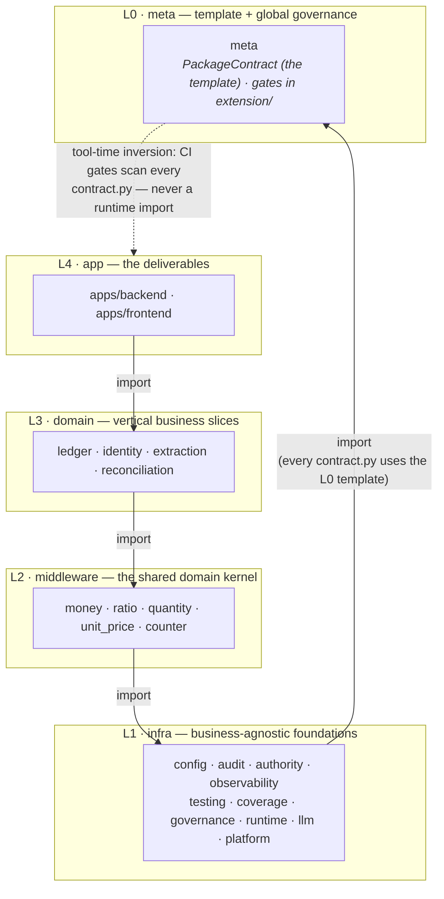

# Package model — a package is a DDD bounded context

> SSOT for **what a package is** and **how packages are governed**. This is the
> prose of the `meta` package (the meta-package about packages) — the model self-hosts: the package
> that defines what a package is is itself a package
> ([`contract.py`](./contract.py), [`todo.md`](./todo.md)), discovered and checked
> by the very gate it ships. This owns the *term* "package" and the contract every
> package speaks; it does not own any single package's goal (that is the package's
> `readme.md`) or the product direction (vision.md).
>
> First worked example: [`common/counter`](../counter/readme.md) (spec) +
> [`apps/backend/src/counter`](../../apps/backend/src/counter) (implementation).
> The first `domain`-layer (L3) bounded context on the model is
> [`common/ledger`](../ledger/readme.md) (spec) +
> [`apps/backend/src/ledger`](../../apps/backend/src/ledger) (implementation).

## What a package is

A **package = a DDD bounded context**. It is the unit of ownership and
governance. Its authoritative form lives in `common/<pkg>/`; the running code is
a conforming *implementation* the contract points at. Every package is exactly
these parts:

1. **`readme.md`** (`common/<pkg>/readme.md`) — prose: the *ubiquitous language*,
   why the package exists, a usage example, and what is public vs internal. (The
   review surface.)
2. **`contract.py`** (`common/<pkg>/contract.py`) — a machine-checkable
   `PackageContract` (a pydantic model): the package's `status`, `klass`
   (its layer, resolved from the central `PACKAGE_LAYER` map — not self-claimed),
   `units` (its DDD building blocks, each carrying its `kind` → layer; `roles` is
   the legacy form), `implementations`, published `interface`, emitted `events`,
   the `invariants` it guarantees, and its `roadmap` (the ACs it owns).
3. **`todo.md`** (`common/<pkg>/todo.md`) — the package's own worklist.
4. **Implementations** — the conforming code under `apps/backend/src/<pkg>`
   (`implementations["be"]`) and/or `apps/frontend/src/lib/<pkg>`
   (`implementations["fe"]`). Files converge by **role**, not by feature:
   - `types/` — domain **nouns** + events (the value language; pure, no I/O).
   - `ops/` — domain **verbs** (the edges in the project DAG; depend on a store
     *port*, never a concrete store or the ORM).
   - `store/` — persistence: a `Protocol` **port** + a concrete adapter (the only
     role that touches the ORM/session).
   - `api/` — the boundary (in-process verbs, or a thin transport adapter).
5. **Published language** — the implementation's `__init__.__all__` is the
   *entire* public surface; everything else is internal. `contract.interface`
   must equal that `__all__`.

The role folders above are the legacy convergence. The forward model converges by
the **DDD building block → layer** table (`base` / `extension` / `data`): each
`unit`'s `kind` decides its layer (`KIND_LAYER`), a repository splits into a base
port + an extension adapter, and `data` is the read-model sink. See
[`migration-standard.md`](./migration-standard.md#internal-layering-replaces-kernelplatformcore-and-typesopsstoreapi)
for the full table and the three cycle-breaking mechanisms; `meta` itself is the
live exemplar.

So `common/<pkg>/` is the **spec + high-level review surface**;
`apps/backend/src/<pkg>` and `apps/frontend/src/lib/<pkg>` are conforming
**implementations**.

## The five-layer topology

Every package sits in one of five ordered layers — `meta < infra < middleware <
domain < app`. Placement is **global topology**, so it is owned here in L0 as
the central `PACKAGE_LAYER` map ([`base/layering.py`](./base/layering.py)): a
package's `contract.py` does not self-claim a `klass`; the model resolves it
from the map (a declared value must agree with the map; only packages outside
the map — synthetic/test contracts — declare one).

The dependency rule is **never up, never sideways-cyclic**: a package may never
import a *higher* layer, and may import a *same-layer* package only when it
declares it in `depends_on` **and** the overall graph stays acyclic. (Enforced
by `check_package_contract`: the upward guard + a global cycle check.) So a
cohesive family — the value types — can share one layer and depend on each
other acyclically.

Two edge *phases* keep the picture acyclic:

- the **template edge** is import-time and points down: every `contract.py`
  imports `PackageContract` from L0;
- the **governance edge** is tool-time and points up: `meta`'s `extension/`
  gates scan every package's contract in CI, outside the runtime import DAG.
  Wherever a lower layer must know about a higher one, the edge is inverted
  through exactly two legal forms — a port in the lower layer's `base` with the
  adapter registered from above (import-time), or a declaration in the upper
  package's contract scanned by the lower package's `extension` at tool-time.

| layer | what it is | examples |
|-------|-----------|----------|
| `meta` (L0) | the template every package follows + the global governance gates; governs only at package granularity (`contract.py`), never implementations | `meta` |
| `infra` (L1) | business-agnostic foundations — L1 does not know what money is | `config`, `audit`, `authority`, `observability`, `testing`, `coverage`, `runtime`, `llm`, `platform` |
| `middleware` (L2) | the shared domain kernel: the value language + generic capabilities | `money`, `ratio`, `quantity`, `unit_price`, `counter` |
| `domain` (L3) | vertical business slices | `ledger`, `identity`, `extraction` |
| `app` (L4) | the deliverables | `apps/backend`, `apps/frontend` |

## Governance is computed, not authored

The only **authored horizontal doc is `vision.md`** (the "why"). Everything else
about a package is *derived from its contract*:

- `tools/check_package_contract.py` (logic in
  [`extension/check_package_contract.py`](./extension/check_package_contract.py))
  discovers every package by scanning `common/*/contract.py` for a
  `CONTRACT = PackageContract(...)` and asserts, per package:
  - **(a)** `contract.interface == __init__.__all__` of the BE implementation
    (`implementations["be"]`) — contract and published language agree;
  - **(b)** every `invariants[].test` and `roadmap[].test` (a `"path::func"`
    reference) resolves to a real test function (an unproven invariant is not an
    invariant);
  - **(c)** no implementation module imports a **higher-class** registered
    package or an undeclared dependency (the DAG rule, mirroring
    `tests/tooling/test_ledger_module.py`);
  - **(d)** for a package that adopts the `base/extension/` split: `base` stays
    pure (A), each declared `unit` sits in its `kind`'s layer + a repository splits
    port/adapter (B), and `data` is a sink nothing imports — additive, so legacy
    role-folder packages keep passing.
- The AC registry sources a package's ACs **directly from its `roadmap`**:
  `common/testing/generate_ac_registry.py` reads `common/*/contract.py` roadmaps
  additively (alongside the EPIC tables), so a package's ACs live in its contract
  and are **never mirrored** into an EPIC table.

Because governance reads the contract, adding a package adds no central index to
edit: a new package is governed the moment it ships a `common/<pkg>/contract.py`.

That additive discovery has a blind spot: a directory with **no** `contract.py`
is invisible to `check_package_contract`, not rejected — exactly how
`common/ci`, `common/shell`, and `common/ssot` accumulated as undeclared junk
drawers before being dissolved back into real packages (#1564-#1568).
`tools/check_package_directory_coverage.py` (logic in
[`extension/check_package_directory_coverage.py`](./extension/check_package_directory_coverage.py))
closes that gap from the other direction: every directory directly under
`common/` must ship a `contract.py` **or** be a documented, reasoned entry in
`UNGOVERNED_EXCEPTIONS` (today: `ssot`, and the two pending-cutover SSOT-only
domains `extraction` / `llm`) — so a new junk drawer fails the gate instead of
silently accumulating.

## Examples

- **`meta`** (`platform`, the meta-package) — self-hosts the model **and** is the
  live example of a project-level shared (meta-model) package — the building-block
  layering it governs, applied to itself. Its
  [`contract.py`](./contract.py) publishes `PackageContract` / `ACRecord` /
  `Invariant` / `Kind` / `Unit` / `contract_index`, declares its `units` (the
  `PackageContract` aggregate + value objects in `base/`, the gate as a
  `domain-service` in `extension/`, `contract_index` as a `projection` in
  `data/`), and its invariants + `AC-meta.*` roadmap pin to the governance-gate
  tests, so the model proves itself.
- **`counter`** (`platform`) — the first full worked example: per-(user, key)
  tallies for insight reports. `CounterKey`/`Count` value objects (`types`),
  `increment`/`get_count` verbs (`ops`) over a `CounterRepository` port (`store`),
  a thin async `read_count` boundary (`api`), and a `PackageContract` whose
  `roadmap` owns `AC-counter.1.1`–`AC-counter.1.4`. See its
  [`readme.md`](../counter/readme.md) and
  [`contract.py`](../counter/contract.py).
- **`ledger`** (`core`) — the double-entry bounded context; the first `core`
  domain cut over to the building-block layering (`base`/`extension`/`data` with
  the balance invariant as a type, the journal `Repository` split as a base port +
  extension adapter, and the account-balance projection as a `data` sink). See its
  [`readme.md`](../ledger/readme.md) and [`contract.py`](../ledger/contract.py).

## Migrating a module into the package model

The recipe for moving a module (and its EPIC-table ACs) into the package model.
**`counter` is the canonical worked example — copy its
[`contract.py`](../counter/contract.py).** One PR per package; `base=main`.

1. **Name the bounded context and its axes.** Pick the package `name` (its
   `common/<name>/` dir), the `klass` (`kernel` < `platform` < `core` — its
   position in the import DAG), and the authority **tier**
   ([`authority` package](../authority/readme.md): CODE-ONLY/CODE-LED/LLM-LED/LLM-ONLY — how
   the module is built). If the tier is genuinely undecided, ship `status="draft"`
   with `tier=None` and resolve it before going `active` (the shipped-package
   rule). **One package = one tier**; a module mixing deterministic + LLM-emitted
   behavior is two packages.

2. **Write `contract.py`.** One `PackageContract(...)` with `name`, `klass`,
   `status`, `tier`, `depends_on` (down-only edges), `units` (the DDD building
   blocks, each `Unit(kind=…, module=…)`; `roles` is the legacy form),
   `implementations` (`be`/`fe` paths), `interface` (must equal the BE
   `__init__.__all__`), `events`, `invariants`, `roadmap`.

3. **Domain ACs → `roadmap`.** Each `ACRecord(id, statement, test, priority,
   status)` with a **package-scoped id `AC-{package}.{group}.{seq}`** (e.g.
   `AC-counter.1.1`). The AC inherits the package tier; `proof_kind` defaults to
   the tier's canonical kind — set it explicitly only when different, and it MUST
   satisfy the tier→proof matrix (LLM-LED/LLM-ONLY may never be `exact`).

4. **Structural guarantees → `invariants`, NOT `roadmap`.** interface==`__all__`,
   converges-by-layer (base/extension/data), layer purity, "passes its own gate"
   carry no tier and are not matrix-constrained. (Keeping them out of `roadmap` is what lets an LLM-LED/LLM-ONLY
   package's structural `exact` tests stay valid — see counter's 7 invariants.)

5. **Anchor every `test` to a real test.** Each `roadmap[].test` /
   `invariants[].test` is a `"path::func"` the gate resolves. Put
   `@ac_proof(ac_ids=["AC-<pkg>.x.y"])` on the **domain-AC** tests only;
   **structural/invariant tests do NOT carry `@ac_proof`** — they are governed
   via `invariants[].test`, not the AC critical-proof matrix (a structural test
   tagged with a domain AC id is a stale anchor — see counter's cleanup).

6. **Renumber the migrated AC to the package-scoped `AC-<pkg>.x.y`** — that id
   form is the target (the package owns its ACs). Renumbering is a cross-repo
   rename, so REPOINT every reference to the old numeric id in the SAME change,
   or the lint cross-checks fire:
   - **floor baselines** — if the old id is in `ac-score-baseline.jsonl` /
     `protection-floor.json` (raise-only), migrate that entry too, else Gate B
     reds on the net-deleted id. (Grep both first; most legacy ids are tracked.)
   - **other EPIC docs** — repoint cross-references (`lint_doc_consistency`
     check4 `epic_to_registry`; e.g. EPIC-008's e2e map pointed at `AC26.x`).
   - **test references** — update the id in the test docstrings/`@ac_proof`
     (check5 `registry_to_tests` scans test-file text for the dotted id).

7. **Delete the EPIC table ROW, but keep the EPIC REFERENCING the new ids.**
   Remove the `| ACx.y.z | … |` definition row (else `check_epic_package_dual`
   fails — no AC defined in two places), and replace the section with a
   disclaimer that **lists every homed `AC-<pkg>.x.y` id** — a registry AC must
   still be *referenced* by an EPIC doc (`lint_doc_consistency` check3
   `registry_to_epic`); a prose mention satisfies it, a table row would re-trip
   `check_epic_package_dual`. (See EPIC-025/EPIC-026 for the pattern.)

8. **Register & classify.** Add any new `docs/ssot/` files to
   [`MANIFEST.yaml`](../../docs/ssot/MANIFEST.yaml) (with `family`+`kind`);
   classify tooling tests in
   [`traceability-exceptions.md`](../../docs/project/traceability-exceptions.md).

9. **Run the gates locally before pushing:** `check_package_contract`,
   `check_package_directory_coverage`, `generate_ac_registry --check`,
   `check_ac_proof_kind`, `check_tier_ast_literal`, `check_epic_package_dual`,
   `check_draft_packages`, `check_tier_imports`, `check_authority_reconcile`, and
   `lint_doc_consistency`. The untagged-debt ratchet shrinks automatically as the
   moved ACs leave the EPIC source.
