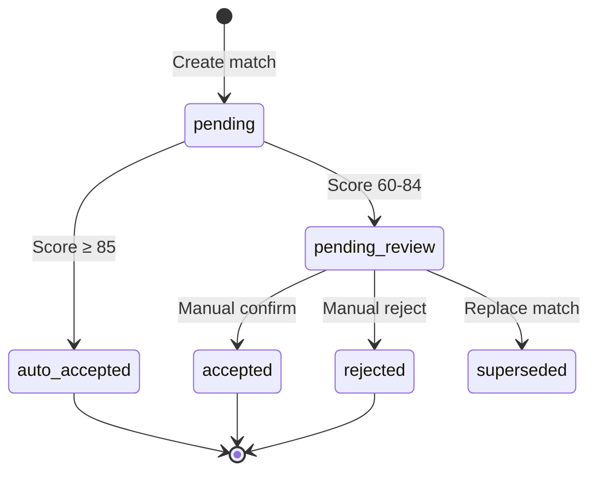

# `reconciliation` — transaction-to-journal matching (domain package)

> Package model: [`../meta/readme.md`](../meta/readme.md). Machine contract:
> [`contract.py`](./contract.py).
>
> This `common/reconciliation/` directory is the **spec + review surface**; the
> conforming implementation lives at
> [`apps/backend/src/reconciliation`](../../apps/backend/src/reconciliation)
> (`contract.implementations["be"]`).

## Why

Extracted bank transactions and manually/portfolio-posted journal entries are
two independent records of the same real-world event; `reconciliation` decides
whether they refer to the same thing, at what confidence, and routes anything
below auto-accept confidence into a review queue instead of silently trusting
either side.

## Ubiquitous language

- **`ReconciliationMatch`** — the aggregate root linking an `AtomicTransaction`
  to one or more `JournalEntry` rows. At most one *active* match exists per
  transaction; a newer match supersedes the prior one rather than mutating it.
- **Status lifecycle** —
  `PENDING_REVIEW → ACCEPTED/AUTO_ACCEPTED/REJECTED → SUPERSEDED`; posted
  entries behind an active match are immutable.
- **Match score** — a weighted composite of amount/date/description/business-
  logic/pattern sub-scores in `[0, 100]` (`score_amount`/`score_date`/
  `score_description`/`score_business_logic`/`score_pattern` composed by
  `calculate_match_score`). Scores at or above the auto-accept threshold
  auto-accept; the review band routes to `PENDING_REVIEW`.
- **`TransferLeg`** — one side of an internal transfer between the user's own
  accounts; `pair_fx_legs`/`discover_fx_conversions` pair cross-currency
  transfer legs within a rate/time tolerance.
- **Many-to-one matching** — `build_many_to_one_groups` groups several bank
  lines against one journal entry (e.g. a combined card settlement) within
  `MAX_COMBINATION_CANDIDATES` and a configured tolerance.
- **Consistency checks / anomaly detection** — `run_all_consistency_checks` /
  `detect_anomalies` are diagnostic passes over already-matched state, not
  part of the matching decision itself.

## Cross-package edges

`extraction` (the `AtomicTransaction` side), `portfolio` (positions can also
be reconciled), `ledger` (the `JournalEntry` side — links by id only, no
cross-domain FK: `AC-reconciliation.txn.1`), `pricing` (FX rate lookups for
cross-currency transfer pairing), `audit` (base value types), `platform`
(publishes `WorkflowEvent.reconciliation_match_outcome`).

## Governance

The package's ACs (`AC-reconciliation.match.*`/`.score.*`/`.stats.*`/`.txn.*`)
live in [`contract.py`](./contract.py)'s `roadmap` and are sourced **directly**
from there into the AC registry (no EPIC mirror); the larger two-stage-review
UI surface (EPIC-016) is a separate frontend concern and has not moved into
this roadmap yet. `tools/check_package_contract.py` validates the
implementation against this contract (interface == `__all__`, every test
reference resolves, no upward import edge).

## Scoring, thresholds, and the state machine

*(Internalized from `docs/ssot/reconciliation.md`, migration closeout wave 3,
#1664 — this is now the single owner; do not re-add a separate SSOT copy.)*

### <a id="thresholds"></a>Thresholds

Runtime threshold values are code/config-owned. The defaults live in
`apps/backend/src/reconciliation/extension/matching.py` (`DEFAULT_CONFIG`) and
are loaded from `apps/backend/config/reconciliation.yaml` when present.
Environment overrides are applied by `load_reconciliation_config()`:
`RECONCILIATION_AUTO_ACCEPT_THRESHOLD` and `RECONCILIATION_REVIEW_THRESHOLD`.
Update the config/code and tests first when changing values — this doc
describes the default routing semantics, it doesn't own them.

| Score Range | Action | Status Transition |
|-------------|--------|-------------------|
| ≥ 85 | Auto-Accept | `pending` → `auto_accepted` |
| 60–84 | Review Queue | `pending` → `pending_review` |
| < 60 | Unmatched | stays `pending` |

```yaml
# apps/backend/config/reconciliation.yaml
scoring:
  weights:
    amount: 0.40      # Amount matching
    date: 0.25        # Date proximity
    description: 0.20 # Description similarity
    business: 0.10    # Business logic
    history: 0.05     # Historical pattern
  thresholds:
    auto_accept: 85    # Auto-accept
    pending_review: 60 # Enter review queue
  tolerances:
    amount_percent: 0.005  # Amount tolerance 0.5%
    amount_absolute: 0.10  # Amount absolute tolerance $0.10
    date_days: 7            # Date tolerance days
```

Amount matching uses the bank/cash side of each candidate journal entry:
statement `IN` transactions match asset debit lines, statement `OUT`
transactions match asset credit lines, and scoring falls back to the entry
debit total only when no bank/cash-side asset line is available. This keeps
split entries, clearing lines, tax lines, and payable/receivable lines from
inflating the amount used for bank reconciliation.

### <a id="state-machine"></a>State machine



`ReconciliationMatch` records are immutable; corrections create a new version
(`version` + `superseded_by_id`). An active match satisfies
`status != superseded AND superseded_by_id IS NULL`.

### Design constraints

- Auto-matches must record `score_breakdown` for audit.
- One-to-many matches must verify amount totals.
- Cross-period matches extend date tolerance to ±7 days.
- Review-queue updates use row-level locking and increment `version` to
  prevent concurrent overwrites.
- The matching engine pre-fetches candidates for the whole statement period
  and caches historical-pattern scores to avoid N+1 queries.
- **Never** mark as matched without scoring; **never** delete rejected match
  records (preserve the audit trail); **never** use non-bank split lines to
  inflate the amount matched to a bank statement transaction.

### Accuracy audit harness

EPIC-004's production-quality claim is proven by an audit-grade
expected-vs-actual run, not only individual scoring examples. The harness in
`apps/backend/src/reconciliation/extension/reconciliation_audit.py` builds
deterministic golden scenarios (exact matches, similar matches, unrelated
transactions, review-band routing, transfer-shaped transactions, many-to-one
settlement, one-to-many fee splits, cross-period timing). `python
tools/reconciliation_audit.py --stdout` emits
`artifacts/reconciliation-audit/reconciliation-audit.{json,md}` with accuracy,
false-positive, false-negative, review-routing, unmatched, per-scenario score
breakdown, and a deterministic 10,000-transaction pair-scoring benchmark. The
CI `ac-traceability` job hard-gates `>=95%` accuracy, `<0.5%` false-positive,
`<2%` false-negative, and `<10s` runtime (`AC-reconciliation.audit-harness.*`
in `contract.py`).

## EPIC-016 two-stage review (frontend-owned surface)

*(Internalized from `docs/ssot/reconciliation.md` §7, wave 3, #1664. This
surface's ACs stay in `docs/project/EPIC-016.two-stage-review-ui.md` — see
[Governance](#governance) above — because the governance gate's AST-based
`_resolve_test()` cannot resolve the `.tsx`/frontend test paths that prove
most of it; this section is the operational reference, not an AC migration.)*

### Stage 1 — record-level review

**Location**: `/statements/{id}/review`. Validates extracted transaction data
against the original document.

1. Parse statement → `status=PARSED`.
2. User reviews transactions with PDF preview.
3. Balance chain validation (tolerance: 0.001 USD):
   `opening_delta = abs(stated_opening - derived_opening)`,
   `closing_delta = abs(stated_closing - calculated_closing)`,
   `valid = (opening_delta <= 0.001) AND (closing_delta <= 0.001)`.
4. Approve → `stage1_status=APPROVED`, `status=APPROVED`.
5. Reject → `stage1_status=REJECTED`, `status=REJECTED`.

`StatementSummary` fields: `stage1_status` (`PENDING_REVIEW | APPROVED |
REJECTED | EDITED`), `balance_validation_result` (JSONB opening/closing
deltas), `stage1_reviewed_at`, `manual_opening_balance`, `currency_balances`
(JSONB array, see below).

### <a id="per-currency-balance-reconciliation"></a>Per-currency balance reconciliation

A statement may hold balances in more than one currency (Wise, IBKR, Futu).
The scalar `opening_balance`/`closing_balance` columns can't represent that,
so a multi-currency statement also carries a `currency_balances` JSONB array
of `{currency, opening, closing}` — additive: the scalar columns stay
populated for the single-currency case, and a single-currency statement maps
to a one-element array.

**Generalized invariant — per account, per currency.** Reconciliation runs
independently for each currency and never sums across currencies:

```
for each currency ccy on the statement:
    opening_ccy + Σ(IN_ccy) − Σ(OUT_ccy) ≈ closing_ccy   (within tolerance)
statement is balance_valid  ⟺  every currency balances
```

Transactions are grouped by their own `currency`. The legacy scalar check
(`opening + Σ(IN) − Σ(OUT) ≈ closing`) is the degenerate one-currency case of
this rule; a mismatch in one currency flags only that currency
(`AC-reconciliation.per-currency-balance.*`). Implemented by
`validate_balance_per_currency` (`services/validation.py`); schema
`CurrencyBalance` (`schemas/extraction.py`).

### <a id="fx-cross-currency-transfer-pairing"></a>FX / cross-currency transfer pairing

A cross-currency transfer (money leaves `from_account` in currency A, arrives
in `to_account` as currency B at a conversion rate) is one economic event
spanning two legs, not two independent income/expense transactions. The
paired event is recorded additively in `fx_conversions`
(`{user_id, from_account, amount_from, currency_from, to_account, amount_to,
currency_to, rate, fee, fee_currency, conversion_date}`).

**Pairing rule** (`AC-reconciliation.fx-transfer.*`) — two legs pair iff ALL:

1. **Same owner** — identical `user_id`.
2. **Opposite direction** — one `OUT` leg and one `IN` leg.
3. **Time window** — `|out.occurred_at − in.occurred_at| ≤ window` (default 2
   days).
4. **Implied-rate match** — `amount_from / amount_to` is within a relative
   `tolerance` (default 0.5%) of the observed market rate (quoted
   `currency_from / currency_to`, matching `services/fx.get_exchange_rate`).

Implemented by `pair_fx_legs`/`build_fx_conversion`
(`reconciliation/extension/fx_transfer.py`); rate orientation matches
`services/fx.py`.

**Ledger-based auto-discovery** — a transfer recorded only as RAW journal
lines (no pre-seeded `fx_conversions` row) is still recognised.
`services/fx_transfer_discovery.discover_fx_conversions` scans the user's
`ASSET`-account journal lines in the window, reinterprets each as a
directional `TransferLeg` (asset `DEBIT` = money `IN`, asset `CREDIT` = money
`OUT`), and pairs OUT/IN candidates through the same `pair_fx_legs` rule
(market rate fetched per candidate via `get_exchange_rate`). Discovery is
conservative and deterministic: it materialises a conversion only for an
unambiguous 1:1 match — an ambiguous leg is left alone, biasing toward
*under*-netting. Discovered conversions are in-memory only (not persisted)
and feed the reporting consumer alongside any recorded rows, deduplicated by
the unordered pair of anchored journal entries.

### Stage 2 — consistency checks

**Location**: `/reconciliation/review-queue`. Runs deduplication, transfer
detection, and anomaly checks before batch approval.

| Type | Description | Severity |
|------|-------------|----------|
| `duplicate` | Same amount/date/description within 1 day (global check) | high |
| `transfer_pair` | Matching OUT/IN across accounts (global check) | medium |
| `anomaly` | Large amount, frequency spike, new merchant | varies |

Batch approve is blocked while unresolved checks exist. Accepted-match
transitions are idempotent: `pending_review -> accepted` is the only
transition that may create or reconcile journal entries; retrying
`accept_match()` or a Stage-2 batch approval after a match is already
`accepted` returns the existing state without incrementing `version` or
creating duplicate statement-derived journal entries. Any missing
auto-created entry is created through the same posting invariants as regular
journal posting (double-entry balance, FX-rate requirements, active
accounts, system-account restrictions).

The Stage-2 queue response derives `confidence_tier` from the actual
`ReconciliationMatch.match_score`: `>= 85` → `HIGH`, `60-84` → `MEDIUM`,
`< 60` or `null` → `LOW`. The `/review/run/[runId]` frontend page currently
uses the shared global `/statements/stage2/queue` endpoint and shows `runId`
only as navigation context — until a backend run-scoped queue contract
exists, the UI must not imply the payload is isolated to a persisted
batch/run.

### Audit anchors

`reconciliation_matches.journal_entry_ids` remains a compatibility JSONB
field for existing API responses and historical payloads. The trusted audit
anchor is the normalized `reconciliation_match_journal_entries` table:

- A normalized link must reference an existing `journal_entries.id`.
- The referenced journal entry must belong to the same user as the match's
  `atomic_txn_id`.
- Invalid, missing, or cross-user legacy UUIDs in `journal_entry_ids` must
  not be treated as trusted report/source anchors.

```
[*] --> pending: Check detected
pending --> approved: User acknowledges (idempotent)
pending --> rejected: User flags for fix
pending --> flagged: Needs manual review
```

### API endpoints

| Method | Path | Description |
|--------|------|-------------|
| GET | `/statements/{id}/review` | Stage 1 review data with PDF URL |
| POST | `/statements/{id}/review/approve` | Approve with balance validation |
| POST | `/statements/{id}/review/reject` | Reject and trigger re-parse |
| POST | `/statements/{id}/review/edit` | Unsupported — returns HTTP 400 (reject + re-parse instead) |
| POST | `/statements/{id}/review/opening-balance` | Set manual opening balance |
| GET | `/review/conflicts/{statement_id}` | Stage 1 duplicate and transfer-pair conflict candidates |
| GET | `/statements/stage2/queue` | Stage 2 review queue (global) |
| POST | `/statements/{id}/stage2/run-checks` | Run consistency checks for statement |
| POST | `/statements/consistency-checks/{id}/resolve` | Resolve a check |
| GET | `/statements/consistency-checks/list` | List/filter consistency checks |
| POST | `/statements/batch-approve-matches` | Batch approve matches |
| POST | `/statements/batch-reject-matches` | Batch reject matches |

### Files

| Dimension | Location |
|-----------|----------|
| Model | `apps/backend/src/models/statement_enums.py` (Stage1Status), `apps/backend/src/models/statement_summary.py` (StatementSummary) |
| Model | `apps/backend/src/reconciliation/orm/consistency_check.py` |
| Service | `apps/backend/src/extraction/extension/statement_validation.py` |
| Service | `apps/backend/src/reconciliation/extension/consistency_checks.py` |
| Router | `apps/backend/src/routers/statements.py` |
| Frontend | `apps/frontend/src/app/(main)/statements/[id]/review/page.tsx` |
| Frontend | `apps/frontend/src/components/review/Stage2ReviewQueue.tsx` |
| Frontend | `apps/frontend/src/app/(main)/reconciliation/review-queue/page.tsx` |
| Frontend | `apps/frontend/src/app/(main)/review/run/[runId]/page.tsx` |
