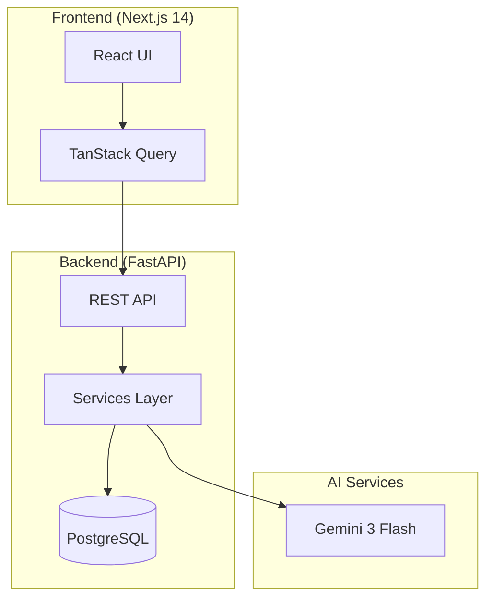

# Finance Report Documentation

Welcome to the **Finance Report** documentation — your comprehensive guide to building and using a personal financial management system with double-entry bookkeeping and bank reconciliation.

## 📖 Documentation Guide

This documentation is organized into four main sections to help you find what you need quickly:

-   :material-book-open-page-variant:{ .lg .middle } __User Guide__

    ---

    Learn how to use Finance Report for daily financial management

    [:octicons-arrow-right-24: Start here](user-guide/getting-started.md)

-   :material-api:{ .lg .middle } __API Reference__

    ---

    Complete REST API documentation for developers

    [:octicons-arrow-right-24: View APIs](reference/api-overview.md)

-   :material-file-document-multiple:{ .lg .middle } __Technical Documentation__

    ---

    Architecture, design decisions, and implementation details

    [:octicons-arrow-right-24: SSOT Docs](ssot/README.md)

-   :material-hammer-wrench:{ .lg .middle } __Development Guide__

    ---

    Setup development environment and contribute to the project

    [:octicons-arrow-right-24: Project Overview](project/README.md)

## 🚀 Quick Start

New to Finance Report? Follow these steps:

-   :material-rocket-launch:{ .lg .middle } __Getting Started__

    ---

    Set up your account and start tracking finances in minutes

    [:octicons-arrow-right-24: Quick start](user-guide/getting-started.md)

-   :material-bank:{ .lg .middle } __Account Management__

    ---

    Create and organize accounts using the Chart of Accounts

    [:octicons-arrow-right-24: Learn more](user-guide/accounts.md)

-   :material-book-open-variant:{ .lg .middle } __Journal Entries__

    ---

    Record transactions with double-entry bookkeeping

    [:octicons-arrow-right-24: View guide](user-guide/journal-entries.md)

-   :material-sync:{ .lg .middle } __Bank Reconciliation__

    ---

    Match bank statements with your records automatically

    [:octicons-arrow-right-24: Reconcile](user-guide/reconciliation.md)

## 🌟 Key Features

| Feature | Description | Status |
|---------|-------------|--------|
| **Double-Entry Bookkeeping** | Every transaction balanced with debits and credits | ✅ Available |
| **Chart of Accounts** | 5 account types: Asset, Liability, Equity, Income, Expense | ✅ Available |
| **Bank Statement Import** | Upload PDF/CSV bank statements | ✅ Available |
| **AI-Powered Parsing** | Gemini 3 Flash extracts transactions from statements | ✅ Available |
| **Smart Reconciliation** | Multi-dimensional matching with confidence scoring | ✅ Available |
| **Financial Reports** | Balance sheet, income statement, cash flow | 🚧 Coming Soon |
| **AI Financial Advisor** | Personalized insights and recommendations | ✅ Available |

## 📚 Documentation Structure

This documentation site is organized as follows:

### User Guide
Step-by-step guides for end users:

- [Getting Started](user-guide/getting-started.md) — Setup and first steps
- [Account Management](user-guide/accounts.md) — Creating and managing accounts
- [Journal Entries](user-guide/journal-entries.md) — Recording transactions
- [Bank Reconciliation](user-guide/reconciliation.md) — Matching bank statements
- [Reports & Dashboards](user-guide/reports.md) — Financial reporting
- [AI Advisor](user-guide/ai-advisor.md) — Using the AI financial advisor

### API Reference
Complete REST API documentation:

- [API Overview](reference/api-overview.md) — Authentication and common patterns
- [Accounts API](reference/api-accounts.md) — Account management endpoints
- [Journal Entries API](reference/api-journal.md) — Transaction recording endpoints
- [Reconciliation API](reference/api-reconciliation.md) — Bank reconciliation endpoints
- [AI Advisor API](reference/api-chat.md) — Chat and insights endpoints

### Technical Documentation (SSOT)
Single Source of Truth for technical decisions:

- [Architecture Overview](ssot/README.md) — System architecture and design principles
- [Accounting Model](ssot/accounting.md) — Double-entry bookkeeping rules
- [Reconciliation Engine](ssot/reconciliation.md) — Matching algorithms
- [Statement Extraction](ssot/extraction.md) — AI parsing pipeline
- [Reporting](ssot/reporting.md) — Report generation logic
- [AI Advisor](ssot/ai_advisor.md) — AI advisor implementation
- [Database Schema](ssot/schema.md) — Database design and migrations
- [Development Guide](ssot/development.md) — Development environment setup

### Development & Project Management
Project tracking and development guides:

- [Project Overview](project/README.md) — EPIC tracking and roadmap
- [Design Decisions](project/DECISIONS.md) — Key architectural decisions
- [Code Audit Report](README.md) — Current status and action items
- EPICs: [Setup](project/EPIC-001.phase0-setup.md) | [Double-Entry](project/EPIC-002.double-entry-core.md) | [Statement Parsing](project/EPIC-003.statement-parsing.md) | [Reconciliation](project/EPIC-004.reconciliation-engine.md) | [Reporting](project/EPIC-005.reporting-visualization.md) | [AI Advisor](project/EPIC-006.ai-advisor.md) | [Deployment](project/EPIC-007.deployment.md)

## 🏗️ System Architecture

For detailed architecture documentation, see [Architecture Overview](ssot/README.md).

## 🔗 Quick Links

- **Live Application**: [report.zitian.party](https://report.zitian.party)
- **API Documentation**: [report.zitian.party/api/docs](https://report.zitian.party/api/docs)
- **GitHub Repository**: [github.com/wangzitian0/finance_report](https://github.com/wangzitian0/finance_report)
- **Report Issues**: [GitHub Issues](https://github.com/wangzitian0/finance_report/issues)

## 🤝 Contributing

Interested in contributing? Check out:

- [Development Guide](ssot/development.md) — Setup your development environment
- [Project Overview](project/README.md) — Understand the project structure and roadmap
- [Code Audit Report](README.md) — Current priorities and action items

## 📄 License

MIT License — See repository for details.
