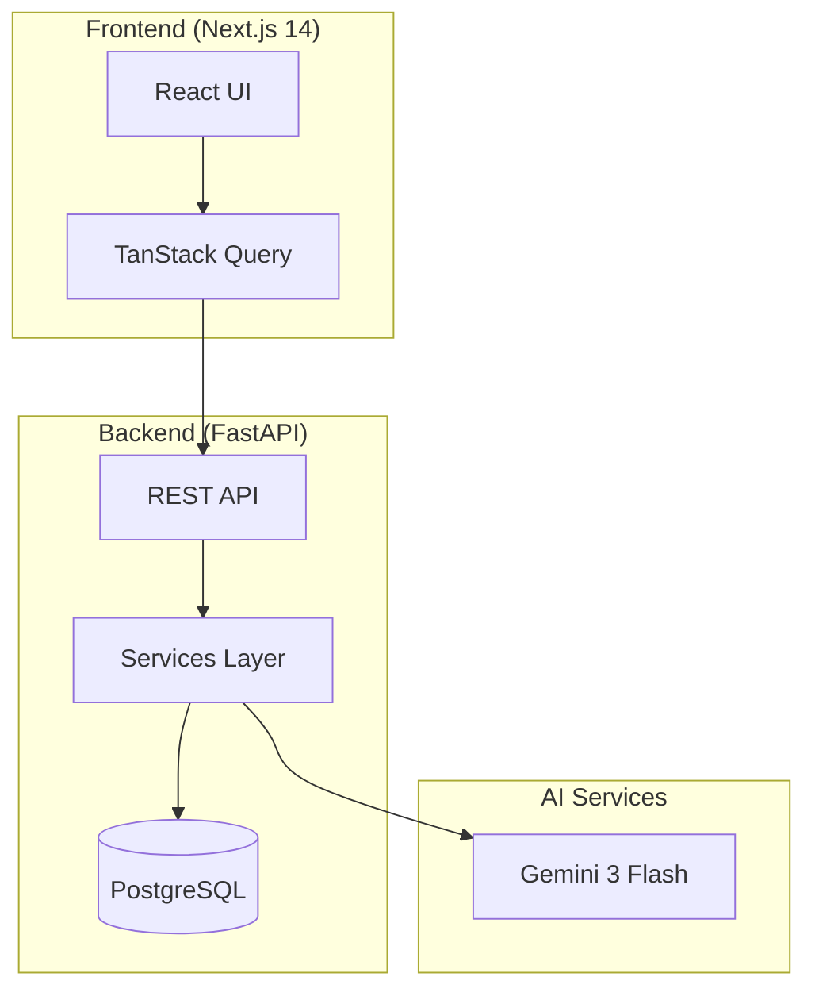

# Finance Report

Personal financial management system with double-entry bookkeeping and bank reconciliation.

-   :material-rocket-launch:{ .lg .middle } __Getting Started__

    ---

    Set up your account and start tracking finances in minutes

    [:octicons-arrow-right-24: Quick start](user-guide/getting-started.md)

-   :material-bank:{ .lg .middle } __Account Management__

    ---

    Create and organize accounts using the Chart of Accounts

    [:octicons-arrow-right-24: Learn more](user-guide/accounts.md)

-   :material-book-open-variant:{ .lg .middle } __Journal Entries__

    ---

    Record transactions with double-entry bookkeeping

    [:octicons-arrow-right-24: View guide](user-guide/journal-entries.md)

-   :material-sync:{ .lg .middle } __Bank Reconciliation__

    ---

    Match bank statements with your records automatically

    [:octicons-arrow-right-24: Reconcile](user-guide/reconciliation.md)

-   :material-comment-processing:{ .lg .middle } __AI Advisor__

    ---

    Ask finance questions and get report insights

    [:octicons-arrow-right-24: View guide](user-guide/ai-advisor.md)

## Live Demo

Visit [report.zitian.party](https://report.zitian.party) to try the application.

## Features

| Feature | Description | Status |
|---------|-------------|--------|
| **Double-Entry Bookkeeping** | Every transaction balanced with debits and credits | ✅ Available |
| **Chart of Accounts** | 5 account types: Asset, Liability, Equity, Income, Expense | ✅ Available |
| **Bank Statement Import** | Upload PDF/CSV bank statements | ✅ Available |
| **AI-Powered Parsing** | Gemini 3 Flash extracts transactions from statements | ✅ Available |
| **Smart Reconciliation** | Multi-dimensional matching with confidence scoring | ✅ Available |
| **Financial Reports** | Balance sheet, income statement, cash flow | 🚧 Coming Soon |
| **AI Financial Advisor** | Personalized insights and recommendations | ✅ Available |

## Architecture

## Quick Links

- **API Documentation**: [report.zitian.party/api/docs](https://report.zitian.party/api/docs)
- **GitHub Repository**: [github.com/wangzitian0/finance_report](https://github.com/wangzitian0/finance_report)
- **Report Issues**: [GitHub Issues](https://github.com/wangzitian0/finance_report/issues)
