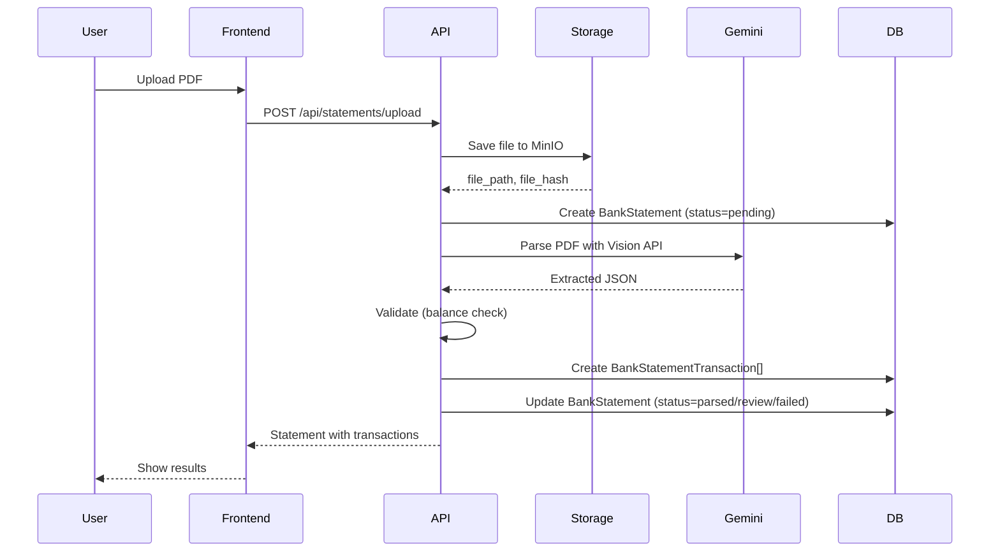

# EPIC-003: Smart Statement Parsing — GENERATED

> **Auto-generated implementation summary** — Do not edit manually.
> **Last updated**: 2026-01-27
> **Source EPIC**: [EPIC-003.statement-parsing.md](./EPIC-003.statement-parsing.md)

---

## 📋 Implementation Summary

EPIC-003 implemented AI-powered bank statement parsing using Gemini Vision through OpenRouter, with validation pipeline and confidence scoring for automated routing.

### Completed Deliverables

| Deliverable | Location | Status |
|-------------|----------|--------|
| BankStatement model | `apps/backend/src/models/statement.py` | ✅ Complete |
| BankStatementTransaction model | `apps/backend/src/models/statement.py` | ✅ Complete |
| Extraction service | `apps/backend/src/services/extraction.py` | ✅ Complete |
| Validation service | `apps/backend/src/services/validation.py` | ✅ Complete |
| Storage service | `apps/backend/src/services/storage.py` | ✅ Complete |
| Statements router | `apps/backend/src/routers/statements.py` | ✅ Complete |
| Statements page | `apps/frontend/src/app/(main)/statements/page.tsx` | ✅ Complete |
| Statement detail page | `apps/frontend/src/app/(main)/statements/[id]/page.tsx` | ✅ Complete |

---

## 🏗️ Architecture

### Data Flow



### AI Model Configuration

| Setting | Value | Source |
|---------|-------|--------|
| Primary Model | `google/gemini-2.0-flash-exp:free` | `config.py` |
| Fallback Models | `nvidia/llama-3.1-nemotron-70b-instruct:free`, `openai/gpt-4o-mini` | `config.py` |
| API Provider | OpenRouter | Rate-limited at provider level |
| Daily Limit | $2 USD | OpenRouter account setting |

---

## 📊 Data Models

### BankStatement

```python
class BankStatement(Base):
    __tablename__ = "bank_statements"
    
    id: Mapped[UUID]
    user_id: Mapped[UUID]
    account_id: Mapped[Optional[UUID]]  # FK to accounts
    
    # Metadata
    institution: Mapped[str]             # e.g., "DBS", "Maybank"
    account_last4: Mapped[Optional[str]] # Last 4 digits
    currency: Mapped[str]                # ISO 4217
    
    # Period
    period_start: Mapped[date]
    period_end: Mapped[date]
    
    # Balances
    opening_balance: Mapped[Decimal]
    closing_balance: Mapped[Decimal]
    
    # File info
    file_path: Mapped[str]               # MinIO path
    file_hash: Mapped[str]               # SHA-256 for dedup
    original_filename: Mapped[str]
    
    # Processing
    status: Mapped[str]                  # pending/parsed/review/failed
    confidence_score: Mapped[Optional[int]]  # 0-100
    balance_validated: Mapped[bool]
    validation_error: Mapped[Optional[str]]
```

### BankStatementTransaction

```python
class BankStatementTransaction(Base):
    __tablename__ = "bank_statement_transactions"
    
    id: Mapped[UUID]
    statement_id: Mapped[UUID]           # FK to bank_statements
    
    # Transaction data
    txn_date: Mapped[date]
    amount: Mapped[Decimal]
    direction: Mapped[str]               # CREDIT/DEBIT
    description: Mapped[str]
    reference: Mapped[Optional[str]]
    
    # Parsing metadata
    raw_text: Mapped[Optional[str]]
    confidence: Mapped[Optional[int]]    # Per-transaction confidence
    
    # Reconciliation
    status: Mapped[str]                  # pending/matched/unmatched
    reconciliation_match_id: Mapped[Optional[UUID]]
```

---

## 🔌 API Endpoints

| Endpoint | Method | Description |
|----------|--------|-------------|
| `/api/statements/upload` | POST | Upload and parse statement file |
| `/api/statements` | GET | List all statements for user |
| `/api/statements/{id}` | GET | Get statement with transactions |
| `/api/statements/pending-review` | GET | List statements needing review |
| `/api/statements/{id}/approve` | POST | Approve statement |
| `/api/statements/{id}/reject` | POST | Reject statement |
| `/api/statements/{id}/transactions` | GET | List transactions for statement |

### Upload Response

```json
{
  "id": "uuid",
  "institution": "DBS",
  "period_start": "2026-01-01",
  "period_end": "2026-01-31",
  "opening_balance": "10000.00",
  "closing_balance": "12500.00",
  "status": "parsed",
  "confidence_score": 92,
  "balance_validated": true,
  "transactions": [
    {
      "id": "uuid",
      "txn_date": "2026-01-05",
      "amount": "500.00",
      "direction": "CREDIT",
      "description": "SALARY PAYMENT"
    }
  ]
}
```

---

## ✅ Validation Pipeline

### Balance Validation

```python
def validate_balance(statement: BankStatement, transactions: list) -> bool:
    """
    Validates: Opening + sum(transactions) ≈ Closing
    Tolerance: 0.1 USD (configurable)
    """
    calculated = statement.opening_balance
    for txn in transactions:
        if txn.direction == "CREDIT":
            calculated += txn.amount
        else:
            calculated -= txn.amount
    
    difference = abs(calculated - statement.closing_balance)
    return difference <= Decimal("0.10")
```

### Confidence Score Routing

| Score | Action | Status |
|-------|--------|--------|
| ≥ 85 | Auto-accept | `parsed` |
| 60-84 | Review queue | `review` |
| < 60 | Manual entry required | `failed` |

### Confidence Factors

```python
CONFIDENCE_FACTORS = {
    "balance_matches": 30,        # Opening + txns = Closing
    "all_dates_valid": 15,        # Dates within period
    "amounts_parsed": 15,         # All amounts extracted
    "institution_known": 10,      # Known bank template
    "currency_detected": 10,      # Valid ISO currency
    "transactions_found": 10,     # At least 1 transaction
    "no_ocr_errors": 10,          # Clean text extraction
}
```

---

## 🏦 Supported Institutions

### Banks (Full Support)

| Institution | Template | Test Coverage |
|-------------|----------|---------------|
| DBS/POSB | `templates/dbs.yaml` | ✅ 3 samples |
| CMB | `templates/cmb.yaml` | ✅ 2 samples |
| Maybank | `templates/maybank.yaml` | ✅ 2 samples |

### Fintech (Generic Template)

| Institution | Template | Test Coverage |
|-------------|----------|---------------|
| Wise | `templates/fintech_generic.yaml` | ✅ 2 samples |
| Revolut | `templates/fintech_generic.yaml` | ⏳ Planned |

### Other (Generic Template)

| Type | Template | Test Coverage |
|------|----------|---------------|
| Brokerage | `templates/brokerage_generic.yaml` | ✅ 2 samples |
| Insurance | `templates/insurance_generic.yaml` | ⏳ Planned |

---

## 🧪 Test Coverage

| Test File | Description |
|-----------|-------------|
| `tests/extraction/test_extraction.py` | PDF parsing, validation |
| `tests/extraction/test_storage.py` | MinIO file operations |
| `tests/extraction/test_statements_router.py` | API endpoints |
| `tests/extraction/test_validation.py` | Balance validation logic |

### Sample Test

```python
def test_parse_dbs_statement(client, test_user_token, dbs_sample_pdf):
    """Upload and parse DBS statement with balance validation"""
    response = client.post(
        "/api/statements/upload",
        files={"file": ("dbs_jan_2026.pdf", dbs_sample_pdf, "application/pdf")},
        headers={"Authorization": f"Bearer {test_user_token}"}
    )
    
    assert response.status_code == 201
    data = response.json()
    assert data["institution"] == "DBS"
    assert data["balance_validated"] is True
    assert data["confidence_score"] >= 85
    assert len(data["transactions"]) > 0
```

---

## 📝 Technical Debt

| Item | Priority | Status |
|------|----------|--------|
| XLSX format support | P2 | ⏳ Planned |
| Batch upload queue | P2 | ⏳ Planned |
| OCR preprocessing | P3 | ⏳ Planned |
| Additional banks (UOB, Citi) | P3 | ⏳ Planned |

---

## 🔗 SSOT References

- [extraction.md](../ssot/extraction.md) — Parsing rules, prompt templates, validation
- [schema.md](../ssot/schema.md) — BankStatement, BankStatementTransaction tables
- [reconciliation.md](../ssot/reconciliation.md) — How parsed transactions feed into matching

---

## ✅ Verification Commands

```bash
# Run extraction tests
moon run backend:test -- -k extraction

# Test upload endpoint
curl -X POST http://localhost:8000/api/statements/upload \
  -H "Authorization: Bearer $TOKEN" \
  -F "file=@sample_dbs_statement.pdf"

# Check parsing result
curl -H "Authorization: Bearer $TOKEN" \
  http://localhost:8000/api/statements/{statement_id}

# List pending reviews
curl -H "Authorization: Bearer $TOKEN" \
  http://localhost:8000/api/statements/pending-review
```

---

*This file is auto-generated from EPIC-003 implementation. For goals and acceptance criteria, see [EPIC-003.statement-parsing.md](./EPIC-003.statement-parsing.md).*
