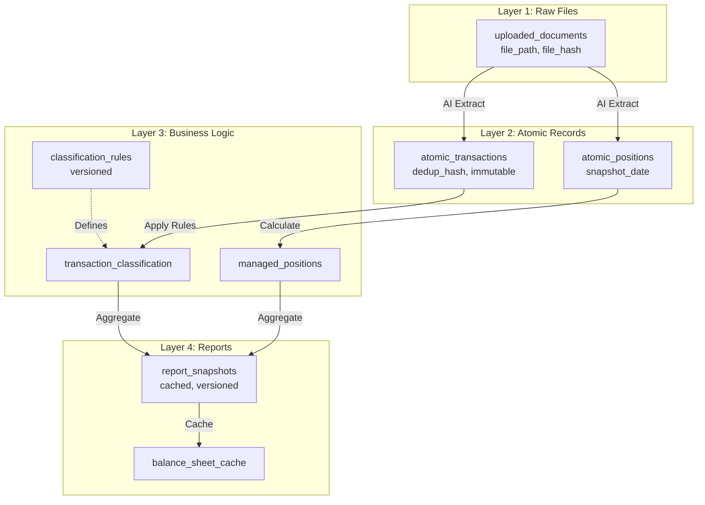

# EPIC-011: Asset Lifecycle Management — GENERATED

> **Auto-generated implementation summary** — Do not edit manually.
> **Last updated**: 2026-01-27
> **Source EPIC**: [EPIC-011.asset-lifecycle.md](./EPIC-011.asset-lifecycle.md)

---

## 📋 Implementation Summary

EPIC-011 implements comprehensive non-cash asset tracking with automated valuation updates, depreciation schedules, and balance sheet integration. The EPIC also includes a foundational 4-layer data architecture migration affecting EPIC-003, EPIC-004, and EPIC-005.

### P0 MVP Status

**✅ P0 Complete (2026-01-24)**: Basic asset position reconciliation API and frontend implemented.

### Scope Overview

| Asset Type | Features | Status |
|------------|----------|--------|
| Securities (Stocks, Bonds) | Market value tracking, mark-to-market | ⏳ In Progress |
| Real Estate | Appraisal-based valuation, mortgage tracking | ⏳ Planned |
| Depreciable Assets | Straight-line/accelerated depreciation | ⏳ Planned |
| ESOP | Vesting schedule, exercise tracking | ⏳ Planned |

---

## 🏗️ Architecture: 4-Layer Data Model

### Layer Overview



### Design Principles

| Layer | Mutability | Schema Evolution | Version Control |
|-------|------------|------------------|-----------------|
| Layer 1 | Append-only | Stable (add doc types) | File hash dedup |
| Layer 2 | Write-once | Stable (add fields only) | Hash-based dedup |
| Layer 3 | Mutable | Frequent changes | Version number required |
| Layer 4 | Ephemeral | Follows Layer 3 | Tied to rule version |

---

## 📁 Data Model

### Layer 1: Raw Files

**`uploaded_documents`** — Document metadata registry

| Column | Type | Description |
|--------|------|-------------|
| id | UUID | Primary key |
| user_id | UUID | Owner |
| file_path | VARCHAR(500) | MinIO object key |
| file_hash | VARCHAR(64) | SHA256 for deduplication |
| document_type | ENUM | `bank_statement\|brokerage_statement\|esop_grant\|property_appraisal` |
| status | ENUM | `uploaded\|processing\|completed\|failed` |

### Layer 2: Atomic Records

**`atomic_transactions`** — Deduplicated transaction records

| Column | Type | Description |
|--------|------|-------------|
| id | UUID | Primary key |
| user_id | UUID | Owner |
| txn_date | DATE | Transaction date |
| amount | DECIMAL(18,2) | Absolute value |
| direction | ENUM | `IN\|OUT` |
| description | TEXT | Merchant/description |
| dedup_hash | VARCHAR(64) | SHA256 for deduplication |
| source_documents | JSONB | Document references |

**`atomic_positions`** — Deduplicated position snapshots

| Column | Type | Description |
|--------|------|-------------|
| id | UUID | Primary key |
| user_id | UUID | Owner |
| snapshot_date | DATE | Snapshot date |
| asset_identifier | VARCHAR(100) | Ticker, ISIN, address |
| broker | VARCHAR(100) | Moomoo, Ping An, etc. |
| quantity | DECIMAL(18,6) | Shares, units |
| market_value | DECIMAL(18,2) | Fair value in asset currency |
| currency | CHAR(3) | Asset currency |
| dedup_hash | VARCHAR(64) | SHA256 for deduplication |

### Layer 3: Business Logic

**`classification_rules`** — Rule version registry

| Column | Type | Description |
|--------|------|-------------|
| id | UUID | Primary key |
| user_id | UUID | Owner |
| version_number | INT | Monotonic version |
| is_active | BOOLEAN | Current active version |
| rule_name | VARCHAR(100) | Rule identifier |
| rule_type | VARCHAR(50) | `keyword_match\|regex_match\|ml_model` |
| rule_config | JSONB | Rule parameters |

**`managed_positions`** — Calculated holdings

| Column | Type | Description |
|--------|------|-------------|
| id | UUID | Primary key |
| account_id | UUID | Linked brokerage account |
| asset_type | ENUM | `STOCK\|BOND\|REAL_ESTATE\|EQUIPMENT\|ESOP` |
| asset_identifier | VARCHAR(100) | Ticker/ISIN |
| quantity | DECIMAL(18,6) | Current holdings |
| cost_basis | DECIMAL(18,2) | Purchase price |
| status | ENUM | `ACTIVE\|DISPOSED` |

### Layer 4: Reports

**`balance_sheet_cache`** — Fast balance sheet queries

| Column | Type | Description |
|--------|------|-------------|
| user_id | UUID | Owner |
| as_of_date | DATE | Balance sheet date |
| rule_version_id | UUID | Rule version used |
| total_assets | DECIMAL(18,2) | Pre-calculated total |
| total_liabilities | DECIMAL(18,2) | Pre-calculated total |
| account_balances | JSONB | Account-level balances |
| ttl | TIMESTAMP | Cache expiry |

---

## 🔄 Rule Versioning

### Workflow

1. User updates classification rule
2. System creates new rule version (`version_number++`)
3. Background job reclassifies transactions
4. Old classifications marked as `superseded`
5. Report caches invalidated

### API Endpoints

| Method | Path | Description |
|--------|------|-------------|
| GET | `/api/rules/versions` | List rule versions |
| POST | `/api/rules/versions` | Create new version |
| PUT | `/api/rules/versions/{id}/activate` | Set as active |
| POST | `/api/rules/versions/{id}/apply` | Reclassify transactions |

---

## 📊 Double-Entry Integration

### Securities (Mark-to-Market)

```
# Purchase: 100 AAPL @ $150
DR  Investments:Moomoo:AAPL     $15,000
    CR  Cash:Bank                       $15,000

# Mark-to-Market: AAPL now $160 (unrealized gain $1,000)
DR  Investments:Moomoo:AAPL     $1,000
    CR  Equity:OCI:Unrealized Gains     $1,000

# Sale: Sell at $160
DR  Cash:Bank                   $16,000
    CR  Investments:Moomoo:AAPL         $16,000
DR  Equity:OCI:Unrealized Gains $1,000
    CR  Income:Realized Gains           $1,000
```

### Depreciation

```
# Purchase: Laptop $3,000 (3-year straight-line)
DR  Assets:Equipment:Laptop     $3,000
    CR  Cash:Bank                       $3,000

# Monthly Depreciation: ($3,000 - $300) / 36 = $75
DR  Expenses:Depreciation       $75
    CR  Contra:Accumulated Depreciation $75
```

### Real Estate

```
# Purchase: Property $500,000 with $400,000 mortgage
DR  Assets:Property             $500,000
    CR  Liabilities:Mortgage            $400,000
    CR  Cash:Down_Payment               $100,000

# Revaluation: Appraisal increases to $550,000
DR  Assets:Property             $50,000
    CR  Equity:Revaluation Reserve      $50,000
```

---

## 🛠️ Migration Strategy

### Recommended: Parallel Run (12 weeks)

| Phase | Duration | Activities |
|-------|----------|------------|
| Phase 1 | Week 1-2 | Add Layer 2 tables (backward compatible) |
| Phase 2 | Week 3-6 | Dual write (old + new tables) |
| Phase 3 | Week 7-8 | Dual read + validation |
| Phase 4 | Week 9-10 | Cutover to Layer 2 reads |
| Phase 5 | Week 11 | Stop dual write |
| Phase 6 | Week 12 | Deprecate Layer 0 |

### Go/No-Go Criteria

1. **Phase 2**: Data consistency ≥ 99.9% between old and new
2. **Phase 3**: Reconciliation results match 100%
3. **Phase 4**: No P0/P1 errors for 1 week

---

## 📏 Acceptance Criteria Status

### P0 MVP (Complete)

| Criterion | Status |
|-----------|--------|
| Basic asset position API | ✅ |
| Frontend asset list view | ✅ |
| Position reconciliation | ✅ |

### P1 Features (In Progress)

| Criterion | Status |
|-----------|--------|
| Market data sync (Yahoo Finance) | ⏳ |
| Mark-to-market journal entries | ⏳ |
| Depreciation schedules | ⏳ |
| ESOP vesting tracking | ⏳ |

### P2 Features (Planned)

| Criterion | Status |
|-----------|--------|
| 4-layer migration complete | ⏳ |
| Rule versioning | ⏳ |
| Report caching | ⏳ |

---

## 📚 SSOT Impact

### Files to Update

| File | Changes Required |
|------|------------------|
| `extraction.md` | Add Layer 1/2 schema, deduplication logic |
| `reconciliation.md` | Add versioning, change input to atomic_transactions |
| `reporting.md` | Add version-aware reports, Layer 4 caching |
| `schema.md` | Add all new tables, ER diagram update |
| `assets.md` | Primary SSOT for asset lifecycle |

---

## 🔗 References

### SSOT

- [assets.md](../ssot/assets.md) — Asset lifecycle SSOT
- [schema.md](../ssot/schema.md) — Database schema
- [reporting.md](../ssot/reporting.md) — Report generation

### Related EPICs

- [EPIC-002: Double-Entry Core](./EPIC-002.double-entry-core.md) — Prerequisite
- [EPIC-003: Statement Parsing](./EPIC-003.statement-parsing.md) — Affected by 4-layer migration
- [EPIC-004: Reconciliation Engine](./EPIC-004.reconciliation-engine.md) — Affected by 4-layer migration
- [EPIC-005: Reporting](./EPIC-005.reporting-visualization.md) — Affected by 4-layer migration

---

## ✅ Verification Commands

```bash
# Run asset-related tests
moon run backend:test -- -k "test_asset" -v

# Verify positions API
curl http://localhost:8000/api/assets/positions \
  -H "X-User-Id: <uuid>"

# Verify valuations API
curl http://localhost:8000/api/assets/valuations \
  -H "X-User-Id: <uuid>"

# Check balance sheet includes assets
curl "http://localhost:8000/api/reports/balance-sheet?as_of_date=2025-12-31" \
  -H "X-User-Id: <uuid>"
```

---

## 📅 Timeline

| Phase | Content | Estimated Duration |
|-------|---------|-------------------|
| P0 MVP | Basic position tracking | ✅ Complete |
| P1 | Market data + depreciation | 4 weeks |
| P2 | 4-layer migration | 12 weeks |
| P3 | Rule versioning + caching | 2 weeks |

**Total estimate**: 18 weeks (6 weeks asset features + 12 weeks migration)

---

*This file is auto-generated from EPIC-011 implementation. For goals and acceptance criteria, see [EPIC-011.asset-lifecycle.md](./EPIC-011.asset-lifecycle.md).*
