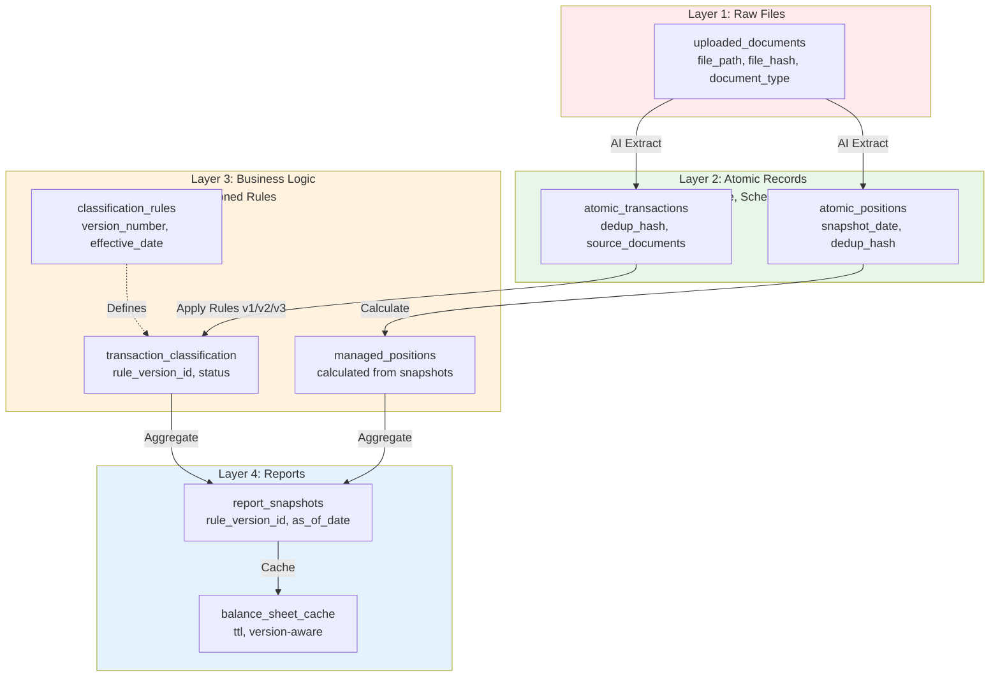
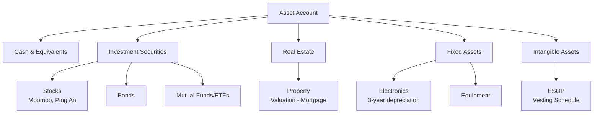
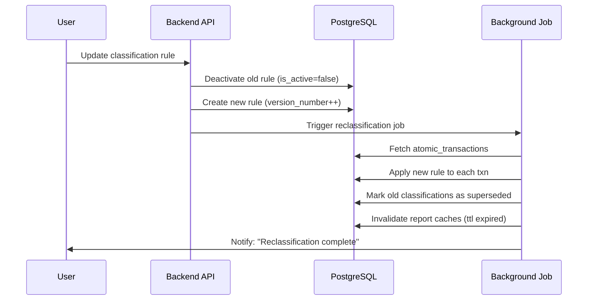
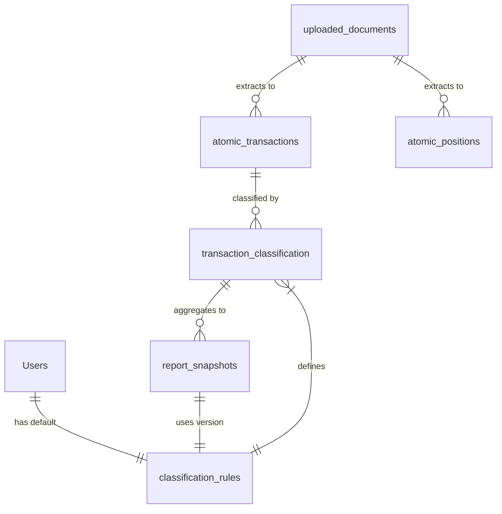

# EPIC-011: Asset Lifecycle Management

**Status**: ⏳ Pending  
**Phase**: 5  
**Duration**: 18 weeks (6 weeks asset features + 12 weeks 4-layer migration)  
**Priority**: P2 (Medium Priority)  
**Dependencies**: EPIC-002 (Double-Entry Core), EPIC-005 (Reporting)

> **Note**: This EPIC includes both asset lifecycle features (6 weeks) and foundational 4-layer architecture migration (12 weeks). The 4-layer migration affects EPIC-003, EPIC-004, EPIC-005 and should be prioritized first.

---

## 📋 Executive Summary

**Goal**: Implement comprehensive **non-cash asset tracking** with automated valuation updates, depreciation schedules, and balance sheet integration.

**Scope**:
- **Securities** (Moomoo, Ping An Securities, ESOP) → Market value tracking
- **Real Estate** (Property - Mortgage) → Appraisal-based valuation
- **Depreciable Assets** (Electronics, Equipment) → Straight-line/accelerated depreciation
- **Intangible Assets** (ESOP vesting schedule)

**Out of Scope**:
- Trading execution (buy/sell orders)
- Portfolio optimization or robo-advisory
- Crypto wallet integration
- Collectibles (art, wine, etc.)

---

## 🎯 Business Value

### Current Pain Points
1. **Securities hidden in bank balances** → No visibility into stock/bond holdings
2. **Property value stale** → Manual updates, no integration with appraisals
3. **Depreciation ignored** → Balance sheet overstates asset value
4. **ESOP vesting unclear** → No tracking of unvested options

### Success Metrics
- **Accuracy**: ≤ 1% variance between reported and real asset values
- **Automation**: ≥ 90% of securities valuations auto-updated
- **Coverage**: All asset classes represented in balance sheet
- **Timeliness**: Real estate valuations updated quarterly, securities daily

---

## 📐 Architecture Design

### 4-Layer Data Architecture (Critical Design Principle)

The system follows a **4-layer architecture** to separate concerns and enable schema evolution:



**Design Principles**:

| Layer | Mutability | Schema Evolution | Version Control |
|-------|------------|------------------|-----------------|
| **Layer 1** | Append-only | Stable (add doc types) | File hash dedup |
| **Layer 2** | Write-once | Stable (add fields only) | Hash-based dedup |
| **Layer 3** | Mutable | Frequent changes | **Version number required** |
| **Layer 4** | Ephemeral (cached) | Follows Layer 3 | **Tied to rule version** |

**Key Insight**: Layer 2 schema is **designed once, stable forever**. Layer 3 rules change frequently (account mappings, classification logic), so every operation in Layer 3/4 **MUST** reference a `rule_version_id`.

---

### Asset Type Hierarchy



---

## 🗄️ Data Model (4-Layer Design)

### Layer 1: Raw Files (Immutable Storage)

**`uploaded_documents`** — Document metadata registry
| Column | Type | Constraint | Description |
|--------|------|------------|-------------|
| id | UUID | PK | Primary key |
| user_id | UUID | FK → Users | Owner |
| file_path | VARCHAR(500) | NOT NULL | MinIO object key |
| file_hash | VARCHAR(64) | NOT NULL | SHA256 for deduplication |
| original_filename | VARCHAR(255) | NOT NULL | User-provided filename |
| document_type | ENUM | NOT NULL | `bank_statement|brokerage_statement|esop_grant|property_appraisal` (name="document_type_enum") |
| status | ENUM | NOT NULL | `uploaded|processing|completed|failed` (name="document_status_enum") |
| extraction_metadata | JSONB | | AI extraction logs, confidence scores |
| created_at | TIMESTAMP | NOT NULL | Upload time |

**Constraints**:
- `UNIQUE(user_id, file_hash)` — Prevent duplicate uploads

---

### Layer 2: Atomic Records (Immutable, Deduped)

**Design Constraint**: Layer 2 records are **write-once**. Once created, only `source_documents` can be appended (never modified). This ensures data integrity and simplifies debugging.

#### `atomic_transactions` — Deduplicated transaction records
| Column | Type | Constraint | Description |
|--------|------|------------|-------------|
| id | UUID | PK | Primary key |
| user_id | UUID | FK → Users | Owner |
| txn_date | DATE | NOT NULL | Transaction date |
| amount | DECIMAL(18,2) | NOT NULL | Absolute value |
| direction | ENUM | NOT NULL | `IN|OUT` (name="transaction_direction_enum") |
| description | TEXT | NOT NULL | Merchant/description |
| reference | VARCHAR(100) | | Bank reference number |
| currency | CHAR(3) | NOT NULL | ISO currency code |
| dedup_hash | VARCHAR(64) | NOT NULL | SHA256(user_id\|date\|amount\|dir\|desc\|ref) |
| source_documents | JSONB | NOT NULL | `[{"doc_id": "uuid", "doc_type": "bank_statement"}]` |
| created_at | TIMESTAMP | NOT NULL | |
| updated_at | TIMESTAMP | NOT NULL | Only for `source_documents` append |

**Constraints**:
- `UNIQUE(user_id, dedup_hash)` — Prevent duplicate transactions

**Deduplication Logic**:
```python
def calculate_dedup_hash(user_id, txn_date, amount, direction, description, reference=None):
    components = [
        str(user_id),
        txn_date.isoformat(),
        str(amount),
        direction,
        description.strip().lower(),
        reference or ""
    ]
    return hashlib.sha256("|".join(components).encode()).hexdigest()
```

**Upsert Behavior**:
- If `dedup_hash` exists → Append to `source_documents` (transaction appears in multiple statements)
- If `dedup_hash` new → Insert new record

---

#### `atomic_positions` — Deduplicated position snapshots
| Column | Type | Constraint | Description |
|--------|------|------------|-------------|
| id | UUID | PK | Primary key |
| user_id | UUID | FK → Users | Owner |
| snapshot_date | DATE | NOT NULL | Snapshot date |
| asset_identifier | VARCHAR(100) | NOT NULL | Ticker (AAPL), ISIN, property address |
| broker | VARCHAR(100) | | Moomoo, Ping An Securities, etc. |
| quantity | DECIMAL(18,6) | NOT NULL | Shares, units |
| market_value | DECIMAL(18,2) | NOT NULL | Fair value **in asset's currency** |
| currency | CHAR(3) | NOT NULL | Asset currency |
| dedup_hash | VARCHAR(64) | NOT NULL | SHA256(user_id\|date\|asset\|broker) |
| source_documents | JSONB | NOT NULL | `[{"doc_id": "uuid", "doc_type": "brokerage_statement"}]` |
| created_at | TIMESTAMP | NOT NULL | |

**Constraints**:
- `UNIQUE(user_id, dedup_hash)` — Prevent duplicate snapshots

---

### Layer 3: Business Logic (Versioned, Mutable)

**Design Constraint**: Layer 3 rules change frequently. Every table in Layer 3 **MUST** have a `rule_version_id` foreign key to enable:
1. **Historical replay**: Reprocess old transactions with new rules
2. **A/B comparison**: Compare results from different rule versions
3. **Audit trail**: Track which rules generated which classifications

#### `classification_rules` — Rule version registry
| Column | Type | Constraint | Description |
|--------|------|------------|-------------|
| id | UUID | PK | Primary key |
| user_id | UUID | FK → Users | Owner |
| version_number | INT | NOT NULL | Monotonic version (1, 2, 3...) |
| effective_date | DATE | NOT NULL | Rule applies from this date |
| is_active | BOOLEAN | NOT NULL | Current active version |
| rule_name | VARCHAR(100) | NOT NULL | "Credit Card Auto-Classification v2" |
| rule_type | VARCHAR(50) | NOT NULL | `keyword_match|regex_match|ml_model` |
| rule_config | JSONB | NOT NULL | Rule parameters (keywords, regex, model_id) |
| default_account_id | UUID | FK → Accounts | Default target account |
| tag_mappings | JSONB | | Tag assignment rules |
| created_by | UUID | FK → Users | Rule author |
| created_at | TIMESTAMP | NOT NULL | |
| updated_at | TIMESTAMP | NOT NULL | |

**Constraints**:
- `UNIQUE(user_id, rule_name, version_number)` — Version uniqueness

**User Default Version**:
```sql
-- Add to users table
ALTER TABLE users ADD COLUMN default_rule_version_id UUID REFERENCES classification_rules(id);
```

---

#### `transaction_classification` — Classification results (versioned)
| Column | Type | Constraint | Description |
|--------|------|------------|-------------|
| id | UUID | PK | Primary key |
| atomic_txn_id | UUID | FK → atomic_transactions | Source transaction |
| rule_version_id | UUID | FK → classification_rules | Rule version used |
| account_id | UUID | FK → Accounts | Classified account |
| tags | JSONB | | Applied tags |
| confidence_score | INT | | Classification confidence (0-100) |
| status | ENUM | NOT NULL | `draft|applied|superseded` (name="classification_status_enum") |
| superseded_by_id | UUID | FK → transaction_classification | Replaced by newer version |
| created_at | TIMESTAMP | NOT NULL | |

**Constraints**:
- `UNIQUE(atomic_txn_id, rule_version_id)` — One classification per transaction per rule version

---

#### `managed_positions` — Calculated positions (from atomic snapshots)
| Column | Type | Constraint | Description |
|--------|------|------------|-------------|
| id | UUID | PK | Primary key |
| user_id | UUID | FK → Users | Owner |
| account_id | UUID | FK → Accounts | Linked brokerage account |
| asset_identifier | VARCHAR(100) | NOT NULL | Ticker/ISIN |
| quantity | DECIMAL(18,6) | NOT NULL | Current holdings |
| cost_basis | DECIMAL(18,2) | NOT NULL | Purchase price (FIFO/AvgCost) |
| acquisition_date | DATE | NOT NULL | First purchase date |
| disposal_date | DATE | | Disposal date (if sold) |
| status | ENUM | NOT NULL | `ACTIVE|DISPOSED` (name="position_status_enum") |
| currency | CHAR(3) | NOT NULL | Asset currency |
| metadata | JSONB | | Broker-specific data |
| created_at | TIMESTAMP | NOT NULL | |
| updated_at | TIMESTAMP | NOT NULL | |

**Calculation Logic**: Reconcile `atomic_positions` snapshots → Calculate buys/sells → Generate `managed_positions`

---

### Layer 4: Reports (Versioned, Cached)

#### `report_snapshots` — Report results (version-aware)
| Column | Type | Constraint | Description |
|--------|------|------------|-------------|
| id | UUID | PK | Primary key |
| user_id | UUID | FK → Users | Owner |
| report_type | VARCHAR(50) | NOT NULL | `balance_sheet|income_statement|cash_flow` |
| as_of_date | DATE | NOT NULL | Report end date |
| start_date | DATE | | Report start date (for P&L, CF) |
| rule_version_id | UUID | FK → classification_rules | Rule version used |
| report_data | JSONB | NOT NULL | Full report JSON |
| is_latest | BOOLEAN | NOT NULL | Latest version flag |
| ttl | TIMESTAMP | | Cache expiry |
| created_at | TIMESTAMP | NOT NULL | |

**Constraints**:
- `UNIQUE(user_id, report_type, as_of_date, start_date, rule_version_id)` — One snapshot per config

**Query Pattern**:
```sql
-- Get latest balance sheet with user's default rule
SELECT report_data 
FROM report_snapshots 
WHERE user_id = ? 
  AND report_type = 'balance_sheet'
  AND as_of_date = ?
  AND rule_version_id = (SELECT default_rule_version_id FROM users WHERE id = ?)
  AND ttl > NOW()
LIMIT 1;
```

---

#### `balance_sheet_cache` — Fast balance sheet queries
| Column | Type | Constraint | Description |
|--------|------|------------|-------------|
| id | UUID | PK | Primary key |
| user_id | UUID | FK → Users | Owner |
| as_of_date | DATE | NOT NULL | Balance sheet date |
| rule_version_id | UUID | FK → classification_rules | Rule version |
| total_assets | DECIMAL(18,2) | NOT NULL | Pre-calculated total |
| total_liabilities | DECIMAL(18,2) | NOT NULL | Pre-calculated total |
| total_equity | DECIMAL(18,2) | NOT NULL | Pre-calculated total |
| currency | CHAR(3) | NOT NULL | Base currency |
| account_balances | JSONB | NOT NULL | `{account_id: balance}` |
| ttl | TIMESTAMP | NOT NULL | Cache expiry |
| created_at | TIMESTAMP | NOT NULL | |

**Constraints**:
- `UNIQUE(user_id, as_of_date, rule_version_id)` — One cache per config

---

---

## 🔄 Version Control & Rule Management

### Rule Version Workflow



### API Endpoints (Version-Aware)

| Method | Path | Description |
|--------|------|-------------|
| GET | `/api/rules/versions` | List rule versions |
| POST | `/api/rules/versions` | Create new rule version |
| PUT | `/api/rules/versions/{id}/activate` | Set as active version |
| POST | `/api/rules/versions/{id}/apply` | Reclassify transactions |
| GET | `/api/reports/balance-sheet?as_of_date={date}&rule_version_id={id}` | Get versioned report |
| GET | `/api/reports/balance-sheet?as_of_date={date}&use_default=true` | Use user's default rule |
| PUT | `/api/users/me/default-rule` | Set default rule version |

### Rule Application Logic

```python
async def apply_classification_rule(
    db: AsyncSession,
    txn: AtomicTransaction,
    rule_version_id: UUID
) -> TransactionClassification:
    """Apply rule to a single transaction."""
    rule = await db.get(ClassificationRule, rule_version_id)
    
    # Apply rule logic based on rule_type
    if rule.rule_type == "keyword_match":
        account_id = match_keywords(txn.description, rule.rule_config)
    elif rule.rule_type == "regex_match":
        account_id = match_regex(txn.description, rule.rule_config)
    elif rule.rule_type == "ml_model":
        account_id = predict_account(txn, rule.rule_config["model_id"])
    else:
        account_id = rule.default_account_id
    
    # Create classification record
    classification = TransactionClassification(
        atomic_txn_id=txn.id,
        rule_version_id=rule_version_id,
        account_id=account_id,
        confidence_score=calculate_confidence(txn, account_id),
        status="draft"
    )
    db.add(classification)
    await db.flush()
    
    return classification
```

### Report Generation (Version-Aware)

```python
async def generate_balance_sheet(
    db: AsyncSession,
    user_id: UUID,
    as_of_date: date,
    rule_version_id: UUID | None = None,
    use_default: bool = False
) -> dict:
    """Generate balance sheet for specific rule version."""
    
    # 1. Resolve rule version
    if use_default:
        user = await db.get(User, user_id)
        rule_version_id = user.default_rule_version_id
    elif rule_version_id is None:
        # Use latest active rule
        rule = await db.scalar(
            select(ClassificationRule)
            .where(
                ClassificationRule.user_id == user_id,
                ClassificationRule.is_active == True
            )
            .order_by(ClassificationRule.version_number.desc())
        )
        rule_version_id = rule.id
    
    # 2. Check cache
    cached = await db.scalar(
        select(BalanceSheetCache)
        .where(
            BalanceSheetCache.user_id == user_id,
            BalanceSheetCache.as_of_date == as_of_date,
            BalanceSheetCache.rule_version_id == rule_version_id,
            BalanceSheetCache.ttl > datetime.now()
        )
    )
    if cached:
        return {
            "total_assets": cached.total_assets,
            "total_liabilities": cached.total_liabilities,
            "total_equity": cached.total_equity,
            "account_balances": cached.account_balances,
            "rule_version_id": str(rule_version_id),
            "cached": True
        }
    
    # 3. Calculate from scratch
    classifications = await db.scalars(
        select(TransactionClassification)
        .join(AtomicTransaction)
        .where(
            AtomicTransaction.user_id == user_id,
            AtomicTransaction.txn_date <= as_of_date,
            TransactionClassification.rule_version_id == rule_version_id,
            TransactionClassification.status == "applied"
        )
    )
    
    # 4. Aggregate by account
    balances = {}
    for classification in classifications:
        account_id = str(classification.account_id)
        amount = classification.atomic_txn.amount
        direction = classification.atomic_txn.direction
        balances[account_id] = balances.get(account_id, Decimal(0))
        balances[account_id] += amount if direction == "IN" else -amount
    
    # 5. Calculate totals
    total_assets = sum(b for aid, b in balances.items() if is_asset_account(aid))
    total_liabilities = sum(b for aid, b in balances.items() if is_liability_account(aid))
    total_equity = total_assets - total_liabilities
    
    # 6. Cache result
    cache = BalanceSheetCache(
        user_id=user_id,
        as_of_date=as_of_date,
        rule_version_id=rule_version_id,
        total_assets=total_assets,
        total_liabilities=total_liabilities,
        total_equity=total_equity,
        currency="SGD",
        account_balances=balances,
        ttl=datetime.now() + timedelta(hours=1)
    )
    db.add(cache)
    await db.commit()
    
    return {
        "total_assets": total_assets,
        "total_liabilities": total_liabilities,
        "total_equity": total_equity,
        "account_balances": balances,
        "rule_version_id": str(rule_version_id),
        "cached": False
    }
```

---

## 📊 Impact Analysis on Existing EPICs

### EPIC-003: Statement Parsing

**Current State**:
- Extraction writes directly to `BankStatement` → `BankStatementTransaction`
- No deduplication mechanism (relies on `file_hash` for statement-level dedup)
- Single-version data model (no schema evolution support)

**Required Changes**:
1. **Add Layer 1 support**: Store file metadata in `uploaded_documents` before parsing
2. **Add Layer 2 target**: Write extracted transactions to `atomic_transactions` instead of `BankStatementTransaction`
3. **Implement deduplication**: Use `services/deduplication.py` to calculate `dedup_hash` and upsert atomic records
4. **Keep legacy tables**: `BankStatement`/`BankStatementTransaction` become Layer 0 (transition period only)

**Migration Path**:
```python
# OLD: services/extraction.py
def persist_parsed_statement(parsed: ParsedStatement):
    stmt = BankStatement(...)
    db.add(stmt)
    for txn in parsed.transactions:
        db.add(BankStatementTransaction(statement_id=stmt.id, ...))

# NEW: services/extraction.py (with 4-layer)
def persist_parsed_statement(parsed: ParsedStatement):
    # Layer 1: Document metadata
    doc = UploadedDocument(
        file_path=..., file_hash=..., document_type='bank_statement'
    )
    db.add(doc)
    
    # Layer 2: Atomic transactions (with dedup)
    for txn in parsed.transactions:
        dedup_service.upsert_atomic_transaction(
            txn_date=txn.date,
            amount=txn.amount,
            direction=txn.direction,
            description=txn.description,
            reference=txn.reference,
            source_document={'doc_id': str(doc.id), 'doc_type': 'bank_statement'}
        )
```

**Rollout Strategy**:
- **Phase 1** (Parallel Run): Write to both old and new tables
- **Phase 2** (Validation): Compare old vs new data, verify dedup works
- **Phase 3** (Cutover): New code only writes to Layer 1/2
- **Phase 4** (Deprecation): Remove old `BankStatement` writes after 3 months

---

### EPIC-004: Reconciliation Engine

**Current State**:
- Matches `BankStatementTransaction` (Layer 0) → `JournalEntry` (ledger)
- No rule versioning (algorithm changes affect all historical data)
- Match results are single-version (no superseded tracking in some flows)

**Required Changes**:
1. **Change input source**: Match from `atomic_transactions` (Layer 2) instead of `BankStatementTransaction`
2. **Add version awareness**: Add `rule_version_id` to `ReconciliationMatch`
3. **Enable historical replay**: Support reprocessing old transactions with new rules

**Migration Path**:
```python
# OLD: services/reconciliation.py
def find_candidates(bank_txn: BankStatementTransaction):
    return db.query(JournalEntry).filter(...)

# NEW: services/reconciliation.py (versioned)
def find_candidates(
    atomic_txn: AtomicTransaction, 
    rule_version_id: UUID
):
    rule = db.get(ClassificationRule, rule_version_id)
    # Apply version-specific matching logic
    candidates = db.query(JournalEntry).filter(...)
    return apply_version_rules(candidates, rule)
```

**Schema Changes**:
```sql
-- Add rule version FK to ReconciliationMatch
ALTER TABLE reconciliation_matches 
ADD COLUMN rule_version_id UUID REFERENCES classification_rules(id);

-- Migrate existing matches to default rule v1
UPDATE reconciliation_matches 
SET rule_version_id = (
    SELECT id FROM classification_rules 
    WHERE user_id = reconciliation_matches.user_id 
      AND version_number = 1
);
```

**Impact on Matching Algorithm**:
- Score weights may vary by rule version
- Historical matches can be recalculated with different rules
- Users can compare "Rule v1 results" vs "Rule v2 results"

---

### EPIC-005: Reporting & Visualization

**Current State**:
- Reports query `journal_entries` directly
- No caching layer (regenerate on every request)
- No support for versioned classifications (reports show current state only)

**Required Changes**:
1. **Add version parameter**: Reports must specify which `rule_version_id` to use
2. **Add user default**: `users.default_rule_version_id` for seamless UX
3. **Implement Layer 4 cache**: Use `report_snapshots` and `balance_sheet_cache` with TTL

**Migration Path**:
```python
# OLD: services/reporting.py
def generate_balance_sheet(user_id: UUID, as_of_date: date):
    entries = db.query(JournalEntry).filter(...)
    return aggregate(entries)

# NEW: services/reporting.py (version-aware + cached)
def generate_balance_sheet(
    user_id: UUID, 
    as_of_date: date,
    rule_version_id: UUID | None = None,
    use_default: bool = True
):
    # 1. Resolve rule version
    if use_default:
        user = db.get(User, user_id)
        rule_version_id = user.default_rule_version_id
    
    # 2. Check Layer 4 cache
    cached = db.query(BalanceSheetCache).filter(
        user_id=user_id, as_of_date=as_of_date, 
        rule_version_id=rule_version_id, ttl > now()
    ).first()
    if cached:
        return cached.to_dict()
    
    # 3. Calculate from Layer 3 classifications
    classifications = db.query(TransactionClassification).filter(
        rule_version_id=rule_version_id, status='applied'
    ).all()
    balances = aggregate(classifications)
    
    # 4. Write to cache
    cache = BalanceSheetCache(..., ttl=now() + timedelta(hours=1))
    db.add(cache)
    return balances
```

**API Changes**:
```diff
# GET /api/reports/balance-sheet
- ?as_of_date=2025-01-01
+ ?as_of_date=2025-01-01&rule_version_id=<uuid>  # optional
+ ?as_of_date=2025-01-01&use_default=true        # uses user's default rule
```

**Cache Invalidation**:
- When user creates new rule version → Invalidate all caches for that user
- When user changes `default_rule_version_id` → No invalidation needed (reports are version-specific)
- TTL expiry: 1 hour for balance sheet, 24 hours for historical reports

---

## 📚 Impact Analysis on SSOTs

### extraction.md

**Current State**:
- Documents 2-layer flow: Upload → Parse → Validate → `BankStatement`/`BankStatementTransaction`
- No mention of deduplication strategy
- No Layer 1/2 separation

**Required Updates**:
1. **Add Layer 1 schema**: Document `uploaded_documents` table
2. **Add Layer 2 schema**: Document `atomic_transactions` and `atomic_positions` tables
3. **Update data flow diagram**: Show 4-layer pipeline (Raw → Atomic → Logic → Reports)
4. **Add deduplication section**: Explain `dedup_hash` calculation and upsert logic
5. **Add source tracking**: Explain `source_documents` JSONB array (allows multiple sources)

**New Sections to Add**:
```markdown
## Layer 1: Raw File Storage

### uploaded_documents
| Field | Type | Description |
|-------|------|-------------|
| file_path | str | MinIO object key |
| file_hash | str | SHA256 for dedup |
| document_type | enum | bank_statement|brokerage_statement|esop_grant|property_appraisal |

## Layer 2: Atomic Records

### atomic_transactions
Deduplicated transaction records. Hash = SHA256(user_id|date|amount|dir|desc|ref).

**Upsert Behavior**:
- If `dedup_hash` exists → Append to `source_documents` array
- If new → Insert new record
```

---

### reconciliation.md

**Current State**:
- Documents matching algorithm with fixed weights
- No mention of rule versioning
- Input is `BankStatementTransaction`

**Required Updates**:
1. **Change input entity**: Update from `BankStatementTransaction` → `atomic_transactions`
2. **Add versioning section**: Document `rule_version_id` parameter in matching algorithm
3. **Update state machine**: Add version transitions (e.g., `superseded` when new rule applied)
4. **Add historical replay**: Document how to reprocess old transactions with new rules

**New Sections to Add**:
```markdown
## Rule Versioning

Every reconciliation operation references a `rule_version_id`:

```python
def execute_matching(
    user_id: UUID, 
    rule_version_id: UUID
):
    rule = db.get(ClassificationRule, rule_version_id)
    atomic_txns = db.query(AtomicTransaction).filter(...)
    
    for txn in atomic_txns:
        candidates = find_candidates(txn, rule)
        score = calculate_match_score(txn, candidates, rule.weights)
        
        match = ReconciliationMatch(
            atomic_txn_id=txn.id,
            rule_version_id=rule_version_id,
            match_score=score
        )
        db.add(match)
```

## Historical Replay

When user creates new rule version:
1. Mark old matches as `status='superseded'`
2. Run matching engine with new `rule_version_id`
3. Create new `ReconciliationMatch` records
4. Invalidate Layer 4 report caches
```

---

### reporting.md

**Current State**:
- Documents 3 report types (Balance Sheet, Income Statement, Cash Flow)
- No caching strategy
- No versioning support

**Required Updates**:
1. **Add version control section**: Document `rule_version_id` parameter for all reports
2. **Add caching strategy**: Document Layer 4 tables (`report_snapshots`, `balance_sheet_cache`)
3. **Add date range support**: Update API signatures to include `start_date` (for P&L, CF)
4. **Add user defaults**: Document `users.default_rule_version_id` behavior

**New Sections to Add**:
```markdown
## Version-Aware Reporting

All reports support rule version selection:

| Parameter | Required | Default | Description |
|-----------|----------|---------|-------------|
| `rule_version_id` | No | User's default | Specific rule version |
| `use_default` | No | true | Use user's default rule |
| `as_of_date` | Yes | - | Report end date |
| `start_date` | For P&L/CF | - | Report start date |

## Layer 4 Caching

### report_snapshots
Full report JSON with TTL and version tracking.

**Cache Hit Logic**:
1. Check if cache exists for (user_id, report_type, as_of_date, rule_version_id)
2. If exists and TTL valid → Return cached JSON
3. Else → Regenerate, write cache, return

**Cache Invalidation**:
- On new rule version creation → Delete all caches for that user
- On TTL expiry → Lazy regeneration on next request
```

---

### schema.md

**Current State**:
- Documents existing tables: `Users`, `Accounts`, `JournalEntries`, `JournalLines`, `BankStatement`, `BankStatementTransaction`, `ReconciliationMatch`
- ER diagram shows current relationships
- No Layer 2/3/4 tables

**Required Updates**:
1. **Add Layer 1 tables**: `uploaded_documents`
2. **Add Layer 2 tables**: `atomic_transactions`, `atomic_positions`
3. **Add Layer 3 tables**: `classification_rules`, `transaction_classification`, `managed_positions`, `asset_valuations`, `depreciation_schedules`, `esop_vesting`
4. **Add Layer 4 tables**: `report_snapshots`, `balance_sheet_cache`
5. **Update ER diagram**: Add new entities and relationships
6. **Add versioning constraints**: Document `UNIQUE(atomic_txn_id, rule_version_id)` constraint

**New ER Relationships**:


**Index Recommendations**:
```sql
-- Layer 2 deduplication
CREATE INDEX idx_atomic_txn_dedup ON atomic_transactions(user_id, dedup_hash);
CREATE INDEX idx_atomic_pos_dedup ON atomic_positions(user_id, dedup_hash);

-- Layer 3 versioning
CREATE INDEX idx_txn_class_rule_version ON transaction_classification(rule_version_id, status);
CREATE INDEX idx_txn_class_atomic_txn ON transaction_classification(atomic_txn_id, rule_version_id);

-- Layer 4 caching
CREATE INDEX idx_report_cache_ttl ON report_snapshots(user_id, report_type, ttl);
CREATE INDEX idx_bs_cache_ttl ON balance_sheet_cache(user_id, as_of_date, ttl);
```

---

## 🛠️ Migration Strategy

### Option A: Parallel Run (Recommended)

**Pros**: Lower risk, rollback safety, gradual validation  
**Cons**: Longer timeline, dual writes increase complexity

**Timeline**: 12 weeks  
**Phases**:

#### Phase 1: Add Layer 2 Tables (Week 1-2)
- Create Alembic migrations for `uploaded_documents`, `atomic_transactions`, `atomic_positions`
- Deploy schema changes (backward compatible)
- No code changes yet

#### Phase 2: Dual Write (Week 3-6)
- Update `services/extraction.py` to write to **both** old and new tables
- Add feature flag: `ENABLE_4_LAYER_WRITE=true`
- Monitor data consistency (old vs new)

```python
if config.ENABLE_4_LAYER_WRITE:
    # Write to Layer 1/2 (new)
    dedup_service.upsert_atomic_transaction(...)
# Always write to Layer 0 (old)
db.add(BankStatementTransaction(...))
```

#### Phase 3: Dual Read + Validation (Week 7-8)
- Update `services/reconciliation.py` to read from **both** sources
- Compare results (should be identical)
- Log discrepancies for investigation

```python
# Read from old
old_txns = db.query(BankStatementTransaction).all()
# Read from new
new_txns = db.query(AtomicTransaction).all()
# Compare
validate_consistency(old_txns, new_txns)
```

#### Phase 4: Cutover to Layer 2 Reads (Week 9-10)
- Switch reconciliation to read **only** from `atomic_transactions`
- Feature flag: `ENABLE_4_LAYER_READ=true`
- Monitor for errors

#### Phase 5: Stop Dual Write (Week 11)
- Stop writing to `BankStatement`/`BankStatementTransaction`
- Keep tables for 3 months (audit trail)

#### Phase 6: Deprecate Layer 0 (Week 12)
- Delete old tables (after 3-month retention)
- Update SSOT docs to remove Layer 0 references

---

### Option B: Big Bang Migration

**Pros**: Faster delivery, cleaner codebase  
**Cons**: Higher risk, no rollback, harder to debug

**Timeline**: 4 weeks  
**Phases**:

#### Phase 1: Schema Cutover (Week 1)
- Rename `bank_statements` → `uploaded_documents`
- Migrate `bank_statement_transactions` → `atomic_transactions` (data migration script)
- Add `dedup_hash` column, backfill hashes

#### Phase 2: Code Update (Week 2)
- Update all services to use new tables
- Remove old table references
- Update tests

#### Phase 3: Validation (Week 3)
- Run full regression test suite
- Manual E2E testing
- Performance benchmarks

#### Phase 4: Deploy (Week 4)
- Production deployment
- Monitor for issues
- Rollback plan: Restore from backup, revert code

---

### Recommendation: Parallel Run

**Justification**:
- Financial data requires high correctness guarantees
- Gradual validation reduces risk of data loss
- Rollback is simple (turn off feature flag)
- 12 weeks is acceptable given criticality

**Go/No-Go Criteria** (end of each phase):
1. **Phase 2**: Data consistency ≥ 99.9% between old and new
2. **Phase 3**: Reconciliation results match 100% (or discrepancies explained)
3. **Phase 4**: No P0/P1 errors in production for 1 week

---

## 📊 Original Asset Design (Layer 3 - To Be Integrated)

> **Note**: The tables below are the **original asset management design**. They will be integrated into Layer 3 as versioned business logic. Key changes:
> - `asset_positions` → Renamed to `managed_positions` (Layer 3 calculated from Layer 2 `atomic_positions`)
> - `asset_valuations` → Remains in Layer 3, linked to `managed_positions`
> - `depreciation_schedules`, `esop_vesting` → Remain in Layer 3

**`managed_positions`** — Holdings registry (Layer 3 - Calculated)
| Column | Type | Constraint | Description |
|--------|------|------------|-------------|
| id | UUID | PK | Primary key |
| user_id | UUID | FK → Users | Owner |
| account_id | UUID | FK → Accounts | Linked account (e.g., "Moomoo Brokerage") |
| asset_type | ENUM | NOT NULL | `STOCK|BOND|REAL_ESTATE|EQUIPMENT|ESOP` (name="asset_type_enum") |
| asset_identifier | VARCHAR(100) | NOT NULL | Ticker (AAPL), address, serial number |
| quantity | DECIMAL(18,6) | NOT NULL | Shares, square meters, units |
| cost_basis | DECIMAL(18,2) | NOT NULL | Purchase price (total) |
| acquisition_date | DATE | NOT NULL | Purchase date |
| disposal_date | DATE | | Sale/disposal date |
| status | ENUM | NOT NULL | `ACTIVE|DISPOSED` (name="asset_position_status_enum") |
| currency | CHAR(3) | NOT NULL | Asset currency (SGD, USD, HKD, etc.) |
| metadata | JSONB | | Broker account, property details, etc. |
| created_at | TIMESTAMP | NOT NULL | |
| updated_at | TIMESTAMP | NOT NULL | |

**Constraints**:
- `(user_id, account_id, asset_identifier, acquisition_date)` unique for active positions

**Important**: All `ENUM` types **MUST** have explicit `name="..."` parameter in SQLAlchemy to prevent migration conflicts.

---

**`asset_valuations`** — Historical valuations
| Column | Type | Constraint | Description |
|--------|------|------------|-------------|
| id | UUID | PK | Primary key |
| position_id | UUID | FK → managed_positions | Position |
| valuation_date | DATE | NOT NULL | Valuation date |
| fair_value | DECIMAL(18,2) | NOT NULL | Market/appraised value **in asset's currency** |
| valuation_source | ENUM | NOT NULL | `MARKET_FEED|MANUAL|APPRAISAL` (name="valuation_source_enum") |
| source_metadata | JSONB | | API source, appraiser name, etc. |
| created_at | TIMESTAMP | NOT NULL | |

**Constraints**:
- `(position_id, valuation_date)` unique

**Note**: `fair_value` is stored in the asset's **original currency** (from `managed_positions.currency`). Reporting layer converts to base currency (SGD) using `fx_rates` table.

---

**`depreciation_schedules`** — Depreciation tracking
| Column | Type | Constraint | Description |
|--------|------|------------|-------------|
| id | UUID | PK | Primary key |
| position_id | UUID | FK → managed_positions | Asset |
| method | ENUM | NOT NULL | `STRAIGHT_LINE|DECLINING_BALANCE` |
| useful_life_years | INT | NOT NULL | Depreciation period |
| salvage_value | DECIMAL(18,2) | NOT NULL | Residual value |
| start_date | DATE | NOT NULL | Depreciation start |
| end_date | DATE | NOT NULL | Depreciation end |
| status | ENUM | NOT NULL | `ACTIVE|FULLY_DEPRECIATED|DISPOSED` |
| created_at | TIMESTAMP | NOT NULL | |
| updated_at | TIMESTAMP | NOT NULL | |

---

**`esop_vesting`** — ESOP vesting schedule
| Column | Type | Constraint | Description |
|--------|------|------------|-------------|
| id | UUID | PK | Primary key |
| user_id | UUID | FK → Users | Owner |
| grant_id | VARCHAR(100) | NOT NULL | Grant identifier |
| grant_date | DATE | NOT NULL | Grant date |
| vesting_start | DATE | NOT NULL | Vesting start |
| vesting_end | DATE | NOT NULL | Vesting end |
| total_options | INT | NOT NULL | Total options granted |
| exercise_price | DECIMAL(18,2) | NOT NULL | Strike price |
| vesting_schedule | JSONB | NOT NULL | `[{"date": "2024-01-01", "quantity": 1000}, ...]` |
| status | ENUM | NOT NULL | `UNVESTED|VESTED|EXERCISED|FORFEITED` |
| created_at | TIMESTAMP | NOT NULL | |
| updated_at | TIMESTAMP | NOT NULL | |

---

### Integration with Double-Entry Bookkeeping

#### Securities (Stocks, Bonds)

**Purchase Entry** (Buy 100 AAPL @ $150 = $15,000)
```
DR  Investments:Moomoo:AAPL     $15,000
    CR  Cash:Bank                       $15,000
```

**Mark-to-Market Adjustment** (AAPL now $160, unrealized gain $1,000)
```
DR  Investments:Moomoo:AAPL     $1,000
    CR  Equity:OCI:Unrealized Gains     $1,000
```

**Note**: Unrealized gains are recorded in **Other Comprehensive Income (OCI)** under Equity, not in P&L (Income). This keeps the income statement clean (only realized gains appear there).

**Sale Entry** (Sell 100 AAPL @ $160 = $16,000)
```
// Realize the proceeds
DR  Cash:Bank                   $16,000
    CR  Investments:Moomoo:AAPL         $16,000

// Reclassify OCI to realized income
DR  Equity:OCI:Unrealized Gains $1,000
    CR  Income:Realized Gains           $1,000
```

---

#### Real Estate

**Purchase Entry** (Buy property $500,000 with $400,000 mortgage)
```
DR  Assets:Property:123_Main_St $500,000
    CR  Liabilities:Mortgage:Bank       $400,000
    CR  Cash:Bank                       $100,000
```

**Revaluation Entry** (Appraisal increases value to $550,000)
```
DR  Assets:Property:123_Main_St $50,000
    CR  Equity:Unrealized Gains         $50,000
```

**Mortgage Payment** (Principal $1,000, Interest $500)
```
DR  Liabilities:Mortgage:Bank   $1,000
DR  Expenses:Interest           $500
    CR  Cash:Bank                       $1,500
```

---

#### Depreciable Assets (Electronics)

**Purchase Entry** (Laptop $3,000, 3-year straight-line)
```
DR  Assets:Equipment:Laptop     $3,000
    CR  Cash:Bank                       $3,000
```

**Monthly Depreciation Entry** (Month 1: $3,000 / 36 months = $83.33)
```
DR  Expenses:Depreciation       $83.33
    CR  Contra Asset:Accumulated Depreciation:Laptop $83.33
```

**Note**: `Accumulated Depreciation` is a **Contra Asset** account (reduces Asset value on balance sheet). Requires extending `AccountType` enum to add `CONTRA_ASSET`.

**Balance Sheet Display**:
```
Assets:
  Equipment:Laptop                       $3,000
  Less: Accumulated Depreciation        ($1,000)
  Net Book Value                         $2,000
```

---

#### ESOP (Vesting & Exercise)

**Grant Entry** (1,000 options, $10 strike, FMV $15 at vest)
```
(No entry until vesting)
```

**Vesting Entry** (250 options vest, intrinsic value 250 × ($15 - $10) = $1,250)
```
DR  Expenses:Stock Compensation $1,250
    CR  Equity:APIC (Additional Paid-in Capital) $1,250
```

**Note**: Per GAAP/IFRS, stock compensation is recorded as **expense** (P&L) and **equity increase** (balance sheet). `APIC` is displayed in UI as "Employee Stock Options" for clarity.

**Exercise Entry** (Exercise 250 options, pay $2,500, receive stock worth $3,750)
```
DR  Investments:Company_Stock   $3,750
DR  Equity:APIC                 $1,250
    CR  Cash:Bank                       $2,500
```

---

## 🔄 Reusable Components & Reference Patterns

### Backend: Components to Reuse

| Component | Location | What to Reuse |
|-----------|----------|---------------|
| **Service Layer Pattern** | `src/services/accounting.py` | Error handling (`AccountingError`, `ValidationError`), validation helpers |
| **Router Structure** | `src/routers/statements.py` | Dependency injection (`DbSession`, `CurrentUserId`), error responses (`raise_not_found`, `raise_bad_request`) |
| **Background Task Pattern** | `src/routers/statements.py::_parse_statement_background()` | Task tracking (`_PENDING_PARSE_TASKS`), async job lifecycle |
| **Database Session Management** | `src/deps.py::get_db()` | Async session generator, automatic commit/rollback |
| **Decimal Validation** | `src/services/accounting.py::validate_journal_balance()` | Tolerance checks (`Decimal("0.01")`), balance validation |
| **Enum Naming** | `src/models/*.py` | **ALWAYS** explicit `name="..."` for all `sa.Enum` types |
| **Audit Fields** | `src/models/base.py` | `created_at`, `updated_at` with `server_default=func.now()` |

### Frontend: Patterns to Follow

| Pattern | Reference | What to Copy |
|---------|-----------|--------------|
| **List Page Structure** | `src/app/(main)/statements/page.tsx` | Fetch loop, polling (`useEffect`), status filters, table rendering |
| **Form Modal Pattern** | `src/app/(main)/journal/page.tsx::JournalEntryForm` | Open/close state, submit handler, error display |
| **API Client** | `src/lib/api.ts::apiFetch()` | Type-safe fetch wrapper, automatic auth headers |
| **Toast Notifications** | `src/components/ui/Toast.tsx` | Success/error feedback |
| **Confirm Dialog** | `src/components/ui/ConfirmDialog.tsx` | Void/delete confirmations with reason input |
| **Currency Formatting** | `statements/page.tsx::formatAmount()` | Locale-aware decimal display |

### Database: Migration Guardrails

| Constraint | Enforcement | Example |
|------------|-------------|---------|
| **Explicit Enum Names** | `tests/test_schema_guardrails.py` | `sa.Enum(AssetType, name="asset_type_enum")` ✅ |
| **Foreign Keys** | SQLAlchemy relationship | `account_id: UUID = sa.Column(UUID, sa.ForeignKey("accounts.id"), nullable=False)` |
| **Unique Constraints** | Table args | `__table_args__ = (UniqueConstraint("user_id", "account_id", "asset_identifier", "acquisition_date"),)` |
| **Decimal Precision** | All monetary columns | `cost_basis: Decimal = sa.Column(sa.NUMERIC(18, 2), nullable=False)` |
| **Audit Timestamps** | Inherit from `Base` | `created_at`, `updated_at` with `onupdate=func.now()` |

### Testing: Reference Test Structures

| Test Type | Reference File | What to Copy |
|-----------|----------------|--------------|
| **Service Unit Tests** | `test_account_service_unit.py` | Mock DB session, fixture setup, assertion patterns |
| **Integration Tests** | `test_reconciliation_engine.py` | Full DB lifecycle, `_make_statement()` helper pattern |
| **Router Tests** | `test_api_endpoints.py` | FastAPI TestClient, auth headers, status code checks |
| **Balance Validation** | `test_accounting_integration.py` | `validate_journal_balance()`, debit/credit checks |

---

## 📋 End-to-End Acceptance Checklist

### User Story 1: Securities Position Tracking

**As a** user with a Moomoo brokerage account  
**I want to** record my stock holdings and see their current value  
**So that** I can track my net worth accurately

**Acceptance Steps**:
1. [ ] **Create Position**: POST `/api/assets/positions` with `{ asset_type: "STOCK", asset_identifier: "AAPL", quantity: 100, cost_basis: 15000, acquisition_date: "2024-01-15" }`
2. [ ] **Verify Entry**: Journal entry created: DR `Investments:Moomoo:AAPL $15,000`, CR `Cash:Bank $15,000`
3. [ ] **Market Data Sync**: Background job fetches AAPL price ($160) → Creates valuation record
4. [ ] **Mark-to-Market Entry**: Journal entry created: DR `Investments:Moomoo:AAPL $1,000`, CR `Income:Unrealized Gains $1,000`
5. [ ] **Balance Sheet Display**: Asset shows as `$16,000` (updated from $15,000)
6. [ ] **Unrealized Gain**: Equity section shows `Unrealized Gains: $1,000`

**Pass Criteria**:
- [ ] Position appears in `/assets` dashboard
- [ ] Balance sheet `GET /api/reports/balance-sheet` includes updated fair value
- [ ] All journal entries are balanced (debit = credit within 0.01 tolerance)
- [ ] Valuation history chart shows cost basis → fair value progression

---

### User Story 2: Depreciation Schedule (Electronics)

**As a** user who bought a laptop for work  
**I want to** depreciate it over 3 years  
**So that** my balance sheet reflects its declining value

**Acceptance Steps**:
1. [ ] **Create Position**: POST `/api/assets/positions` with `{ asset_type: "EQUIPMENT", asset_identifier: "MacBook Pro 2024", quantity: 1, cost_basis: 3000, acquisition_date: "2024-01-01" }`
2. [ ] **Create Schedule**: POST `/api/assets/depreciation/schedules` with `{ position_id, method: "STRAIGHT_LINE", useful_life_years: 3, salvage_value: 300 }`
3. [ ] **Monthly Depreciation**: Background job creates entry: DR `Expenses:Depreciation $75`, CR `Accumulated Depreciation:Laptop $75` (calculation: `(3000 - 300) / 36 months`)
4. [ ] **Balance Sheet Display**: 
   - Assets: `Equipment: $3,000`
   - Less: `Accumulated Depreciation: ($900)` (after 12 months)
   - Net Book Value: `$2,100`
5. [ ] **Disposal**: User disposes after 18 months → POST `/api/assets/positions/{id}/dispose`
6. [ ] **Disposal Entry**: 
   - DR `Cash:Proceeds $1,500` (sale price)
   - DR `Accumulated Depreciation:Laptop $1,350` (18 months × $75)
   - DR `Expenses:Loss on Disposal $150` (plug)
   - CR `Assets:Equipment:Laptop $3,000`

**Pass Criteria**:
- [ ] Depreciation schedule status updates to `ACTIVE` → `FULLY_DEPRECIATED` automatically
- [ ] Monthly job posts entries on schedule without manual intervention
- [ ] Balance sheet net book value matches `cost_basis - accumulated_depreciation`
- [ ] Disposal entry balances correctly (debit = credit)

---

### User Story 3: Real Estate Valuation (Property - Mortgage)

**As a** homeowner with a mortgage  
**I want to** track my property's appraised value and outstanding loan  
**So that** I can see my true net equity

**Acceptance Steps**:
1. [ ] **Create Property Position**: POST `/api/assets/positions` with `{ asset_type: "REAL_ESTATE", asset_identifier: "123 Main St", quantity: 1, cost_basis: 500000, acquisition_date: "2023-01-01" }`
2. [ ] **Create Mortgage Liability**: POST `/api/journal-entries` (manual entry):
   - DR `Assets:Property:123_Main_St $500,000`
   - CR `Liabilities:Mortgage:Bank $400,000`
   - CR `Cash:Down_Payment $100,000`
3. [ ] **Annual Revaluation**: POST `/api/assets/valuations` with `{ position_id, valuation_date: "2024-01-01", fair_value: 550000, source: "APPRAISAL" }`
4. [ ] **Revaluation Entry**: 
   - DR `Assets:Property:123_Main_St $50,000`
   - CR `Equity:Unrealized Gains $50,000`
5. [ ] **Mortgage Payment**: POST `/api/journal-entries` (monthly):
   - DR `Liabilities:Mortgage:Bank $1,000` (principal)
   - DR `Expenses:Interest $500`
   - CR `Cash:Bank $1,500`
6. [ ] **Balance Sheet Display**:
   - Assets: `Property: $550,000`
   - Liabilities: `Mortgage: $399,000` (after 1 payment)
   - Net Equity: `$151,000` ($550k - $399k)

**Pass Criteria**:
- [ ] Manual valuation creates `asset_valuations` record
- [ ] Revaluation entry posted with proper Equity account
- [ ] Balance sheet shows updated fair value, not historical cost
- [ ] Net equity calculation correct: `(Property Value - Mortgage Balance)`

---

### User Story 4: ESOP Vesting & Exercise

**As an** employee with stock options  
**I want to** track my vesting schedule and intrinsic value  
**So that** I know when to exercise

**Acceptance Steps**:
1. [ ] **Create Grant**: POST `/api/assets/esop/grants` with `{ grant_id: "G2024-001", grant_date: "2024-01-01", total_options: 1000, exercise_price: 10, vesting_schedule: [{"date": "2025-01-01", "quantity": 250}, ...] }`
2. [ ] **Vesting Event** (1 year cliff): Background job on `2025-01-01` creates entry:
   - DR `Assets:ESOP:Unvested $1,250` (250 × ($15 FMV - $10 strike))
   - CR `Income:Stock Compensation $1,250`
3. [ ] **Exercise**: POST `/api/assets/esop/grants/{id}/exercise` with `{ quantity: 250, fmv: 15 }`
4. [ ] **Exercise Entry**:
   - DR `Investments:Company_Stock $3,750` (250 × $15 FMV)
   - CR `Cash:Bank $2,500` (250 × $10 strike)
   - CR `Assets:ESOP:Unvested $1,250`
5. [ ] **Balance Sheet Display**:
   - Assets: `ESOP Unvested: $3,750` (remaining 750 options)
   - Assets: `Company Stock: $3,750` (exercised shares)

**Pass Criteria**:
- [ ] Vesting job only processes grants where `status = UNVESTED` and `as_of_date >= vesting_date`
- [ ] Intrinsic value calculation uses latest FMV from `asset_valuations` or manual input
- [ ] ESOP dashboard shows vesting timeline (Gantt chart)
- [ ] Exercise entry reduces `unvested` balance correctly

---

## 🎬 Typical Use Cases (Workflows)

### Daily: Auto-Update Securities Prices

```
Cron Job (Daily 9 AM SGD Time):
  1. SELECT positions WHERE asset_type IN ('STOCK', 'BOND', 'FUND') AND status = 'ACTIVE'
  2. FOR EACH position:
       - Fetch EOD price from Yahoo Finance API (ticker = asset_identifier)
       - INSERT INTO asset_valuations (fair_value, valuation_source = 'MARKET_FEED')
       - IF abs(fair_value - previous_valuation) > 1%:
           - Create mark-to-market journal entry
           - Update journal entry status to 'posted'
  3. Email digest: "Updated 15 securities, total unrealized gain: $12,345"
```

**Expected Behavior**:
- No user intervention required
- Stale data alert if API fails for >7 days
- Multi-currency positions converted to base currency (SGD) using FX rates from `market_data.md`

---

### Monthly: Depreciation Batch Processing

```
Cron Job (1st of Month, 2 AM):
  1. SELECT schedules WHERE status = 'ACTIVE' AND start_date <= today
  2. FOR EACH schedule:
       - Calculate monthly depreciation:
           - Straight-line: (cost_basis - salvage_value) / (useful_life_years * 12)
           - Declining balance: net_book_value × (2 / useful_life_years) / 12
       - Create journal entry:
           - DR Expenses:Depreciation
           - CR Accumulated Depreciation:{asset_identifier}
       - IF net_book_value <= salvage_value:
           - UPDATE schedule SET status = 'FULLY_DEPRECIATED'
  3. Log: "Processed 8 depreciation schedules, total expense: $1,200"
```

**Expected Behavior**:
- Idempotent: Rerunning for same period does not duplicate entries
- Pro-rata depreciation for mid-period acquisitions
- Disposal stops depreciation (no entries after `disposal_date`)

---

### Quarterly: Real Estate Revaluation

```
User Workflow:
  1. Navigate to /assets/positions/{property_id}
  2. Click "Add Valuation"
  3. Upload appraisal PDF (optional, stored in S3)
  4. Enter fair value: $550,000
  5. Select source: "APPRAISAL"
  6. Click "Submit"
  
Backend Logic:
  1. Create asset_valuations record
  2. Calculate unrealized gain: fair_value - cost_basis = $550k - $500k = $50k
  3. Create journal entry:
       - DR Assets:Property:123_Main_St $50,000
       - CR Equity:Unrealized Gains $50,000
  4. Update balance sheet cache (if exists)
```

**Expected Behavior**:
- Revaluation does NOT change `cost_basis` (historical cost preserved)
- Balance sheet shows fair value, not cost
- Audit trail: `asset_valuations` stores all historical appraisals

---

### Ad-hoc: Stock Sale (Dispose Position)

```
User Workflow:
  1. Navigate to /assets/positions (list page)
  2. Click "..." menu on AAPL position
  3. Click "Dispose"
  4. Modal: Enter sale details:
       - Sale date: 2024-06-15
       - Sale price per share: $170
       - Quantity: 100 (full position)
  5. Click "Confirm"
  
Backend Logic:
  1. Calculate realized gain:
       - Proceeds: 100 × $170 = $17,000
       - Cost basis: $15,000
       - Gain: $2,000
  2. Create disposal journal entry:
       - DR Cash:Bank $17,000
       - CR Investments:Moomoo:AAPL $15,000
       - CR Income:Capital Gains $2,000
  3. Create reversal entry for unrealized gain:
       - DR Income:Unrealized Gains $1,000 (previous MTM adjustment)
       - CR Investments:Moomoo:AAPL $1,000
  4. UPDATE position SET status = 'DISPOSED', disposal_date = '2024-06-15'
```

**Expected Behavior**:
- Partial disposal supported (user enters quantity < total)
- FIFO cost basis calculation for multiple lots (future enhancement)
- Position hidden from active list, still visible in "Disposed" filter

---

## 🔨 Implementation Plan

### Phase 1: Layer 2 Foundation (Week 1-2)

**Layer 2: Atomic Records (Immutable Schema)**
- [ ] **Create Alembic migration**: `uploaded_documents` table
  - Add `document_type` enum with explicit `name="document_type_enum"`
  - Add `UNIQUE(user_id, file_hash)` constraint
- [ ] **Create Alembic migration**: `atomic_transactions` table
  - Add `transaction_direction_enum` with explicit `name="transaction_direction_enum"`
  - Add `dedup_hash` VARCHAR(64) indexed
  - Add `UNIQUE(user_id, dedup_hash)` constraint
  - Add `source_documents` JSONB column
- [ ] **Create Alembic migration**: `atomic_positions` table
  - Add `dedup_hash` VARCHAR(64) indexed
  - Add `UNIQUE(user_id, dedup_hash)` constraint
  - Add `source_documents` JSONB column
- [ ] **Implement deduplication service**: `services/deduplication.py`
  - `calculate_txn_hash()` — SHA256 hash function
  - `upsert_atomic_transaction()` — Idempotent insert/update
  - `upsert_atomic_position()` — Idempotent insert/update
- [ ] **Tests**:
  - [ ] Unit test: `test_dedup_hash_calculation()` — Verify hash consistency
  - [ ] Unit test: `test_atomic_txn_upsert()` — Verify source_documents append
  - [ ] Integration test: `test_duplicate_statement_import()` — Same txn in 2 statements → 1 atomic record

---

### Phase 2: Layer 3 Versioned Rules (Week 2-3)

**Layer 3: Business Logic (Versioned Schema)**
- [ ] **Extend `AccountType` enum**: Add `CONTRA_ASSET` value
  ```python
  # apps/backend/src/models/account.py
  class AccountType(str, Enum):
      ASSET = "ASSET"
      LIABILITY = "LIABILITY"
      EQUITY = "EQUITY"
      INCOME = "INCOME"
      EXPENSE = "EXPENSE"
      CONTRA_ASSET = "CONTRA_ASSET"  # NEW: For accumulated depreciation
  ```
- [ ] **Create Alembic migration**: `classification_rules` table
  - Add `classification_status_enum` with explicit naming
  - Add `UNIQUE(user_id, rule_name, version_number)` constraint
- [ ] **Create Alembic migration**: `transaction_classification` table
  - Add `rule_version_id` FK → `classification_rules`
  - Add `UNIQUE(atomic_txn_id, rule_version_id)` constraint
  - Add `superseded_by_id` self-referencing FK
- [ ] **Add to `users` table**: `default_rule_version_id` FK → `classification_rules`
- [ ] **Create Alembic migration**: `managed_positions` table (renamed from `asset_positions`)
  - Link to `atomic_positions` via calculation logic (not FK)
  - Add explicit enum names for `asset_type_enum`, `position_status_enum`
- [ ] **Create Alembic migration**: `asset_valuations` table (unchanged)
  - Add `rule_version_id` FK → `classification_rules` (optional, for versioned fair value calculations)
- [ ] **Create Alembic migration**: `depreciation_schedules` table (unchanged)
  - Add explicit enum names for `depreciation_method_enum`, `depreciation_status_enum`
- [ ] **Create Alembic migration**: `esop_vesting` table (unchanged)
  - Add explicit enum name for `esop_status_enum`

**Services**
- [ ] Implement `services/classification.py`:
  - `create_rule_version()` — Create new rule, deactivate old
  - `apply_classification_rule()` — Apply rule to single transaction
  - `batch_reclassify()` — Apply new rule to all transactions (background job)
- [ ] Implement `services/position_reconciliation.py`:
  - `calculate_managed_positions()` — Reconcile `atomic_positions` snapshots → `managed_positions`
  - `detect_buys_sells()` — Infer transactions from position changes

**Routers**
- [ ] `POST /api/rules/versions` — Create new rule version
- [ ] `GET /api/rules/versions?user_id={id}` — List rule versions
- [ ] `PUT /api/rules/versions/{id}/activate` — Set as active
- [ ] `POST /api/rules/versions/{id}/apply` — Trigger reclassification job
- [ ] `PUT /api/users/me/default-rule` — Set default rule version

**Tests**
- [ ] Unit test: `test_rule_versioning()` — Create v1, v2, verify deactivation
- [ ] Unit test: `test_classification_idempotency()` — Apply same rule twice → No duplicates
- [ ] Integration test: `test_rule_change_workflow()` — Create rule v2 → Reclassify → Verify superseded_by_id
- [ ] Integration test: `test_position_reconciliation()` — Import 2 snapshots → Calculate buy/sell

---

### Phase 3: Layer 4 Report Caching (Week 3-4)

**Layer 4: Reports (Version-Aware Cache)**
- [ ] **Create Alembic migration**: `report_snapshots` table
  - Add `rule_version_id` FK → `classification_rules`
  - Add `UNIQUE(user_id, report_type, as_of_date, start_date, rule_version_id)` constraint
- [ ] **Create Alembic migration**: `balance_sheet_cache` table
  - Add `rule_version_id` FK → `classification_rules`
  - Add `UNIQUE(user_id, as_of_date, rule_version_id)` constraint
  - Add TTL index: `CREATE INDEX idx_bs_cache_ttl ON balance_sheet_cache(ttl)`

**Services**
- [ ] Extend `services/reporting.py`:
  - `generate_balance_sheet()` — Add `rule_version_id` parameter
  - `generate_income_statement()` — Add `rule_version_id`, `start_date`, `as_of_date` parameters
  - `invalidate_report_cache()` — Mark `ttl` expired when rules change
- [ ] Implement cache warming strategy:
  - Background job: Pre-generate common reports (month-end, quarter-end)
  - Cache eviction: LRU policy for reports older than 3 months

**Routers**
- [ ] Extend `GET /api/reports/balance-sheet`:
  - Add `rule_version_id` query parameter (optional)
  - Add `use_default=true` flag to use user's default rule
- [ ] Extend `GET /api/reports/income-statement`:
  - Add `start_date`, `as_of_date`, `rule_version_id` parameters
- [ ] Add `POST /api/reports/invalidate-cache` — Manual cache clear (admin only)

**Tests**
- [ ] Integration test: `test_versioned_balance_sheet()` — Generate report with rule v1, v2 → Different results
- [ ] Integration test: `test_cache_invalidation()` — Create rule v2 → Old caches expired
- [ ] Performance test: `test_report_generation_speed()` — Cold vs. cached (expect 10x speedup)
- [ ] Edge case: `test_report_date_range()` — P&L with custom start/end dates

---

### Phase 4: AI Extraction Pipeline (Week 4-5)

**Extend Document Extraction for New Types**
- [ ] Update `docs/ssot/extraction.md`:
  - Add **Brokerage Statement** extraction schema (positions, trades, dividends)
  - Add **ESOP Grant** extraction schema (grant_id, options, vesting_schedule, exercise_price)
  - Add **Property Appraisal** extraction schema (address, appraised_value, appraisal_date)
- [ ] Extend `services/extraction.py`:
  - `extract_brokerage_statement()` → Parse positions, extract to `atomic_positions`
  - `extract_esop_grant()` → Parse vesting schedule, create `esop_vesting` record
  - `extract_property_appraisal()` → Create manual valuation in `asset_valuations`
- [ ] Create prompt templates:
  - `prompts/brokerage_statement.py` — Gemini Vision prompt for position extraction
  - `prompts/esop_grant.py` — Structured extraction from grant letters
  - `prompts/property_appraisal.py` — Extract appraised value from PDF reports

**Tests**
- [ ] Fixture test: `test_brokerage_statement_extraction()` — Parse sample Moomoo statement
- [ ] Fixture test: `test_esop_grant_extraction()` — Parse sample ESOP grant letter
- [ ] Validation test: `test_position_snapshot_validation()` — Quantity > 0, valid ticker format
- [ ] End-to-end: Upload brokerage statement → Verify `atomic_positions` created → Verify `managed_positions` calculated

---

### Phase 5: Market Data & Depreciation Automation (Week 5)

**Market Data Integration (Extend Existing Service)**
- [ ] Extend `services/market_data.py`:
  - `sync_stock_prices()` — Fetch EOD prices from yfinance for active tickers
  - Insert into raw `stock_prices` table (already exists per `market_data.md`)
  - Deduplicate via `UNIQUE(symbol, price_date)` constraint
- [ ] Add `POST /api/v1/market-data/sync/stocks` endpoint (ETL trigger)
- [ ] Add `POST /api/v1/assets/sync-valuations` endpoint:
  - Read `stock_prices`, create `asset_valuations` + MTM journal entries
  - Only process positions where `asset_type = STOCK` and `status = ACTIVE`

**Depreciation Engine**
- [ ] Implement `services/depreciation.py`:
  - `create_schedule()` → Create `depreciation_schedules` record
  - `calculate_monthly_depreciation()` → Straight-line formula
  - `post_depreciation_entry()` → **Idempotent**: Check existing `(source_id, entry_date)` before insert
  - `batch_process_depreciation()` → Monthly job for all active schedules
- [ ] Add `POST /api/assets/depreciation/schedules` endpoint (user-triggered)
- [ ] Add `POST /api/v1/assets/depreciation/process` endpoint (scheduler-triggered)

**Scheduling**
- [ ] Configure APScheduler:
  - Daily job (22:00 SGT): `sync_stock_prices()` → `sync_asset_valuations()`
  - Monthly job (1st, 00:00): `batch_process_depreciation()`
- [ ] Add health check: `/api/v1/scheduler/status` → Show last run times

**Tests**
- [ ] Unit test: `test_depreciation_calculation()` — Straight-line formula
- [ ] Unit test: `test_depreciation_idempotent()` — Rerun same month → No duplicate entries
- [ ] Integration test: `test_stock_price_sync()` — Mock yfinance → Verify `stock_prices` → `asset_valuations`
- [ ] Integration test: `test_disposal_stops_depreciation()` — No entries after `disposal_date`

---

### Phase 6: Frontend & User Experience (Week 6)

**Frontend Pages**
- [ ] `/assets` — Asset dashboard
  - Summary cards: Total Securities, Real Estate, Equipment, ESOP
  - Asset allocation pie chart
  - Unrealized gains/losses
- [ ] `/assets/positions` — Position list (table view)
  - Columns: Type, Identifier, Quantity, Cost Basis, Fair Value, P&L
  - Filter by asset type, status
  - Actions: Add, Edit, Dispose
- [ ] `/assets/positions/[id]` — Position detail page
  - Valuation history chart (line chart)
  - Transaction history (purchases, sales, adjustments)
  - Depreciation schedule table (if applicable)
- [ ] `/assets/esop` — ESOP dashboard
  - Vesting timeline (Gantt chart)
  - Vested vs. unvested options
  - Intrinsic value calculator

**Balance Sheet Integration**
- [ ] Extend `reporting.md` SSOT:
  - Asset section: Display "Net Book Value" (cost - accumulated depreciation)
  - Display "Unrealized Gains" in Equity section
- [ ] Update `services/reporting.py`:
  - `calculate_balance_sheet()` → Include asset positions, subtract accumulated depreciation
  - `calculate_unrealized_gains()` → Sum of (Fair Value - Cost Basis) for all positions

**Tests**
- [ ] E2E test: Create position → Record valuation → Verify balance sheet
- [ ] E2E test: Create depreciation schedule → Post monthly entry → Verify balance sheet
- [ ] Smoke test: Asset dashboard loads without errors

---

## ✅ Acceptance Criteria

### Must Have (MVP)

#### Backend API
- [ ] **CRUD Endpoints**: `POST /api/assets/positions`, `GET /api/assets/positions`, `PUT /api/assets/positions/{id}`, `DELETE /api/assets/positions/{id}`
- [ ] **Valuation API**: `POST /api/assets/valuations`, `GET /api/assets/valuations?position_id={id}`
- [ ] **Depreciation API**: `POST /api/assets/depreciation/schedules`, `GET /api/assets/depreciation/schedules?position_id={id}`
- [ ] **ESOP API**: `POST /api/assets/esop/grants`, `GET /api/assets/esop/grants`, `POST /api/assets/esop/grants/{id}/exercise`

#### Data Integrity
- [ ] **Decimal Precision**: All monetary amounts use `DECIMAL(18,2)`, never float
- [ ] **Balanced Entries**: Every auto-generated journal entry passes `validate_journal_balance()` (debit = credit within 0.01)
- [ ] **Enum Naming**: All new enums have explicit `name="..."` parameter (enforced by `test_schema_guardrails.py`)
- [ ] **Foreign Keys**: All `user_id`, `account_id`, `position_id` have FK constraints
- [ ] **Audit Trail**: All valuations and depreciation entries create `JournalEntry` records with `source_type="system"`

#### Automation
- [ ] **Securities Sync**: Daily cron job updates prices for active STOCK/BOND positions
- [ ] **Depreciation Job**: Monthly cron job posts depreciation entries for active schedules
- [ ] **MTM Entries**: Price changes >1% trigger mark-to-market journal entries

#### Reporting Integration
- [ ] **Balance Sheet**: Asset section shows net book value (`cost_basis - accumulated_depreciation`)
- [ ] **Equity Section**: Displays `Unrealized Gains` account balance
- [ ] **Valuation History**: Chart shows cost basis → fair value over time

#### Testing Coverage
- [ ] **Unit Tests**: 
  - [ ] `test_asset_position_crud()` — Create, read, update, dispose
  - [ ] `test_depreciation_calculation()` — Straight-line and declining balance
  - [ ] `test_mark_to_market()` — Unrealized gain/loss journal entries
  - [ ] `test_esop_vesting()` — Cliff and graded vesting schedules
- [ ] **Integration Tests**:
  - [ ] `test_securities_e2e()` — Position creation → price sync → balance sheet update
  - [ ] `test_depreciation_e2e()` — Schedule creation → monthly job → disposal
  - [ ] `test_real_estate_e2e()` — Property valuation → balance sheet net equity
- [ ] **Smoke Tests**:
  - [ ] `GET /api/assets/positions` returns 200
  - [ ] `POST /api/assets/valuations` with valid data returns 201

#### Frontend Pages
- [ ] **Asset Dashboard** (`/assets`): Summary cards, allocation chart, unrealized gains
- [ ] **Position List** (`/assets/positions`): Table with type filter, search, add/edit/dispose actions
- [ ] **Position Detail** (`/assets/positions/[id]`): Valuation chart, transaction history, depreciation table
- [ ] **ESOP Dashboard** (`/assets/esop`): Vesting timeline, intrinsic value calculator

### Verification Methods

| Test Type | Command | Expected Output |
|-----------|---------|-----------------|
| **Unit Tests** | `moon run backend:test -k test_asset` | All pass, coverage ≥95% |
| **Integration Tests** | `moon run backend:test -k test_e2e` | Securities/depreciation/ESOP workflows pass |
| **Lint** | `moon run backend:format && moon run :lint` | No errors |
| **Schema Guardrails** | `moon run backend:test -k test_schema_guardrails` | Enum naming enforced |
| **Balance Validation** | `moon run backend:test -k test_accounting_integration` | All entries balanced |
| **Smoke Test** | `moon run :smoke` | Asset endpoints return 2xx |
| **Manual E2E** | See "End-to-End Acceptance Checklist" above | All user stories pass |

---

### Nice to Have
- [ ] Bond yield tracking
- [ ] ETF/mutual fund support
- [ ] Real-time price updates (WebSocket)
- [ ] Automated property appraisal API (Zillow, etc.)
- [ ] Tax lot tracking (FIFO/LIFO for capital gains)
- [ ] Historical cost basis vs. fair value chart
- [ ] Depreciation method comparison tool

### Not Acceptable
- [ ] Float precision errors in valuation calculations
- [ ] Missing audit trail for revaluations
- [ ] Unbalanced journal entries from automated adjustments
- [ ] Stale data (securities not updated for >7 days without alert)
- [ ] Missing foreign key constraints

---

## 🚫 Open Questions & Risks

### Technical Risks

| Risk | Impact | Mitigation |
|------|--------|------------|
| **Market data API reliability** | Free tiers have rate limits (5 calls/min); may need paid plan for >100 tickers | Use Alpha Vantage free tier initially; fallback to Yahoo Finance scraper; cache responses for 24h |
| **Depreciation complexity** | Declining balance and bonus depreciation (tax accounting) may require expert review | MVP: Straight-line only; add declining balance after validation by accountant |
| **ESOP tax treatment** | Vesting creates taxable income; system should warn but not calculate taxes | Display disclaimer: "Consult tax advisor"; link to IRS Publication 525 |
| **Stale securities data** | API failures leave positions unvalued | Alert user if any position lacks valuation for >7 days; email digest with missing tickers |
| **Multi-lot cost basis** | User buys AAPL 3 times at different prices; which lot to sell (FIFO/LIFO/AvgCost)? | MVP: Average cost basis; FIFO/LIFO as Phase 6 enhancement |

### Product Questions

| Question | Options | Decision | Rationale |
|----------|---------|----------|-----------|
| **Auto-revaluation frequency for real estate** | Quarterly / Annually / On-demand | **On-demand** | Appraisals are manual; quarterly is too frequent; annual is too stale → User decides |
| **Depreciation posting** | Auto-post / Draft for review | **Auto-post** | Monthly entries are deterministic; manual review adds friction → Trust the calculation |
| **ESOP FMV source** | Manual input / External API / 409A valuation | **Manual input (MVP)** | Private company valuations require 409A reports → User uploads PDF, enters value |
| **Disposal workflow** | Hide / Archive / Soft delete | **Soft delete** (`status='DISPOSED'`) | Keep audit trail; support "Undo" within 30 days |
| **Partial disposal** | Allow / Disallow | **Allow** | Real-world scenario: Sell 50 of 100 shares → Must support |
| **Revaluation on disposal** | Required / Optional | **Optional** | Sale price is final FMV; no need for separate valuation record |

### Technical Decisions

| Decision | Alternative | Choice | Reason |
|----------|-------------|--------|--------|
| **Market data provider** | Alpha Vantage / Yahoo Finance / Polygon.io | **yfinance (free)** | Existing in `market_data.md`; unofficial but widely used |
| **Scheduler** | Celery / APScheduler / External cron | **APScheduler (internal)** | Lightweight, async-compatible, no external dependencies |
| **Depreciation method** | Straight-line / Declining balance / MACRS | **Straight-line (MVP)** | Simplest to implement and explain; tax accounting requires MACRS (future) |
| **ESOP intrinsic value** | FMV - Strike / Black-Scholes / Monte Carlo | **FMV - Strike** | Options are vested → Only intrinsic value matters (time value = 0) |
| **Valuation storage** | JSONB in positions table / Separate `asset_valuations` table | **Separate table** | Support full history, query by date range, chart rendering |
| **Account type extensions** | Add `CONTRA_ASSET` / Use existing types | **Add `CONTRA_ASSET`** | Accumulated Depreciation requires correct classification (not LIABILITY) |
| **Unrealized gains** | Income / Equity:OCI | **Equity:OCI** | Standard accounting: keeps P&L clean, only realized gains in income statement |
| **ESOP accounting** | Asset-based / Expense-based | **Expense + APIC** | GAAP/IFRS standard: stock compensation is expense, equity increases via APIC |

### Scope Decisions

**Out of Scope (Phase 6+)**:
- [ ] Tax lot tracking (FIFO/LIFO/AvgCost)
- [ ] Wash sale detection (IRS 30-day rule)
- [ ] Options Greeks (Delta, Gamma, Vega)
- [ ] Bond yield curve analysis
- [ ] Cryptocurrency wallet integration
- [ ] Automated property appraisal API (Zillow, Redfin)
- [ ] Real-time price updates (WebSocket)

---

## ✅ Design Decisions Summary

All key decisions confirmed based on requirements:

| # | Question | Decision | Implementation |
|---|----------|----------|----------------|
| 1 | **Accumulated Depreciation Account Type** | `CONTRA_ASSET` | Extend `AccountType` enum in Phase 1 |
| 2 | **Market Data Integration** | Extend `market_data.py` | Reuse existing service, extend SSOT |
| 3 | **ESOP Accounting** | `Equity:APIC` (standard GAAP) | Vesting creates expense + equity, not asset |
| 4 | **Unrealized Gains** | `Equity:OCI` (Other Comprehensive Income) | Keeps P&L clean, reclassified on sale |
| 5 | **Multi-Currency Storage** | Original currency + conversion at report time | Add `currency` field to `asset_positions` |
| 6 | **Depreciation Idempotency** | Query check before insert | Check existing `(source_id, entry_date)` in journal |
| 7 | **Scheduler** | APScheduler (internal) | No external dependencies (no Activepieces needed) |
| 8 | **ETL Layer** | 4-layer architecture: Raw → Atomic → Logic → Reports | Layer 2 immutable, Layer 3/4 versioned |
| 9 | **Rule Versioning** | Every Layer 3/4 operation references `rule_version_id` | Enable historical replay, A/B comparison |
| 10 | **User Default Rule** | Users can set default rule version for reports | `users.default_rule_version_id` FK |
| 11 | **Report Date Range** | Reports support `start_date` and `as_of_date` parameters | P&L, CF need period range |
| 12 | **Cache Strategy** | Layer 4 uses TTL-based cache, invalidated on rule change | 1-hour TTL for balance sheet |

### Key Architectural Principles Applied

1. **ETL Separation with Version Control**:
   - **Layer 1 (Raw)**: `uploaded_documents` (immutable file storage)
   - **Layer 2 (Atomic)**: `atomic_transactions`, `atomic_positions` (write-once, schema stable)
   - **Layer 3 (Logic)**: `classification_rules`, `transaction_classification`, `managed_positions` (versioned, mutable)
   - **Layer 4 (Reports)**: `report_snapshots`, `balance_sheet_cache` (ephemeral, version-aware)

2. **Accounting Accuracy**:
   - Contra assets properly classified (not liabilities)
   - Unrealized gains in OCI (not income statement)
   - ESOP follows GAAP (expense + APIC)

3. **Idempotency & Version Control**:
   - **Layer 2 Deduplication**: Hash-based (`dedup_hash`) prevents duplicate atomic records
   - **Layer 3 Versioning**: `rule_version_id` enables historical replay and A/B comparison
   - **Layer 4 Caching**: TTL-based, invalidated when rules change
   - **Depreciation**: Query check before creating journal entry (idempotent)
   - **Market data**: `UNIQUE(symbol, price_date)` constraint handles duplicates
   - **Valuations**: `UNIQUE(position_id, valuation_date)` constraint

---

### Risk Mitigation Checklist

**Before Phase 1 (Data Model)**:
- [ ] Extend `AccountType` enum: Add `CONTRA_ASSET` value
- [ ] Update balance sheet calculation logic to handle contra assets
- [ ] Add migration test: Verify enum addition doesn't break existing data

**Before Phase 2 (Market Data)**:
- [ ] Extend `market_data.md` SSOT with stock price schema
- [ ] Test yfinance with 100+ tickers to confirm reliability
- [ ] Implement exponential backoff for API retries
- [ ] Cache market data responses for 24h (avoid redundant calls)

**Before Phase 3 (Depreciation)**:
- [ ] Validate straight-line calculation with accountant
- [ ] Test edge cases: disposal mid-period, salvage value > cost basis
- [ ] Implement idempotency check (query before insert)

**Before Phase 4 (ESOP)**:
- [ ] Confirm FMV calculation with HR/finance team
- [ ] Add disclaimer: "Not tax advice; consult CPA"
- [ ] Test APIC account display in balance sheet

**Before Phase 5 (Frontend)**:
- [ ] Design review for asset dashboard with UX designer
- [ ] Accessibility audit for color-blind users (chart colors)
- [ ] Test multi-currency display (HKD → SGD conversion)

---

## 📊 Dependencies

| Dependency | Reason |
|------------|--------|
| EPIC-002 (Double-Entry Core) | Asset adjustments must create balanced journal entries |
| EPIC-005 (Reporting) | Balance sheet must display net book value and unrealized gains |
| `market_data.md` SSOT | Need to extend for securities price feeds |

---

## 📚 Related Documentation

- [accounting.md](../ssot/accounting.md) — Double-entry rules
- [schema.md](../ssot/schema.md) — Database models
- [reporting.md](../ssot/reporting.md) — Financial reports
- [market_data.md](../ssot/market_data.md) — Market data sources

---

**Last Updated**: 2026-01-24
