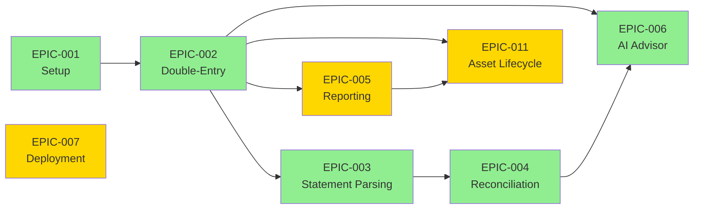

# Project EPIC & Task Tracking

> **Modification Guide** — How to read, create, and modify EPIC documents.

---

## 📖 Reading Guide

### For New Developers

1. **[../target.md](../target.md)** — North Star goals and decision criteria
2. **[../ssot/development.md](../ssot/development.md)** — Environment setup
3. **[EPIC-001](./EPIC-001.phase0-setup.md)** — Infrastructure and authentication
4. **[EPIC-002](./EPIC-002.double-entry-core.md)** — Core accounting system
5. **[DECISIONS.md](./DECISIONS.md)** — Key architectural choices

### EPIC by Feature Area

| Feature Area | EPIC |
|--------------|------|
| Infrastructure | [EPIC-001](./EPIC-001.phase0-setup.md), [EPIC-007](./EPIC-007.deployment.md) |
| Accounting | [EPIC-002](./EPIC-002.double-entry-core.md) |
| Statement Import | [EPIC-003](./EPIC-003.statement-parsing.md) |
| Reconciliation | [EPIC-004](./EPIC-004.reconciliation-engine.md) |
| Reports | [EPIC-005](./EPIC-005.reporting-visualization.md) |
| AI Features | [EPIC-006](./EPIC-006.ai-advisor.md) |
| Testing | [EPIC-008](./EPIC-008.testing-strategy.md) |
| Asset Management | [EPIC-011](./EPIC-011.asset-lifecycle.md) |

---

## 📝 How to Modify This Directory

### EPIC Document Convention (Two Files Per Feature)

Each major feature/EPIC has **two files**:

| File Type | Naming | Purpose | Author |
|-----------|--------|---------|--------|
| **Human Review** | `EPIC-XXX.<name>.md` | Goals, acceptance criteria, Q&A decisions | Human/PM |
| **Machine Generated** | `EPIC-XXX.<name>-GENERATED.md` | Implementation details, test results, API docs | AI/Automation |

### File Categories

| Category | Pattern | Examples |
|----------|---------|----------|
| **EPIC specs** | `EPIC-XXX.<name>.md` | `EPIC-002.double-entry-core.md` |
| **Generated docs** | `EPIC-XXX.<name>-GENERATED.md` | Implementation summaries, test results |
| **Decisions** | `DECISIONS.md`, `DECISIONS_ZH.md` | Cross-EPIC architectural decisions |
| **Audit reports** | `AUDIT-YYYYMMDD.md` | Point-in-time system audits |
| **QA reports** | `QA_REPORT_YYYYMMDD.md` | Quality assurance snapshots |

---

## 📋 EPIC Template (Human Review Version)

```markdown
# EPIC-XXX: [Feature Name]

> **Status**: ⏳ Pending | 🟡 In Progress | ✅ Complete | 🔴 Blocked
> **Phase**: [0-5]
> **Duration**: [X weeks]
> **Dependencies**: [EPIC-YYY, EPIC-ZZZ]

---

## 🎯 Objective

What we're building and why.

---

## ✅ Task Checklist

### [Layer Name] (Backend/Frontend/Infrastructure)

- [ ] Task 1
- [ ] Task 2
- [ ] Task 3

---

## 📏 Acceptance Criteria

### 🟢 Must Have

| Standard | Verification | Weight |
|----------|--------------|--------|
| Criterion 1 | How to verify | 🔴 Critical |
| Criterion 2 | How to verify | Required |

### 🌟 Nice to Have

| Standard | Verification | Status |
|----------|--------------|--------|
| Enhancement 1 | How to verify | ⏳ |

### 🚫 Not Acceptable Signals

- Failure condition 1
- Failure condition 2

---

## 🧪 Test Scenarios

### [Test Category]

```python
def test_scenario_name():
    """Description of what this tests"""
```

---

## 📚 SSOT References

- [schema.md](../ssot/schema.md) — Related tables
- [domain.md](../ssot/domain.md) — Domain rules

---

## 🔗 Deliverables

- [ ] `path/to/file.py`
- [ ] `path/to/component.tsx`
- [ ] Update `docs/ssot/domain.md`

---

## 📝 Technical Debt

| Item | Priority | Planned Resolution |
|------|----------|-------------------|
| Debt 1 | P2 | v2.0 |

---

## ❓ Q&A (Clarification Required)

### Q1: [Question]
> **Question**: Full question text

**✅ Your Answer**: [Decision made]

**Decision**: [Explanation of decision and rationale]

---

## 📅 Timeline

| Phase | Content | Estimated Hours |
|-------|---------|-----------------|
| Week 1 | ... | Xh |

**Total estimate**: X hours
```

---

## ✅ Status Snapshot

### In Progress
- [EPIC-005](./EPIC-005.reporting-visualization.md) — Financial Reports & Visualization
- [EPIC-007](./EPIC-007.deployment.md) — Production Deployment
- [EPIC-009](./EPIC-009.pdf-fixture-generation.md) — PDF Fixture Generation
- [EPIC-010](./EPIC-010.signoz-logging.md) — SigNoz Logging Integration
- [EPIC-011](./EPIC-011.asset-lifecycle.md) — Asset Lifecycle Management (P0 Complete)
- [EPIC-012](./EPIC-012.foundation-libs.md) — Foundation Libraries Enhancement

### Pending
- [EPIC-008](./EPIC-008.testing-strategy.md) — Testing Strategy (Smoke & E2E)

### Complete
- [EPIC-001](./EPIC-001.phase0-setup.md) — Infrastructure & Authentication
- [EPIC-002](./EPIC-002.double-entry-core.md) — Double-Entry Bookkeeping Core
- [EPIC-003](./EPIC-003.statement-parsing.md) — Smart Statement Parsing
- [EPIC-004](./EPIC-004.reconciliation-engine.md) — Reconciliation Engine & Matching
- [EPIC-006](./EPIC-006.ai-advisor.md) — AI Financial Advisor

---

## 🎯 Active Projects (EPICs)

| ID | Project | Status | Phase | Duration |
|----|---------|--------|-------|----------|
| [EPIC-001](./EPIC-001.phase0-setup.md) | Infrastructure & Authentication | ✅ Complete | 0 | 2 weeks |
| [EPIC-002](./EPIC-002.double-entry-core.md) | Double-Entry Bookkeeping Core | ✅ Complete | 1 | 3 weeks |
| [EPIC-003](./EPIC-003.statement-parsing.md) | Smart Statement Parsing | ✅ Complete | 2 | 4 weeks |
| [EPIC-004](./EPIC-004.reconciliation-engine.md) | Reconciliation Engine & Matching | ✅ Complete | 3 | 5 weeks |
| [EPIC-005](./EPIC-005.reporting-visualization.md) | Financial Reports & Visualization | 🟡 In Progress | 4 | 3 weeks |
| [EPIC-006](./EPIC-006.ai-advisor.md) | AI Financial Advisor | ✅ Complete | 4 | 2 weeks |
| [EPIC-007](./EPIC-007.deployment.md) | Production Deployment | 🟡 In Progress | 0 | 1 week |
| [EPIC-008](./EPIC-008.testing-strategy.md) | Testing Strategy (Smoke & E2E) | ⏳ Pending | 0 | 2 weeks |
| [EPIC-009](./EPIC-009.pdf-fixture-generation.md) | PDF Fixture Generation | 🟡 In Progress | 2 | 2-3 weeks |
| [EPIC-010](./EPIC-010.signoz-logging.md) | SigNoz Logging Integration | 🟡 In Progress | 0 | 1 week |
| [EPIC-011](./EPIC-011.asset-lifecycle.md) | Asset Lifecycle Management | 🟡 In Progress (P0 ✅) | 5 | 4-5 weeks |
| [EPIC-012](./EPIC-012.foundation-libs.md) | Foundation Libraries Enhancement | 🟡 In Progress | 0 | 2-3 weeks |

**Total Duration**: 23-28 weeks
**Current Focus**: Phase 4 (Reporting & AI Features) plus deployment readiness and infrastructure hardening

---

## 🗺️ EPIC Dependencies



**Critical Path**: EPIC-001 → EPIC-002 → EPIC-003 → EPIC-004
**Parallel Path**: EPIC-005 can start after EPIC-002
**Infrastructure Path**: EPIC-007 deploys completed features

## 📖 Reading Guide

### For New Developers
Start with these documents in order:

1. **[target.md](../../target.md)** — North Star goals and decision criteria
2. **[README.md](../README.md)** — Tech stack and quick start
3. **[EPIC-001: Setup](./EPIC-001.phase0-setup.md)** — Infrastructure and authentication
4. **[EPIC-002: Double-Entry](./EPIC-002.double-entry-core.md)** — Core accounting system
5. **[Design Decisions](./DECISIONS.md)** — Key architectural choices

### For Feature Development
Check the relevant EPIC for your feature:

- **Accounting**: [EPIC-002](./EPIC-002.double-entry-core.md)
- **Statement Import**: [EPIC-003](./EPIC-003.statement-parsing.md)
- **Reconciliation**: [EPIC-004](./EPIC-004.reconciliation-engine.md)
- **Reports**: [EPIC-005](./EPIC-005.reporting-visualization.md)
- **AI Features**: [EPIC-006](./EPIC-006.ai-advisor.md)
- **Infrastructure**: [EPIC-012](./EPIC-012.foundation-libs.md)
- **Deployment**: [EPIC-007](./EPIC-007.deployment.md)
- **Asset Management**: [EPIC-011](./EPIC-011.asset-lifecycle.md)

---

## 📊 Quality Standards

Each EPIC document contains:

- ✅ **Must Have**: Minimum requirements to pass
- 🌟 **Nice to Have**: Excellence targets beyond expectations
- 🚫 **Not Acceptable**: Issues requiring immediate fix
- ❓ **Q&A**: Questions requiring clarification

## 🗂️ Status Icons

| Icon | Meaning |
|------|---------|
| ⏳ | Pending — Not started |
| 🟡 | In Progress — Currently working |
| ✅ | Complete — Done |
| 🔴 | Blocked — Cannot proceed |

---

## 📁 Archive Directory

Consolidated sub-documents are moved to `archive/` for reference (no deletion policy).

### archive/ Contents

| File | Consolidated Into | Original Purpose |
|------|-------------------|------------------|
| `EPIC-002-IMPLEMENTATION.md` | EPIC-002-GENERATED | Implementation summary |
| `EPIC-002-DECISIONS.md` | EPIC-002-GENERATED | Architectural decisions |
| `EPIC-002-API-TESTING.md` | EPIC-002-GENERATED | API testing guide |
| `EPIC-002-SUMMARY-ZH.md` | EPIC-002-GENERATED | Chinese summary |
| `EPIC-004.reconciliation-accuracy-report.md` | EPIC-004-GENERATED | Accuracy baseline report |
| `testing-implementation.md` | EPIC-008-GENERATED | P1 implementation summary |
| `testing-gap-analysis.md` | EPIC-008-GENERATED | Gap analysis and priorities |
| `EPIC-QA-Standardization.md` | EPIC-008-GENERATED | QA standardization plan |
| `QA_REPORT_20260121.md` | EPIC-008-GENERATED | QA report snapshot |

### Point-in-Time Reports (Keep at root)

| File | Purpose |
|------|---------|
| `AUDIT-20260113.md` | System audit snapshot |

---

## 🔗 Quick Links

- [Technical Specs (SSOT)](../ssot/README.md)
- [Development Guide](../ssot/development.md)
- [Project Target](../target.md)
- [AGENTS.md](../../AGENTS.md)
- [docs/ Navigation](../README.md)

---

*This file serves as both index and modification guide for the `docs/project/` directory.*
