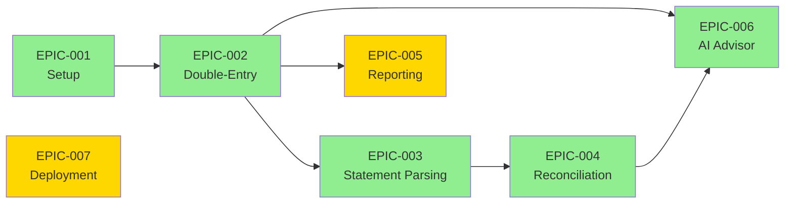

# Project EPIC & Task Tracking

> **Project Management Hub** — Track project milestones, active tasks, and development progress.

## 📋 Quick Overview

This section contains:

- **EPIC Tracking** — Major project milestones and their status
- **Design Decisions** — Key architectural choices and rationale
- **Repository Overview** — Current system orientation ([README.md](../README.md))

## ✅ Status Snapshot

**In Progress**
- [EPIC-005](./EPIC-005.reporting-visualization.md) — Financial Reports & Visualization
- [EPIC-007](./EPIC-007.deployment.md) — Production Deployment

**TODO**
- None listed. Add future EPICs here before work starts.

**Done**
- [EPIC-001](./EPIC-001.phase0-setup.md) — Infrastructure & Authentication
- [EPIC-002](./EPIC-002.double-entry-core.md) — Double-Entry Bookkeeping Core
- [EPIC-003](./EPIC-003.statement-parsing.md) — Smart Statement Parsing
- [EPIC-004](./EPIC-004.reconciliation-engine.md) — Reconciliation Engine & Matching
- [EPIC-006](./EPIC-006.ai-advisor.md) — AI Financial Advisor

## 🎯 Active Projects (EPICs)

| ID | Project | Status | Phase | Duration |
|----|---------|--------|-------|----------|
| [EPIC-001](./EPIC-001.phase0-setup.md) | Infrastructure & Authentication | ✅ Complete | 0 | 2 weeks |
| [EPIC-002](./EPIC-002.double-entry-core.md) | Double-Entry Bookkeeping Core | ✅ Complete (Backend) | 1 | 3 weeks |
| [EPIC-003](./EPIC-003.statement-parsing.md) | Smart Statement Parsing | ✅ Complete (Backend) | 2 | 4 weeks |
| [EPIC-004](./EPIC-004.reconciliation-engine.md) | Reconciliation Engine & Matching | ✅ Complete | 3 | 5 weeks |
| [EPIC-005](./EPIC-005.reporting-visualization.md) | Financial Reports & Visualization | 🟡 In Progress | 4 | 3 weeks |
| [EPIC-006](./EPIC-006.ai-advisor.md) | AI Financial Advisor | ✅ Complete | 4 | 2 weeks |
| [EPIC-007](./EPIC-007.deployment.md) | Production Deployment | 🟡 In Progress | 0 | 1 week |

**Total Duration**: 17-20 weeks  
**Current Focus**: Phase 4 (Reporting & AI Features) plus deployment readiness

## 🗺️ EPIC Dependencies

**Critical Path**: EPIC-001 → EPIC-002 → EPIC-003 → EPIC-004  
**Parallel Path**: EPIC-005 can start after EPIC-002, parallel with EPIC-003/004  
**Infrastructure Path**: EPIC-007 deploys completed features to production

## 📖 Reading Guide

### For New Developers
Start with these documents in order:

1. **[target.md](../../target.md)** — North Star goals and decision criteria
2. **[README.md](../README.md)** — Tech stack and quick start
3. **[EPIC-001: Setup](./EPIC-001.phase0-setup.md)** — Infrastructure and authentication
4. **[EPIC-002: Double-Entry](./EPIC-002.double-entry-core.md)** — Core accounting system
5. **[Design Decisions](./DECISIONS.md)** — Key architectural choices

### For Feature Development
Check the relevant EPIC for your feature:

- **Accounting**: [EPIC-002](./EPIC-002.double-entry-core.md)
- **Statement Import**: [EPIC-003](./EPIC-003.statement-parsing.md)
- **Reconciliation**: [EPIC-004](./EPIC-004.reconciliation-engine.md)
- **Reports**: [EPIC-005](./EPIC-005.reporting-visualization.md)
- **AI Features**: [EPIC-006](./EPIC-006.ai-advisor.md)
- **Deployment**: [EPIC-007](./EPIC-007.deployment.md)

## 📊 Quality Standards

Each EPIC document contains:

- ✅ **Must Have**: Minimum requirements to pass
- 🌟 **Nice to Have**: Excellence targets beyond expectations
- 🚫 **Not Acceptable**: Issues requiring immediate fix
- ❓ **Q&A**: Questions requiring clarification

## 🗂️ Project File Conventions

- **Naming**: `EPIC-XXX.<project_name>.md`
- **Status Icons**: 
  - 🔴 Blocked — Cannot proceed
  - 🟡 In Progress — Currently working
  - ✅ Complete — Done
  - ⏳ Pending — Not started

## 🔗 Related Documentation

- **Technical Specs**: [SSOT Documentation](../ssot/README.md)
- **Development Setup**: [Development Guide](../ssot/development.md)
- **North Star**: [target.md](../../target.md)

---

*Last updated: January 2026*

## Quick Links

- [Project Target](../../target.md)
- [SSOT Index](../ssot/README.md)
- [AGENTS.md](../../AGENTS.md)
