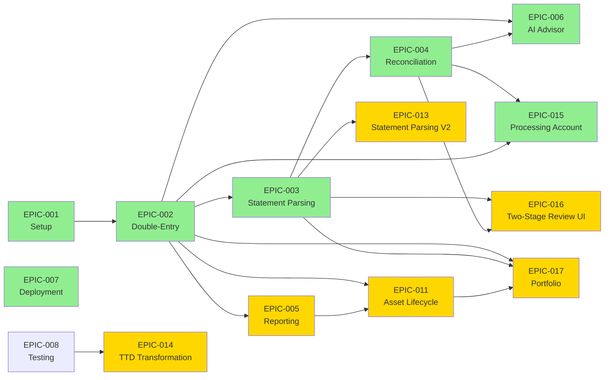

# Project EPIC & Task Tracking

> **Project Management Hub** — Track project milestones, active tasks, and development progress.

## 📋 Quick Overview

This section contains:

- **EPIC Tracking** — Major project milestones and their status
- **Design Decisions** — Key architectural choices and rationale
- **Repository Overview** — Current system orientation ([README.md](https://github.com/wangzitian0/finance_report#readme))

## ✅ Status Snapshot

**In Progress**
- [EPIC-005](./EPIC-005.reporting-visualization.md) — Financial Reports & Visualization
- [EPIC-011](./EPIC-011.asset-lifecycle.md) — Asset Lifecycle Management (P0 ✅)
- [EPIC-012](./EPIC-012.foundation-libs.md) — Foundation Libraries Enhancement
- [EPIC-014](./EPIC-014.ttd-transformation.md) — TTD Transformation (P0 ✅, 96% unified coverage achieved)
**Planned (P0 - Critical)**
- [EPIC-016](./EPIC-016.two-stage-review-ui.md) — Two-Stage Review & Data Validation UI (4-6 weeks) — Stage 1: PDF vs parsed validation. Stage 2: Dedup, transfer pairing, anomaly detection.

**Planned (P1 - High Priority)**
- [EPIC-017](./EPIC-017.portfolio-management.md) — Investment Portfolio Management (6-8 weeks) — 100% self-developed.

~~**TODO (Design Needed)**~~
- ~~source_type Priority Logic~~ ✅ **Resolved** — SSOT doc added: [source-type-priority.md](../ssot/source-type-priority.md) (EPIC-013 / EPIC-016 implementation planned).
- ~~Confirmation Workflow SSOT~~ ✅ **Resolved** — SSOT doc added: [confirmation-workflow.md](../ssot/confirmation-workflow.md) defines the `pending_review` state machine for Stage 1 and Stage 2.

**Done**
 [EPIC-001](./EPIC-001.phase0-setup.md) — Infrastructure & Authentication
 [EPIC-002](./EPIC-002.double-entry-core.md) — Double-Entry Bookkeeping Core
 [EPIC-003](./EPIC-003.statement-parsing.md) — Smart Statement Parsing
 [EPIC-004](./EPIC-004.reconciliation-engine.md) — Reconciliation Engine & Matching
 [EPIC-008](./EPIC-008.testing-strategy.md) — Testing Strategy (Smoke & E2E)
 [EPIC-009](./EPIC-009.pdf-fixture-generation.md) — PDF Fixture Generation
 [EPIC-006](./EPIC-006.ai-advisor.md) — AI Financial Advisor
 [EPIC-007](./EPIC-007.deployment.md) — Production Deployment
 [EPIC-010](./EPIC-010.signoz-logging.md) — SigNoz Logging Integration
 [EPIC-013](./EPIC-013.statement-parsing-v2.md) — Statement Parsing V2
 [EPIC-015](./EPIC-015.processing-account.md) — Processing Account Integration

## 🎯 Active Projects (EPICs)

| ID | Project | Status | Phase | Duration |
|----|---------|--------|-------|----------|
| [EPIC-001](./EPIC-001.phase0-setup.md) | Infrastructure & Authentication | ✅ Complete | 0 | 2 weeks |
| [EPIC-002](./EPIC-002.double-entry-core.md) | Double-Entry Bookkeeping Core | 🟡 In Progress (Refining) | 1 | 3 weeks |
| [EPIC-003](./EPIC-003.statement-parsing.md) | Smart Statement Parsing | 🟡 In Progress (Refining) | 2 | 4 weeks |
| [EPIC-004](./EPIC-004.reconciliation-engine.md) | Reconciliation Engine & Matching | 🟡 In Progress (Refining) | 3 | 5 weeks |
| [EPIC-005](./EPIC-005.reporting-visualization.md) | Financial Reports & Visualization | 🟡 In Progress | 4 | 3 weeks |
| [EPIC-006](./EPIC-006.ai-advisor.md) | AI Financial Advisor | 🟡 In Progress (Refining) | 4 | 2 weeks |
| [EPIC-007](./EPIC-007.deployment.md) | Production Deployment | ✅ Complete | 0 | 1 week |
| [EPIC-008](./EPIC-008.testing-strategy.md) | Testing Strategy (Smoke & E2E) | ✅ Complete | 0 | 2 weeks |
| [EPIC-009](./EPIC-009.pdf-fixture-generation.md) | PDF Fixture Generation | ✅ Complete | 2 | 2-3 weeks |
| [EPIC-010](./EPIC-010.signoz-logging.md) | SigNoz Logging Integration | ✅ Complete | 0 | 1 week |
| [EPIC-011](./EPIC-011.asset-lifecycle.md) | Asset Lifecycle Management | 🟡 In Progress (P0 ✅) | 5 | 4-5 weeks |
| [EPIC-012](./EPIC-012.foundation-libs.md) | Foundation Libraries Enhancement | 🟡 In Progress | 0 | 2-3 weeks |
| [EPIC-013](./EPIC-013.statement-parsing-v2.md) | Statement Parsing V2 | ✅ Complete | 2 | 3 weeks |
| [EPIC-014](./EPIC-014.ttd-transformation.md) | TTD Transformation | 🟡 In Progress (P0 ✅) | 0 | 3-4 weeks |
| [EPIC-015](./EPIC-015.processing-account.md) | Processing Account Integration | ✅ Complete | 3 | 2 weeks |
| [EPIC-016](./EPIC-016.two-stage-review-ui.md) | Two-Stage Review & Data Validation UI | 🟡 Planned | 3 | 4-6 weeks |
| [EPIC-017](./EPIC-017.portfolio-management.md) | Investment Portfolio Management | 🟡 Planned | 5 | 6-8 weeks |

**Total Duration**: 40-51 weeks (including EPIC-016 and EPIC-017)
**Current Focus**: Phase 3 (Two-Stage Review - Foundation for User Adoption), Phase 4 (Reporting & AI Features), Phase 5 (Portfolio Management)

## 🗺️ EPIC Dependencies

```mermaid
graph LR
    E1[EPIC-001<br/>Setup] --> E2[EPIC-002<br/>Double-Entry]
    E2 --> E3[EPIC-003<br/>Statement Parsing]
    E3 --> E4[EPIC-004<br/>Reconciliation]
    E2 --> E5[EPIC-005<br/>Reporting]
    E2 --> E6[EPIC-006<br/>AI Advisor]
    E4 --> E6
    E7[EPIC-007<br/>Deployment]
    E2 --> E11[EPIC-011<br/>Asset Lifecycle]
    E5 --> E11
    E3 --> E13[EPIC-013<br/>Statement Parsing V2]
    E8[EPIC-008<br/>Testing] --> E14[EPIC-014<br/>TTD Transformation]
    E4 --> E15[EPIC-015<br/>Processing Account]
    E2 --> E15
    E3 --> E16[EPIC-016<br/>Two-Stage Review UI]
    E4 --> E16
    E2 --> E17[EPIC-017<br/>Portfolio]
    E3 --> E17
    E11 --> E17
    
    style E1 fill:#90EE90
    style E2 fill:#90EE90
    style E3 fill:#90EE90
    style E4 fill:#90EE90
    style E5 fill:#FFD700
    style E6 fill:#90EE90
    style E7 fill:#90EE90
    style E11 fill:#FFD700
    style E13 fill:#FFD700
    style E14 fill:#FFD700
    style E15 fill:#90EE90
    style E16 fill:#FFD700
    style E17 fill:#FFD700
```

**Critical Path**: EPIC-001 → EPIC-002 → EPIC-003 → EPIC-004  
**Parallel Path**: EPIC-005 can start after EPIC-002, parallel with EPIC-003/004  
**Infrastructure Path**: EPIC-007 deploys completed features to production  
**Future Work**: EPIC-011 requires EPIC-002 (Double-Entry) and EPIC-005 (Reporting), EPIC-015 extends EPIC-004 (Reconciliation), EPIC-016 (Two-Stage Review) is critical for user adoption, EPIC-017 (Portfolio) implements 100% self-developed solution

## 📖 Reading Guide

### For New Developers
Start with these documents in order:

1. **[vision.md](../../vision.md)** — North Star goals and decision criteria
2. **[README.md](https://github.com/wangzitian0/finance_report#readme)** — Tech stack and quick start
3. **[EPIC-001: Setup](./EPIC-001.phase0-setup.md)** — Infrastructure and authentication
4. **[EPIC-002: Double-Entry](./EPIC-002.double-entry-core.md)** — Core accounting system
5. **[Design Decisions](./DECISIONS.md)** — Key architectural choices

### For Feature Development
Check the relevant EPIC for your feature:

- **Accounting**: [EPIC-002](./EPIC-002.double-entry-core.md)
- **Statement Import**: [EPIC-003](./EPIC-003.statement-parsing.md)
- **Reconciliation**: [EPIC-004](./EPIC-004.reconciliation-engine.md)
- **Reports**: [EPIC-005](./EPIC-005.reporting-visualization.md)
- **AI Features**: [EPIC-006](./EPIC-006.ai-advisor.md)
- **Infrastructure**: [EPIC-012](./EPIC-012.foundation-libs.md)
- **Deployment**: [EPIC-007](./EPIC-007.deployment.md)
- **Asset Management**: [EPIC-011](./EPIC-011.asset-lifecycle.md)
 **Processing Account**: [EPIC-015](./EPIC-015.processing-account.md)

- **Statement Parsing V2**: [EPIC-013](./EPIC-013.statement-parsing-v2.md)
- **TTD Transformation**: [EPIC-014](./EPIC-014.ttd-transformation.md)

## 📊 Quality Standards

Each EPIC document contains:

- ✅ **Must Have**: Minimum requirements to pass
- 🌟 **Nice to Have**: Excellence targets beyond expectations
- 🚫 **Not Acceptable**: Issues requiring immediate fix
- ❓ **Q&A**: Questions requiring clarification

## 🗂️ Project File Conventions

- **Naming**: `EPIC-XXX.<project_name>.md`
- **Status Icons**: 
  - 🔴 Blocked — Cannot proceed
  - 🟡 In Progress — Currently working
  - ✅ Complete — Done
  - ⏳ Pending — Not started

## 🔗 Related Documentation

- **Technical Specs**: [SSOT Documentation](../ssot/README.md)
- **Development Setup**: [Development Guide](../ssot/development.md)
- **North Star**: [vision.md](../../vision.md)

---

*Last updated: February 2026*

## Quick Links

- [Project Vision](../../vision.md)
- [SSOT Index](../ssot/README.md)
- [AGENTS.md](https://github.com/wangzitian0/finance_report/blob/main/AGENTS.md)
