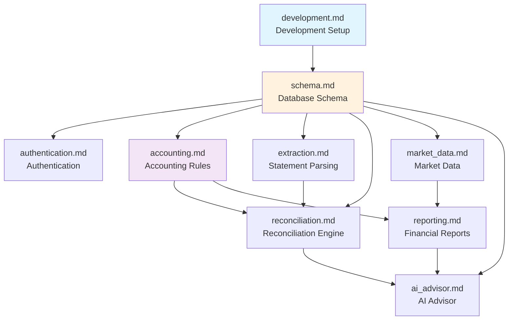

# SSOT Documentation Index

> **SSOT = Single Source of Truth**  
> This directory is the **authoritative reference** for all technical decisions and implementation details.

## 📖 What is SSOT?

SSOT documents define the "why" and "how" of technical decisions before code is written. When code differs from SSOT, the documentation must be updated immediately to maintain truth.

## 📚 Document Index

All SSOT documents are organized by domain. **Start here** to understand the system:

### Core System Documents

| Document | SSOT Key | Description |
|----------|----------|-------------|
| [development.md](./development.md) | `development` | **START HERE** — Moon commands, DB lifecycle, CI environments, and building documentation |
| [authentication.md](./authentication.md) | `authentication` | API user identity resolution and auth constraints |
| [schema.md](./schema.md) | `schema` | PostgreSQL tables, ER diagram, indexes, and migrations |
| [accounting.md](./accounting.md) | `accounting` | Double-entry rules, accounting equation, and transaction validation |

### Feature-Specific Documents

| Document | SSOT Key | Description |
|----------|----------|-------------|
| [reconciliation.md](./reconciliation.md) | `reconciliation` | Matching algorithm, confidence scoring, and acceptance thresholds |
| [extraction.md](./extraction.md) | `extraction` | Gemini Vision parsing, validation pipeline, and document handling |
| [reporting.md](./reporting.md) | `reporting` | Financial reports, multi-currency consolidation, and calculations |
| [ai_advisor.md](./ai_advisor.md) | `ai_advisor` | AI advisor prompt policy, context scope, and safety controls |
| [market_data.md](./market_data.md) | `market_data` | FX rates, stock prices, data sources, and sync schedule |

## 🗺️ Recommended Reading Order

For new developers joining the project:

1. **[development.md](./development.md)** — Setup your environment and understand the build/test workflow
2. **[schema.md](./schema.md)** — Understand the database structure
3. **[authentication.md](./authentication.md)** — Learn how auth works
4. **[accounting.md](./accounting.md)** — Learn the double-entry bookkeeping model
5. **[extraction.md](./extraction.md)** — See how bank statements are parsed
6. **[reconciliation.md](./reconciliation.md)** — Understand the matching engine
7. **[reporting.md](./reporting.md)** — Learn how reports are generated
8. **[ai_advisor.md](./ai_advisor.md)** — Understand the AI advisor implementation

## 📊 Document Dependency Graph

## Design Principles

1. **Docs explain "why", code defines "what"**
2. **Never hardcode volatile values** — Reference code as the source
3. **SSOT before implementation** — Define truth before writing code
4. **Immediate sync on drift** — If code differs, update SSOT immediately

## SSOT Template Structure

Each document follows this structure:
1. **Source of Truth** — Physical file locations
2. **Architecture Model** — Diagrams, key decisions
3. **Design Constraints** — Dos & Don'ts
4. **Playbooks (SOP)** — Standard operating procedures
5. **Verification (The Proof)** — How to validate

## Quick Links

- [AGENTS.md](../../AGENTS.md) — Agent behavioral guidelines
- [init.md](../../init.md) — Project specification
- [Project Tracking](../project/README.md) — EPIC & tasks