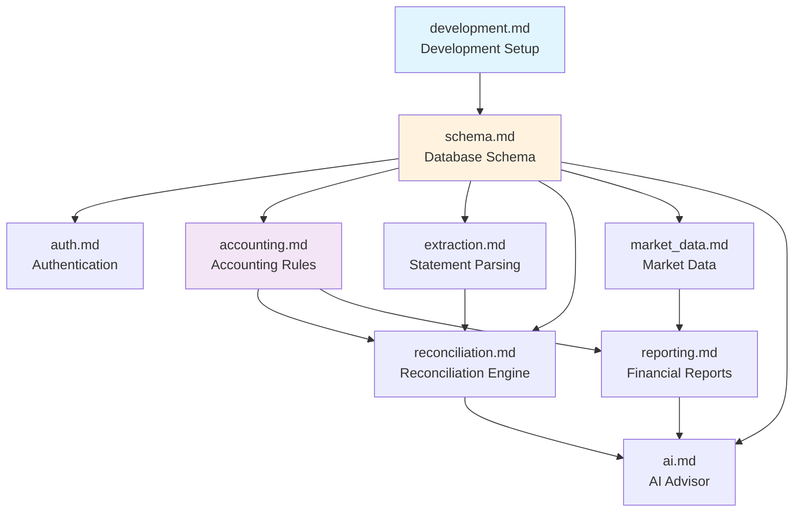

# SSOT Documentation Index

> **Single Source of Truth (SSOT)** — Authoritative reference for all technical decisions and implementation details.

## 📝 How to Modify This Directory

### Before adding or modifying SSOT documents:

1. **Read the relevant existing documents first** — SSOT docs may already cover your topic
2. **Follow the 5-part template structure** (see below)
3. **Update the Module Mapping table** if adding cross-layer alignment

### SSOT Template Structure

Each document MUST follow this structure:

```markdown
# [Domain] (Source of Truth)

## 1. Source of Truth
Physical file locations (code paths)

## 2. Architecture Model
Diagrams, key decisions, data flow

## 3. Design Constraints
Dos & Don'ts, hard rules

## 4. Playbooks (SOP)
Standard operating procedures

## 5. Verification (The Proof)
How to validate, test commands
```

### Naming convention:

- Use lowercase with hyphens: `feature-name.md`
- Match the SSOT key (e.g., `reconciliation.md` → SSOT key `reconciliation`)

### Design principles:

1. **Docs explain "why", code defines "what"**
2. **Never hardcode volatile values** — Reference code as the source
3. **SSOT before implementation** — Define truth before writing code
4. **Immediate sync on drift** — If code differs, update SSOT immediately

---

## 📚 Document Index

### Core System Documents

| Document | SSOT Key | Description |
|----------|----------|-------------|
| [development.md](./development.md) | `development` | **START HERE** — Moon commands, DB lifecycle, CI environments |
| [schema.md](./schema.md) | `schema` | PostgreSQL tables, ER diagram, indexes, and migrations |
| [deployment.md](./deployment.md) | `deployment` | Environment layers, CI/CD workflows, staging/production |
| [auth.md](./auth.md) | `auth` | API user identity, registration/login flow |
| [frontend-patterns.md](./frontend-patterns.md) | `frontend-patterns` | React/Next.js SSR handling, theme system, API patterns |
| [observability.md](./observability.md) | `observability` | Logging and SigNoz OTLP export configuration |
| [env_smoke_test.md](./env_smoke_test.md) | `env_smoke_test` | Environment variable smoke testing |

### Feature-Specific Documents

| Document | SSOT Key | Description |
|----------|----------|-------------|
| [accounting.md](./accounting.md) | `accounting` | Double-entry rules, accounting equation, transaction validation |
| [assets.md](./assets.md) | `assets` | Asset tracking, position management, portfolio reconciliation |
| [reconciliation.md](./reconciliation.md) | `reconciliation` | Matching algorithm, confidence scoring, acceptance thresholds |
| [extraction.md](./extraction.md) | `extraction` | Gemini Vision parsing, validation pipeline, document handling |
| [reporting.md](./reporting.md) | `reporting` | Financial reports, multi-currency consolidation |
| [ai.md](./ai.md) | `ai` | AI advisor prompt policy, context scope, safety controls |
| [market_data.md](./market_data.md) | `market_data` | FX rates, stock prices, data sources, sync schedule |

---

## 🗺️ Recommended Reading Order

For new developers joining the project:

1. **[development.md](./development.md)** — Setup environment and understand build/test workflow
2. **[schema.md](./schema.md)** — Understand the database structure
3. **[auth.md](./auth.md)** — Learn how auth and registration works
4. **[frontend-patterns.md](./frontend-patterns.md)** — React/Next.js patterns and SSR handling
5. **[accounting.md](./accounting.md)** — Learn the double-entry bookkeeping model
6. **[extraction.md](./extraction.md)** — See how bank statements are parsed
7. **[reconciliation.md](./reconciliation.md)** — Understand the matching engine
8. **[reporting.md](./reporting.md)** — Learn how reports are generated
9. **[ai.md](./ai.md)** — Understand the AI advisor implementation

---

## 📊 Document Dependency Graph



---

## 🗺️ Module Mapping (Cross-Layer Alignment)

This table shows how domain concepts map across different layers. **Update this table when adding new domains.**

| Domain | SSOT Doc | Backend Router | Backend Service | Frontend Route | Tests |
|--------|----------|----------------|-----------------|----------------|-------|
| **accounting** | [accounting.md](./accounting.md) | `journal.py`, `accounts.py` | `accounting.py`, `account_service.py` | `/journal`, `/accounts` | `accounting/` |
| **reconciliation** | [reconciliation.md](./reconciliation.md) | `reconciliation.py` | `reconciliation.py`, `review_queue.py` | `/reconciliation` | `reconciliation/` |
| **reporting** | [reporting.md](./reporting.md) | `reports.py` | `reporting.py`, `reporting_snapshot.py` | `/reports` | `reporting/` |
| **extraction** | [extraction.md](./extraction.md) | `statements.py` | `extraction.py`, `storage.py`, `validation.py` | `/statements` | `extraction/` |
| **ai** | [ai.md](./ai.md) | `chat.py`, `ai_models.py` | `ai_advisor.py`, `openrouter_*.py` | `/chat` | `ai/` |
| **assets** | [assets.md](./assets.md) | `assets.py` | `assets.py` | `/assets` | `assets/` |
| **auth** | [auth.md](./auth.md) | `auth.py`, `users.py` | — | `/login` | `auth/` |
| **market_data** | [market_data.md](./market_data.md) | — | `fx.py` | — | `market_data/` |

**Notes**:
- Backend API paths use the router filename (e.g., `/statements`, `/reports`, `/chat`)
- Tests are organized by SSOT domain name for discoverability
- Frontend routes follow user-facing terminology

---

## 🔗 Quick Links

- [AGENTS.md](../../AGENTS.md) — Agent behavioral guidelines
- [target.md](../../target.md) — Project target and decision criteria
- [Project Tracking](../project/README.md) — EPIC & tasks
- [docs/ Navigation](../README.md) — Documentation hub

---

*This file serves as both index and modification guide for the `docs/ssot/` directory.*
