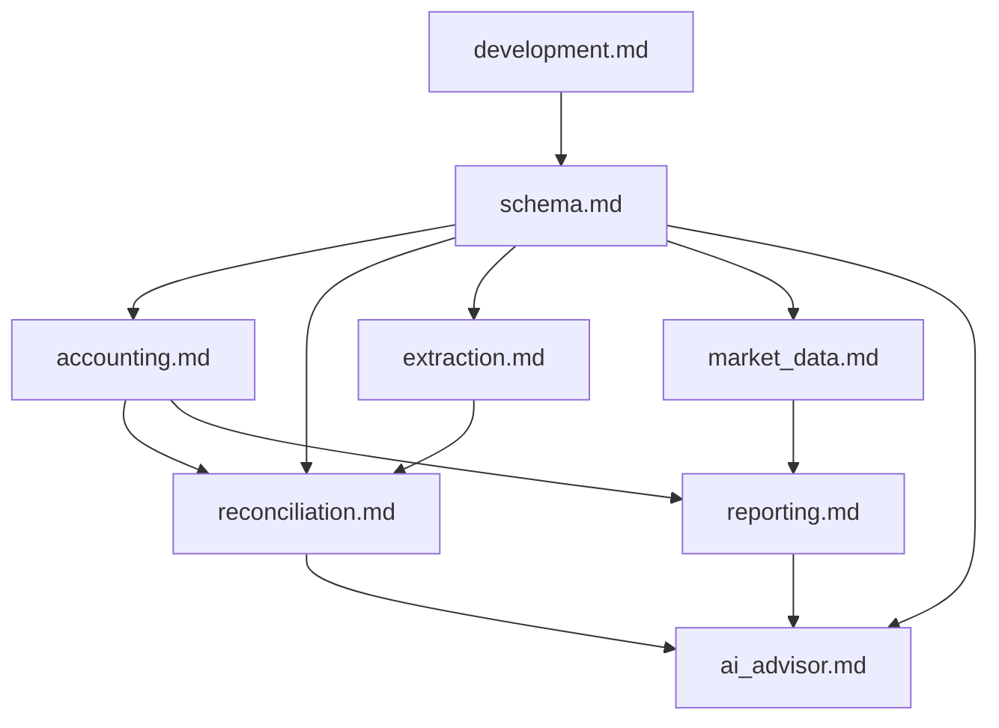

# SSOT Documentation Index

> **SSOT = Single Source of Truth**
> This directory is the **authoritative reference** for all technical decisions.

## Document Index (Flat Ontology)

All documents are at the same level, organized by domain:

| Document | SSOT Key | Description |
|----------|----------|-------------|
| [development.md](./development.md) | `development` | **Moon commands, DB lifecycle, CI environments** |
| [schema.md](./schema.md) | `schema` | PostgreSQL tables, ER diagram, indexes |
| [accounting.md](./accounting.md) | `accounting` | Double-entry rules, accounting equation |
| [reconciliation.md](./reconciliation.md) | `reconciliation` | Matching algorithm, confidence scoring |
| [extraction.md](./extraction.md) | `extraction` | Gemini Vision parsing, validation pipeline |
| [reporting.md](./reporting.md) | `reporting` | Financial reports, multi-currency consolidation |
| [market_data.md](./market_data.md) | `market_data` | FX rates, stock prices, sync schedule |
| [ai_advisor.md](./ai_advisor.md) | `ai_advisor` | AI advisor prompt policy, context scope, and safety controls |

## Document Dependency Graph

## Design Principles

1. **Docs explain "why", code defines "what"**
2. **Never hardcode volatile values** — Reference code as the source
3. **SSOT before implementation** — Define truth before writing code
4. **Immediate sync on drift** — If code differs, update SSOT immediately

## SSOT Template Structure

Each document follows this structure:
1. **Source of Truth** — Physical file locations
2. **Architecture Model** — Diagrams, key decisions
3. **Design Constraints** — Dos & Don'ts
4. **Playbooks (SOP)** — Standard operating procedures
5. **Verification (The Proof)** — How to validate

## Quick Links

- [AGENTS.md](../../AGENTS.md) — Agent behavioral guidelines
- [init.md](../../init.md) — Project specification
- [Project Tracking](../project/README.md) — EPIC & tasks
