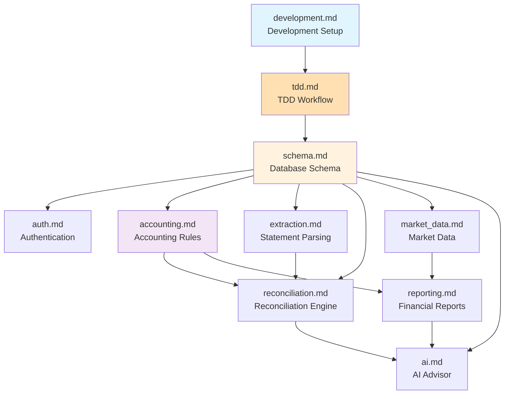

# SSOT Documentation Index

> **SSOT = Single Source of Truth**  
> This directory is the **authoritative reference** for all technical decisions and implementation details.

## 📖 What is SSOT?

SSOT documents define the "why" and "how" of technical decisions before code is written. When code differs from SSOT, the documentation must be updated immediately to maintain truth.

For the macro product direction and decision criteria, read [vision.md](../../vision.md) first.

## 📚 Document Index

All SSOT documents are organized by domain. **Start here** to understand the system:

### Core System Documents

| Document | SSOT Key | Description |
|----------|----------|-------------|
| [development.md](./development.md) | `development` | **START HERE** — Moon commands, DB lifecycle, CI environments, TDD workflow, and building documentation |
| [tdd.md](./tdd.md) | `tdd-transformation` | Test-Driven Development transformation plan, testing patterns, and 99% coverage goal |
| [observability.md](./observability.md) | `observability` | Logging and SigNoz OTLP export configuration |
| [auth.md](./auth.md) | `auth` | API user identity, registration/login flow, and frontend integration |
| [frontend-patterns.md](./frontend-patterns.md) | `frontend-patterns` | React/Next.js SSR handling, theme system, and API patterns |
| [schema.md](./schema.md) | `schema` | PostgreSQL tables, ER diagram, indexes, and migrations |
| [accounting.md](./accounting.md) | `accounting` | Double-entry rules, accounting equation, and transaction validation |
| [env_smoke_test.md](./env_smoke_test.md) | `env_smoke_test` | Environment variable smoke testing — Validates configuration works via real operations |

### Feature-Specific Documents

| Document | SSOT Key | Description |
|----------|----------|-------------|
| [reconciliation.md](./reconciliation.md) | `reconciliation` | Matching algorithm, confidence scoring, and acceptance thresholds |
| [extraction.md](./extraction.md) | `extraction` | Gemini Vision parsing, validation pipeline, and document handling |
| [reporting.md](./reporting.md) | `reporting` | Financial reports, multi-currency consolidation, and calculations |
| [ai.md](./ai.md) | `ai` | AI advisor prompt policy, context scope, and safety controls |
| [market_data.md](./market_data.md) | `market_data` | FX rates, stock prices, data sources, and sync schedule |

## 🗺️ Recommended Reading Order

For new developers joining the project:

1. **[development.md](./development.md)** — Setup your environment and understand the build/test workflow
2. **[tdd.md](./tdd.md)** — Learn Test-Driven Development workflow and coverage requirements (99%)
3. **[observability.md](./observability.md)** — Logging and SigNoz OTLP export
4. **[schema.md](./schema.md)** — Understand the database structure
5. **[auth.md](./auth.md)** — Learn how auth and registration works
6. **[frontend-patterns.md](./frontend-patterns.md)** — React/Next.js patterns and SSR handling
7. **[accounting.md](./accounting.md)** — Learn the double-entry bookkeeping model
8. **[extraction.md](./extraction.md)** — See how bank statements are parsed
9. **[reconciliation.md](./reconciliation.md)** — Understand the matching engine
10. **[reporting.md](./reporting.md)** — Learn how reports are generated
11. **[ai.md](./ai.md)** — Understand the AI advisor implementation

## 📊 Document Dependency Graph

## Design Principles

1. **Docs explain "why", code defines "what"**
2. **Never hardcode volatile values** — Reference code as the source
3. **SSOT before implementation** — Define truth before writing code
4. **Immediate sync on drift** — If code differs, update SSOT immediately

## SSOT Template Structure

Each document follows this structure:
1. **Source of Truth** — Physical file locations
2. **Architecture Model** — Diagrams, key decisions
3. **Design Constraints** — Dos & Don'ts
4. **Playbooks (SOP)** — Standard operating procedures
5. **Verification (The Proof)** — How to validate

## 🗺️ Module Mapping (Cross-Layer Alignment)

This table shows how domain concepts map across different layers. Use this to maintain consistency.

| Domain | SSOT Doc | Backend Router | Backend Service | Frontend Route | Tests |
|--------|----------|----------------|-----------------|----------------|-------|
| **accounting** | [accounting.md](./accounting.md) | `journal.py`, `accounts.py` | `accounting.py`, `account_service.py` | `/journal`, `/accounts` | `accounting/` |
| **reconciliation** | [reconciliation.md](./reconciliation.md) | `reconciliation.py` | `reconciliation.py`, `review_queue.py` | `/reconciliation` | `reconciliation/` |
| **reporting** | [reporting.md](./reporting.md) | `reports.py` | `reporting.py`, `reporting_snapshot.py` | `/reports` | `reporting/` |
| **extraction** | [extraction.md](./extraction.md) | `statements.py` | `extraction.py`, `storage.py`, `validation.py` | `/statements` | `extraction/` |
| **ai** | [ai.md](./ai.md) | `chat.py`, `ai_models.py` | `ai_advisor.py`, `openrouter_*.py` | `/chat` | `ai/` |
| **assets** | [assets.md](./assets.md) | `assets.py` | `assets.py` | `/assets` | `assets/` |
| **auth** | [auth.md](./auth.md) | `auth.py`, `users.py` | — | `/login` | `auth/` |
| **market_data** | [market_data.md](./market_data.md) | — | `fx.py` | — | `market_data/` |

**Notes**:
- Backend API paths use the router filename (e.g., `/statements`, `/reports`, `/chat`)
- Tests are organized by SSOT domain name for discoverability
- Frontend routes follow user-facing terminology

## Quick Links

- [AGENTS.md](https://github.com/wangzitian0/finance_report/blob/main/AGENTS.md) — Agent behavioral guidelines
- [vision.md](../../vision.md) — Project vision and decision criteria
- [Project Tracking](../project/README.md) — EPIC & tasks
