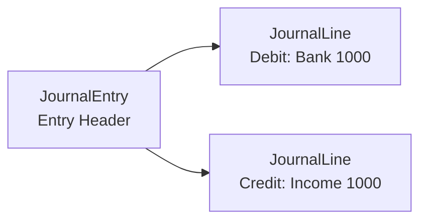

# Double-Entry Bookkeeping Domain Model SSOT

> **SSOT Key**: `accounting`
> **Core Definition**: Accounting equation, account classification, and entry rules for double-entry bookkeeping.

---

## 1. Source of Truth

| Dimension | Physical Location (SSOT) | Description |
|-----------|--------------------------|-------------|
| **Bookkeeping Logic** | `apps/backend/src/services/accounting.py` | Core business |
| **Model Definition** | `apps/backend/src/models/journal.py` | ORM |
| **Validation Rules** | `apps/backend/src/schemas/journal.py` | Pydantic |

---

## 2. Architecture Model

### Accounting Equation

```
Assets = Liabilities + Equity + (Income - Expenses)
```

**At any moment, all `posted` entries must satisfy this equation.**

### Account Classification and Debit/Credit Rules

| Type | Debit Increases | Credit Increases | Normal Balance |
|------|-----------------|------------------|----------------|
| Asset | ✓ | | Debit |
| Liability | | ✓ | Credit |
| Equity | | ✓ | Credit |
| Income | | ✓ | Credit |
| Expense | ✓ | | Debit |

### Entry Structure




---

## 3. Design Constraints (Dos & Don'ts)

### ✅ Recommended Patterns

- **Pattern A**: Each entry has at least 2 lines, debit/credit balanced
- **Pattern B**: Use Decimal for precise calculations, tolerance < 0.01
- **Pattern C**: Posted entries can only be voided, not directly modified

### ⛔ Prohibited Patterns

- **Anti-pattern A**: **NEVER** use FLOAT to store, calculate, or transfer monetary amounts.
    -   **Reason**: IEEE 754 floating point arithmetic causes precision errors (e.g., `0.1 + 0.2 != 0.3`).
    -   **Enforcement**: All Pydantic models MUST use `Decimal`. API clients MUST parse JSON numbers as strings or Decimals, never floats.
    -   **Guardrail**: `tests/test_decimal_safety.py` fuzzes models with float inputs to ensure strictness.
- **Anti-pattern B**: **NEVER** allow unbalanced debit/credit entries
- **Anti-pattern C**: **NEVER** skip validation when writing posted status

---

## 4. Standard Operating Procedures (Playbooks)

### SOP-001: Create Manual Entry

```python
def create_manual_entry(user_id, date, memo, lines: list[dict]) -> JournalEntry:
    # 1. Validate debit/credit balance
    total_debit = sum(l["amount"] for l in lines if l["direction"] == "DEBIT")
    total_credit = sum(l["amount"] for l in lines if l["direction"] == "CREDIT")
    if abs(total_debit - total_credit) > Decimal("0.01"):
        raise ValidationError("Debit/credit not balanced")
    
    # 2. Create entry header
    entry = JournalEntry(
        user_id=user_id,
        entry_date=date,
        memo=memo,
        source_type="manual",
        status="draft"
    )
    
    # 3. Create lines
    for line in lines:
        entry.lines.append(JournalLine(**line))
    
    return entry
```

### SOP-002: Post Entry

```python
def post_entry(entry: JournalEntry) -> None:
    # 1. Re-validate balance
    validate_balance(entry)
    
    # 2. Validate accounts are active
    for line in entry.lines:
        if not line.account.is_active:
            raise ValidationError(f"Account {line.account.name} is disabled")
    
    # 3. Update status
    entry.status = "posted"
    entry.updated_at = datetime.utcnow()
```

### SOP-003: Void Entry

```python
def void_entry(entry: JournalEntry, reason: str) -> JournalEntry:
    # 1. Can only void posted entries
    if entry.status != "posted":
        raise ValidationError("Can only void posted entries")
    
    # 2. Create reversal entry
    reverse_entry = JournalEntry(
        user_id=entry.user_id,
        entry_date=date.today(),
        memo=f"Void: {entry.memo} ({reason})",
        source_type="system",
        status="posted"
    )
    
    for line in entry.lines:
        reverse_entry.lines.append(JournalLine(
            account_id=line.account_id,
            direction="CREDIT" if line.direction == "DEBIT" else "DEBIT",
            amount=line.amount,
            currency=line.currency
        ))
    
    # 3. Mark original entry
    entry.status = "void"
    
    return reverse_entry
```

---

## 5. Verification & Testing (The Proof)

| Behavior | Verification Method | Status |
|----------|---------------------|--------|
| Entry debit/credit balance | Unit test `test_journal_balance` | ⏳ Pending |
| Accounting equation | Integration test `test_accounting_equation` | ⏳ Pending |
| Void logic | Unit test `test_void_entry` | ⏳ Pending |

---

## Used by

- [schema.md](./schema.md)
- [reconciliation.md](./reconciliation.md)
