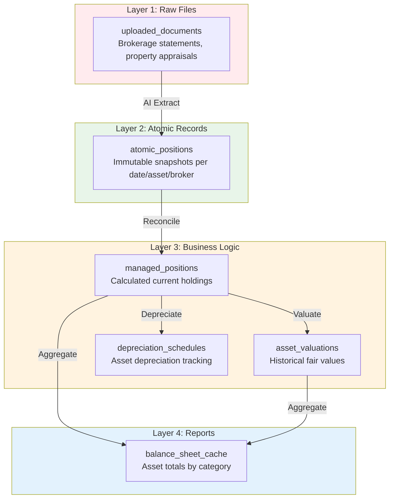
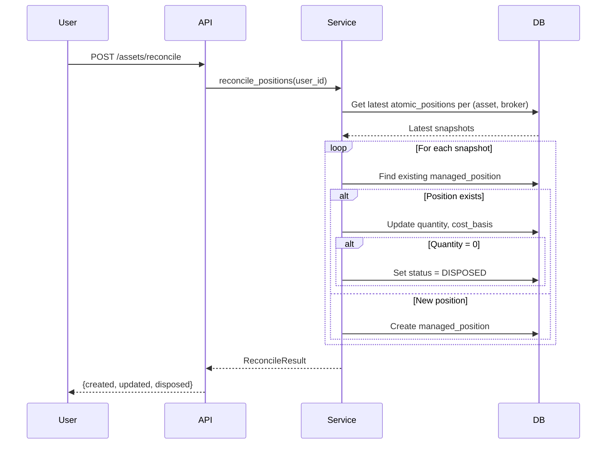
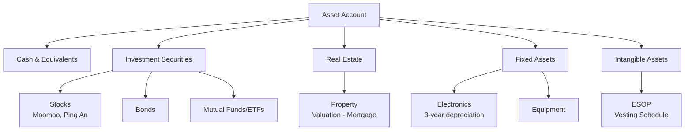

# Assets (Source of Truth)

> **SSOT Key**: `assets`
> **Core Definition**: Non-cash asset tracking, position reconciliation, and valuation management.

---

## 1. Source of Truth

| Component | Physical Location | Description |
|-----------|-------------------|-------------|
| Asset service | `apps/backend/src/services/assets.py` | Position reconciliation logic |
| Assets router | `apps/backend/src/routers/assets.py` | API endpoints for asset management |
| ManagedPosition model | `apps/backend/src/models/layer3.py` | Position records (Layer 3) |
| AtomicPosition model | `apps/backend/src/models/layer2.py` | Position snapshots (Layer 2) |
| Assets schemas | `apps/backend/src/schemas/assets.py` | Request/response validation |
| Assets page | `apps/frontend/src/app/(main)/assets/page.tsx` | Asset management UI |
| Asset tests | `apps/backend/tests/assets/` | Unit and integration tests |

---

## 2. Architecture Model

### 4-Layer Data Architecture

Assets follow the project's **4-layer architecture** for data integrity:



### Position Reconciliation Flow



---

## 3. Asset Type Hierarchy



---

## 4. Data Models

### Layer 2: AtomicPosition (Immutable Snapshots)

```python
class AtomicPosition(Base):
    __tablename__ = "atomic_positions"
    
    id: Mapped[UUID]                    # Primary key
    user_id: Mapped[UUID]               # Owner
    snapshot_date: Mapped[date]         # Date of snapshot
    asset_identifier: Mapped[str]       # Ticker, ISIN, address
    broker: Mapped[str | None]          # Moomoo, Ping An, etc.
    quantity: Mapped[Decimal]           # Shares, units
    market_value: Mapped[Decimal]       # Fair value in asset currency
    currency: Mapped[str]               # ISO 4217 code
    dedup_hash: Mapped[str]             # SHA256 for deduplication
    source_documents: Mapped[dict]      # JSONB - source file references
```

**Constraints**:
- `UNIQUE(user_id, dedup_hash)` — Prevent duplicate snapshots

### Layer 3: ManagedPosition (Calculated Holdings)

```python
class ManagedPosition(Base):
    __tablename__ = "managed_positions"
    
    id: Mapped[UUID]                    # Primary key
    user_id: Mapped[UUID]               # Owner
    account_id: Mapped[UUID]            # FK to accounts (broker account)
    asset_identifier: Mapped[str]       # Ticker, ISIN, address
    quantity: Mapped[Decimal]           # Current holdings
    cost_basis: Mapped[Decimal]         # Purchase price (proxy: market_value)
    acquisition_date: Mapped[date]      # First purchase date
    disposal_date: Mapped[date | None]  # Sale date (if disposed)
    status: Mapped[PositionStatus]      # ACTIVE | DISPOSED
    currency: Mapped[str]               # Asset currency
    position_metadata: Mapped[dict]     # JSONB - broker-specific data
```

**Constraints**:
- `UNIQUE(user_id, account_id, asset_identifier, acquisition_date)`

### Position Status Enum

```python
class PositionStatus(str, Enum):
    ACTIVE = "ACTIVE"       # Currently held
    DISPOSED = "DISPOSED"   # Sold or disposed
```

---

## 5. API Endpoints

| Method | Path | Description |
|--------|------|-------------|
| GET | `/api/assets/positions` | List managed positions (paginated) |
| GET | `/api/assets/positions/{id}` | Get single position details |
| POST | `/api/assets/reconcile` | Reconcile from atomic snapshots |

### List Positions Request

```
GET /api/assets/positions?status_filter=ACTIVE&page=1&page_size=50
Authorization: Bearer <token>
```

### List Positions Response

```json
{
  "items": [
    {
      "id": "uuid",
      "account_id": "uuid",
      "account_name": "Moomoo",
      "asset_identifier": "AAPL",
      "quantity": "100.000000",
      "cost_basis": "15000.00",
      "acquisition_date": "2024-01-15",
      "status": "ACTIVE",
      "currency": "USD"
    }
  ],
  "total": 15
}
```

### Reconcile Response

```json
{
  "message": "Positions reconciled successfully",
  "created": 3,
  "updated": 5,
  "disposed": 1,
  "skipped": 0,
  "skipped_assets": []
}
```

---

## 6. Design Constraints

### Required

- **All monetary values use `Decimal`** — Never use `float` for amounts
- **Positions linked to accounts** — Each position has a broker `Account` (type=ASSET)
- **Layer 2 immutability** — `atomic_positions` are write-once, never modified
- **Layer 3 calculated** — `managed_positions` derived from Layer 2 reconciliation
- **Explicit enum names** — All `sa.Enum` types have `name="..."` parameter
- **Multi-currency support** — Store values in asset's original currency

### Prohibited

- **Direct position modification** — Always reconcile from Layer 2 snapshots
- **Negative quantity positions** — If quantity ≤ 0, mark as DISPOSED
- **Float for currency** — Always use `Decimal(18, 6)` for quantities, `Decimal(18, 2)` for values
- **Orphan positions** — Every position must have a valid `account_id`

---

## 7. Reconciliation Logic

### Algorithm

```python
async def reconcile_positions(db: AsyncSession, user_id: UUID) -> ReconcileResult:
    """
    Reconcile managed positions from latest atomic snapshots.
    
    1. Get latest snapshot per (asset_identifier, broker) using window function
    2. For each snapshot:
       - Find or create broker Account (type=ASSET)
       - Find existing ManagedPosition
       - If exists: update quantity, cost_basis, status
       - If new: create ManagedPosition
       - If quantity = 0: mark as DISPOSED
    """
```

### Skipped Records

Records are skipped (not reconciled) if:
- `quantity` is NULL — Data integrity issue
- `market_value` is NULL — Incomplete snapshot

Skipped assets are logged and returned in the response.

### Broker Account Auto-Creation

When a snapshot references a new broker:
1. Create `Account` with `type=ASSET`, `name=broker_name`
2. Use `code="AUTO-ASSET"` for auto-created accounts
3. Default currency: USD

---

## 8. Playbooks (SOP)

### Adding a New Asset Position (Manual)

```bash
# 1. Upload brokerage statement
curl -X POST http://localhost:8000/api/statements/upload \
  -H "Authorization: Bearer $TOKEN" \
  -F "file=@moomoo_statement.pdf"

# 2. Wait for extraction to complete (creates atomic_positions)

# 3. Trigger reconciliation
curl -X POST http://localhost:8000/api/assets/reconcile \
  -H "Authorization: Bearer $TOKEN"

# 4. Verify positions
curl http://localhost:8000/api/assets/positions \
  -H "Authorization: Bearer $TOKEN"
```

### Viewing Asset Holdings

```bash
# List all active positions
curl "http://localhost:8000/api/assets/positions?status_filter=ACTIVE" \
  -H "Authorization: Bearer $TOKEN"

# Get specific position
curl http://localhost:8000/api/assets/positions/{position_id} \
  -H "Authorization: Bearer $TOKEN"
```

### Debugging Reconciliation Issues

1. Check `atomic_positions` for the user:
   ```sql
   SELECT * FROM atomic_positions 
   WHERE user_id = '<user_id>' 
   ORDER BY snapshot_date DESC;
   ```

2. Check for NULL quantities/values (will be skipped):
   ```sql
   SELECT id, asset_identifier, quantity, market_value 
   FROM atomic_positions 
   WHERE quantity IS NULL OR market_value IS NULL;
   ```

3. Check managed positions:
   ```sql
   SELECT * FROM managed_positions 
   WHERE user_id = '<user_id>';
   ```

---

## 9. Verification (The Proof)

```bash
# 1. Run asset tests
moon run backend:test -- -k assets

# 2. Test position listing
curl -H "Authorization: Bearer $TOKEN" \
  http://localhost:8000/api/assets/positions
# Expected: 200 OK with items array

# 3. Test reconciliation
curl -X POST -H "Authorization: Bearer $TOKEN" \
  http://localhost:8000/api/assets/reconcile
# Expected: 200 OK with reconcile counts

# 4. Verify no LSP errors
moon run backend:lint

# 5. Integration test: create atomic position, reconcile, verify managed
python -c "
from tests.assets.test_asset_service import test_reconcile_creates_position
# Run integration test
"
```

---

## 10. Integration with Double-Entry Bookkeeping

### Securities Purchase

When buying 100 AAPL @ $150 = $15,000:

```
DR  Investments:Moomoo:AAPL     $15,000
    CR  Cash:Bank                       $15,000
```

### Mark-to-Market Adjustment

When AAPL rises to $160 (unrealized gain $1,000):

```
DR  Investments:Moomoo:AAPL     $1,000
    CR  Equity:OCI:Unrealized Gains     $1,000
```

**Note**: Unrealized gains go to **Other Comprehensive Income (OCI)** in Equity, not Income.

### Securities Sale

When selling 100 AAPL @ $160 = $16,000:

```
DR  Cash:Bank                   $16,000
    CR  Investments:Moomoo:AAPL         $16,000

DR  Equity:OCI:Unrealized Gains $1,000
    CR  Income:Realized Gains           $1,000
```

---

## 11. Future Enhancements (EPIC-011)

| Feature | Status | Description |
|---------|--------|-------------|
| Asset valuations | ⏳ Planned | Historical fair value tracking |
| Depreciation schedules | ⏳ Planned | Straight-line/declining balance |
| ESOP vesting | ⏳ Planned | Stock option vesting tracking |
| Real estate | ⏳ Planned | Property valuation + mortgage |
| Market data sync | ⏳ Planned | Auto-update securities prices |

See [EPIC-011.asset-lifecycle.md](../project/EPIC-011.asset-lifecycle.md) for the full implementation plan.

---

## 🔗 Related Documents

- [schema.md](./schema.md) — Database tables including Layer 2/3 models
- [accounting.md](./accounting.md) — Double-entry bookkeeping rules
- [reconciliation.md](./reconciliation.md) — Transaction matching (bank → journal)
- [market_data.md](./market_data.md) — FX rates for multi-currency conversion
- [EPIC-011](../project/EPIC-011.asset-lifecycle.md) — Asset Lifecycle Management EPIC

---

*This document is the authoritative reference for asset management. For project tracking, see the EPIC.*
