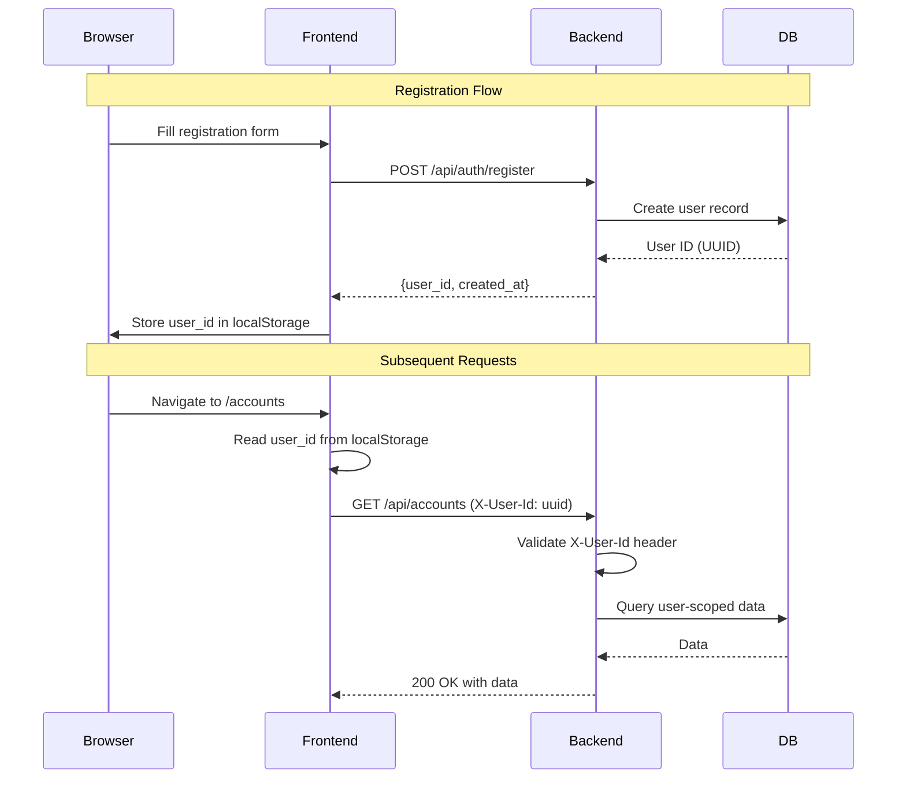

# Authentication SSOT

> **SSOT Key**: `authentication`
> **Core Definition**: How API requests resolve the current user identity and how users register/login.

---

## 1. Source of Truth

| Component | Physical Location | Description |
|-----------|-------------------|-------------|
| User context dependency | `apps/backend/src/auth.py` | `get_current_user_id` header-based resolver |
| User registration API | `apps/backend/src/routers/auth.py` | Registration and login endpoints |
| User model | `apps/backend/src/models/user.py` | Persistence for valid user IDs |
| Frontend auth context | `apps/frontend/src/lib/auth.ts` | User session management |
| API fetch with auth | `apps/frontend/src/lib/api.ts` | Header injection for all API calls |

---

## 2. Authentication Flow



---

## 3. Current Authentication Model (MVP)

**Mechanism**: Request header `X-User-Id` (UUID).

**Behavior**:
- Missing header -> `401 Unauthorized`
- Invalid/unknown user ID -> `401 Unauthorized`
- Valid user ID -> request proceeds

**Scope**:
- Accounts, journal entries, statements, reports, reconciliation, and chat endpoints.
- Reconciliation endpoints **must** be authenticated and user-scoped via `get_current_user_id`. Unauthenticated access to reconciliation data is **prohibited**, including in MVP and test environments.

---

### 3. Route Protection (Client-Side)

We use a global `AuthGuard` component in `layout.tsx` to protect routes.

**`components/AuthGuard.tsx`**
```tsx
"use client";

import { useEffect, useState } from "react";
import { useRouter, usePathname } from "next/navigation";
import { isAuthenticated } from "@/lib/auth";

const PUBLIC_PATHS = ["/login", "/ping-pong"];

export function AuthGuard({ children }: { children: React.ReactNode }) {
  const router = useRouter();
  const pathname = usePathname();
  const [authorized, setAuthorized] = useState(false);

  useEffect(() => {
    if (PUBLIC_PATHS.some((path) => pathname === path || pathname.startsWith(path + "/"))) {
      setAuthorized(true);
      return;
    }

    if (!isAuthenticated()) {
      setAuthorized(false);
      router.push("/login");
    } else {
      setAuthorized(true);
    }
  }, [pathname, router]);

  if (!authorized && !PUBLIC_PATHS.includes(pathname)) return null;

  return <>{children}</>;
}
```

**Usage in `layout.tsx`**
```tsx
export default function RootLayout({ children }) {
  return (
    <html>
      <body>
        <AuthGuard>
           <AppShell>{children}</AppShell>
        </AuthGuard>
      </body>
    </html>
  );
}
```

---

## 4. Registration & Login API

### POST /api/auth/register

Creates a new user.

**Request**:
```json
{
  "email": "user@example.com",
  "name": "John Doe"
}
```

**Response** (201 Created):
```json
{
  "id": "uuid",
  "email": "user@example.com",
  "name": "John Doe",
  "created_at": "2026-01-12T00:00:00Z"
}
```

### POST /api/auth/login

Returns existing user by email (MVP: no password).

**Request**:
```json
{
  "email": "user@example.com"
}
```

**Response** (200 OK):
```json
{
  "id": "uuid",
  "email": "user@example.com",
  "name": "John Doe"
}
```

---

## 5. Frontend Integration

### Session Storage

```typescript
// apps/frontend/src/lib/auth.ts
const USER_KEY = "finance_user_id";

export function getUserId(): string | null {
  if (typeof window === "undefined") return null;
  return localStorage.getItem(USER_KEY);
}

export function setUserId(userId: string): void {
  localStorage.setItem(USER_KEY, userId);
}

export function clearUserId(): void {
  localStorage.removeItem(USER_KEY);
}
```

### API Header Injection

```typescript
// apps/frontend/src/lib/api.ts
export async function apiFetch<T>(path: string, options?: RequestInit): Promise<T> {
  const userId = getUserId();
  const headers: HeadersInit = {
    "Content-Type": "application/json",
    ...options?.headers,
  };
  
  if (userId) {
    headers["X-User-Id"] = userId;
  }
  
  const res = await fetch(`${API_URL}${path}`, { ...options, headers });
  // ... handle response
}
```

### Auth Protection

Pages that require authentication should redirect to `/login` if `getUserId()` returns null.

---

## 6. Security Considerations

> **Warning**: The `X-User-Id` header is currently trusted without cryptographic verification. This allows any client to impersonate any user by sending a valid UUID.

### Risk Mitigation
- **Private Access Only**: This API must NOT be exposed to the public internet without a trusted upstream gateway (e.g., Kong, Nginx) that handles auth and sanitizes this header.
- **Production Requirement**: Before production release, this mechanism MUST be replaced by:
  1. **OIDC/JWT Tokens**: Validated by the backend.
  2. **Trusted Gateway**: Where the gateway authenticates the user and injects the `X-User-Id` header (stripping any client-provided value).

---

## 7. Design Constraints

### Required
- **No hard-coded user IDs** in routers or services.
- **User existence check** against `users` table before processing.
- **UUID validation** on the header value.
- **Frontend must send X-User-Id** on all authenticated API calls.

### Prohibited
- **Mock user bypass** in production code.
- **Implicit defaults** when the user header is missing.
- **Storing sensitive data** in localStorage (passwords, tokens).

---

## 8. Playbook

### Local Development
1. Start backend and frontend servers.
2. Navigate to `/login` or `/register` page.
3. Register a new user or login with existing email.
4. User ID is stored in localStorage and sent with all API calls.

### Testing
- Tests must create a user via `/api/auth/register` and attach `X-User-Id` via client headers.

### Debugging "Missing X-User-Id header"
1. Open browser DevTools → Application → Local Storage
2. Check for `finance_user_id` key
3. If missing, navigate to `/login` and register/login
4. Verify API requests include `X-User-Id` header in Network tab

---

## 9. Verification (The Proof)

```bash
# Register a new user
curl -X POST http://localhost:8000/api/auth/register \
  -H "Content-Type: application/json" \
  -d '{"email": "test@example.com", "name": "Test User"}'
# Response: {"id": "uuid", ...}

# Use the user ID for subsequent calls
curl -H "X-User-Id: <uuid>" http://localhost:8000/api/accounts
# Expect 200 with data

# Without header
curl http://localhost:8000/api/accounts
# Expect 401 Missing X-User-Id header
```
