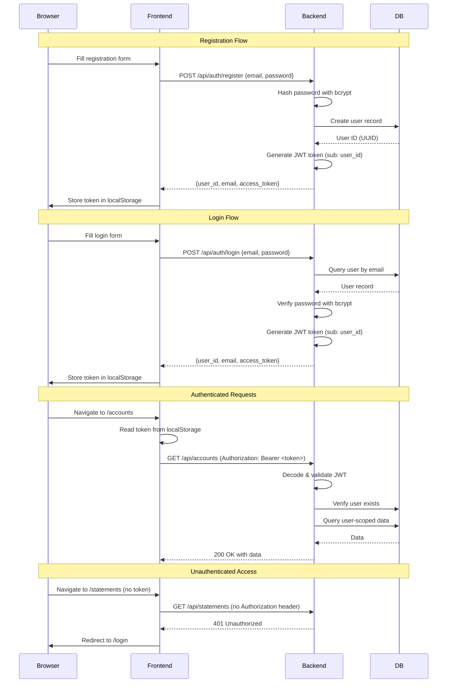

# Authentication SSOT

> **SSOT Key**: `authentication`
> **Core Definition**: How API requests resolve the current user identity and how users register/login.

---

## 1. Source of Truth

| Component | Physical Location | Description |
|-----------|-------------------|-------------|
| User context dependency | `apps/backend/src/auth.py` | `get_current_user_id` header-based resolver |
| User registration API | `apps/backend/src/routers/auth.py` | Registration and login endpoints |
| User model | `apps/backend/src/models/user.py` | Persistence for valid user IDs |
| Frontend auth context | `apps/frontend/src/lib/auth.ts` | User session management |
| API fetch with auth | `apps/frontend/src/lib/api.ts` | Header injection for all API calls |

---

## 2. Authentication Flow



---

## 3. Current Authentication Model

**Mechanism**: JWT (JSON Web Token) with Bearer token authentication.

**Token Storage**:
- Frontend: `localStorage` (key: `finance_access_token`)
- Token format: `Bearer <jwt_token>`
- Token lifetime: 1 day (1440 minutes, configurable via `ACCESS_TOKEN_EXPIRE_MINUTES`)

**Backend Validation**:
- Uses `OAuth2PasswordBearer` scheme
- Validates JWT signature with `SECRET_KEY`
- Extracts user ID from token payload (`sub` claim)
- Verifies user exists in database

**Behavior**:
- Missing token → `401 Unauthorized`
- Invalid/expired token → `401 Unauthorized`
- Valid token but user deleted → `401 Unauthorized`
- Valid token → request proceeds with resolved user_id

**Scope**:
- Accounts, journal entries, statements, reports, reconciliation, and chat endpoints.
- Reconciliation endpoints **must** be authenticated and user-scoped via `get_current_user_id`. Unauthenticated access to reconciliation data is **prohibited**, including in MVP and test environments.

---

### 3. Route Protection (Client-Side)

We use a global `AuthGuard` component in `layout.tsx` to protect routes.

**`components/AuthGuard.tsx`**
```tsx
"use client";

import { useEffect, useState } from "react";
import { useRouter, usePathname } from "next/navigation";
import { isAuthenticated } from "@/lib/auth";

const PUBLIC_PATHS = ["/login", "/ping-pong"];

export function AuthGuard({ children }: { children: React.ReactNode }) {
  const router = useRouter();
  const pathname = usePathname();
  const [authorized, setAuthorized] = useState(false);

  useEffect(() => {
    if (PUBLIC_PATHS.some((path) => pathname === path || pathname.startsWith(path + "/"))) {
      setAuthorized(true);
      return;
    }

    if (!isAuthenticated()) {
      setAuthorized(false);
      router.push("/login");
    } else {
      setAuthorized(true);
    }
  }, [pathname, router]);

  if (!authorized && !PUBLIC_PATHS.includes(pathname)) return null;

  return <>{children}</>;
}
```

**Usage in `layout.tsx`**
```tsx
export default function RootLayout({ children }) {
  return (
    <html>
      <body>
        <AuthGuard>
           <AppShell>{children}</AppShell>
        </AuthGuard>
      </body>
    </html>
  );
}
```

---

## 4. Registration & Login API

### POST /api/auth/register

Creates a new user with email and password.

**Request**:
```json
{
  "email": "user@example.com",
  "name": "John Doe",
  "password": "secure_password_123"
}
```

**Response** (201 Created):
```json
{
  "id": "uuid",
  "email": "user@example.com",
  "name": "John Doe",
  "created_at": "2026-01-22T00:00:00Z",
  "access_token": "eyJhbGciOiJIUzI1NiIsInR5cCI6IkpXVCJ9..."
}
```

**Security Features**:
- Password hashed with bcrypt
- Rate limiting: 3 attempts per hour per IP
- Email uniqueness enforced at DB level

### POST /api/auth/login

Authenticates user with email and password.

**Request**:
```json
{
  "email": "user@example.com",
  "password": "secure_password_123"
}
```

**Response** (200 OK):
```json
{
  "id": "uuid",
  "email": "user@example.com",
  "name": "John Doe",
  "created_at": "2026-01-22T00:00:00Z",
  "access_token": "eyJhbGciOiJIUzI1NiIsInR5cCI6IkpXVCJ9..."
}
```

**Error Response** (401 Unauthorized):
```json
{
  "detail": "Invalid email or password"
}
```

**Security Features**:
- Constant-time password comparison
- Rate limiting: 5 attempts per 15 minutes per IP
- Generic error message (doesn't reveal if email exists)

### GET /api/auth/me

Returns current authenticated user information.

**Headers**:
```
Authorization: Bearer <access_token>
```

**Response** (200 OK):
```json
{
  "id": "uuid",
  "email": "user@example.com",
  "name": "John Doe",
  "created_at": "2026-01-22T00:00:00Z",
  "access_token": "eyJhbGciOiJIUzI1NiIsInR5cCI6IkpXVCJ9..."
}
```

---

## 5. Frontend Integration

### Session Storage

```typescript
// apps/frontend/src/lib/auth.ts
const USER_KEY = "finance_user_id";
const USER_EMAIL_KEY = "finance_user_email";
const TOKEN_KEY = "finance_access_token";

export function getAccessToken(): string | null {
  if (typeof window === "undefined") return null;
  return localStorage.getItem(TOKEN_KEY);
}

export function setUser(userId: string, email: string, token: string): void {
  localStorage.setItem(USER_KEY, userId);
  localStorage.setItem(USER_EMAIL_KEY, email);
  localStorage.setItem(TOKEN_KEY, token);
}

export function clearUser(): void {
  localStorage.removeItem(USER_KEY);
  localStorage.removeItem(USER_EMAIL_KEY);
  localStorage.removeItem(TOKEN_KEY);
}

export function isAuthenticated(): boolean {
  return getAccessToken() !== null;
}
```

### API Header Injection

```typescript
// apps/frontend/src/lib/api.ts
export async function apiFetch<T>(path: string, options?: RequestInit): Promise<T> {
  const token = getAccessToken();
  const headers: HeadersInit = {
    "Content-Type": "application/json",
    ...options?.headers,
  };
  
  if (token) {
    headers["Authorization"] = `Bearer ${token}`;
  }
  
  const res = await fetch(`${API_URL}${path}`, { ...options, headers });
  
  // Redirect to login on 401 Unauthorized
  if (!res.ok && res.status === 401) {
    if (typeof window !== "undefined") {
      window.location.href = "/login";
    }
    throw new Error("Authentication required");
  }
  
  // ... handle other responses
}
```

### Auth Protection

Pages that require authentication should redirect to `/login` if `isAuthenticated()` returns false. The `AuthGuard` component in `layout.tsx` handles this globally for all protected routes.

---

## 6. Security Considerations

### JWT Token Security

**Current Implementation**:
- **Algorithm**: HS256 (HMAC with SHA-256)
- **Secret Key**: Stored in `SECRET_KEY` environment variable
- **Token Lifetime**: 1 day (1440 minutes, configurable via `ACCESS_TOKEN_EXPIRE_MINUTES`)
- **Token Claims**: `sub` (user ID), `exp` (expiration timestamp)

### Security Features

**Password Security**:
- Bcrypt hashing with automatic salt generation
- Cost factor: 12 (default bcrypt rounds)
- Constant-time comparison to prevent timing attacks

**Rate Limiting**:
- **Registration**: 3 attempts per hour per IP
- **Login**: 5 attempts per 15 minutes per IP
- Trusted proxy support via `TRUST_PROXY` environment variable
- Automatic reset on successful authentication

**Token Validation**:
- Signature verification on every request
- Expiration check (tokens auto-expire after 1 day)
- User existence verification against database
- Missing/invalid token → immediate 401 response

### Known Limitations

**Token Storage**:
- Stored in `localStorage` (vulnerable to XSS attacks)
- **Mitigation**: Strict Content Security Policy (CSP) recommended
- **Future**: Consider `httpOnly` cookies for enhanced security

**Token Revocation**:
- No blacklist mechanism (tokens valid until expiration)
- User account deletion does NOT immediately invalidate tokens
- **Workaround**: Database user existence check on every request

**Frontend Redirect**:
- Client-side 401 handling redirects to `/login`
- Requires JavaScript enabled
- **Limitation**: Direct API access (curl) still returns JSON error

### Production Requirements

Before production deployment, ensure:

1. **SECRET_KEY** is cryptographically random (min 32 bytes)
2. **HTTPS only** - Never expose tokens over HTTP
3. **CSP headers** - Prevent XSS attacks that could steal tokens
4. **Rate limiting** - Configure appropriate limits for production traffic
5. **Token lifetime** - Consider shorter expiration for sensitive operations
6. **Monitoring** - Track failed auth attempts for security analysis

---

## 7. Design Constraints

### Required
- **No hard-coded user IDs** in routers or services.
- **User existence check** against `users` table on every authenticated request.
- **JWT signature validation** on every request.
- **Frontend must send Authorization header** with Bearer token on all authenticated API calls.
- **Token expiration check** - reject expired tokens immediately.

### Prohibited
- **Mock user bypass** in production code.
- **Implicit defaults** when authentication fails.
- **Storing passwords** in localStorage (only tokens allowed).
- **Trusting client-provided user IDs** without JWT validation.

---

## 8. Playbook

### Local Development
1. Start backend and frontend servers:
   ```bash
   moon run backend:dev  # Terminal 1
   moon run frontend:dev # Terminal 2
   ```
2. Navigate to `http://localhost:3000/login` or `/register`
3. Register a new user with email and password
4. Access token is stored in localStorage and sent with all API calls

### Testing
- Tests must create a user via `/api/auth/register` and include `Authorization: Bearer <token>` header in all requests
- Example test setup:
  ```python
  # Backend test (pytest)
  response = client.post("/auth/register", json={
      "email": "test@example.com",
      "password": "secure123",
      "name": "Test User"
  })
  token = response.json()["access_token"]
  
  # Use token in subsequent requests
  client.get("/accounts", headers={"Authorization": f"Bearer {token}"})
  ```

### Debugging "Not authenticated" / 401 Errors

**Frontend debugging**:
1. Open browser DevTools → Application → Local Storage
2. Check for `finance_access_token` key
3. If missing, navigate to `/login` and register/login
4. Verify API requests include `Authorization: Bearer <token>` header in Network tab
5. Check token expiration: decode JWT at https://jwt.io

**Backend debugging**:
1. Check backend logs for JWT validation errors
2. Verify `SECRET_KEY` is set correctly in environment
3. Verify token signature matches the secret key
4. Check if user still exists in database

**Common issues**:
- **Token expired**: Re-login to get new token (7-day lifetime)
- **User deleted**: Token remains valid until expiration, but user check fails
- **Wrong SECRET_KEY**: Tokens generated with different key won't validate
- **Missing Authorization header**: Frontend not sending token (check localStorage)

---

## 9. Verification (The Proof)

```bash
# 1. Register a new user
curl -X POST http://localhost:8000/api/auth/register \
  -H "Content-Type: application/json" \
  -d '{
    "email": "test@example.com",
    "name": "Test User",
    "password": "secure_password_123"
  }'

# Expected response (201 Created):
# {
#   "id": "550e8400-e29b-41d4-a716-446655440000",
#   "email": "test@example.com",
#   "name": "Test User",
#   "created_at": "2026-01-22T00:00:00Z",
#   "access_token": "eyJhbGciOiJIUzI1NiIsInR5cCI6IkpXVCJ9.eyJzdWIiOiI1NTBlODQwMC1lMjliLTQxZDQtYTcxNi00NDY2NTU0NDAwMDAiLCJleHAiOjE3MDY5NzYwMDB9.xxx"
# }

# 2. Login with existing user
curl -X POST http://localhost:8000/api/auth/login \
  -H "Content-Type: application/json" \
  -d '{
    "email": "test@example.com",
    "password": "secure_password_123"
  }'

# Expected response (200 OK):
# Same structure as registration response with new access_token

# 3. Use the token for authenticated requests
TOKEN="eyJhbGciOiJIUzI1NiIsInR5cCI6IkpXVCJ9..."

curl -H "Authorization: Bearer $TOKEN" \
  http://localhost:8000/api/accounts

# Expected: 200 OK with account data

# 4. Test without token (should fail)
curl -v http://localhost:8000/api/accounts

# Expected: 401 Unauthorized
# {"detail":"Not authenticated"}

# 5. Test with invalid token
curl -v -H "Authorization: Bearer invalid_token_here" \
  http://localhost:8000/api/accounts

# Expected: 401 Unauthorized
# {"detail":"Could not validate credentials"}

# 6. Get current user info
curl -H "Authorization: Bearer $TOKEN" \
  http://localhost:8000/api/auth/me

# Expected: 200 OK
# {
#   "id": "550e8400-e29b-41d4-a716-446655440000",
#   "email": "test@example.com",
#   "name": "Test User",
#   "created_at": "2026-01-22T00:00:00Z",
#   "access_token": "eyJhbGciOiJIUzI1NiIsInR5cCI6IkpXVCJ9..."
# }

# 7. Test frontend redirect on 401 (after PR #122 merges)
# Visit in browser (not logged in): http://localhost:3000/statements
# Expected: Automatically redirects to /login
```
