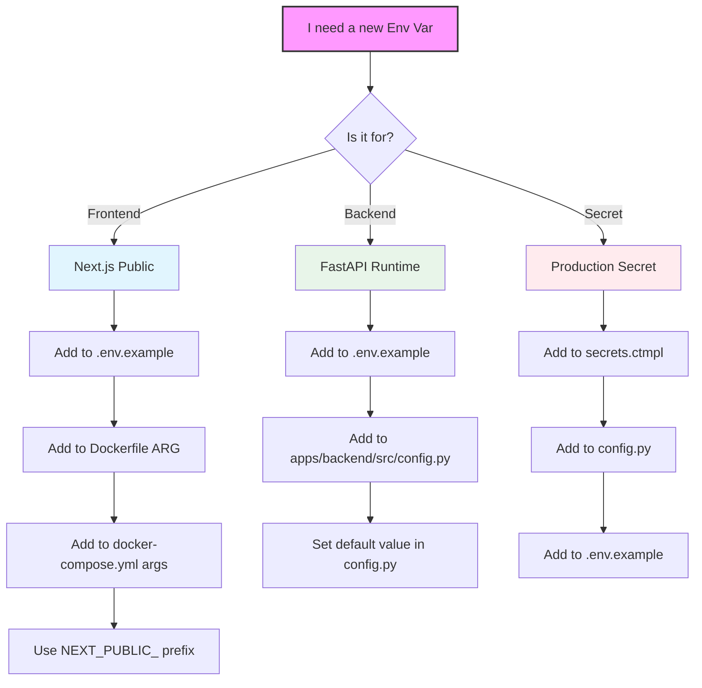

# Development Environment SSOT

> **SSOT Key**: `development`
> **Source of Truth** for local development, testing, CI, and deployment.

## Source Files

### Prerequisites
- **Node.js**: v20+ (Managed by system, not moon)
- **pnpm/npm**: Required for frontend dependencies
- **Python**: v3.12+ (Managed by uv)

| File | Purpose |
|------|---------|
| `moon.yml` | Root workspace tasks |
| `apps/*/moon.yml` | Per-project tasks |
| `scripts/test_backend.sh` | Database lifecycle (reference counting) |
| `scripts/smoke_test.sh` | Unified smoke tests |
| `docker-compose.yml` | Development service containers |
| `.github/workflows/ci.yml` | GitHub Actions CI |
| `.github/workflows/docker-build.yml` | Build, Deploy, Smoke Test |

---

## Moon Commands (Primary Interface)

```bash
# Development
moon run backend:dev        # FastAPI on :8000
moon run frontend:dev       # Next.js on :3000

# Testing
moon run :test              # All tests
moon run backend:test       # Backend tests (auto-manages DB)
moon run :smoke             # Smoke tests

# Code Quality
moon run :lint              # Lint all
moon run backend:format     # Format Python

# Build
moon run :build             # Build all
```

---

## Documentation

The project uses [MkDocs](https://www.mkdocs.org/) with Material theme for documentation.

### Build & Serve Docs

```bash
# Install dependencies
pip install -r docs/requirements.txt

# Serve docs locally with live reload
mkdocs serve
# → Open http://127.0.0.1:8000

# Build static site
mkdocs build
# → Output: site/ directory
```

### Documentation Structure

| Path | Content |
|------|---------|
| `docs/` | Source markdown files |
| `mkdocs.yml` | MkDocs configuration |
| `site/` | Generated static site (gitignored) |

The live documentation is hosted at [wangzitian0.github.io/finance_report](https://wangzitian0.github.io/finance_report/).

---

## Six Scenarios

> **Core Principle**: Only Staging needs comprehensive testing.  
> Other environments prioritize **speed** (Local/CI) or **stability** (Production).

### Strategy Overview

```
┌──────────────────────────────────────────────────────────────────┐
│  SPEED ←─────────────────────────────────────────→ THOROUGHNESS  │
│                                                                   │
│  Local      CI         PR Test       Staging        Production   │
│  ─────      ──         ───────       ───────        ──────────   │
│  Unit+Int   Unit+Int   Health        Smoke+Perf     Health       │
│  < 30s      < 2min     Check         FULL TEST      Check        │
│                        (deploy ok?)  (pre-prod)     (stable?)    │
└──────────────────────────────────────────────────────────────────┘
```

### Test Categories

| Category | Where | Purpose |
|----------|-------|---------|
| **Unit + Integration** | Local, CI | Fast feedback and quality gate |
| **Health Check** | PR Test, Prod | Verify service availability |
| **Smoke Test** | Staging | End-to-end functional validation |
| **Performance** | Staging | API response time baseline |

### Scenario Matrix

| # | Scenario | Trigger | Tests | Goal |
|---|----------|---------|-------|------|
| 1 | **Local Dev** | Manual | None | Iteration speed |
| 2 | **Local Test** | `moon run backend:test` | Unit+Integration | < 30s feedback |
| 3 | **Remote CI** | PR / Push | Unit+Integration | Quality gate |
| 4 | **PR Test** | PR opened | **Health Check** | Deployment validation |
| 5 | **Staging** | Push to main | **Smoke + Perf** | Full validation |
| 6 | **Production** | Manual dispatch | **Health Check** | Minimal validation |

### pytest Markers

| Marker | Description | Where |
|--------|-------------|-------|
| (none) | Standard tests | Local, CI |
| `@pytest.mark.slow` | Performance tests | Manual only |

> **Note:** Slow tests are skipped by default via `-m 'not slow'` in `pyproject.toml`.
> Run all tests: `uv run pytest -m ""`

### Coverage Gate

- Backend line coverage must be **>= 95%** (`pytest-cov` enforces via `--cov-fail-under=95`).

### Workflow Diagram

```
┌─────────────────────────────────────────────────────────────────┐
│ Scenario 1-3: Local/CI                                          │
│ ┌─────────┐    ┌─────────┐                                     │
│ │ DB auto │ -> │ pytest  │  (Unit+Integration, fast)           │
│ └─────────┘    └─────────┘                                     │
├─────────────────────────────────────────────────────────────────┤
│ Scenario 4: PR Test                                             │
│ ┌─────────┐    ┌─────────┐    ┌─────────┐                      │
│ │ Build   │ -> │ Deploy  │ -> │ Health  │  (deployment check)  │
│ │ source  │    │ Dokploy │    │ Check   │                      │
│ └─────────┘    └─────────┘    └─────────┘                      │
├─────────────────────────────────────────────────────────────────┤
│ Scenario 5: Staging (FULL VALIDATION)                           │
│ ┌─────────┐    ┌─────────┐    ┌─────────┐    ┌─────────┐      │
│ │ Build   │ -> │ Deploy  │ -> │ Smoke   │ -> │ Perf    │      │
│ │ images  │    │ Dokploy │    │ Test    │    │ Bench   │      │
│ └─────────┘    └─────────┘    └─────────┘    └─────────┘      │
├─────────────────────────────────────────────────────────────────┤
│ Scenario 6: Production (MINIMAL RISK)                           │
│ ┌─────────┐    ┌─────────┐    ┌─────────┐                      │
│ │ Verify  │ -> │ Deploy  │ -> │ Health  │  (availability only) │
│ │ image   │    │ Dokploy │    │ Check   │                      │
│ └─────────┘    └─────────┘    └─────────┘                      │
└─────────────────────────────────────────────────────────────────┘
```

---

## Database Lifecycle

### Reference Counting (scripts/test_backend.sh)

```
Terminal 1: moon run backend:test  → refcount=1 (start container)
Terminal 2: moon run backend:test  → refcount=2
Terminal 2 exits                   → refcount=1
Terminal 1 exits                   → refcount=0 (stop container)
```

### Local Test Isolation (Branch Suffix)

- Set `BRANCH_NAME=<branch_name>` to namespace test resources for local runs.
- Use `WORKSPACE_ID=<id>` to isolate multiple working copies on the same branch (defaults to the last 8 characters of a repo-path checksum if omitted, so collisions are still possible).
- The test DB container name and lock/state files include the branch suffix (and workspace id when set).
- If `POSTGRES_PORT` is not set, a deterministic port is derived from the branch suffix (range: 5400-5999).
- Test runs track whether the DB container was created or just started, and only remove containers they created.
- The postgres service binds to `127.0.0.1:${POSTGRES_PORT:-5432}`; ensure unique ports when running multiple repos in parallel.

### Key Features

1. **Auto-detect runtime**: podman compose / docker compose
2. **Lock file**: `~/.cache/finance_report/db.lock`
3. **Auto-cleanup**: Last runner stops container

---

## Resource Lifecycle Management

All resources are bound to either **dev server lifecycle** (Ctrl+C) or **test lifecycle** (start/end).

### Dev Server Lifecycle (`scripts/dev_*.py`)

```
┌─────────────────────────────────────────────────────────────────┐
│ User runs: moon run backend:dev                                 │
│ ┌─────────┐    ┌─────────┐    ┌─────────┐                      │
│ │ Start   │ -> │ Server  │ -> │ Ctrl+C  │                      │
│ │ DB      │    │ Runs    │    │ Cleanup │                      │
│ └─────────┘    └─────────┘    └─────────┘                      │
│                                    │                            │
│                              Stops: OUR uvicorn, OUR DB only    │
└─────────────────────────────────────────────────────────────────┘
```

**Key safety feature**: Scripts track processes by PID, only kill what THEY started.
Safe for multi-window development - won't kill other sessions' processes.

**Resources managed by dev scripts:**
| Script | Resources Started | Cleaned up on Ctrl+C |
|--------|-------------------|---------------------|
| `dev_backend.py` | uvicorn (PID tracked), dev DB (container ID tracked) | ✓ Only ours |
| `dev_frontend.py` | Next.js (PID tracked) | ✓ Only ours |

### Test Lifecycle (`scripts/test_backend.sh`)

```
┌─────────────────────────────────────────────────────────────────┐
│ User runs: moon run backend:test                                │
│ ┌─────────┐    ┌─────────┐    ┌─────────┐    ┌─────────┐      │
│ │ Start   │ -> │ Create  │ -> │ pytest  │ -> │ Cleanup │      │
│ │ DB      │    │ test DB │    │ runs    │    │ (trap)  │      │
│ └─────────┘    └─────────┘    └─────────┘    └─────────┘      │
│                                                   │             │
│                          Stops: DB (if refcount=0), playwright  │
└─────────────────────────────────────────────────────────────────┘
```

**Resources managed by test script:**
| Resource | Start | Stop |
|----------|-------|------|
| Test DB container | Before tests | After last test runner exits |
| Playwright driver | By pytest | Cleanup on test end |
| Child processes | By pytest | `pkill -P $$` on exit |


## Smoke Tests (scripts/smoke_test.sh)

### Usage

```bash
# Local (after starting servers)
moon run :smoke

# Against staging/prod
BASE_URL=https://report.zitian.party bash scripts/smoke_test.sh
```

### Endpoints Tested

| Endpoint | Check |
|----------|-------|
| `/` | Homepage loads |
| `/api/health` | Returns "healthy" |
| `/api/docs` | Swagger UI loads |
| `/ping-pong` | Demo page loads |
| `/reconciliation` | Workbench loads |
| `/api/ping` | Ping API responds |

---

## CI Workflows

### ci.yml (on PR/push)

```
Trigger: PR or push to main
Steps:  install → lint → test
DB:     GitHub services (ephemeral)
Smoke:  ❌ Not run (unit tests only)
Note:   Uses moon tasks for install/lint/build (uv/npm invoked via moon)
```

### docker-build.yml (Build and Deploy)

```
Triggers:
  - Push to main (apps/** changed) → Build + Deploy Production + Smoke
  - Manual dispatch → Build + Optional deploy to staging/production

Environments:
  - Production: report.zitian.party (auto on main push)
  - Staging: report-staging.zitian.party (manual trigger only)

Required Secrets:
  - DOKPLOY_API_KEY: API key for Dokploy
  - DOKPLOY_COMPOSE_ID: Production compose ID
  - DOKPLOY_STAGING_COMPOSE_ID: Staging compose ID
```

---

## Deployment Architecture

### Environment Flow

```
┌─────────────────────────────────────────────────────────────────┐
│ Development Flow                                                 │
│                                                                  │
│   Local Dev        PR/Branch           Staging         Prod     │
│   ┌─────────┐      ┌─────────┐      ┌─────────┐    ┌─────────┐ │
│   │ docker  │  →   │ CI test │  →   │ Manual  │ →  │ Auto on │ │
│   │ compose │      │ build   │      │ deploy  │    │ main    │ │
│   │ integrat│      │ images  │      │ verify  │    │ merge   │ │
│   └─────────┘      └─────────┘      └─────────┘    └─────────┘ │
│                                                                  │
│   docker-compose   GitHub Actions    workflow      push to      │
│   .integration.yml                   _dispatch     main         │
└─────────────────────────────────────────────────────────────────┘
```

### Database Migrations Testing Strategy

Migrations are tested at multiple stages:

1. **Local Development**: Manual testing with `alembic upgrade head` before committing
2. **GitHub CI**: pytest validates model definitions and constraints
3. **Staging Deployment**: First automated test of migrations via entrypoint
4. **Production Deployment**: Only after staging validation

Before deploying schema changes:
- Test locally: `cd apps/backend && alembic upgrade head`
- Ensure backward-compatible migrations (for rollback)
- Consider: existing data, indexes, constraints

### Staging Deployment (Manual)

```bash
# Via GitHub Actions UI:
# 1. Go to Actions → "Build and Deploy"
# 2. Click "Run workflow"
# 3. Select deploy_target: "staging"
# 4. Run workflow

# Or via gh CLI:
gh workflow run docker-build.yml -f deploy_target=staging
```

### Production Deployment (Automatic)

Production deploys automatically when:
1. Push to `main` branch
2. Changes in `apps/backend/**` or `apps/frontend/**`

The workflow:
1. Builds images with SHA tag
2. Updates Dokploy IMAGE_TAG env var
3. Triggers compose redeploy
4. Runs smoke tests

### Database Migrations

Migrations run automatically on container startup via the entrypoint:

```yaml
# In infra2 compose.yaml
entrypoint:
  - sh
  - -c
  - |
    cd /app && export PYTHONPATH=/app
    # Wait for secrets...
    alembic upgrade head  # ← Runs migrations
    exec uvicorn src.main:app --host 0.0.0.0 --port 8000
```

**Important**: Before deploying schema changes:
1. Test migration locally with `docker-compose.integration.yml`
2. Ensure migration is backward-compatible (for rollback)
3. Consider: existing data, indexes, constraints

---

## Environment Variables

| Scenario | DATABASE_URL | Hostname Strategy |
|----------|--------------|-------------------|
| Local Dev | `postgresql+asyncpg://...` | `localhost` or `postgres` |
| Local Test | `postgresql+asyncpg://...` | `localhost:5432` |
| PR Test | `postgresql+asyncpg://...` | **Unique**: `finance-report-db-pr-XX` |
| CI | Same as Local Test | `localhost:5433` (services) |
| Staging/Prod | External PostgreSQL | Dokploy Managed |

---

## Verification

```bash
# Verify moon commands work
moon run backend:test

# Test smoke tests locally
nohup moon run backend:dev > /dev/null 2>&1 &
sleep 10
export BASE_URL="http://localhost:8000"
moon run :smoke

# Check no orphan containers after tests
podman ps | grep finance_report
```

---

## Engineering Standards

### Environment Variable Lifecycle

Variables follow a strict "Bake vs. Runtime" flow:



1.  **Frontend (Next.js)**:
    *   Variables prefixed with `NEXT_PUBLIC_` are "baked" into the static JS bundle during `npm run build`.
    *   **Requirement**: These MUST be defined as `ARG` in `apps/frontend/Dockerfile`.
    *   **Requirement**: They must also be passed in `docker-compose.yml` under `args`.
2.  **Backend (FastAPI)**:
    *   Variables are loaded at runtime via Pydantic Settings.
    *   **Requirement**: All variables must have a type and default in `apps/backend/src/config.py`.
    *   **Requirement**: Must be documented in `.env.example`.
3.  **Production (Vault)**:
    *   Secrets are stored in Vault and rendered by `vault-agent` using `secrets.ctmpl`.
    *   **Consistency**: CI runs `scripts/check_env_keys.py` to ensure `secrets.ctmpl`, `config.py`, and `.env.example` are aligned.

### Cross-Repo Synchronization

The `repo/` directory is a submodule pointing to `infra2`.

*   **Logic**: Main Repo (`finance_report`).
*   **Infrastructure**: Submodule (`infra2`).
*   **Workflow**:
    1.  If a change requires a new environment variable or a change to `docker-compose.yml` labels/configs for production:
    2.  Create a branch in `repo/`.
    3.  Commit changes to `repo/finance_report/finance_report/10.app/`.
    4.  Push and create a PR in `infra2`.
    5.  Once merged, update the submodule pointer in the Main Repo PR.
