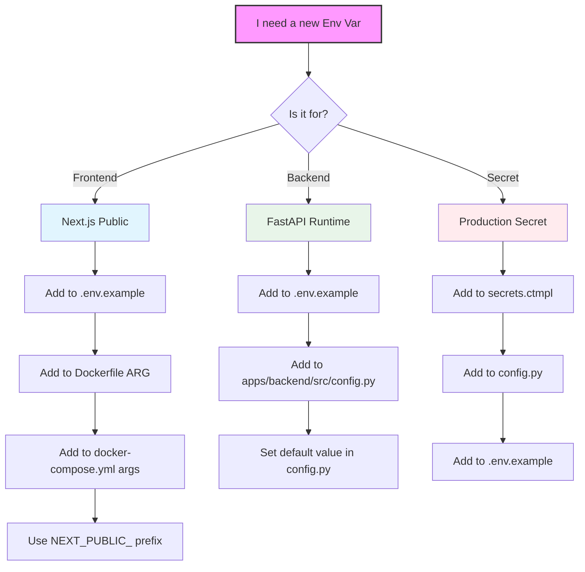

# Development Environment SSOT

> **SSOT Key**: `development`
> **Source of Truth** for local development, testing, CI, and deployment.

## Source Files

### Prerequisites
- **Node.js**: v20+ (Managed by system, not moon)
- **pnpm/npm**: Required for frontend dependencies
- **Python**: v3.12+ (Managed by uv)

| File | Purpose |
|------|---------|
| `moon.yml` | Root workspace tasks |
| `apps/*/moon.yml` | Per-project tasks |
| `scripts/test_lifecycle.py` | Database lifecycle (Python Context Manager) |
| `scripts/smoke_test.sh` | Unified smoke tests |
| `docker-compose.yml` | Development service containers |
| `.github/workflows/ci.yml` | GitHub Actions CI |
| `.github/workflows/staging-deploy.yml` | Staging Build & Deploy |
| `.github/workflows/production-release.yml` | Production Release |

---

## Moon Commands (Primary Interface)


```bash
# Development
moon run backend:dev        # Full Stack (App + DB + Redis + MinIO)
moon run frontend:dev       # Next.js on :3000

# Local CI / Verification (Recommended)
moon run :ci                # One-button check (Lint + Format + Test + Check)
                            # Matches GitHub CI exactly.

# Testing
moon run :test              # All tests
moon run backend:test       # Backend tests (auto-manages DB)

# Environment Verification
# (See docs/ssot/env_smoke_test.md for full details)
uv run python -m src.boot --mode full  # Full Stack Check (Gate 3)

# Code Quality
moon run :lint              # Lint all
moon run backend:format     # Format Python (auto-fix)
moon run backend:format     # Format Python

# Build
moon run :build             # Build all
```

---

## Documentation

The project uses [MkDocs](https://www.mkdocs.org/) with Material theme for documentation.

### Build & Serve Docs

```bash
# Install dependencies
pip install -r docs/requirements.txt

# Serve docs locally with live reload
mkdocs serve
# → Open http://127.0.0.1:8000

# Build static site
mkdocs build
# → Output: site/ directory
```

### Documentation Structure

| Path | Content |
|------|---------|
| `docs/` | Source markdown files |
| `mkdocs.yml` | MkDocs configuration |
| `site/` | Generated static site (gitignored) |

The live documentation is hosted at [wangzitian0.github.io/finance_report](https://wangzitian0.github.io/finance_report/).

---

## Six Environments (SSOT)

> **Core Principle**: "One Codebase, Multiple Environments" - Local uses containers + namespace isolation, CI emphasizes consistency, Production uses image deployment.

### Environment Overview

| # | Environment | URL | Trigger | Code Runtime | Infrastructure | Database | Isolation |
|---|-------------|-----|---------|--------------|----------------|----------|-----------|
| **1** | **Local Dev** | `localhost:3000` | Manual<br>`moon run backend:dev` | Source (Host)<br>uvicorn/next dev | Shared Containers<br>(Podman/Docker) | `finance_report` | Container name suffix |
| **2** | **Local CI** | `localhost:3000` | Manual<br>`moon run :ci` | Source (Host)<br>pytest | Shared Containers<br>(Podman/Docker) | `finance_report_test_{namespace}` | DB/bucket name |
| **3** | **GitHub CI** | - | Push/PR<br>`ci.yml` | Source (Runner)<br>pytest | GitHub Services<br>(Ephemeral) | `finance_report_test` | Job isolation |
| **4** | **PR Preview** | `report-pr-123.zitian.party` | PR opened<br>`pr-test.yml` | **Docker Images**<br>(GHCR) | Dedicated Containers<br>(Per PR) | Dedicated DB/Redis/MinIO | Container suffix<br>`-pr-123` |
| **5** | **Staging** | `report-staging.zitian.party` | Push to main<br>`staging-deploy.yml` | **Docker Images**<br>(GHCR) | Dedicated infra2<br>+ Shared Platform | Dedicated DB/Redis | Bucket name<br>`-staging` |
| **6** | **Production** | `report.zitian.party` | Manual release<br>`production-release.yml` | **Docker Images**<br>(GHCR) | Dedicated infra2<br>+ Shared Platform | Dedicated DB/Redis | Bucket name |

### Key Differences

#### Local Environments (Dev + CI)

**Local Dev** - One shared set of containers, isolated by **different database names**:
- Uses `docker-compose.yml` (Profile: `infra`)
- **Persistent**: Manually started, data preserved across runs
- Isolation: Multiple repo copies use **namespace-aware DB names** (`finance_report`, `finance_report_dev_branch_a`, etc.)
- S3: Shared local MinIO with namespace-aware buckets (`statements`, `statements-branch-a`)
- Command: `moon run backend:dev` (or `moon run :infra` + manual uvicorn)

**Local CI** - Reuses Local Dev containers, creates **temporary test databases**:
- Uses same `docker-compose.yml` (Profile: `infra`)
- **Ephemeral data**: Test DB reset before each run, worker DBs auto-cleaned
- Isolation: `finance_report_test_{namespace}` + worker DBs (`_gw0`, `_gw1`, etc.)
- Command: `moon run :ci` (includes `moon run backend:test`)
- **Matches GitHub CI command exactly** (`moon run :ci`)

#### GitHub Environments

**GitHub CI** - Temporary services, runs same commands as Local CI:
- Uses GitHub Actions `services:` (ephemeral Postgres container)
- **Completely ephemeral**: Destroyed after job finishes
- Command: `moon run :ci` (**identical to Local CI**)
- Database: `finance_report_test` (no namespace needed, job-isolated)

**PR Preview** - Full deployment with code changes:
- **Builds Docker images** from PR branch
- Deploys to Dokploy with unique URLs (`report-pr-123.zitian.party`)
- **Ephemeral**: Destroyed when PR closes
- Database/Redis/MinIO: Dedicated per-PR instances
- Isolation: Container name suffix `-pr-123`

#### Production Environments (Staging + Production)

**Staging** - Tracks latest `main` branch:
- **Image deployment**: Built from latest `main` commit after merge
- Deployed to Dokploy automatically on push to main
- Persistent data, stable environment for QA
- Uses dedicated DB/Redis + shared Platform (SigNoz, MinIO with bucket isolation)

**Production** - Manual release process:
- **Image deployment**: Built from version tags (`v1.2.3`)
- Manual trigger after Staging validation
- Most stable environment, persistent data
- Uses dedicated DB/Redis + shared Platform

### Container/Database Naming Patterns

| Environment | Backend Container | Frontend Container | Database | S3 Bucket |
|-------------|-------------------|---------------------|----------|-----------|
| **Local Dev** | `finance-report-backend` | `finance-report-frontend` | `finance_report` | `statements` |
| **Local CI** | *(uses Local Dev containers)* | *(uses Local Dev containers)* | `finance_report_test_{namespace}` | `statements-{namespace}` |
| **GitHub CI** | *(GitHub Services)* | *(N/A)* | `finance_report_test` | `statements` (mock) |
| **PR Preview** | `finance_report-backend-pr-123` | `finance_report-frontend-pr-123` | `finance_report_postgres-pr-123` | *(dedicated MinIO)* |
| **Staging** | `finance_report-backend-staging` | `finance_report-frontend-staging` | `finance_report-postgres-staging` | `finance-report-staging` |
| **Production** | `finance_report-backend` | `finance_report-frontend` | `finance_report-postgres` | `finance-report-production` |

See [AGENTS.md](../../AGENTS.md#container-naming-patterns) for debugging container names.

### Workflow Files Reference

| Workflow File | Environment | Trigger | Actions |
|---------------|-------------|---------|---------|
| `.github/workflows/ci.yml` | GitHub CI | Push/PR to main | Run `moon run :ci`, upload coverage |
| `.github/workflows/pr-test.yml` | PR Preview | PR opened/sync | Build images, deploy to Dokploy, cleanup on close |
| `.github/workflows/staging-deploy.yml` | Staging | Push to main | Build images (`:staging` tag), deploy |
| `.github/workflows/production-release.yml` | Production | Tag `v*.*.*` or manual | Build release images, deploy on manual trigger |

### Shared Platform Resources

The production Platform layer (SigNoz, MinIO, Traefik) runs as **Singleton** services. Staging and PR environments use **logical isolation**:

| Service | Scope | Isolation Method | Example |
|---------|-------|------------------|---------|
| **SigNoz** | Singleton | `deployment.environment` tag | `staging`, `production`, `pr-47` |
| **MinIO** (Prod) | Singleton | Separate buckets | `finance-report-staging`, `finance-report-production` |
| **Postgres** | Dedicated | Separate containers/instances | One per environment |
| **Redis** | Dedicated | Separate containers/instances | One per environment |

**Note**: PR Previews have **dedicated MinIO/DB/Redis** to allow destructive testing, but send logs to shared SigNoz.

### Test Strategy by Environment

| Environment | Tests Run | Purpose | Duration |
|-------------|-----------|---------|----------|
| **Local Dev** | None (manual testing) | Fast iteration | - |
| **Local CI** | Unit + Integration (92% coverage, target 97%) | Pre-push validation | ~30s |
| **GitHub CI** | Unit + Integration (92% coverage, target 97%) | Quality gate | ~2min |
| **PR Preview** | Health check only | Deployment validation | ~30s |
| **Staging** | Smoke + Performance | Full validation | ~5min |
| **Production** | Health check only | Availability check | ~10s |

### Coverage Requirements

- Backend line coverage: **>= 92%** (enforced by `pytest-cov`, target 97%)
- Branch coverage: Required (via `--cov-branch`)
- See [TDD Transformation Plan](./tdd.md) for details

### Common Commands

```bash
# Local Development
moon run :infra                    # Start containers (Postgres/Redis/MinIO)
moon run backend:dev               # Start backend dev server
moon run frontend:dev              # Start frontend dev server

# Local CI (matches GitHub CI exactly)
moon run :ci                       # Lint + Format + Test + Build

# Isolated testing (multiple repo copies)
BRANCH_NAME=feature-auth moon run backend:test
BRANCH_NAME=feature-auth WORKSPACE_ID=alice moon run backend:test
```

---

## Database Lifecycle

### Database Management (Python Context Manager)

The `scripts/test_lifecycle.py` script uses a Python Context Manager (`@contextmanager`) to robustly handle the database lifecycle:

1.  **Setup**: Checks for the container runtime (Podman/Docker), starts the `postgres` service via Docker Compose, and ensures the database is ready.
2.  **Isolation**: Creates a dedicated `finance_report_test` database and runs migrations.
3.  **Teardown**: Automatically stops the database container after tests complete, ensuring resources are freed.
4.  **Signal Handling**: Catches `SIGINT` (Ctrl+C) and `SIGTERM` to perform cleanup even if the test run is interrupted.


### Local Test Isolation (Namespace-Based)

**Purpose**: Enable multiple repo copies (or branches) to run tests in parallel without conflicts.

**How It Works**:

1. **Namespace Generation** (priority order):
   - `BRANCH_NAME` (explicit) + `WORKSPACE_ID` (optional) → e.g., `feature_auth_abc123`
   - Git branch + repo path hash → e.g., `feature_payments_beeba6ed`
   - "default" (with warning if neither is set)

2. **Isolated Resources**:
   - **Test Database**: `finance_report_test_{namespace}`
   - **Worker Databases**: `finance_report_test_{namespace}_gw0`, `gw1`, etc. (pytest-xdist)
   - **S3 Buckets**: `statements-{namespace}`

3. **Usage Examples**:
   ```bash
   # Explicit namespace (recommended for parallel development)
   BRANCH_NAME=feature-auth moon run backend:test
   
   # With workspace ID (multiple copies of same branch)
   BRANCH_NAME=feature-auth WORKSPACE_ID=alice moon run backend:test
   BRANCH_NAME=feature-auth WORKSPACE_ID=bob moon run backend:test
   
   # Auto-detect from git branch (adds repo path hash)
   moon run backend:test  # Uses current git branch
   ```

4. **Automatic Cleanup**:
   - Worker databases (`_gw0`, `_gw1`, etc.) are automatically cleaned up after test runs
   - Prevents database pollution from parallel test execution
   - See `scripts/test_lifecycle.py` → `cleanup_worker_databases()`

**Implementation Details**:
- Shared Podman containers (no port conflicts)
- Namespace-aware database and bucket names only
- See `scripts/isolation_utils.py` for namespace logic
- Integration tests: `apps/backend/tests/infra/test_isolation.py`

### Key Features

1. **Auto-detect runtime**: podman compose / docker compose
2. **Lock file**: `~/.cache/finance_report/db.lock`
3. **Auto-cleanup**: Last runner stops container

---

## Isolation Utilities (`scripts/isolation_utils.py`)

**Purpose**: Support parallel test execution across multiple repo copies without resource conflicts.

### Namespace Generation

The `get_namespace()` function generates a unique identifier for test resources based on:

```python
# Priority 1: Explicit environment variables
BRANCH_NAME=feature-auth           # → "feature_auth"
BRANCH_NAME=feature-auth WORKSPACE_ID=alice  # → "feature_auth_alice"

# Priority 2: Git branch + repo path hash (auto-detect)
# On branch "feature-payments" at /path/to/repo
# → "feature_payments_beeba6ed"

# Priority 3: Fallback (with warning)
# → "default_abc12345"  # Includes repo path hash for isolation
```

### Resource Naming Functions

| Function | Input | Output | Purpose |
|----------|-------|--------|---------|
| `get_test_db_name(namespace)` | `"feature_auth"` | `"finance_report_test_feature_auth"` | Test database name |
| `get_s3_bucket(namespace)` | `"feature_auth"` | `"statements-feature_auth"` | S3 bucket name |
| `get_env_suffix(namespace)` | `"feature_auth"` | `"-feature_auth"` | Docker Compose suffix (future use) |
| `sanitize_namespace(name)` | `"feature/auth-v2"` | `"feature_auth_v2"` | Convert branch names to safe identifiers |

### Integration Points

1. **`scripts/test_lifecycle.py`**:
   - Calls `get_namespace()` at test start
   - Sets `TEST_NAMESPACE` environment variable
   - Creates namespace-specific test database
   - Overrides `S3_BUCKET` with namespace-aware bucket
   - Cleans up worker databases (`_gw0`, `_gw1`, etc.) after tests

2. **`apps/backend/tests/conftest.py`**:
   - Reads `TEST_NAMESPACE` from environment
   - Generates worker-specific database URLs:
     - Master: `finance_report_test_{namespace}`
     - Worker 0: `finance_report_test_{namespace}_gw0`
     - Worker 1: `finance_report_test_{namespace}_gw1`
     - etc.

3. **Contract Tests** (`apps/backend/tests/infra/test_isolation.py`):
   - 15 tests verifying isolation behavior
   - Tests namespace generation, database naming, S3 buckets
   - Verifies conftest integration

### Practical Examples

**Scenario 1: Single developer, multiple feature branches**
```bash
# Terminal 1 (feature-auth branch)
cd ~/repos/finance_report
BRANCH_NAME=feature-auth moon run backend:test
# Uses: finance_report_test_feature_auth

# Terminal 2 (feature-payments branch)
cd ~/repos/finance_report
BRANCH_NAME=feature-payments moon run backend:test
# Uses: finance_report_test_feature_payments
```

**Scenario 2: Multiple developers, same branch**
```bash
# Alice's terminal
cd ~/repos/finance_report_alice
BRANCH_NAME=feature-auth WORKSPACE_ID=alice moon run backend:test
# Uses: finance_report_test_feature_auth_alice

# Bob's terminal
cd ~/repos/finance_report_bob
BRANCH_NAME=feature-auth WORKSPACE_ID=bob moon run backend:test
# Uses: finance_report_test_feature_auth_bob
```

**Scenario 3: Auto-detection from git**
```bash
cd ~/repos/finance_report
git checkout feature-payments
moon run backend:test
# Auto-detects: finance_report_test_feature_payments_<hash>
# Hash prevents collisions across different repo copies
```

---

## Resource Lifecycle Management

All resources are bound to either **dev server lifecycle** (Ctrl+C) or **test lifecycle** (start/end).

### Dev Server Lifecycle (`scripts/dev_*.py`)

```
┌─────────────────────────────────────────────────────────────────┐
│ User runs: moon run backend:dev                                 │
│ ┌─────────┐    ┌─────────┐    ┌─────────┐                      │
│ │ Start   │ -> │ Server  │ -> │ Ctrl+C  │                      │
│ │ Stack   │    │ Runs    │    │ Cleanup │                      │
│ └─────────┘    └─────────┘    └─────────┘                      │
│      │                               │                          │
│  (DB,Redis,MinIO)              Stops: uvicorn (PID)             │
│                                       (Containers persist)      │
└─────────────────────────────────────────────────────────────────┘
```

**Key safety feature**: Scripts track processes by PID, only kill what THEY started.
Safe for multi-window development - won't kill other sessions' processes.

**Resources managed by dev scripts:**
| Script | Resources Started | Cleaned up on Ctrl+C |
|--------|-------------------|---------------------|
| `dev_backend.py` | uvicorn (PID), **Full Stack Containers** | ✓ uvicorn only (Containers stay for speed) |
| `dev_frontend.py` | Next.js (PID tracked) | ✓ Only ours |

### Test Lifecycle (`scripts/test_lifecycle.py`)

```
┌─────────────────────────────────────────────────────────────────┐
│ User runs: moon run backend:test                                │
│ ┌─────────┐    ┌─────────┐    ┌─────────┐    ┌─────────┐      │
│ │ Start   │ -> │ Create  │ -> │ pytest  │ -> │ Cleanup │      │
│ │ DB      │    │ test DB │    │ runs    │    │ (trap)  │      │
│ └─────────┘    └─────────┘    └─────────┘    └─────────┘      │
│                                                   │             │
│                          Stops: DB (if refcount=0), playwright  │
└─────────────────────────────────────────────────────────────────┘
```

**Resources managed by test script:**
| Resource | Start | Stop |
|----------|-------|------|
| Test DB container | Before tests | After last test runner exits |
| Playwright driver | By pytest | Cleanup on test end |
| Child processes | By pytest | `pkill -P $$` on exit |


## Smoke Tests (scripts/smoke_test.sh)

### Usage

```bash
# Local (after starting servers)
moon run :smoke

# Against staging/prod
BASE_URL=https://report.zitian.party bash scripts/smoke_test.sh
```

### Endpoints Tested

| Endpoint | Check |
|----------|-------|
| `/` | Homepage loads |
| `/api/health` | Returns "healthy" |
| `/api/docs` | Swagger UI loads |
| `/ping-pong` | Demo page loads |
| `/reconciliation` | Workbench loads |
| `/api/ping` | Ping API responds |

---

## Deployment Architecture

### Dual-Repository Model

Finance Report uses **two git repositories** for configuration:

| Environment | Configuration Source | Purpose |
|-------------|---------------------|---------|
| **Local/CI/PR** | `/docker-compose.yml` | Development + PR previews |
| **Staging/Production** | `/repo/finance_report/.../compose.yaml` | Production with Vault secrets |

The `/repo/` directory is a git submodule pointing to [`infra2`](https://github.com/wangzitian0/infra2) (infrastructure repo).

**Key implications**:
- Workflows build images and trigger deployments
- Actual deployment config managed in `infra2`
- Env vars for staging/prod stored in HashiCorp Vault
- Container names include env suffix (e.g., `-staging`)

### Secret Injection Flow

Production deployments use Vault sidecar pattern:

```
1. Dokploy pulls compose.yaml from infra2
2. vault-agent sidecar starts → renders /secrets/.env
3. Backend waits for secrets (CHECKPOINT-1)
4. Alembic runs migrations (CHECKPOINT-2)
5. Uvicorn starts application (CHECKPOINT-3)
```

Health check timeout (6min) accounts for this entire flow.

### Container Naming

| Environment | Backend | Database |
|-------------|---------|----------|
| Local/CI | `finance-report-backend` | `finance-report-db` |
| PR #47 | `finance-report-backend-pr-47` | `finance-report-db-pr-47` |
| Staging | `finance_report-backend-staging` | `finance_report-postgres-staging` |
| Production | `finance_report-backend` | `finance_report-postgres` |

**Note**: Local uses hyphens (Compose), prod uses underscores (Dokploy).

---

## CI Workflows

### ci.yml (PR/push)

```
Trigger: PR or push to main
Steps:  install → lint → test
DB:     GitHub services (ephemeral)
Smoke:  ❌ Not run (unit tests only)
Note:   Uses moon tasks for install/lint/build (uv/npm invoked via moon)
```

### Deployment Workflows

**Helper scripts**: `scripts/dokploy_deploy.sh`, `scripts/health_check.sh`

#### staging-deploy.yml

```yaml
Trigger: Push to main (apps/** changed)
Flow: Build (commit SHA) → Deploy → Health (6min) → E2E tests
URL: https://report-staging.zitian.party
```

#### production-release.yml

```yaml
Triggers:
  - Tag push (v*.*.*): Build release images
  - Manual dispatch: Deploy to production

Build job: Tag → Build backend + frontend → Push to GHCR
Deploy job: Verify images → Deploy → Health (4min) → Smoke test

URL: https://report.zitian.party
```

### Version Release Workflow

**Manual control** for stable releases and cherry-picks:

```bash
# Create release tag
git tag -a v1.2.3 -m "Release v1.2.3"
git push origin v1.2.3
# → Triggers production-release.yml (build job)
# → Images: ghcr.io/.../finance_report-{backend,frontend}:v1.2.3

# Deploy to production (manual)
# → Actions → Production Release → Run workflow → Select v1.2.3
```

**Hotfix flow**:
```bash
git checkout -b hotfix/bug v1.2.3
git cherry-pick abc123
git tag -a v1.2.4 -m "Hotfix: critical bug"
git push origin v1.2.4
# → Build automatically, deploy manually
```

### Deployment Failures

| Symptom | Cause | Resolution |
|---------|-------|------------|
| Stuck "Waiting for secrets" | Vault token expired | `invoke vault.setup-tokens --project=finance_report` |
| 6min timeout | Migration failed | Check SigNoz for CHECKPOINT-2 errors |
| "Image not found" | Tag not built | `git push origin v1.2.3` to trigger build |
| 502 Bad Gateway | Backend crashed | Check CHECKPOINT-3 in SigNoz logs |

### Vault Token Lifecycle

Staging and production deployments use HashiCorp Vault for secrets management. The `vault-agent` sidecar renders secrets to `/secrets/.env` using an app token.

#### Token Properties

| Property | Value |
|----------|-------|
| Token TTL | 768 hours (~32 days) |
| Secrets file path | `/secrets/.env` |
| Staleness threshold | 1 hour (bootloader warning) |

#### Check Token Status

```bash
# SSH into VPS
ssh root@$VPS_HOST

# Check vault-agent logs for token issues
docker logs finance_report-vault-agent-staging 2>&1 | tail -20

# Check if secrets file exists and when it was last modified
docker exec finance_report-backend-staging ls -la /secrets/.env
```

#### Regenerate Tokens

When a token expires, the vault-agent cannot refresh secrets, causing the backend to hang at "Waiting for secrets".

```bash
# From local machine with infra2 repo
cd /path/to/infra2

# Regenerate tokens (requires Vault root access)
invoke vault.setup-tokens --project=finance_report

# Restart vault-agent to pick up new token
ssh root@$VPS_HOST "docker restart finance_report-vault-agent-staging"
```

#### Monitoring (Bootloader Check)

The bootloader includes a `_check_vault_secrets()` method that runs in FULL mode:

1. **Missing secrets file**: Warning with regeneration instructions
2. **Stale secrets file** (>1 hour old): Warning that vault-agent may have stopped
3. **Fresh secrets file**: OK status with last modified time

This check runs during smoke tests (`moon run :smoke`) and provides early warning of token issues.

---

## Deployment Architecture

### Environment Flow

```
┌─────────────────────────────────────────────────────────────────┐
│ Development Flow                                                 │
│                                                                  │
│   Local Dev        PR/Branch           Staging         Prod     │
│   ┌─────────┐      ┌─────────┐      ┌─────────┐    ┌─────────┐ │
│   │ docker  │  →   │ CI test │  →   │ Auto on │ →  │ Manual  │ │
│   │ compose │      │ + PR    │      │ main    │    │ tag +   │ │
│   │         │      │ preview │      │ merge   │    │ dispatch│ │
│   └─────────┘      └─────────┘      └─────────┘    └─────────┘ │
│                                                                  │
│   docker-compose   pr-test.yml      staging-       production-  │
│   .yml             ci.yml           deploy.yml     release.yml  │
└─────────────────────────────────────────────────────────────────┘
```

### Database Migrations Testing Strategy

Migrations are tested at multiple stages:

1. **Local Development**: Manual testing with `alembic upgrade head` before committing
2. **GitHub CI**: pytest validates model definitions and constraints
3. **Staging Deployment**: First automated test of migrations via entrypoint
4. **Production Deployment**: Only after staging validation

Before deploying schema changes:
- Test locally: `cd apps/backend && alembic upgrade head`
- Ensure backward-compatible migrations (for rollback)
- Consider: existing data, indexes, constraints

### Staging Deployment (Automatic)

Staging deploys automatically when:
1. Push to `main` branch
2. Changes in `apps/backend/**` or `apps/frontend/**`

The workflow (`staging-deploy.yml`):
1. Builds images with commit SHA tag
2. Pushes to GHCR
3. Deploys to Dokploy staging
4. Runs health check + E2E tests

### Production Deployment (Manual)

Production deployment is a two-step process:

1. **Build**: Create a git tag (triggers `production-release.yml`)
```bash
git tag -a v1.2.3 -m "Release v1.2.3"
git push origin v1.2.3
# → Builds images: ghcr.io/.../finance_report-{backend,frontend}:v1.2.3
```

2. **Deploy**: Manual workflow dispatch
```bash
# Via GitHub Actions UI:
# Actions → "Production Release" → Run workflow → Select tag

# Or via gh CLI:
gh workflow run production-release.yml
```

The deploy job:
1. Verifies images exist in GHCR
2. Deploys to Dokploy production
3. Runs health check + smoke tests

### Database Migrations

Migrations run automatically on container startup via the entrypoint:

```yaml
# In infra2 compose.yaml
entrypoint:
  - sh
  - -c
  - |
    cd /app && export PYTHONPATH=/app
    # Wait for secrets...
    alembic upgrade head  # ← Runs migrations
    exec uvicorn src.main:app --host 0.0.0.0 --port 8000
```

**Important**: Before deploying schema changes:
1. Test migration locally with `docker-compose.yml`
2. Ensure migration is backward-compatible (for rollback)
3. Consider: existing data, indexes, constraints

---

## Environment Variables

| Scenario | DATABASE_URL | Hostname Strategy |
|----------|--------------|-------------------|
| Local Dev | `postgresql+asyncpg://...` | `localhost` or `postgres` |
| Local Test | `postgresql+asyncpg://...` | `localhost:5432` |
| PR Test | `postgresql+asyncpg://...` | **Unique**: `finance-report-db-pr-XX` |
| CI | Same as Local Test | `localhost:5433` (services) |
| Staging/Prod | External PostgreSQL | Dokploy Managed |

---

## Verification

```bash
# Verify moon commands work
moon run backend:test

# Test smoke tests locally
nohup moon run backend:dev > /dev/null 2>&1 &
sleep 10
export BASE_URL="http://localhost:8000"
moon run :smoke

# Check no orphan containers after tests
podman ps | grep finance_report
```

---

## Engineering Standards

### Environment Variable Lifecycle

Variables follow a strict "Bake vs. Runtime" flow:



1.  **Frontend (Next.js)**:
    *   Variables prefixed with `NEXT_PUBLIC_` are "baked" into the static JS bundle during `npm run build`.
    *   **Requirement**: These must be defined as `ARG` in `apps/frontend/Dockerfile`. See: `apps/frontend/Dockerfile`
    *   **Requirement**: They must also be passed in `docker-compose.yml` under `args`.
2.  **Backend (FastAPI)**:
    *   Variables are loaded at runtime via Pydantic Settings.
    *   **Requirement**: All variables must have a type and default in `apps/backend/src/config.py`. See: `apps/backend/src/config.py`
    *   **Requirement**: Must be documented in `.env.example`. See: `.env.example`
3.  **Production (Vault)**:
    *   Secrets are stored in Vault and rendered by `vault-agent` using `secrets.ctmpl`.
    *   **Consistency**: CI runs `scripts/check_env_keys.py` to ensure `secrets.ctmpl`, `config.py`, and `.env.example` are aligned.

### Cross-Repo Synchronization

The `repo/` directory is a submodule pointing to `infra2`.

*   **Logic**: Main Repo (`finance_report`).
*   **Infrastructure**: Submodule (`infra2`).
*   **Workflow**:
    1.  If a change requires a new environment variable or a change to `docker-compose.yml` labels/configs for production:
    2.  Create a branch in `repo/`.
    3.  Commit changes to `repo/finance_report/finance_report/10.app/`.
    4.  Push and create a PR in `infra2`.
    5.  Once merged, update the submodule pointer in the Main Repo PR.
