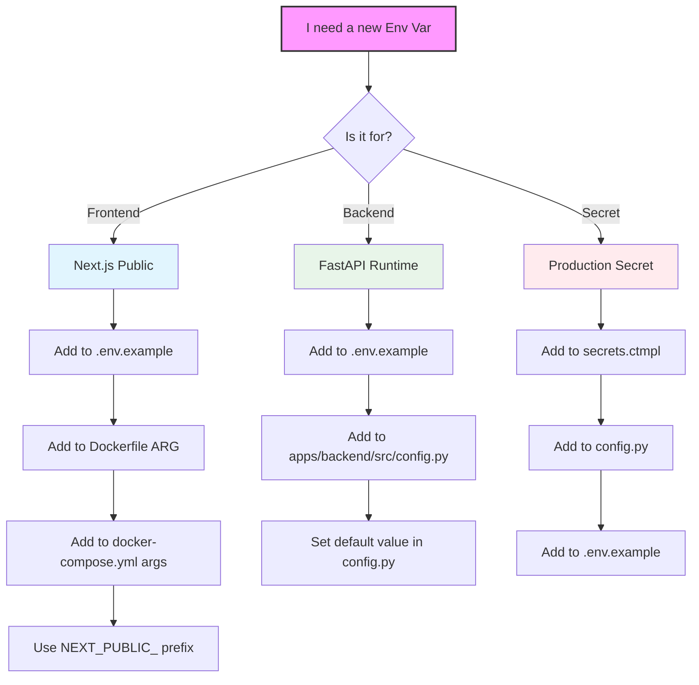

# Development Environment SSOT

> **SSOT Key**: `development`
> **Source of Truth** for local development, testing, CI, and deployment.

## Source Files

### Prerequisites
- **Node.js**: v20+ (Managed by system, not moon)
- **pnpm/npm**: Required for frontend dependencies
- **Python**: v3.12+ (Managed by uv)

| File | Purpose |
|------|---------|
| `moon.yml` | Root workspace tasks |
| `apps/*/moon.yml` | Per-project tasks |
| `scripts/test_lifecycle.py` | Database lifecycle (Python Context Manager) |
| `scripts/smoke_test.sh` | Unified smoke tests |
| `docker-compose.yml` | Development service containers |
| `.github/workflows/ci.yml` | GitHub Actions CI |
| `.github/workflows/staging-deploy.yml` | Staging Build & Deploy |
| `.github/workflows/production-release.yml` | Production Release |

---

## Moon Commands (Primary Interface)


```bash
# Development
moon run backend:dev        # Full Stack (App + DB + Redis + MinIO)
moon run frontend:dev       # Next.js on :3000

# Local CI / Verification (Recommended)
moon run :ci                # One-button check (Lint + Format + Test + Check)
                            # Matches GitHub CI exactly.

# Testing
moon run :test              # All tests
moon run backend:test       # Backend tests (auto-manages DB)

# Environment Verification
# (See docs/ssot/env_smoke_test.md for full details)
uv run python -m src.boot --mode full  # Full Stack Check (Gate 3)

# Code Quality
moon run :lint              # Lint all
moon run backend:format     # Format Python (auto-fix)
moon run backend:format     # Format Python

# Build
moon run :build             # Build all
```

---

## Documentation

The project uses [MkDocs](https://www.mkdocs.org/) with Material theme for documentation.

### Build & Serve Docs

```bash
# Install dependencies
pip install -r docs/requirements.txt

# Serve docs locally with live reload
mkdocs serve
# → Open http://127.0.0.1:8000

# Build static site
mkdocs build
# → Output: site/ directory
```

### Documentation Structure

| Path | Content |
|------|---------|
| `docs/` | Source markdown files |
| `mkdocs.yml` | MkDocs configuration |
| `site/` | Generated static site (gitignored) |

The live documentation is hosted at [wangzitian0.github.io/finance_report](https://wangzitian0.github.io/finance_report/).

---

## Six Scenarios

> **Core Principle**: "Shift Left" for speed (Code Runtime), "Shift Right" for stability (Infrastructure).

### Strategy Overview

| Environment | **1. Code Runtime** | **2. Infrastructure** (DB/Redis/S3) | **3. Compose File** | **4. Lifecycle** | **5. Responsibility** |
| :--- | :--- | :--- | :--- | :--- | :--- |
| **Local Dev** | **Source (Host)**<br>*(uvicorn / next dev)* | **Docker Container**<br>*(Singleton)* | `docker-compose.yml`<br>*(Profile: infra)* | **Persistent**<br>*(Manual start/stop)* | Developer<br>`moon run :infra` |
| **Local CI** | **Source (Host)**<br>*(pytest)* | **Docker Container**<br>*(Reuse Local Dev)* | `docker-compose.yml`<br>*(Profile: infra)* | **Ephemeral**<br>*(Test data reset)* | Developer<br>`moon run :test` |
| **Github CI** | **Source (Runner)**<br>*(pytest)* | **Docker Container**<br>*(Ephemeral Service)* | `docker-compose.yml`<br>*(Profile: infra)* | **Ephemeral**<br>*(Job duration)* | CI Pipeline<br>`ci.yml` |
| **Github PR** | **Source Build**<br>*(Docker build .)* | **Docker Container**<br>*(Per PR Isolated)* | `docker-compose.yml`<br>*(Profile: infra+app)* | **Ephemeral**<br>*(Destroy on PR close)* | Dokploy<br>(Preview) |
| **Staging** | **Docker Image**<br>*(GHCR Pull)* | **Shared Platform (Prod)**<br>*(SigNoz/MinIO)*<br>+ **Dedicated DB/Redis** | `docker-compose.yml`<br>*(Profile: app)* | **Persistent**<br>*(Stable Env)* | Ops / Dokploy<br>(Staging) |
| **Production**| **Docker Image**<br>*(GHCR Pull)* | **Shared Platform (Prod)**<br>*(SigNoz/MinIO)*<br>+ **Dedicated DB/Redis** | `docker-compose.yml`<br>*(Profile: app)* | **Persistent**<br>*(Stable Env)* | Ops / Dokploy<br>(Production) |

### Shared Platform Strategy (Singleton)

To reduce resource overhead, the **Platform** layer (SigNoz, MinIO, Traefik) runs as a **Singleton** in Production. Non-production environments (Staging, PRs) connect to these shared services with strict **Logical Isolation**.

| Service | Scope | Isolation Strategy | Config |
|---------|-------|--------------------|--------|
| **SigNoz** | Singleton (Prod) | `deployment.environment` tag | `OTEL_RESOURCE_ATTRIBUTES` |
| **MinIO** | Singleton (Prod) | Separate Buckets | `S3_BUCKET=finance-report-staging` |
| **Postgres** | Dedicated | Separate Instance/Container | Managed by `infra2` |
| **Redis** | Dedicated | Separate Instance/Container | Managed by `infra2` |

> **Note**: PR Environments spin up their own ephemeral MinIO/DB/Redis to allow destructive testing, but send logs to Shared SigNoz.

### Test Categories

| Category | Where | Purpose |
|----------|-------|---------|
| **Unit + Integration** | Local, CI | Fast feedback and quality gate |
| **Health Check** | PR Test, Prod | Verify service availability |
| **Smoke Test** | Staging | End-to-end functional validation |
| **Performance** | Staging | API response time baseline |

### Scenario Matrix

| # | Scenario | Trigger | Tests | Goal |
|---|----------|---------|-------|------|
| 1 | **Local Dev** | Manual | None | Iteration speed |
| 2 | **Local Test** | `moon run backend:test` | Unit+Integration | < 30s feedback |
| 3 | **Remote CI** | PR / Push | Unit+Integration | Quality gate |
| 4 | **PR Test** | PR opened | **Health Check** | Deployment validation |
| 5 | **Staging** | Push to main | **Smoke + Perf** | Full validation |
| 6 | **Production** | Manual dispatch | **Health Check** | Minimal validation |

### pytest Markers

| Marker | Description | Where |
|--------|-------------|-------|
| (none) | Standard tests | Local, CI |
| `@pytest.mark.slow` | Performance tests | Manual only |

> **Note:** Slow tests are skipped by default via `-m 'not slow'` in `pyproject.toml`.
> Run all tests: `uv run pytest -m ""`

### Coverage Gate

- Backend line coverage must be **>= 95%** (`pytest-cov` enforces via `--cov-fail-under=95`).
- **Long-term target: 97%** (see [TDD Transformation Plan](./tdd.md) - will be enforced once coverage improves)
- Branch coverage also enforced via `--cov-branch` flag for stricter quality.
- Current threshold: 95% (temporary), Target: 97% (long-term goal)

### Workflow Diagram

```
┌─────────────────────────────────────────────────────────────────┐
│ Scenario 1-3: Local/CI                                          │
│ ┌─────────┐    ┌─────────┐                                     │
│ │ DB auto │ -> │ pytest  │  (Unit+Integration, fast)           │
│ └─────────┘    └─────────┘                                     │
├─────────────────────────────────────────────────────────────────┤
│ Scenario 4: PR Test                                             │
│ ┌─────────┐    ┌─────────┐    ┌─────────┐                      │
│ │ Build   │ -> │ Deploy  │ -> │ Health  │  (deployment check)  │
│ │ source  │    │ Dokploy │    │ Check   │                      │
│ └─────────┘    └─────────┘    └─────────┘                      │
├─────────────────────────────────────────────────────────────────┤
│ Scenario 5: Staging (FULL VALIDATION)                           │
│ ┌─────────┐    ┌─────────┐    ┌─────────┐    ┌─────────┐      │
│ │ Build   │ -> │ Deploy  │ -> │ Smoke   │ -> │ Perf    │      │
│ │ images  │    │ Dokploy │    │ Test    │    │ Bench   │      │
│ └─────────┘    └─────────┘    └─────────┘    └─────────┘      │
├─────────────────────────────────────────────────────────────────┤
│ Scenario 6: Production (MINIMAL RISK)                           │
│ ┌─────────┐    ┌─────────┐    ┌─────────┐                      │
│ │ Verify  │ -> │ Deploy  │ -> │ Health  │  (availability only) │
│ │ image   │    │ Dokploy │    │ Check   │                      │
│ └─────────┘    └─────────┘    └─────────┘                      │
└─────────────────────────────────────────────────────────────────┘
```

---

## Database Lifecycle

### Database Management (Python Context Manager)

The `scripts/test_lifecycle.py` script uses a Python Context Manager (`@contextmanager`) to robustly handle the database lifecycle:

1.  **Setup**: Checks for the container runtime (Podman/Docker), starts the `postgres` service via Docker Compose, and ensures the database is ready.
2.  **Isolation**: Creates a dedicated `finance_report_test` database and runs migrations.
3.  **Teardown**: Automatically stops the database container after tests complete, ensuring resources are freed.
4.  **Signal Handling**: Catches `SIGINT` (Ctrl+C) and `SIGTERM` to perform cleanup even if the test run is interrupted.


### Local Test Isolation (Branch Suffix)

- Set `BRANCH_NAME=<branch_name>` to namespace test resources for local runs.
- Use `WORKSPACE_ID=<id>` to isolate multiple working copies on the same branch (defaults to the last 8 characters of a repo-path checksum if omitted, so collisions are still possible).
- The test DB container name and lock/state files include the branch suffix (and workspace id when set).
- If `POSTGRES_PORT` is not set, a deterministic port is derived from the branch suffix (range: 5400-5999).
- Test runs track whether the DB container was created or just started, and only remove containers they created.
- The postgres service binds to `127.0.0.1:${POSTGRES_PORT:-5432}`; ensure unique ports when running multiple repos in parallel.

### Key Features

1. **Auto-detect runtime**: podman compose / docker compose
2. **Lock file**: `~/.cache/finance_report/db.lock`
3. **Auto-cleanup**: Last runner stops container

---

## Resource Lifecycle Management

All resources are bound to either **dev server lifecycle** (Ctrl+C) or **test lifecycle** (start/end).

### Dev Server Lifecycle (`scripts/dev_*.py`)

```
┌─────────────────────────────────────────────────────────────────┐
│ User runs: moon run backend:dev                                 │
│ ┌─────────┐    ┌─────────┐    ┌─────────┐                      │
│ │ Start   │ -> │ Server  │ -> │ Ctrl+C  │                      │
│ │ Stack   │    │ Runs    │    │ Cleanup │                      │
│ └─────────┘    └─────────┘    └─────────┘                      │
│      │                               │                          │
│  (DB,Redis,MinIO)              Stops: uvicorn (PID)             │
│                                       (Containers persist)      │
└─────────────────────────────────────────────────────────────────┘
```

**Key safety feature**: Scripts track processes by PID, only kill what THEY started.
Safe for multi-window development - won't kill other sessions' processes.

**Resources managed by dev scripts:**
| Script | Resources Started | Cleaned up on Ctrl+C |
|--------|-------------------|---------------------|
| `dev_backend.py` | uvicorn (PID), **Full Stack Containers** | ✓ uvicorn only (Containers stay for speed) |
| `dev_frontend.py` | Next.js (PID tracked) | ✓ Only ours |

### Test Lifecycle (`scripts/test_lifecycle.py`)

```
┌─────────────────────────────────────────────────────────────────┐
│ User runs: moon run backend:test                                │
│ ┌─────────┐    ┌─────────┐    ┌─────────┐    ┌─────────┐      │
│ │ Start   │ -> │ Create  │ -> │ pytest  │ -> │ Cleanup │      │
│ │ DB      │    │ test DB │    │ runs    │    │ (trap)  │      │
│ └─────────┘    └─────────┘    └─────────┘    └─────────┘      │
│                                                   │             │
│                          Stops: DB (if refcount=0), playwright  │
└─────────────────────────────────────────────────────────────────┘
```

**Resources managed by test script:**
| Resource | Start | Stop |
|----------|-------|------|
| Test DB container | Before tests | After last test runner exits |
| Playwright driver | By pytest | Cleanup on test end |
| Child processes | By pytest | `pkill -P $$` on exit |


## Smoke Tests (scripts/smoke_test.sh)

### Usage

```bash
# Local (after starting servers)
moon run :smoke

# Against staging/prod
BASE_URL=https://report.zitian.party bash scripts/smoke_test.sh
```

### Endpoints Tested

| Endpoint | Check |
|----------|-------|
| `/` | Homepage loads |
| `/api/health` | Returns "healthy" |
| `/api/docs` | Swagger UI loads |
| `/ping-pong` | Demo page loads |
| `/reconciliation` | Workbench loads |
| `/api/ping` | Ping API responds |

---

## Deployment Architecture

### Dual-Repository Model

Finance Report uses **two git repositories** for configuration:

| Environment | Configuration Source | Purpose |
|-------------|---------------------|---------|
| **Local/CI/PR** | `/docker-compose.yml` | Development + PR previews |
| **Staging/Production** | `/repo/finance_report/.../compose.yaml` | Production with Vault secrets |

The `/repo/` directory is a git submodule pointing to [`infra2`](https://github.com/wangzitian0/infra2) (infrastructure repo).

**Key implications**:
- Workflows build images and trigger deployments
- Actual deployment config managed in `infra2`
- Env vars for staging/prod stored in HashiCorp Vault
- Container names include env suffix (e.g., `-staging`)

### Secret Injection Flow

Production deployments use Vault sidecar pattern:

```
1. Dokploy pulls compose.yaml from infra2
2. vault-agent sidecar starts → renders /secrets/.env
3. Backend waits for secrets (CHECKPOINT-1)
4. Alembic runs migrations (CHECKPOINT-2)
5. Uvicorn starts application (CHECKPOINT-3)
```

Health check timeout (6min) accounts for this entire flow.

### Container Naming

| Environment | Backend | Database |
|-------------|---------|----------|
| Local/CI | `finance-report-backend` | `finance-report-db` |
| PR #47 | `finance-report-backend-pr-47` | `finance-report-db-pr-47` |
| Staging | `finance_report-backend-staging` | `finance_report-postgres-staging` |
| Production | `finance_report-backend` | `finance_report-postgres` |

**Note**: Local uses hyphens (Compose), prod uses underscores (Dokploy).

---

## CI Workflows

### ci.yml (PR/push)

```
Trigger: PR or push to main
Steps:  install → lint → test
DB:     GitHub services (ephemeral)
Smoke:  ❌ Not run (unit tests only)
Note:   Uses moon tasks for install/lint/build (uv/npm invoked via moon)
```

### Deployment Workflows

**Helper scripts**: `scripts/dokploy_deploy.sh`, `scripts/health_check.sh`

#### staging-deploy.yml

```yaml
Trigger: Push to main (apps/** changed)
Flow: Build (commit SHA) → Deploy → Health (6min) → E2E tests
URL: https://report-staging.zitian.party
```

#### production-release.yml

```yaml
Triggers:
  - Tag push (v*.*.*): Build release images
  - Manual dispatch: Deploy to production

Build job: Tag → Build backend + frontend → Push to GHCR
Deploy job: Verify images → Deploy → Health (4min) → Smoke test

URL: https://report.zitian.party
```

### Version Release Workflow

**Manual control** for stable releases and cherry-picks:

```bash
# Create release tag
git tag -a v1.2.3 -m "Release v1.2.3"
git push origin v1.2.3
# → Triggers production-release.yml (build job)
# → Images: ghcr.io/.../finance_report-{backend,frontend}:v1.2.3

# Deploy to production (manual)
# → Actions → Production Release → Run workflow → Select v1.2.3
```

**Hotfix flow**:
```bash
git checkout -b hotfix/bug v1.2.3
git cherry-pick abc123
git tag -a v1.2.4 -m "Hotfix: critical bug"
git push origin v1.2.4
# → Build automatically, deploy manually
```

### Deployment Failures

| Symptom | Cause | Resolution |
|---------|-------|------------|
| Stuck "Waiting for secrets" | Vault token expired | `invoke vault.setup-tokens --project=finance_report` |
| 6min timeout | Migration failed | Check SigNoz for CHECKPOINT-2 errors |
| "Image not found" | Tag not built | `git push origin v1.2.3` to trigger build |
| 502 Bad Gateway | Backend crashed | Check CHECKPOINT-3 in SigNoz logs |

### Vault Token Lifecycle

Staging and production deployments use HashiCorp Vault for secrets management. The `vault-agent` sidecar renders secrets to `/secrets/.env` using an app token.

#### Token Properties

| Property | Value |
|----------|-------|
| Token TTL | 768 hours (~32 days) |
| Secrets file path | `/secrets/.env` |
| Staleness threshold | 1 hour (bootloader warning) |

#### Check Token Status

```bash
# SSH into VPS
ssh root@$VPS_HOST

# Check vault-agent logs for token issues
docker logs finance_report-vault-agent-staging 2>&1 | tail -20

# Check if secrets file exists and when it was last modified
docker exec finance_report-backend-staging ls -la /secrets/.env
```

#### Regenerate Tokens

When a token expires, the vault-agent cannot refresh secrets, causing the backend to hang at "Waiting for secrets".

```bash
# From local machine with infra2 repo
cd /path/to/infra2

# Regenerate tokens (requires Vault root access)
invoke vault.setup-tokens --project=finance_report

# Restart vault-agent to pick up new token
ssh root@$VPS_HOST "docker restart finance_report-vault-agent-staging"
```

#### Monitoring (Bootloader Check)

The bootloader includes a `_check_vault_secrets()` method that runs in FULL mode:

1. **Missing secrets file**: Warning with regeneration instructions
2. **Stale secrets file** (>1 hour old): Warning that vault-agent may have stopped
3. **Fresh secrets file**: OK status with last modified time

This check runs during smoke tests (`moon run :smoke`) and provides early warning of token issues.

---

## Deployment Architecture

### Environment Flow

```
┌─────────────────────────────────────────────────────────────────┐
│ Development Flow                                                 │
│                                                                  │
│   Local Dev        PR/Branch           Staging         Prod     │
│   ┌─────────┐      ┌─────────┐      ┌─────────┐    ┌─────────┐ │
│   │ docker  │  →   │ CI test │  →   │ Auto on │ →  │ Manual  │ │
│   │ compose │      │ + PR    │      │ main    │    │ tag +   │ │
│   │         │      │ preview │      │ merge   │    │ dispatch│ │
│   └─────────┘      └─────────┘      └─────────┘    └─────────┘ │
│                                                                  │
│   docker-compose   pr-test.yml      staging-       production-  │
│   .yml             ci.yml           deploy.yml     release.yml  │
└─────────────────────────────────────────────────────────────────┘
```

### Database Migrations Testing Strategy

Migrations are tested at multiple stages:

1. **Local Development**: Manual testing with `alembic upgrade head` before committing
2. **GitHub CI**: pytest validates model definitions and constraints
3. **Staging Deployment**: First automated test of migrations via entrypoint
4. **Production Deployment**: Only after staging validation

Before deploying schema changes:
- Test locally: `cd apps/backend && alembic upgrade head`
- Ensure backward-compatible migrations (for rollback)
- Consider: existing data, indexes, constraints

### Staging Deployment (Automatic)

Staging deploys automatically when:
1. Push to `main` branch
2. Changes in `apps/backend/**` or `apps/frontend/**`

The workflow (`staging-deploy.yml`):
1. Builds images with commit SHA tag
2. Pushes to GHCR
3. Deploys to Dokploy staging
4. Runs health check + E2E tests

### Production Deployment (Manual)

Production deployment is a two-step process:

1. **Build**: Create a git tag (triggers `production-release.yml`)
```bash
git tag -a v1.2.3 -m "Release v1.2.3"
git push origin v1.2.3
# → Builds images: ghcr.io/.../finance_report-{backend,frontend}:v1.2.3
```

2. **Deploy**: Manual workflow dispatch
```bash
# Via GitHub Actions UI:
# Actions → "Production Release" → Run workflow → Select tag

# Or via gh CLI:
gh workflow run production-release.yml
```

The deploy job:
1. Verifies images exist in GHCR
2. Deploys to Dokploy production
3. Runs health check + smoke tests

### Database Migrations

Migrations run automatically on container startup via the entrypoint:

```yaml
# In infra2 compose.yaml
entrypoint:
  - sh
  - -c
  - |
    cd /app && export PYTHONPATH=/app
    # Wait for secrets...
    alembic upgrade head  # ← Runs migrations
    exec uvicorn src.main:app --host 0.0.0.0 --port 8000
```

**Important**: Before deploying schema changes:
1. Test migration locally with `docker-compose.yml`
2. Ensure migration is backward-compatible (for rollback)
3. Consider: existing data, indexes, constraints

---

## Environment Variables

| Scenario | DATABASE_URL | Hostname Strategy |
|----------|--------------|-------------------|
| Local Dev | `postgresql+asyncpg://...` | `localhost` or `postgres` |
| Local Test | `postgresql+asyncpg://...` | `localhost:5432` |
| PR Test | `postgresql+asyncpg://...` | **Unique**: `finance-report-db-pr-XX` |
| CI | Same as Local Test | `localhost:5433` (services) |
| Staging/Prod | External PostgreSQL | Dokploy Managed |

---

## Verification

```bash
# Verify moon commands work
moon run backend:test

# Test smoke tests locally
nohup moon run backend:dev > /dev/null 2>&1 &
sleep 10
export BASE_URL="http://localhost:8000"
moon run :smoke

# Check no orphan containers after tests
podman ps | grep finance_report
```

---

## Engineering Standards

### Environment Variable Lifecycle

Variables follow a strict "Bake vs. Runtime" flow:



1.  **Frontend (Next.js)**:
    *   Variables prefixed with `NEXT_PUBLIC_` are "baked" into the static JS bundle during `npm run build`.
    *   **Requirement**: These MUST be defined as `ARG` in `apps/frontend/Dockerfile`.
    *   **Requirement**: They must also be passed in `docker-compose.yml` under `args`.
2.  **Backend (FastAPI)**:
    *   Variables are loaded at runtime via Pydantic Settings.
    *   **Requirement**: All variables must have a type and default in `apps/backend/src/config.py`.
    *   **Requirement**: Must be documented in `.env.example`.
3.  **Production (Vault)**:
    *   Secrets are stored in Vault and rendered by `vault-agent` using `secrets.ctmpl`.
    *   **Consistency**: CI runs `scripts/check_env_keys.py` to ensure `secrets.ctmpl`, `config.py`, and `.env.example` are aligned.

### Cross-Repo Synchronization

The `repo/` directory is a submodule pointing to `infra2`.

*   **Logic**: Main Repo (`finance_report`).
*   **Infrastructure**: Submodule (`infra2`).
*   **Workflow**:
    1.  If a change requires a new environment variable or a change to `docker-compose.yml` labels/configs for production:
    2.  Create a branch in `repo/`.
    3.  Commit changes to `repo/finance_report/finance_report/10.app/`.
    4.  Push and create a PR in `infra2`.
    5.  Once merged, update the submodule pointer in the Main Repo PR.
