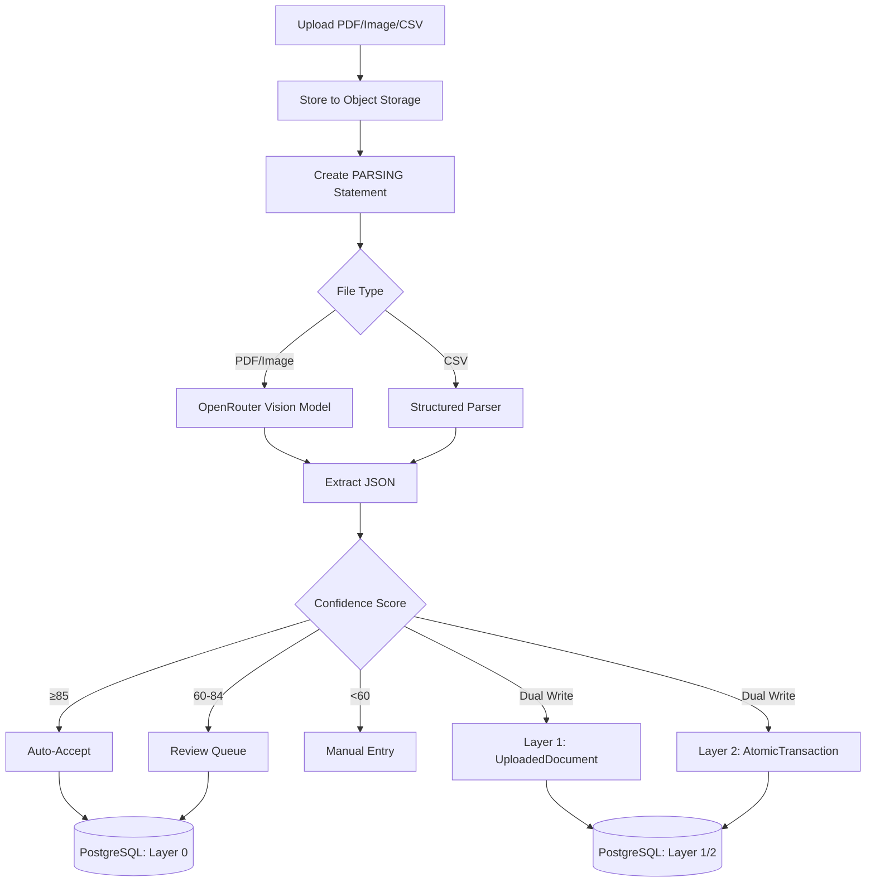

# Document Extraction SSOT

This document defines the Single Source of Truth for the document extraction feature.

## Overview

The extraction pipeline parses financial statements (PDFs, images, CSVs) using a single OpenRouter vision model (default `PRIMARY_MODEL`), outputting structured transaction data with confidence scoring. PDFs are sent to the model via public URLs (no base64), while images can use URLs or inline data when necessary. Uploads immediately create a `parsing` record, and a background worker updates the statement once parsing completes.

## Data Flow



## Data Models

### Layer 1 & 2 (EPIC-011 Migration)

The system is currently migrating to a 4-layer architecture. During Phase 2, data is written to both the legacy `BankStatement` tables (Layer 0) and the new Layer 1/2 tables.

**Layer 1: Raw Documents (`UploadedDocument`)**
- Stores immutable metadata for every uploaded file
- Maps to `DocumentType`: `bank_statement`, `brokerage_statement`, `esop_grant`, `property_appraisal`
- Status tracking: `uploaded` → `processing` → `completed`

**Layer 2: Atomic Data (`AtomicTransaction`, `AtomicPosition`)**
- Deduplicated via SHA256 hash of core fields
- `source_documents` (JSONB) tracks lineage (which files contributed this record)
- Immutable once written (except for appending sources)

### Layer 0 (Legacy)

### BankStatement

| Field | Type | Description |
|-------|------|-------------|
| `id` | UUID | Primary key |
| `user_id` | UUID | Owner user |
| `account_id` | UUID | Linked account (nullable in MVP) |
| `file_path` | str | Object storage key (S3/MinIO) |
| `file_hash` | str | SHA256 for dedup |
| `original_filename` | str | User-provided name |
| `institution` | str | Bank/broker/fintech (DBS, CMB, Wise) |
| `account_last4` | str | Last 4 digits |
| `currency` | str | ISO currency code |
| `period_start` | date | Statement start |
| `period_end` | date | Statement end |
| `opening_balance` | Decimal | Beginning balance |
| `closing_balance` | Decimal | Ending balance |
| `status` | enum | uploaded, parsing, parsed, approved, rejected |
| `confidence_score` | int | 0-100 |
| `balance_validated` | bool | Opening + txns ≈ closing |
| `validation_error` | str | Optional validation failure details |

**Parsing state note**: `currency`, `period_start`, `period_end`, `opening_balance`, `closing_balance`,
`confidence_score`, and `balance_validated` are nullable while status is `parsing`.

### BankStatementTransaction

| Field | Type | Description |
|-------|------|-------------|
| `id` | UUID | Primary key |
| `statement_id` | UUID | FK to BankStatement |
| `txn_date` | date | Transaction date |
| `description` | str | Merchant/purpose |
| `amount` | Decimal | Absolute value |
| `direction` | str | IN or OUT |
| `reference` | str | Optional reference |
| `status` | enum | pending / matched / unmatched |
| `confidence` | enum | high / medium / low |
| `confidence_reason` | str | Confidence reasoning |
| `raw_text` | str | Original OCR text |
| `updated_at` | datetime | Update time |

## Confidence Scoring

| Factor | Weight | Criteria |
|--------|--------|----------|
| Balance Check | 40% | opening + Σtxn ≈ closing (±0.1) |
| Field Completeness | 30% | Required fields present |
| Format Consistency | 20% | Valid date/amount formats |
| Transaction Count | 10% | Reasonable (1-500) |

**Thresholds**:
- ≥85: Auto-accept
- 60-84: Review queue
- <60: Manual entry required

## API Endpoints

| Method | Path | Description |
|--------|------|-------------|
| POST | `/api/statements/upload` | Upload document and enqueue parsing (202 Accepted) |
| GET | `/api/statements` | Statement list |
| GET | `/api/statements/{id}` | Get statement with transactions |
| GET | `/api/statements/{id}/transactions` | Transaction list |
| GET | `/api/statements/pending-review` | List items needing review |
| POST | `/api/statements/{id}/approve` | Approve statement |
| POST | `/api/statements/{id}/reject` | Reject statement |
| GET | `/api/ai/models` | OpenRouter model catalog for UI selection |

## Supported Institutions

| Institution | Format | Tier | Notes |
|-------------|--------|------|-------|
| DBS/POSB | PDF | v1 | Singapore bank, GIRO/PayNow |
| CMB (China Merchants Bank) | PDF | v1 | Chinese statements |
| Maybank | PDF | v1 | Malaysia bank |
| Wise | PDF/CSV | v1 | Fintech wallet |
| Brokerage (generic) | PDF/CSV | v1 | Covers Moomoo/IBKR style |
| Insurance (generic) | PDF | v1 | Policy statements |
| OCBC | PDF | Extended | Singapore bank |
| MariBank | PDF | Extended | Digital bank |
| GXS | PDF | Extended | Digital bank |
| Futu (Futu Holdings) | PDF | Extended | HK brokerage |

## Configuration

Required environment variables:
```bash
OPENROUTER_API_KEY=<YOUR_OPENROUTER_API_KEY>
PRIMARY_MODEL=google/gemini-3-flash-preview
FALLBACK_MODELS=qwen/qwen-2.5-vl-7b-instruct:free,nvidia/nemotron-nano-12b-v2-vl:free
OPENROUTER_DAILY_LIMIT_USD=2
S3_ENDPOINT=http://localhost:9000
S3_ACCESS_KEY=minio
S3_SECRET_KEY=<YOUR_S3_SECRET_KEY>
S3_BUCKET=statements
S3_REGION=us-east-1
S3_PRESIGN_EXPIRY_SECONDS=300

# EPIC-011 Migration Flags
ENABLE_4_LAYER_WRITE=false  # Enable writing to Layer 1/2 tables
ENABLE_4_LAYER_READ=false   # Enable reading from Layer 2 (Future)
```

## Parsing Resilience

- **Bucket auto-create**: storage ensures the bucket exists before upload.
- **Orphan cleanup**: if DB persistence fails after upload, the uploaded object is deleted.
- **Stuck job supervisor**: statements stuck in `parsing` longer than 30 minutes are marked `rejected`
  with a validation error so users can retry.

## Model Selection

- **Default**: Uses `PRIMARY_MODEL` for parsing.
- **Upload requirement**: `/api/statements/upload` requires a `model` form field for PDF/image uploads.
  - **No validation at upload**: Model is accepted as-is without checking against OpenRouter catalog.
  - **Validation happens during parsing**: If model is invalid or unavailable, the parsing task fails (statement marked `REJECTED`).
  - **Rationale**: Avoids upload failures due to external API (OpenRouter) downtime or rate limits.
- **Retry**: `/api/statements/{id}/retry` accepts a `model` query parameter (always used as-is, no validation).
- **Catalog**: `/api/ai/models` returns the OpenRouter catalog for UI dropdowns (for model selection only).
- **Fallback models**: `FALLBACK_MODELS` are for manual selection only; parsing does not automatically retry other models.

## Data Integrity & Typing

To prevent floating-point errors (e.g. `0.1 + 0.2 != 0.3`), the system enforces strict typing:

1.  **AI Output**: The LLM prompt must request a strict JSON object (no markdown or extra text).
2.  **Pydantic Validation**:
    -   **NEVER** use `float` for `amount` fields.
    -   Use `Decimal` with strict mode or string coercion. See: `apps/backend/tests/accounting/test_decimal_safety.py`
    -   Example: `amount: Decimal = Field(decimal_places=2)`
3.  **Database Storage**: Stored as `DECIMAL(18,2)`.

> **Float Ban**: Any code found using `float` for currency calculation will be rejected by CI.

## Files

| File | Purpose |
|------|---------|
| `src/models/statement.py` | SQLAlchemy models |
| `src/schemas/extraction.py` | Pydantic schemas |
| `src/services/extraction.py` | Core extraction logic |
| `src/services/validation.py` | Validation and confidence scoring |
| `src/services/storage.py` | Object storage uploads + presigned URLs |
| `src/prompts/statement.py` | Parsing prompt templates |
| `tests/fixtures/*.json` | Parsed test data |
| `scripts/generate_fixtures.py` | Parse docs with caching |
| `scripts/sanitize_fixtures.py` | Mask PII |
