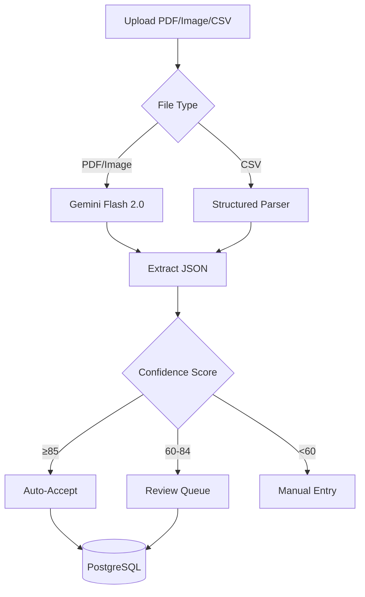

# Document Extraction SSOT

This document defines the Single Source of Truth for the document extraction feature.

## Overview

The extraction pipeline parses financial statements (PDFs, images, CSVs) using Gemini Flash 2.0 via OpenRouter, outputting structured transaction data with confidence scoring.

## Data Flow



## Data Models

### Statement

| Field | Type | Description |
|-------|------|-------------|
| `id` | UUID | Primary key |
| `file_path` | str | S3 key |
| `file_hash` | str | SHA256 for dedup |
| `original_filename` | str | User-provided name |
| `institution` | str | Bank/broker (DBS, Moomoo, CMB) |
| `account_last4` | str | Last 4 digits |
| `currency` | str | ISO currency code |
| `period_start` | date | Statement start |
| `period_end` | date | Statement end |
| `opening_balance` | Decimal | Beginning balance |
| `closing_balance` | Decimal | Ending balance |
| `status` | enum | UPLOADED, PARSING, PARSED, APPROVED, REJECTED |
| `confidence_score` | int | 0-100 |
| `balance_validated` | bool | Opening + txns ≈ closing |

### AccountEvent

| Field | Type | Description |
|-------|------|-------------|
| `id` | UUID | Primary key |
| `statement_id` | UUID | FK to Statement |
| `txn_date` | date | Transaction date |
| `description` | str | Merchant/purpose |
| `amount` | Decimal | Absolute value |
| `direction` | str | IN or OUT |
| `reference` | str | Optional reference |
| `confidence` | enum | HIGH, MEDIUM, LOW |
| `raw_text` | str | Original OCR text |

## Confidence Scoring

| Factor | Weight | Criteria |
|--------|--------|----------|
| Balance Check | 40% | opening + Σtxn ≈ closing (±0.01) |
| Field Completeness | 30% | Required fields present |
| Format Consistency | 20% | Valid date/amount formats |
| Transaction Count | 10% | Reasonable (1-500) |

**Thresholds**:
- ≥85: Auto-accept
- 60-84: Review queue
- <60: Manual entry required

## API Endpoints

| Method | Path | Description |
|--------|------|-------------|
| POST | `/statements/upload` | Upload and parse document |
| GET | `/statements/{id}` | Get statement with events |
| GET | `/statements/pending-review` | List items needing review |
| POST | `/statements/{id}/approve` | Approve/reject statement |

## Supported Institutions

| Institution | Format | Notes |
|-------------|--------|-------|
| DBS | PDF | Singapore bank, GIRO/PayNow |
| MariBank | PDF | Digital bank, PayNow merchants |
| GXS | PDF | Digital bank, daily interest |
| Moomoo | PDF/CSV | Brokerage, SGD/USD/HKD |
| Futu (富途) | PDF | HK brokerage |
| CMB (招商银行) | PDF | Chinese, 中文 |
| IBKR | PDF | Activity statements |

## Configuration

Required environment variables:
```bash
OPENROUTER_API_KEY=sk-or-...
OPENROUTER_MODEL=google/gemini-2.5-flash-lite
S3_ENDPOINT=http://localhost:9000
S3_ACCESS_KEY=minio
S3_SECRET_KEY=minio123
S3_BUCKET=statements
```

## Files

| File | Purpose |
|------|---------|
| `src/models/statement.py` | SQLAlchemy models |
| `src/schemas/extraction.py` | Pydantic schemas |
| `src/services/extraction.py` | Core extraction logic |
| `src/prompts/statement.py` | Gemini prompt templates |
| `tests/fixtures/*.json` | Parsed test data |
| `scripts/generate_fixtures.py` | Parse docs with caching |
| `scripts/sanitize_fixtures.py` | Mask PII |
