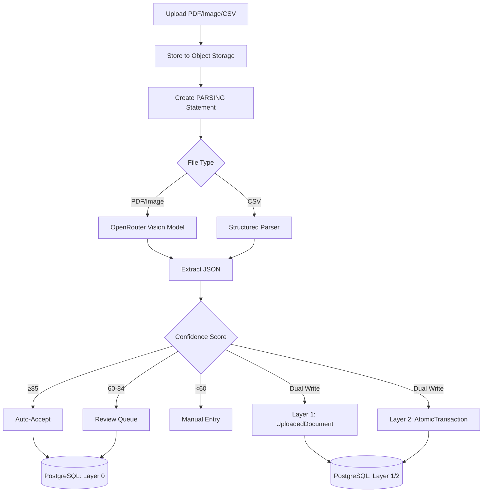

# Document Extraction (Source of Truth)

> **SSOT Key**: `extraction`
> **Purpose**: Statement parsing using AI vision models, transaction extraction, and confidence scoring.

---

## 1. Source of Truth

### Physical File Locations

| File | Purpose |
|------|---------|
| `src/models/statement.py` | SQLAlchemy models (BankStatement, BankStatementTransaction) |
| `src/schemas/extraction.py` | Pydantic schemas |
| `src/services/extraction.py` | Core extraction logic |
| `src/services/validation.py` | Validation and confidence scoring |
| `src/services/storage.py` | Object storage uploads + presigned URLs |
| `src/prompts/statement.py` | Parsing prompt templates |
| `tests/fixtures/*.json` | Parsed test data |
| `scripts/generate_fixtures.py` | Parse docs with caching |
| `scripts/sanitize_fixtures.py` | Mask PII |

### Overview

The extraction pipeline parses financial statements (PDFs, images, CSVs) using OpenRouter vision models (default `PRIMARY_MODEL`), outputting structured transaction data with confidence scoring. PDF/image files are uploaded to object storage and sent to the models via URLs. Uploads immediately create a `parsing` record, and a background worker updates the statement once parsing completes.

---

## 2. Architecture Model

### Data Flow



### Data Models

#### Layer 1 & 2 (EPIC-011 Migration)

The system is currently migrating to a 4-layer architecture. During Phase 2, data is written to both the legacy `BankStatement` tables (Layer 0) and the new Layer 1/2 tables.

**Layer 1: Raw Documents (`UploadedDocument`)**
- Stores immutable metadata for every uploaded file
- Maps to `DocumentType`: `bank_statement`, `brokerage_statement`, `esop_grant`, `property_appraisal`
- Status tracking: `uploaded` → `processing` → `completed`

**Layer 2: Atomic Data (`AtomicTransaction`, `AtomicPosition`)**
- Deduplicated via SHA256 hash of core fields
- `source_documents` (JSONB) tracks lineage (which files contributed this record)
- Immutable once written (except for appending sources)

#### Layer 0 (Legacy)

**BankStatement**

| Field | Type | Description |
|-------|------|-------------|
| `id` | UUID | Primary key |
| `user_id` | UUID | Owner user |
| `account_id` | UUID | Linked account (nullable in MVP) |
| `file_path` | str | Object storage key (S3/MinIO) |
| `file_hash` | str | SHA256 for dedup |
| `original_filename` | str | User-provided name |
| `institution` | str | Bank/broker/fintech (DBS, CMB, Wise) |
| `account_last4` | str | Last 4 digits |
| `currency` | str | ISO currency code |
| `period_start` | date | Statement start |
| `period_end` | date | Statement end |
| `opening_balance` | Decimal | Beginning balance |
| `closing_balance` | Decimal | Ending balance |
| `status` | enum | uploaded, parsing, parsed, approved, rejected |
| `confidence_score` | int | 0-100 |
| `balance_validated` | bool | Opening + txns ≈ closing |
| `validation_error` | str | Optional validation failure details |

**Parsing state note**: `currency`, `period_start`, `period_end`, `opening_balance`, `closing_balance`,
`confidence_score`, and `balance_validated` are nullable while status is `parsing`.

**BankStatementTransaction**

| Field | Type | Description |
|-------|------|-------------|
| `id` | UUID | Primary key |
| `statement_id` | UUID | FK to BankStatement |
| `txn_date` | date | Transaction date |
| `description` | str | Merchant/purpose |
| `amount` | Decimal | Absolute value |
| `direction` | str | IN or OUT |
| `reference` | str | Optional reference |
| `status` | enum | pending / matched / unmatched |
| `confidence` | enum | high / medium / low |
| `confidence_reason` | str | Confidence reasoning |
| `raw_text` | str | Original OCR text |
| `updated_at` | datetime | Update time |

### Confidence Scoring

| Factor | Weight | Criteria |
|--------|--------|----------|
| Balance Check | 40% | opening + Σtxn ≈ closing (±0.1) |
| Field Completeness | 30% | Required fields present |
| Format Consistency | 20% | Valid date/amount formats |
| Transaction Count | 10% | Reasonable (1-500) |

**Thresholds**:
- ≥85: Auto-accept
- 60-84: Review queue
- <60: Manual entry required

### API Endpoints

| Method | Path | Description |
|--------|------|-------------|
| POST | `/api/statements/upload` | Upload document and enqueue parsing (202 Accepted) |
| GET | `/api/statements` | Statement list |
| GET | `/api/statements/{id}` | Get statement with transactions |
| GET | `/api/statements/{id}/transactions` | Transaction list |
| GET | `/api/statements/pending-review` | List items needing review |
| POST | `/api/statements/{id}/approve` | Approve statement |
| POST | `/api/statements/{id}/reject` | Reject statement |
| GET | `/api/ai/models` | OpenRouter model catalog for UI selection |

### Supported Institutions

| Institution | Format | Tier | Notes |
|-------------|--------|------|-------|
| DBS/POSB | PDF | v1 | Singapore bank, GIRO/PayNow |
| CMB (China Merchants Bank) | PDF | v1 | Chinese statements |
| Maybank | PDF | v1 | Malaysia bank |
| Wise | PDF/CSV | v1 | Fintech wallet |
| Brokerage (generic) | PDF/CSV | v1 | Covers Moomoo/IBKR style |
| Insurance (generic) | PDF | v1 | Policy statements |
| OCBC | PDF | Extended | Singapore bank |
| MariBank | PDF | Extended | Digital bank |
| GXS | PDF | Extended | Digital bank |
| Futu (Futu Holdings) | PDF | Extended | HK brokerage |

---

## 3. Design Constraints

### Data Integrity & Typing

To prevent floating-point errors (e.g. `0.1 + 0.2 != 0.3`), the system enforces strict typing:

| Rule | Description |
|------|-------------|
| **Float Ban** | **NEVER** use `float` for `amount` fields — CI rejects `float` for currency |
| **Decimal Required** | **MUST** use `Decimal` with strict mode or string coercion |
| **Database Storage** | Stored as `DECIMAL(18,2)` |
| **AI Output** | LLM prompt must request monetary values as numbers or strings |

**Pydantic Example**:
```python
amount: Decimal = Field(decimal_places=2)
```

### Hard Rules

| Rule | Description |
|------|-------------|
| **Bucket Auto-Create** | Storage ensures the bucket exists before upload |
| **Orphan Cleanup** | If DB persistence fails after upload, the uploaded object is deleted |
| **Stuck Job Supervisor** | Statements stuck in `parsing` > 30 minutes are marked `rejected` |
| **Balance Tolerance** | 0.1 USD tolerance for balance validation |

### Model Selection

- **Default**: Uses `PRIMARY_MODEL` for parsing.
- **Override**: `/api/statements/upload` accepts a `model` form field to select a specific OpenRouter model.
- **Retry**: `/api/statements/{id}/retry` accepts a `model` query parameter.
- **Catalog**: `/api/ai/models` returns the OpenRouter catalog for UI dropdowns (filterable by modality).

---

## 4. Playbooks (SOP)

### Configuration

Required environment variables:

```bash
OPENROUTER_API_KEY=<YOUR_OPENROUTER_API_KEY>
PRIMARY_MODEL=google/gemini-2.0-flash-exp:free
FALLBACK_MODELS=google/gemini-flash-1.5-8b:free,mistralai/pixtral-12b:free
OPENROUTER_DAILY_LIMIT_USD=2
S3_ENDPOINT=http://localhost:9000
S3_ACCESS_KEY=minio
S3_SECRET_KEY=<YOUR_S3_SECRET_KEY>
S3_BUCKET=statements
S3_REGION=us-east-1
S3_PRESIGN_EXPIRY_SECONDS=900

# EPIC-011 Migration Flags
ENABLE_4_LAYER_WRITE=false  # Enable writing to Layer 1/2 tables
ENABLE_4_LAYER_READ=false   # Enable reading from Layer 2 (Future)
```

### Upload a Statement

```bash
# Upload PDF
curl -X POST http://localhost:8000/api/statements/upload \
  -H "X-User-Id: <user-uuid>" \
  -F "file=@statement.pdf"

# Response: 202 Accepted with statement ID
```

### Check Parsing Status

```bash
# Get statement with transactions
curl http://localhost:8000/api/statements/{id} \
  -H "X-User-Id: <user-uuid>"
```

### Retry Failed Parsing

```bash
# Retry with different model
curl -X POST "http://localhost:8000/api/statements/{id}/retry?model=google/gemini-flash-1.5-8b:free" \
  -H "X-User-Id: <user-uuid>"
```

### Generate Test Fixtures

```bash
# Parse real documents and cache results
python scripts/generate_fixtures.py --input docs/ --output tests/fixtures/

# Sanitize PII from fixtures
python scripts/sanitize_fixtures.py tests/fixtures/
```

### Handling Stuck Jobs

Statements stuck in `parsing` status for > 30 minutes are automatically marked as `rejected` by the supervisor. To manually check:

```bash
# Find stuck statements
SELECT id, original_filename, created_at 
FROM bank_statements 
WHERE status = 'parsing' 
  AND created_at < NOW() - INTERVAL '30 minutes';
```

---

## 5. Verification (The Proof)

### Upload Verification

```bash
# Upload a test statement
curl -X POST http://localhost:8000/api/statements/upload \
  -H "X-User-Id: test-user-uuid" \
  -F "file=@tests/fixtures/sample_statement.pdf"

# Expected: 202 Accepted
# Verify status changes from 'parsing' to 'parsed'
```

### Confidence Score Verification

```bash
# Check statement confidence
curl http://localhost:8000/api/statements/{id} \
  -H "X-User-Id: test-user-uuid" | jq '.confidence_score'

# Expected: 0-100 integer
```

### Balance Validation Verification

```bash
# Check balance validation
curl http://localhost:8000/api/statements/{id} \
  -H "X-User-Id: test-user-uuid" | jq '.balance_validated'

# Expected: true (if opening + transactions ≈ closing)
```

### Test Commands

```bash
# Run extraction tests
moon run backend:test -- -k extraction

# Test with coverage
moon run backend:test -- -k extraction --cov=src/services/extraction
```

### MinIO Health Check

```bash
# Verify MinIO is accessible
curl http://localhost:9000/minio/health/live

# Expected: HTTP 200
```

---

*Last updated: 2026-01-27*
