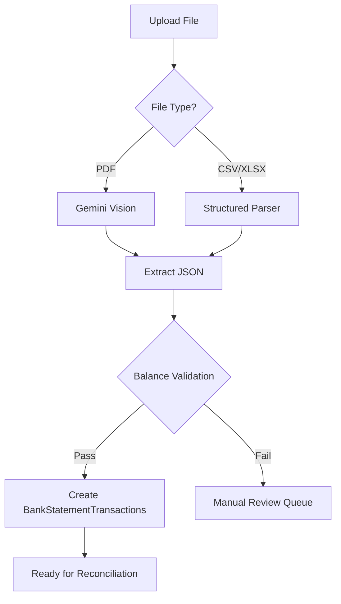

# Document Extraction SSOT

> **SSOT Key**: `extraction`
> **Core Definition**: Gemini Vision parsing pipeline, validation rules, and error handling.

---

## 1. Source of Truth

| Dimension | Physical Location (SSOT) | Description |
|-----------|--------------------------|-------------|
| **Parsing Logic** | `apps/backend/src/services/extraction.py` | Core extraction |
| **Prompt Templates** | `apps/backend/src/prompts/` | Gemini prompts |
| **Supported Types** | Config `SUPPORTED_STATEMENT_TYPES` | Statement types |

---

## 2. Supported Statement Types

| Institution | Format | Parser Status |
|-------------|--------|---------------|
| DBS Bank | PDF | 🟡 Planned |
| Moomoo | CSV | 🟡 Planned |
| Interactive Brokers | CSV | 🟡 Planned |
| CMB (招商银行) | PDF | 🟡 Planned |
| Generic CSV | CSV | 🟡 Planned |

---

## 3. Extraction Pipeline



---

## 4. Gemini Vision Prompt Design

### 4.1 System Prompt
```
You are a bank statement parser. Extract structured transaction data from the provided document image.

Output format (JSON):
{
  "institution": "Bank Name",
  "account_number_last4": "1234",
  "currency": "SGD",
  "period_start": "2025-01-01",
  "period_end": "2025-01-31",
  "opening_balance": "10000.00",
  "closing_balance": "12500.00",
  "transactions": [
    {
      "date": "2025-01-15",
      "description": "SALARY ACME CORP",
      "amount": "5000.00",
      "direction": "IN",
      "reference": "TXN123456"
    }
  ]
}

Rules:
- All amounts as strings with 2 decimal places
- Dates in YYYY-MM-DD format
- direction: "IN" for credits, "OUT" for debits
- Include ALL transactions visible in the document
```

### 4.2 Validation Prompt
```
Verify the extracted data:
1. opening_balance + sum(IN) - sum(OUT) ≈ closing_balance (tolerance: 0.01)
2. All dates within period_start and period_end
3. No missing required fields

If validation fails, explain the discrepancy.
```

---

## 5. Balance Validation

**Critical Gate**: No statement passes to reconciliation without balance validation.

```python
def validate_statement_balance(statement: ParsedStatement) -> ValidationResult:
    """
    Validate: opening + net_transactions ≈ closing
    Tolerance: 0.01 (absolute)
    """
    net = sum(
        t.amount if t.direction == "IN" else -t.amount
        for t in statement.transactions
    )
    expected_closing = statement.opening_balance + net
    diff = abs(statement.closing_balance - expected_closing)
    
    if diff <= Decimal("0.01"):
        return ValidationResult(valid=True)
    else:
        return ValidationResult(
            valid=False,
            error=f"Balance mismatch: expected {expected_closing}, got {statement.closing_balance}"
        )
```

---

## 6. Error Handling

| Error Type | Action | Retry? |
|------------|--------|--------|
| Gemini API timeout | Queue for retry | Yes (3x) |
| Balance validation failed | Manual review queue | No |
| Parsing format error | Log + manual review | No |
| Unsupported institution | Reject with message | No |

---

## 7. Design Constraints

### ✅ Recommended Patterns
- **Pattern A**: Parse → Validate → Store (never skip validation)
- **Pattern B**: Cache parsed results by file hash
- **Pattern C**: Log all Gemini requests/responses for debugging

### ⛔ Prohibited Patterns
- **Anti-pattern A**: **NEVER** create journal entries directly from parsing
- **Anti-pattern B**: **NEVER** auto-pass failed balance validation

---

## 8. Verification

| Behavior | Test Method | Status |
|----------|-------------|--------|
| PDF parsing | `test_parse_dbs_pdf` | ⏳ Pending |
| CSV parsing | `test_parse_moomoo_csv` | ⏳ Pending |
| Balance validation | `test_balance_validation` | ⏳ Pending |
| Error handling | `test_extraction_errors` | ⏳ Pending |

---

## Used by

- [reconciliation.md](./reconciliation.md)
- [schema.md](./schema.md)
