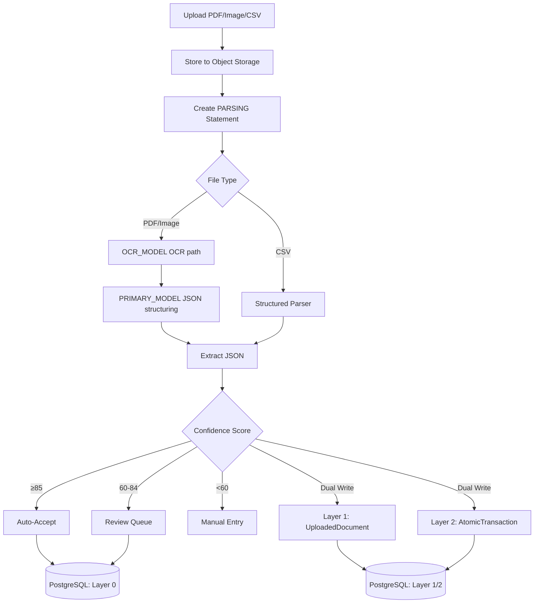

# Document Extraction SSOT

This document defines the Single Source of Truth for the document extraction feature.

## Overview

The extraction pipeline parses financial statements (PDFs, images, CSVs) with the configured AI provider. PDF/image uploads use `OCR_MODEL` (default `glm-4.6v`) as the OCR-capable model. When `OCR_MODEL` is a separate model from `VISION_MODEL`, the service uses the provider layout parser first, then structures Markdown with `PRIMARY_MODEL` (default `glm-5.1`). When `OCR_MODEL` equals `VISION_MODEL`, the service skips layout parsing and uses the shared vision OCR path directly. Z.AI PDF vision extraction renders the uploaded PDF bytes into a bounded set of in-memory PNG `image_url` payloads; short-lived external URLs are used only when no bytes are available. Inline base64 PDF payloads are reserved for dedicated layout parsing and non-Z.AI compatibility. JSON extraction disables GLM thinking by default and caps output tokens to keep provider latency bounded. Uploads immediately create a `parsing` record, and a background worker updates the statement once parsing completes.

## Data Flow


```mermaid
flowchart TB
    A[Upload PDF/Image/CSV] --> S[Store to Object Storage]
    S --> P[Create PARSING Statement]
    P --> B{File Type}
    B -->|PDF/Image| C["OCR_MODEL OCR path"]
    C --> C2["PRIMARY_MODEL JSON structuring"]
    B -->|CSV| D[Structured Parser]
    C2 --> E[Extract JSON]
    D --> E
    E --> F{Confidence Score}
    F -->|≥85| G[Auto-Accept]
    F -->|60-84| H[Review Queue]
    F -->|<60| I[Manual Entry]
    G --> J[(PostgreSQL: Layer 0)]
    H --> J
    
    %% EPIC-011 Dual Write
    F -->|Dual Write| K[Layer 1: UploadedDocument]
    F -->|Dual Write| L[Layer 2: AtomicTransaction]
    K --> M[(PostgreSQL: Layer 1/2)]
    L --> M
```

## Data Models

### Layer 1 & 2 (EPIC-011 Migration)

The system is currently migrating to a 4-layer architecture. During Phase 2, data is written to both the legacy `BankStatement` tables (Layer 0) and the new Layer 1/2 tables.

**Layer 1: Raw Documents (`UploadedDocument`)**
- Stores immutable metadata for every uploaded file
- Maps to `DocumentType`: `bank_statement`, `brokerage_statement`, `esop_grant`, `property_appraisal`
- Status tracking: `uploaded` → `processing` → `completed`

**Layer 2: Atomic Data (`AtomicTransaction`, `AtomicPosition`)**
- Deduplicated via SHA256 hash of core fields
- `source_documents` (JSONB) tracks lineage (which files contributed this record)
- Immutable once written (except for appending sources)

### Layer 0 (Legacy)

### BankStatement

| Field | Type | Description |
|-------|------|-------------|
| `id` | UUID | Primary key |
| `user_id` | UUID | Owner user |
| `account_id` | UUID | Linked account (nullable in MVP) |
| `file_path` | str | Object storage key (S3/MinIO) |
| `file_hash` | str | SHA256 for dedup |
| `original_filename` | str | User-provided name |
| `institution` | str | Bank/broker/fintech (DBS, CMB, Wise) |
| `account_last4` | str | Last 4 alphanumeric characters (sanitized: non-alphanumeric stripped) |
| `currency` | str | ISO currency code |
| `period_start` | date | Statement start |
| `period_end` | date | Statement end |
| `opening_balance` | Decimal | Beginning balance |
| `closing_balance` | Decimal | Ending balance |
| `status` | enum | uploaded, parsing, parsed, approved, rejected |
| `confidence_score` | int | 0-100 |
| `balance_validated` | bool | Opening + txns ≈ closing |
| `validation_error` | str | Optional validation failure details |

**Parsing state note**: `currency`, `period_start`, `period_end`, `opening_balance`, `closing_balance`,
`confidence_score`, and `balance_validated` are nullable while status is `parsing`.

### BankStatementTransaction

| Field | Type | Description |
|-------|------|-------------|
| `id` | UUID | Primary key |
| `statement_id` | UUID | FK to BankStatement |
| `txn_date` | date | Transaction date |
| `description` | str | Merchant/purpose |
| `amount` | Decimal | Absolute value |
| `direction` | str | IN or OUT |
| `reference` | str | Optional reference |
| `currency` | str(3) | Per-transaction ISO currency (nullable) |
| `balance_after` | Decimal | Running balance after this txn (nullable) |
| `status` | enum | pending / matched / unmatched |
| `confidence` | enum | high / medium / low |
| `confidence_reason` | str | Confidence reasoning |
| `raw_text` | str | Original OCR text |
| `updated_at` | datetime | Update time |

## Confidence Scoring

| Factor | Weight |
|--------|--------|
| Balance validation | 35% |
| Field completeness | 25% |
| Format consistency | 15% |
| Transaction count | 10% |
| Balance progression | 10% |
| Currency consistency | 5% |

**Thresholds**:
- ≥85: Auto-accept
- 60-84: Review queue
- <60: Manual entry required

## API Endpoints

| Method | Path | Description |
|--------|------|-------------|
| POST | `/api/statements/upload` | Upload document and enqueue parsing (202 Accepted) |
| GET | `/api/statements` | Statement list |
| GET | `/api/statements/{id}` | Get statement with transactions |
| GET | `/api/statements/{id}/transactions` | Transaction list |
| GET | `/api/statements/pending-review` | List items needing review |
| GET | `/api/accounts/coverage` | Account-level latest confirmed source date, stale status, and statement period continuity issues |
| POST | `/api/statements/{id}/review/approve` | Stage 1 approve with balance-chain validation (canonical) |
| POST | `/api/statements/{id}/review/reject` | Stage 1 reject (canonical) |
| POST | `/api/statements/{id}/approve` | Deprecated compatibility endpoint (proxies to Stage 1 approve) |
| POST | `/api/statements/{id}/reject` | Deprecated compatibility endpoint (proxies to Stage 1 reject) |
| GET | `/api/ai/models` | Configured AI provider model catalog for UI selection |

## Supported Institutions

| Institution | Format | Tier | Notes |
|-------------|--------|------|-------|
| DBS/POSB | PDF | v1 | Singapore bank, GIRO/PayNow |
| CMB (China Merchants Bank) | PDF | v1 | Chinese statements |
| Maybank | PDF | v1 | Malaysia bank |
| Wise | PDF/CSV | v1 | Fintech wallet |
| Brokerage (generic) | PDF/CSV | v1 | Covers Moomoo/IBKR style |
| Insurance (generic) | PDF | v1 | Policy statements |
| OCBC | PDF | Extended | Singapore bank |
| MariBank | PDF | Extended | Digital bank |
| GXS | PDF | Extended | Digital bank |
| Futu (Futu Holdings) | PDF | Extended | HK brokerage |

## Brokerage Position Import

Brokerage extraction feeds Layer 2 `AtomicPosition` through `apps/backend/src/services/brokerage_positions.py`.

Parsing priority:
1. Prefer structured `positions`, `holdings`, or `securities` arrays from OCR/LLM output.
2. For Moomoo, recover money-market fund snapshots from subscription rows when no holdings table is available.
3. For Futu, preserve aggregate securities valuation as `FUTU_STOCK_AND_OPTIONS` when the statement only exposes a portfolio total.
4. For Interactive Brokers, consume structured position rows from CSV/PDF extraction payloads.

Import entry points:
- Automatic: successful statement background parsing inspects the structured extraction payload. If it contains brokerage `positions`, `holdings`, or `securities`, or if broker detection recognizes the filename/institution/content, the parser calls `BrokeragePositionImportService` with the current statement ID as `source_document_id`.
- Manual/API: `POST /portfolio/brokerage/import` remains available for parsed payload backfills and tests.

Import behavior:
- Creates immutable `AtomicPosition` rows with dedup hash `SHA256(user_id|snapshot_date|asset_identifier|broker)`.
- Re-running the same payload is idempotent and does not create duplicate atomic rows.
- Brokerage payloads still run entry balance validation. When brokerage cash rows do not reconcile like a bank statement, the statement keeps `balance_validated=false` and a validation note, but routes to `parsed` so position import and asset reporting can continue.
- Reconciliation runs after import to refresh `ManagedPosition` with latest quantity, market value, currency, and snapshot metadata.
- A successful statement-scoped brokerage import must make the imported position visible through `GET /portfolio/holdings` and through the balance sheet's broker market valuation adjustment for the same as-of date.
- Import failures do not discard the parsed statement; the statement remains visible and receives a sanitized `validation_error` noting that brokerage positions were not imported.

## Configuration

Required environment variables:
```bash
AI_PROVIDER=zai
ZAI_API_KEY=<YOUR_ZAI_API_KEY>
AI_BASE_URL=https://api.z.ai/api/coding/paas/v4
AI_CHAT_COMPLETIONS_PATH=/chat/completions
AI_LAYOUT_PARSING_PATH=/layout_parsing
AI_MODEL_CATALOG_SOURCE=configured
PRIMARY_MODEL=glm-5.1
OCR_MODEL=glm-4.6v
VISION_MODEL=glm-4.6v
FALLBACK_MODELS=glm-5-turbo,glm-5
AI_JSON_TIMEOUT_SECONDS=360
AI_JSON_MAX_TOKENS=8192
AI_JSON_DISABLE_THINKING=true
AI_DAILY_LIMIT_USD=2
S3_ENDPOINT=http://localhost:9000
S3_ACCESS_KEY=minio
S3_SECRET_KEY=<YOUR_S3_SECRET_KEY>
S3_BUCKET=statements
S3_REGION=us-east-1
S3_PUBLIC_ENDPOINT=https://s3.zitian.party
S3_PUBLIC_BUCKET=statements
S3_PRESIGN_EXPIRY_SECONDS=300

# EPIC-011 Migration Flags
ENABLE_4_LAYER_WRITE=false  # Enable writing to Layer 1/2 tables
ENABLE_4_LAYER_READ=false   # Enable reading from Layer 2 (Future)
```

## Parsing Resilience

- **Bucket auto-create**: storage ensures the bucket exists before upload.
- **Orphan cleanup**: if DB persistence fails after upload, the uploaded object is deleted.
- **Periodic orphan sweep**: old statement storage objects without matching DB records are deleted by
  `src/services/storage_sweep.py`; EPIC-003 AC3.8 owns the behavior tests.
- **Stuck job supervisor**: statements stuck in `parsing` longer than 30 minutes are marked `rejected`
  with a validation error so users can retry.
- **Error handler rollback-first**: `_handle_parse_failure` calls `db.rollback()` before re-fetching
  the statement, preventing `PendingRollbackError` cascades from leaving statements stuck.
- **`account_last4` sanitization**: `_sanitize_account_last4()` strips non-alphanumeric characters
  and takes the last 4, preventing `StringDataRightTruncationError` from the VARCHAR(4) column.

## Model Selection

- **Default**: Uses `OCR_MODEL=glm-4.6v` on the vision OCR path. Dedicated layout parsing is used only when `OCR_MODEL` differs from `VISION_MODEL`.
- **Upload model field**: optional for PDF/image uploads. If omitted, the OCR-first pipeline is used.
- **Manual override**: a selected image-capable model bypasses the default OCR path and is used directly as a vision chat model. Selecting the shared `OCR_MODEL` uses the same vision OCR model.
- **Retry**: `/api/statements/{id}/retry` accepts a model override; omitted uses OCR-first mode.
- **Catalog**: `/api/ai/models` returns the configured provider catalog for UI dropdowns (filterable by modality).
- **Fallback models**: `FALLBACK_MODELS` are used after OCR text extraction when `PRIMARY_MODEL` fails.

## Data Integrity & Typing

To prevent floating-point errors (e.g. `0.1 + 0.2 != 0.3`), the system enforces strict typing:

1.  **AI Output**: The LLM prompt must request a strict JSON object (no markdown or extra text).
2.  **Pydantic Validation**:
    -   **NEVER** use `float` for `amount` fields.
    -   Use `Decimal` with strict mode or string coercion. See: `apps/backend/tests/accounting/test_decimal_safety.py`
    -   Example: `amount: Decimal = Field(decimal_places=2)`
3.  **Database Storage**: Stored as `DECIMAL(18,2)`.
4.  **String Field Sanitization**: AI-extracted string fields with DB length constraints (e.g. `account_last4 VARCHAR(4)`)
    are sanitized before persistence to prevent truncation errors.

> **Float Ban**: Any code found using `float` for currency calculation will be rejected by CI.

## Statement Account Mapping

Automatic journal posting from imported statements must never use a generic
fallback account. Before Stage 1 approval creates posted journal entries, the
statement must resolve to a user-owned asset account by one of these paths:

1. The statement already has an explicit `account_id` selected by the user.
2. The user explicitly confirms first-upload account creation during Stage 1
   approval; the created asset account is bound to the statement before posted
   journal entries are created.

Prior confirmed statements with matching `institution`, `account_last4`, and
`currency` may be shown as account candidates, but they must not silently bind
the statement during posting. If no explicit mapping or explicit account-create
confirmation exists, the approval flow must block posting with a clear
account-mapping action item. Draft candidate entries may still use legacy
defaults in manual workflows, but posted entries cannot silently use
`Bank - Main`.

### Stage 1 Posting Guard Contract

`apps/backend/src/services/stage1_posting_guard.py` owns this contract. Router
approval paths may call it, but must not duplicate or bypass the guard rules.

| Condition before posted journal entries are created | Result | User/API detail | Primary test proof |
|---|---|---|---|
| `statement.account_id` points to an account owned by the approving user | Allow posting | n/a | `test_approve_statement_stage1_creates_posted_entries` |
| No explicit `statement.account_id`, even when prior statements have matching metadata | Block posting | `Account mapping required before posting. Confirm the target account before posting.` | `test_stage1_posting_guard_blocks_prior_confirmed_metadata_without_explicit_mapping` |
| No explicit `statement.account_id` and first-upload metadata is incomplete | Block posting | `Account mapping required before posting. Confirm the target account before posting.` | `test_stage1_posting_guard_blocks_missing_metadata_without_fallback` |
| No explicit `statement.account_id` and prior metadata points to multiple candidates | Block posting | `Account mapping required before posting. Confirm the target account before posting.` | `test_stage1_posting_guard_blocks_ambiguous_metadata_without_explicit_mapping` |
| `statement.account_id` is stale or belongs to another user | Block posting | `Statement account mapping is invalid. Confirm the target account before posting.` | `test_stage1_posting_guard_blocks_invalid_explicit_mapping` |
| User explicitly requests first-upload account creation during Stage 1 approval | Create asset account, bind it to the statement, then allow posting | n/a | `test_stage1_posting_guard_creates_account_with_explicit_confirmation` |
| Any statement transaction has a pending consistency check | Block both approve and edit+approve | `Cannot approve statement while there are unresolved consistency checks for this statement.` | `test_stage1_posting_guard_blocks_approve_with_unresolved_consistency_checks`, `test_stage1_posting_guard_blocks_edit_approve_with_unresolved_consistency_checks` |

## Account Coverage Contract

Approved statements are the only source for account-level statement coverage.
`GET /api/accounts/coverage` returns one row per active account/currency pair
with the latest confirmed source date, latest confirmed closing balance, stale
status, and period-level continuity issues.

Coverage checks compare monthly statement periods within each account/currency:

- adjacent monthly statements must have `previous.closing_balance ==
  current.opening_balance` within `BALANCE_TOLERANCE`;
- gaps, overlaps, and duplicate monthly periods are emitted as issues before a
  dashboard can treat the account as complete;
- one-day broker snapshots may override the latest confirmed source date and
  balance without requiring daily statement continuity.

## Files

| File | Purpose |
|------|---------|
| `src/models/statement.py` | SQLAlchemy models |
| `src/schemas/extraction.py` | Pydantic schemas |
| `src/services/extraction.py` | Core extraction logic |
| `src/services/validation.py` | Validation and confidence scoring |
| `src/services/storage.py` | Object storage uploads + presigned URLs |
| `src/prompts/statement.py` | Parsing prompt templates |
| `tests/fixtures/*.json` | Parsed test data |
| `tools/generate_fixtures.py` | Parse docs with caching |
| `tools/sanitize_fixtures.py` | Mask PII |
