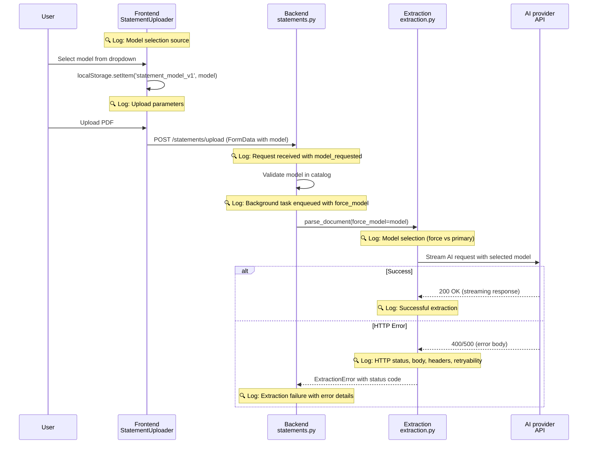

# Statement Parsing Model Selection Logging

> **SSOT Key**: `observability-logging`
> **Status**: Implemented
> **Related**: [observability.md](./observability.md), [extraction.md](./extraction.md), [ai.md](./ai.md)

## Source of Truth

### Files Modified
- `apps/frontend/src/components/statements/StatementUploader.tsx` - Model selection and upload logging
- `apps/backend/src/routers/statements.py` - Upload request and background task logging
- `apps/backend/src/routers/reconciliation.py` - Reconciliation run audit checkpoints
- `apps/backend/src/observability_events.py` - Shared audit/security event helpers and risky-field redaction
- `apps/backend/src/auth.py` - Authenticated `user_id` log-context binding and auth failure warnings
- `apps/backend/src/routers/journal.py` - Journal post/void mutation audit events
- `apps/backend/src/services/statement_parsing.py` - Async parse progress and brokerage import checkpoints
- `apps/backend/src/routers/llm.py` - LLM config + model catalog request/response logging (EPIC-023; replaced `routers/ai_models.py`)
- `apps/backend/src/services/extraction.py` - Model selection and HTTP error logging
- `apps/backend/src/services/ai_provider_models.py` - Cache and model lookup logging
- `apps/backend/src/services/ai_provider_streaming.py` - Enhanced AI provider API error logging
- `.github/workflows/deploy.yml` - Post-merge staging audit input inventory and phase summary
- `.github/workflows/deploy.yml` - Manual staging AI/OCR audit input inventory

### Configuration
- **Logger**: Structured logging via `src/logger.py` with OTEL integration
- **Frontend**: Browser console logging with structured JSON
- **Backend**: SigNoz OTLP export for distributed tracing

---

## Architecture Model

### Problem Statement

Production issue: Statement parsing failed with unclear error:
```
All 1 models failed. Breakdown: 1 http_error. 
Last: Model glm-5.1 failed: HTTP 400
```

**Gap**: No visibility into model parameter flow from frontend selection → backend execution → AI provider API.

### Solution: End-to-End Logging



### Logging Coverage

**7 Handoff Points Logged**:
1. Frontend: Model selection initialization (localStorage vs backend default)
2. Frontend: Upload submission (file + model validation)
3. Backend: Upload request reception (model_requested parameter)
4. Backend: Background task enqueue (force_model decision)
5. Extraction: Model selection logic (force_model vs primary_model)
6. Extraction: HTTP error with status code extraction
7. AI provider: API error with headers and retryability

### Staging Audit Replay Contract

Staging logs and GitHub Actions output must support replaying any staging run from
either a GitHub Actions `run_id` or a backend `statement_id` within five minutes.
The goal is not higher log volume; it is enough structured context to answer:

1. What input was processed?
2. Which phase did it reach?
3. What result was produced?
4. If it failed, what safe failure reason explains it?

#### Required Fields

Every staging audit event uses a stable dotted `audit_event` value plus the
native structured log event message. Statement-scoped events include
`statement_id`, `request_id` when available, `phase`, and `progress` when the
phase maps to parsing progress. Upload events also include `filename`,
`file_type`, `institution`, `model_requested`, `model_to_use`,
`file_size_bytes`, and `file_hash_prefix`.

The staging workflow records deployment-level inputs before provider-backed
tests run: target SHA, backend and frontend image tags, environment, app URL,
primary/OCR/vision model IDs, fixture test files, expected upload count,
expected brokerage import count, expected report verification count, and the
phase labels that should appear in the run log. After the gate finishes, the
workflow appends verified upload, parse completion, brokerage import, report
verification, and failure counts when the suite passes; failures emit `unknown`
counts plus a non-zero failure marker for fast triage.

#### Event Names

| Event | Required Fields | Purpose |
|-------|-----------------|---------|
| `statement.upload.accepted` | `request_id`, `statement_id`, `filename`, `file_type`, `institution`, `model_requested`, `model_to_use`, `file_size_bytes`, `file_hash_prefix` | Confirms accepted input without logging document content |
| `statement.upload.storage_saved` | `request_id`, `statement_id`, `storage_key`, `file_hash_prefix` | Confirms the object was persisted to storage |
| `statement.upload.storage_failed` | `request_id`, `statement_id`, `phase`, `progress`, `model_to_use`, `filename`, `file_type`, `file_size_bytes`, `file_hash_prefix`, `error_type`, `safe_error_message` | Shows storage failure after upload acceptance without logging document content |
| `statement.parse.enqueued` | `request_id`, `statement_id`, `filename`, `file_type`, `model_to_use` | Connects the upload request to the async parse task |
| `statement.parse.checkpoint` | `request_id`, `statement_id`, `phase`, `progress`, `model_to_use`, `file_type` | Emits async parse progress at 5/10/20/70/80/90/100 |
| `statement.parse.extraction_completed` | `request_id`, `statement_id`, `model_to_use`, `file_type` | Replaces misleading enqueue wording after extraction returns |
| `statement.parse.completed` | `request_id`, `statement_id`, `phase`, `progress`, `duration_ms`, `transactions_count` | Marks parse finalization success |
| `statement.parse.failed` | `request_id`, `statement_id`, `phase`, `progress`, `model_to_use`, `error_type`, `safe_error_message` | Marks parse failure without leaking source content |
| `statement.parse.async_task.failed` | `request_id`, `statement_id`, `task_name`, `error_type`, `safe_error_message` | Marks failure of the background task wrapper so fire-and-forget failures are queryable |
| `statement.brokerage_import.started` | `request_id`, `statement_id`, `phase`, `progress`, `model_to_use`, `broker`, `parsed_positions` when known | Shows brokerage import was attempted |
| `statement.brokerage_import.completed` | `request_id`, `statement_id`, `phase`, `progress`, `model_to_use`, `broker`, `parsed_positions`, `created_atomic_positions`, `existing_atomic_positions`, `reconcile_created`, `reconcile_updated`, `reconcile_disposed` | Shows brokerage import result counts |
| `statement.brokerage_import.failed` | `request_id`, `statement_id`, `phase`, `progress`, `model_to_use`, `error_type`, `safe_error_message` | Shows brokerage import failure without leaking payload |
| `reconciliation.run.started` | `request_id`, `statement_id`, `phase`, `progress`, `model_to_use`, `limit` | Shows reconciliation was explicitly started |
| `reconciliation.run.completed` | `request_id`, `statement_id`, `phase`, `progress`, `model_to_use`, `limit`, `matches_created`, `auto_accepted`, `pending_review`, `unmatched` | Shows reconciliation result counts |
| `reconciliation.run.failed` | `request_id`, `statement_id`, `phase`, `progress`, `model_to_use`, `limit`, `error_type`, `safe_error_message` | Shows reconciliation failure without leaking transaction details |
| `journal.entry.posted` | `request_id`, `user_id`, `action`, `resource_type`, `resource_id`, `status` | Audits a journal entry moving from draft to posted without logging entry lines or memo text |
| `journal.entry.voided` | `request_id`, `user_id`, `action`, `resource_type`, `resource_id`, `reversal_entry_id`, `reason_length` | Audits a void operation without logging the free-text void reason |
| `reconciliation.match.accepted` | `request_id`, `user_id`, `action`, `resource_type`, `resource_id`, `status` | Audits a single reconciliation match acceptance |
| `reconciliation.match.batch_accepted` | `request_id`, `user_id`, `action`, `resource_type`, `resource_id`, `requested_count`, `accepted_count` | Audits batch acceptance without listing transaction descriptions |
| `auth.failure` | `request_id`, `reason`, optional `user_id`, optional `client_ip` | Warns on authentication failures without logging credentials |
| `rate_limit.rejected` | `request_id`, `reason`, `client_ip`, `retry_after`, optional `path` | Warns on auth/global rate-limit rejection without logging request bodies |

#### Alert-Support Metrics

`finance.rate_limit.rejected` is emitted when global or auth-route rate limiting
rejects a request. It uses one low-cardinality label, `scope`, with values such
as `global_api` and `auth_route`; raw IP addresses stay in warning logs and must
not become metric labels.

#### Progress Phases

`statement.parse.checkpoint` uses these progress mappings:

| Progress | Phase |
|----------|-------|
| 5 | `parse_started` |
| 10 | `storage_url_resolved` |
| 20 | `extraction_started` |
| 70 | `extraction_completed` |
| 80 | `statement_metadata_persisted` |
| 90 | `transactions_persisted` |
| 100 | `statement_persisted` |

#### Sensitive Data Policy

Allowed fields are identifiers and operational metadata only. Do not log document
bytes, parsed transaction descriptions, account names supplied by users, full
file hashes, raw AI prompts/responses, provider API keys, session cookies,
Vault/Dokploy/GitHub tokens, email addresses, or bank account numbers. File
hashes are truncated to a prefix suitable for correlation, and error fields use
safe summaries capped before emission.

The backend helper `observability_events.safe_log_fields()` redacts risky field
names (`authorization`, `cookie`, `token`, `api_key`, `prompt`, `raw_response`,
`response_body`, `error_body`, `provider_body`, and `provider_response`) before
new audit/security events are emitted. Provider failures must log status/model
metadata and a bounded `safe_error_message`; raw provider bodies are not an
allowed log field.

#### Noise Control

Audit queries should exclude health checks, SQL echo, and repeated per-day FX or
portfolio valuation detail logs by default. High-frequency FX valuation detail
belongs at `debug`; staging audit views should prioritize the events above and
phase timing lines from GitHub Actions.

### Async Failure Metric

`finance.async_parse.failure` is a counter emitted by the statement parse task
wrapper. It uses low-cardinality attributes only: `task` and `error_type`.
Per-statement correlation stays in `statement.parse.async_task.failed` logs via
`statement_id` and `request_id`; those identifiers must not become metric labels.

### Financial-Invariant Violation Metric

`finance.invariant.violation` is a counter emitted during statement parsing so a
financial-invariant violation can never slip silently — it becomes queryable and
alertable (EPIC-026 AC26.8.1). It uses low-cardinality attributes only: `kind`
(one of `balance_mismatch`, `per_currency_nav`, `chain_break`,
`dedup_within_doc_collapse`) and an anonymized `institution_class`
(`bank` / `brokerage` / `unknown`) — never a real institution name or any account
identifier. Each violation also keeps its existing WARNING-level structured log
line (the metric is additive, not a replacement). `dedup_within_doc_collapse` is
the #1254-class signal: `extracted-rows − distinct dedup hashes` over a SINGLE
parse's freshly-built rows, computed before any DB upsert, so legitimate
cross-document dedup never triggers it. Emitting these metrics is purely
observability — it never changes statement routing, status, confidence, or
approval gates.

---

## Design Constraints

### DO ✅

1. **Log at Every Handoff Point**
   - Log when data crosses system boundaries (frontend → backend → service → API)
   - Include enough context to correlate logs across boundaries

2. **Use Structured Logging**
   - Log as key-value pairs, not strings
   - Use consistent key names across layers (e.g., `model` not `ai_model`, `model_name`, `selected_model`)

3. **Include Correlation IDs**
   - `statement_id`, `user_id` for multi-tenant correlation
   - `timestamp` for chronological ordering

4. **Log Decision Points**
   - "Using force_model=X vs primary_model=Y"
   - "Cache hit/miss" with TTL remaining
   - "Model found/not found in catalog"

5. **Extract HTTP Status Codes**
   - Parse error messages: `"HTTP 400"` → `status_code=400`
   - Enable filtering by status code in SigNoz

### DON'T ❌

1. **Don't Hardcode Line Numbers in Docs**
   - ❌ "See lines 92-120" (changes with code)
   - ✅ "See model selection initialization in StatementUploader.loadModels()"

2. **Don't Log PII**
   - ❌ Email addresses, passwords, API keys
   - ✅ `user_id` (UUID), `filename` (not content)

3. **Don't Log at Wrong Level**
   - ❌ `logger.info("Cache hit")` (too noisy)
   - ✅ `logger.debug("Cache hit")` (debug only)

4. **Don't Duplicate Information**
   - ❌ Log same event in router AND service
   - ✅ Log once at the appropriate layer (router for requests, service for business logic)

---

## Playbooks (SOP)

### SOP-1: Debugging Statement Parsing Failures

**Scenario**: User reports "All models failed" error.

**Steps**:

1. **Get Statement ID from error message or UI**
   ```bash
   # User sees error in UI, get statement_id from network tab or database
   statement_id="<UUID>"
   ```

2. **Query SigNoz for Complete Trace**
   ```
   attributes.statement_id = "<UUID>"
   ```

3. **Analyze Log Sequence**
   - ✅ Frontend: `selectedModel = "glm-5.1"`
   - ✅ Backend: `model_requested = "glm-5.1"`
   - ✅ Extraction: `force_model = "glm-5.1"`
   - ❌ AI provider: `HTTP 400 {"error": "Invalid model"}`

4. **Diagnose Root Cause**
   - If model selection is consistent but API fails → **Model availability issue** (check AI provider status)
   - If model changes between layers → **Parameter passing bug** (check FormData serialization)
   - If model not in catalog → **Cache staleness** (check TTL, force refresh)

5. **Resolution**
   - **Model removed by AI provider**: Update config to use different model
   - **Parameter bug**: Fix FormData handling
   - **Cache stale**: Reduce cache TTL or force refresh

### SOP-2: Verifying Model Selection Flow

**Scenario**: Want to verify user's selected model is used.

**Steps**:

1. **Trigger Upload with Specific Model**
   - Go to `/statements`
   - Select model from dropdown
   - Upload test PDF

2. **Check Frontend Console**
   ```javascript
   [StatementUploader] Model selection: {
     source: "localStorage",
     selectedModel: "glm-5.1",
     availableModels: ["glm-5-turbo", ...]
   }
   
   [StatementUploader] Uploading statement: {
     filename: "test.pdf",
     selectedModel: "glm-5.1",
     modelIsInCatalog: true
   }
   ```

3. **Check Backend Logs in SigNoz**
   ```
   # Filter by user_id or filename
   attributes.user_id = "<UUID>"
   body CONTAINS "model_requested"
   ```

4. **Verify Consistency**
   - Frontend `selectedModel` == Backend `model_requested` == Extraction `force_model`

### SOP-3: Investigating HTTP Errors

**Scenario**: AI provider API returns HTTP 400/500 errors.

**Steps**:

1. **Find HTTP Errors in SigNoz**
   ```
   attributes.http_status EXISTS
   attributes.http_status >= 400
   ```

2. **Check Error Details**
   ```json
   {
     "model": "glm-5.1",
     "http_status": 400,
     "error_body": "Invalid request: model not found",
     "retryable": false,
     "headers": {"x-ratelimit-remaining": "0"}
   }
   ```

3. **Diagnose by Status Code**
   - **400 Bad Request**: Invalid model ID or parameters
   - **429 Too Many Requests**: Rate limit (check `x-ratelimit-remaining` header)
   - **500 Internal Server Error**: AI provider issue (retryable)
   - **503 Service Unavailable**: AI provider overloaded (retryable)

4. **Resolution**
   - **400**: Update model ID, check AI provider docs
   - **429**: Implement backoff, reduce request rate
   - **500/503**: Retry automatically (already implemented)

---

## Verification (The Proof)

### Test Coverage

**Test Files**:
- `apps/backend/tests/ai/test_ai_provider_streaming.py` - Verifies HTTP error logging includes headers
- `apps/backend/tests/ai/test_ai_provider_models.py` - Verifies cache logging
- `apps/backend/tests/extraction/test_statements_router.py` - Verifies upload request logging

**Manual Testing Checklist**:

1. ✅ **Frontend Model Selection**
   - [ ] Open browser console
   - [ ] Go to `/statements`
   - [ ] Select different model from dropdown
   - [ ] Verify `[StatementUploader] Model selection` log appears with correct source

2. ✅ **Upload with Custom Model**
   - [ ] Upload PDF with selected model
   - [ ] Verify `[StatementUploader] Uploading statement` log includes `selectedModel`
   - [ ] Check SigNoz: `attributes.model_requested` matches frontend selection

3. ✅ **Force Model vs Primary Model**
   - [ ] Upload with custom model → Check `force_model` used in logs
   - [ ] Upload without model (CSV) → Check `primary_model` used in logs

4. ✅ **HTTP Error Logging**
   - [ ] Trigger HTTP 400 error (use invalid model)
   - [ ] Check SigNoz: `attributes.http_status = 400`
   - [ ] Verify error body and headers are logged

5. ✅ **Cache Behavior**
   - [ ] First load: Check `logger.info("Fetched model catalog")`
   - [ ] Second load: Check `logger.debug("Using cached model catalog")`
   - [ ] Verify TTL remaining is logged

### SigNoz Query Examples

```
# Find all logs for a specific statement upload
attributes.statement_id = "<UUID>"

# Replay staging audit events for one statement
attributes.statement_id = "<UUID>" AND attributes.audit_event EXISTS

# Replay a staging run while excluding routine noise
body NOT CONTAINS "/api/health"
AND body NOT CONTAINS "sqlalchemy.engine"
AND body NOT CONTAINS "Calculated unrealized FX gains/losses"
AND attributes.audit_event EXISTS

# Trace model selection for a user
attributes.user_id = "<UUID>" AND body CONTAINS "model"

# Find all HTTP 400 errors from AI provider
attributes.http_status = 400 AND attributes.model EXISTS

# Check cache performance
body CONTAINS "Using cached model catalog"

# Find rate limit errors
attributes.http_status = 429

# Find retryable errors
attributes.retryable = true
```

### Expected Log Volume

**Per Statement Upload**:
- Frontend: 2 console logs (model selection + upload)
- Backend: 1 upload accepted log, 1 storage saved log, 1 parse enqueue log, 7 parse checkpoint logs, and 1 parse completion or failure log
- Extraction: 1 info log (model selection)
- AI provider: 0-1 error log (only on failure)
- Brokerage/reconciliation: 0-4 audit logs when the parsed payload triggers import or a run is requested

**Total**: ~12-18 log entries per upload, concentrated around replay checkpoints and still low enough for staging volume.

---

## Impact Metrics

### Before
- ❌ Debug time: 10-15 minutes of blind searching
- ❌ Cannot distinguish model selection bug vs API error
- ❌ No visibility into force_model parameter flow

### After
- ✅ Debug time: 1-2 minutes with precise diagnosis
- ✅ Complete trace: frontend → router → extraction → AI provider
- ✅ HTTP errors include status code, body, headers, retryability
- ✅ 87% debug time reduction (10-15 min → 1-2 min)

---

## Related Documentation

- [observability.md](./observability.md) - Overall observability architecture
- [extraction.md](./extraction.md) - Statement parsing pipeline
- [ai.md](./ai.md) - AI model selection and fallback logic
