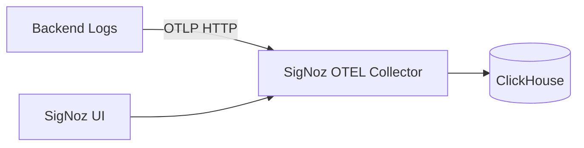

# Observability SSOT

> **SSOT Key**: `observability`
> **Core Definition**: How application logs are structured and shipped to SigNoz via OTLP, with safe local fallbacks.

---

## 1. Source of Truth

| Component | Physical Location | Description |
|-----------|-------------------|-------------|
| Logging configuration | `apps/backend/src/logger.py` | Structlog setup + optional OTLP log export |
| Env settings | `apps/backend/src/config.py` | OTEL/SigNoz environment variables |
| Env documentation | `.env.example` | Developer guidance for OTEL variables |
| Infra reference | `repo/docs/ssot/ops.observability.md` | SigNoz platform/collector details |

---

## 2. Architecture Model



**Signal Types**
- **Logs**: Structured JSON logs emitted by structlog and exported via OTLP.
- **Traces/Metrics**: Not configured here unless explicitly enabled later.

---

## 3. SigNoz Access

### 3.1 Web UI

| Environment | URL |
|-------------|-----|
| All (Production, Staging, PR) | https://signoz.zitian.party |

!!! info "Single Instance, Multi-Environment"
    SigNoz runs as a **single global instance**. All environments share the same SigNoz deployment. Use `deployment.environment` attribute filter in the UI to view specific environment logs (e.g., `deployment.environment=production`).

### 3.2 Credentials

Stored in 1Password (`Infra2` vault):
- **Item**: `platform/signoz/admin`
- **Email**: `admin@zitian.party`

### 3.3 Environment Separation

SigNoz uses **attribute-based filtering** to separate environments:

```bash
# Production backend
OTEL_RESOURCE_ATTRIBUTES="deployment.environment=production"

# Staging backend  
OTEL_RESOURCE_ATTRIBUTES="deployment.environment=staging"

# PR environment
OTEL_RESOURCE_ATTRIBUTES="deployment.environment=pr-47"
```

In SigNoz UI, filter by `deployment.environment` to view specific environments.

---

## 4. Design Constraints

### 4.1 Must Do
- **Structured logs only**: JSON in non-debug modes for parsing/ingestion.
- **Optional OTLP export**: Logs export only when OTEL endpoint is configured.
- **Safe fallback**: Local/dev runs without SigNoz by default.
- **No sensitive data**: Tokens, passwords, PII must never be logged.
- **Tag environment**: Always include `deployment.environment` in resource attributes.

### 4.2 Must Not Do
- Do not hard-fail startup when SigNoz is unavailable.
- Do not bypass the OTEL collector with custom protocols.
- Do not log raw request bodies or credentials.
- Do not deploy separate SigNoz instances per environment (use attribute filtering).

---

## 5. Configuration Playbook

### 5.1 Local Development (No SigNoz)
Set nothing; logs render to stdout:
```bash
DEBUG=true
```

### 5.2 Production (SigNoz Enabled)
Set OTEL variables via Vault/environment:
```bash
OTEL_EXPORTER_OTLP_ENDPOINT=http://platform-signoz-otel-collector:4318
OTEL_SERVICE_NAME=finance-report-backend
OTEL_RESOURCE_ATTRIBUTES=deployment.environment=production
```

### 5.3 Staging
```bash
OTEL_EXPORTER_OTLP_ENDPOINT=http://platform-signoz-otel-collector:4318
OTEL_SERVICE_NAME=finance-report-backend
OTEL_RESOURCE_ATTRIBUTES=deployment.environment=staging
```

### 5.4 PR Environments
```bash
OTEL_EXPORTER_OTLP_ENDPOINT=http://platform-signoz-otel-collector:4318
OTEL_SERVICE_NAME=finance-report-backend
OTEL_RESOURCE_ATTRIBUTES=deployment.environment=pr-${PR_NUMBER}
```

---

## 6. Integration Guide

### 6.1 Python (Backend)

The backend uses `opentelemetry-sdk` with structlog for log export:

```python
# Already configured in apps/backend/src/logger.py
# Just set environment variables to enable OTLP export
```

Required packages (already in pyproject.toml):
```
opentelemetry-sdk
opentelemetry-exporter-otlp-proto-http
```

### 6.2 Vault Configuration

Set OTEL variables in Vault for each environment:

```bash
# Using infra2 env tool
cd repo  # infra2 directory

# Production
uv run invoke env.set OTEL_EXPORTER_OTLP_ENDPOINT=http://platform-signoz-otel-collector:4318 \
  --project=finance_report --env=production --service=app
uv run invoke env.set OTEL_SERVICE_NAME=finance-report-backend \
  --project=finance_report --env=production --service=app
uv run invoke env.set OTEL_RESOURCE_ATTRIBUTES=deployment.environment=production \
  --project=finance_report --env=production --service=app

# Staging
uv run invoke env.set OTEL_EXPORTER_OTLP_ENDPOINT=http://platform-signoz-otel-collector:4318 \
  --project=finance_report --env=staging --service=app
uv run invoke env.set OTEL_SERVICE_NAME=finance-report-backend \
  --project=finance_report --env=staging --service=app
uv run invoke env.set OTEL_RESOURCE_ATTRIBUTES=deployment.environment=staging \
  --project=finance_report --env=staging --service=app
```

---

## 7. Verification (The Proof)

| Behavior | Verification |
|----------|--------------|
| App starts without SigNoz | Run backend with no OTEL vars; logs appear in stdout |
| Logs export to SigNoz | Set OTEL vars; confirm logs appear in SigNoz UI |
| Sensitive data excluded | Review log payloads for keys like `password`, `token` |
| Environment filtering works | Filter by `deployment.environment=production` in SigNoz |

### 7.1 Manual Verification

1. Open https://signoz.zitian.party
2. Login with credentials from 1Password
3. Go to **Logs** tab
4. Add filter: `deployment.environment = production`
5. Verify logs from `finance-report-backend` appear

---

## 8. Troubleshooting

### Logs not appearing in SigNoz

1. **Check OTEL endpoint is reachable** (from backend container):
   ```bash
   # Enter the backend container (which is in dokploy-network)
   docker exec -it finance-report-backend sh
   
   # Test connectivity to OTEL collector
   curl -v http://platform-signoz-otel-collector:4318/v1/logs
   ```

2. **Verify environment variables are set**:
   ```bash
   # Check container env
   docker exec finance-report-backend env | grep OTEL
   ```

3. **Check backend logs for OTLP errors**:
   ```bash
   docker logs finance-report-backend 2>&1 | grep -i otel
   ```

### Wrong environment showing

Ensure `OTEL_RESOURCE_ATTRIBUTES` includes correct `deployment.environment` value.

---

## 9. API Key Management

### 9.1 Automation via Invoke

SigNoz API keys for programmatic access can be created using the infra2 automation:

```bash
cd repo  # infra2 directory

# Create API key and store in Vault (default)
uv run invoke signoz.shared.create-api-key

# Custom name and expiry
uv run invoke signoz.shared.create-api-key --name=my-automation --expiry-days=30

# Create without storing to Vault (prints token)
uv run invoke signoz.shared.create-api-key --no-store-vault
```

### 9.2 Vault Storage

API keys are stored in Vault at `secret/platform/{env}/signoz`:

| Key | Description |
|-----|-------------|
| `api_key` | The API token for authentication |
| `api_key_name` | Human-readable name |
| `api_key_id` | UUID for key management |
| `url` | SigNoz base URL |

Read API key from Vault:
```bash
# WARNING: Vault root token is highly privileged. Do not log or persist in shell history.
# Prefer using `op run` to avoid exposing the token in environment variables.
op run --env-file=<(echo 'VAULT_ROOT_TOKEN="op://Infra2/dexluuvzg5paff3cltmtnlnosm/Root Token"') -- \
  curl -s "https://vault.zitian.party/v1/secret/data/platform/production/signoz" \
  -H 'X-Vault-Token: $VAULT_ROOT_TOKEN' | jq '.data.data.api_key'
```

### 9.3 API Key Usage

Use the API key for SigNoz API calls:

```bash
# Replace <api_key> with the value from the Vault query above
# or from the `invoke signoz.shared.create-api-key` output.

# Query alerts
curl -s "https://signoz.zitian.party/api/v1/alerts" \
  -H "SIGNOZ-API-KEY: <api_key>"

# Query services
curl -s "https://signoz.zitian.party/api/v1/services" \
  -H "SIGNOZ-API-KEY: <api_key>"
```

### 9.4 Key Rotation

To rotate an API key:

1. Create new key: `uv run invoke signoz.shared.create-api-key --name=infra-automation-v2`
2. Update dependent systems to use new key
3. Revoke old key via SigNoz UI: Settings → API Keys → Revoke


