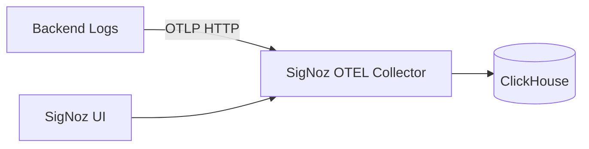

# Observability SSOT

> **SSOT Key**: `observability`
> **Core Definition**: How application logs are structured and shipped to SigNoz via OTLP, with safe local fallbacks.

---

## 1. Source of Truth

| Component | Physical Location | Description |
|-----------|-------------------|-------------|
| Logging configuration | `apps/backend/src/logger.py` | Structlog setup + optional OTLP log export |
| Env settings | `apps/backend/src/config.py` | OTEL/SigNoz environment variables |
| Env documentation | `.env.example` | Developer guidance for OTEL variables |
| Infra reference | `repo/docs/ssot/ops.observability.md` | SigNoz platform/collector details |

---

## 2. Architecture Model



**Signal Types**
- **Logs**: Structured JSON logs emitted by structlog and exported via OTLP.
- **Traces/Metrics**: Not configured here unless explicitly enabled later.

---

## 3. Design Constraints

### 3.1 Must Do
- **Structured logs only**: JSON in non-debug modes for parsing/ingestion.
- **Optional OTLP export**: Logs export only when OTEL endpoint is configured.
- **Safe fallback**: Local/dev runs without SigNoz by default.
- **No sensitive data**: Tokens, passwords, PII must never be logged.

### 3.2 Must Not Do
- Do not hard-fail startup when SigNoz is unavailable.
- Do not bypass the OTEL collector with custom protocols.
- Do not log raw request bodies or credentials.

---

## 4. Configuration Playbook

### 4.1 Local Development (No SigNoz)
Set nothing; logs render to stdout:
```
DEBUG=true
```

### 4.2 Production (SigNoz Enabled)
Set OTEL variables via Vault/environment:
```
OTEL_EXPORTER_OTLP_ENDPOINT=http://platform-signoz-otel-collector${ENV_SUFFIX}:4318
OTEL_SERVICE_NAME=finance-report-backend
OTEL_RESOURCE_ATTRIBUTES=deployment.environment=production
```

---

## 5. Verification (The Proof)

| Behavior | Verification |
|----------|--------------|
| App starts without SigNoz | Run backend with no OTEL vars; logs appear in stdout |
| Logs export to SigNoz | Set OTEL vars; confirm logs appear in SigNoz UI |
| Sensitive data excluded | Review log payloads for keys like `password`, `token` |

