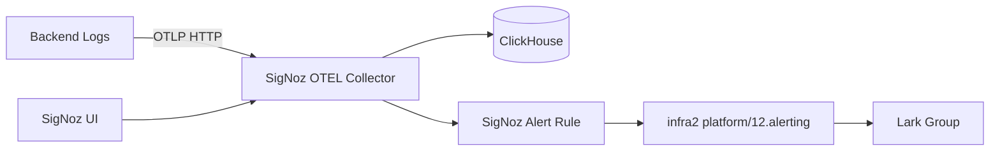

# Observability SSOT

> **SSOT Key**: `observability`
> **Core Definition**: How the **App-side backend** *consumes* the observability
> contract — which `OTEL_*` env vars `config.py` reads, the redacted
> `/health.observability` runtime snapshot, and fast-fail behavior.

!!! warning "Contract is owned by infra2 — this App doc covers consumption only"
    The canonical **env/observability contract** is **owned and issued by
    infra2** (runtime), not by this App doc (software). infra2 owns:

    - the single no-suffix **OTLP collector** endpoint,
    - the `deployment.environment` surface alias and its allowed values,
    - the layered **telemetry identity** (underlying short-commit-SHA
      `service.version` + surface `deployment.environment`),
    - the environment **taxonomy**.

    Canonical sources (infra2, vendored at `repo/`):

    - [`repo/docs/ssot/ops.observability.md`](../../repo/docs/ssot/ops.observability.md)
      — OTLP single no-suffix collector, signal types, OTLP env vars.
    - [`repo/docs/ssot/core.environments.md#telemetry-identity`](../../repo/docs/ssot/core.environments.md#telemetry-identity)
      — telemetry identity (`service.version` / `deployment.environment`) and
      environment taxonomy.

    **The App must NOT re-define environments or the observability contract.**
    It only *consumes* the contract via `config.py` and **fast-fails** if a
    required value is missing. Per-environment collector endpoints and
    `deployment.environment` value enumerations live in infra2 — see the
    boundary in Infra-014 / `AGENTS.md`. Do not restate them here.

---

## 1. Source of Truth

| Component | Physical Location | Description |
|-----------|-------------------|-------------|
| Logging configuration | `apps/backend/src/logger.py` | Structlog setup + optional OTLP log export |
| Runtime contract | `apps/backend/src/observability.py` | Redacted observability status for health checks, startup logs, and alert triage |
| Env settings | `apps/backend/src/config.py` | OTEL/SigNoz environment variables |
| Env documentation | `.env.example` | Developer guidance for OTEL variables |
| Infra reference | `repo/docs/ssot/ops.observability.md`, `repo/docs/ssot/ops.alerting.md` | SigNoz platform, collector, alert rule, and Lark delivery details |

---

## 2. Architecture Model


```mermaid
flowchart LR
    Backend[Backend Logs] -->|OTLP HTTP| Collector[SigNoz OTEL Collector]
    Collector --> ClickHouse[(ClickHouse)]
    UI[SigNoz UI] --> Collector
    Collector --> Alerts[SigNoz Alert Rule]
    Alerts --> Bridge[infra2 platform/12.alerting]
    Bridge --> Lark[Lark Group]
```

**Signal Types**
- **Logs**: Structured JSON logs emitted by structlog and exported via OTLP.
- **Traces**: FastAPI, SQLAlchemy, and HTTPX spans are exported when the OTLP endpoint is configured.
- **Metrics**: Not configured here unless explicitly enabled later.
- **Alerts**: Backend error logs follow `component -> OTEL -> SigNoz -> Lark`; the app owns the service name and safe runtime contract, while infra2 owns shared SigNoz/Lark automation.

---

## 3. SigNoz Access (infra2-owned)

SigNoz access, the single global instance model, environment **attribute-based
filtering**, and the allowed `deployment.environment` values are part of the
**infra2-owned contract**. Do not restate the endpoints or per-env values here.

- Platform, collector, single-instance model, OTLP env vars →
  [`repo/docs/ssot/ops.observability.md`](../../repo/docs/ssot/ops.observability.md).
- Environment taxonomy + telemetry identity (`deployment.environment` values,
  `service.version`) →
  [`repo/docs/ssot/core.environments.md#telemetry-identity`](../../repo/docs/ssot/core.environments.md#telemetry-identity).

Credentials for the SigNoz UI are stored in 1Password (`Infra2` vault), item
`platform/signoz/admin`. To view App logs, filter the SigNoz UI by the
`deployment.environment` value that infra2 assigned to the target environment.

---

## 4. Design Constraints

### 4.1 Must Do
- **Structured logs only**: JSON in non-debug modes for parsing/ingestion.
- **Optional OTLP export**: Logs export only when OTEL endpoint is configured.
- **Safe fallback**: Local/dev runs without SigNoz by default.
- **No sensitive data**: Tokens, passwords, PII must never be logged.
- **Tag environment**: Always include `deployment.environment` in resource attributes.

### 4.2 Must Not Do
- Do not hard-fail startup when SigNoz is unavailable.
- Do not bypass the OTEL collector with custom protocols.
- Do not log raw request bodies or credentials.
- Do not deploy separate SigNoz instances per environment (use attribute filtering).

---

## 5. App-Side Consumption (what `config.py` reads)

The App does **not** define collector endpoints or per-environment
`deployment.environment` values — those are **issued by infra2** (see the banner
at the top of this doc and
[`repo/docs/ssot/ops.observability.md`](../../repo/docs/ssot/ops.observability.md)).
The App only *reads* the values infra2 injects.

`apps/backend/src/config.py` reads these `OTEL_*` env vars (via pydantic
`validation_alias`):

| Env var | `config.py` field | App-side behavior |
|---------|-------------------|-------------------|
| `OTEL_EXPORTER_OTLP_ENDPOINT` | `otel_exporter_otlp_endpoint` | When set, the backend exports logs/traces to the infra2-issued collector; when unset, the App degrades safely to stdout (local dev). |
| `OTEL_SERVICE_NAME` | `otel_service_name` | App service identity used by the shared alert rule. |
| `OTEL_RESOURCE_ATTRIBUTES` | `otel_resource_attributes` | Carries the infra2-issued `deployment.environment` (surface alias) and `service.version` (underlying short-commit-SHA). The App parses, never enumerates, these values. |

Local development needs nothing set; logs render to stdout (e.g. `DEBUG=true`).
The concrete endpoint string and the allowed `deployment.environment` values are
infra2's to define — find them in the infra2 contract, not here.

---

## 6. Integration Guide

### 6.1 Python (Backend)

The backend uses `opentelemetry-sdk` with structlog for log export:

```python
# Already configured in apps/backend/src/logger.py
# Just set environment variables to enable OTLP export
```

Required packages (already in pyproject.toml):
```
opentelemetry-sdk
opentelemetry-exporter-otlp-proto-http
```

### 6.2 Vault Configuration (infra2-owned)

The `OTEL_*` values are **issued by infra2** into Vault per environment. The
concrete endpoint, `service.version`, and `deployment.environment` values, plus
the `invoke env.set` procedure, live in the infra2 contract — see
[`repo/docs/ssot/ops.observability.md`](../../repo/docs/ssot/ops.observability.md)
and
[`repo/docs/ssot/core.environments.md#telemetry-identity`](../../repo/docs/ssot/core.environments.md#telemetry-identity).
The App must not hardcode or restate these per-environment values; it consumes
whatever infra2 injects and fast-fails if a required value is absent.

---

## 7. Verification (The Proof)

| Behavior | Verification |
|----------|--------------|
| App starts without SigNoz | Run backend with no OTEL vars; logs appear in stdout |
| Logs export to SigNoz | Set OTEL vars; confirm logs appear in SigNoz UI |
| Sensitive data excluded | Review log payloads for keys like `password`, `token` |
| Environment filtering works | Filter by `deployment.environment=production` in SigNoz |
| App alert readiness is visible | `/health.observability` and startup logs expose service `finance-report-backend`, rule `FinanceReportBackendErrorLogs`, and no collector/webhook URL |
| Production deploy blocks missing app observability configuration | `python tools/production_infra_smoke.py --base-url https://report.zitian.party --signoz-url https://signoz.zitian.party` |

### 7.1 Runtime Contract

The backend exposes a redacted observability snapshot through `/health` and emits
the same fields once at startup with event `Observability runtime configured`.
This snapshot is for deploy checks and alert triage, not for secret discovery.

Required fields:

| Field | Meaning |
|-------|---------|
| `otel_exporter_configured` | Whether OTLP export is configured at runtime |
| `logs_export_enabled` | Whether structured logs should be exported to SigNoz |
| `traces_export_enabled` | Whether traces should be exported to SigNoz |
| `service_name` | OTEL service name; production value is `finance-report-backend` |
| `deployment_environment` | Effective environment from `deployment.environment` or app environment fallback |
| `resource_attributes` | Parsed non-secret OTEL resource attributes |
| `alert_rule_name` | Shared SigNoz rule name, `FinanceReportBackendErrorLogs` |
| `alert_rule_service_name` | Service matched by the shared rule, `finance-report-backend` |
| `alerting_pipeline` | Literal app path, `component->otel->signoz->lark` |

Forbidden fields:
- OTLP collector endpoint URLs
- SigNoz API keys
- SigNoz webhook channel URLs
- Feishu/Lark bot webhook URLs
- Feishu/Lark app secrets

### 7.2 Alert Rule Contract

Finance Report production uses the shared infra2 rule automation:

```bash
cd repo
uv run python -m invoke alerting.shared.ensure-log-error-rule \
  --alert-name=FinanceReportBackendErrorLogs \
  --service-name=finance-report-backend
```

The shared owner for SigNoz channels, bridge deployment, and Lark delivery is
`repo/docs/ssot/ops.alerting.md`. This application must not duplicate that
automation; it only declares the service metadata and emits structured logs that
the shared rule can query.

### 7.3 Manual Verification

1. Open https://signoz.zitian.party
2. Login with credentials from 1Password
3. Go to **Logs** tab
4. Add filter: `deployment.environment = production`
5. Verify logs from `finance-report-backend` appear
6. Verify alert rule `FinanceReportBackendErrorLogs` targets service `finance-report-backend`

---

## 8. Runtime Incident Routing

Runtime failure triage is owned by
[runtime-incident-response.md](./runtime-incident-response.md). This document
owns the observability contract only: structured log shape, OTEL/SigNoz
configuration, the redacted `/health.observability` fields, and app service
metadata used by the shared alert rule.

Use the runtime incident SSOT for missing logs, wrong environment labels,
502/503 responses, route failures, stale deployed versions, and flapping
recovery proof. Use `repo/docs/ssot/ops.alerting.md` for shared SigNoz alert
automation, bridge delivery, and Lark channel behavior.

---

## 9. API Key Management

### 9.1 Automation via Invoke

SigNoz API keys for programmatic access can be created using the infra2 automation:

```bash
cd repo  # infra2 directory

# Create API key and store in Vault (default)
uv run invoke signoz.shared.create-api-key

# Custom name and expiry
uv run invoke signoz.shared.create-api-key --name=my-automation --expiry-days=30

# Create without storing to Vault (prints token)
uv run invoke signoz.shared.create-api-key --no-store-vault
```

### 9.2 Vault Storage

API keys are stored in Vault at `secret/platform/{env}/signoz`:

| Key | Description |
|-----|-------------|
| `api_key` | The API token for authentication |
| `api_key_name` | Human-readable name |
| `api_key_id` | UUID for key management |
| `url` | SigNoz base URL |

Read API key from Vault:
```bash
# WARNING: Vault root token is highly privileged. Do not log or persist in shell history.
# Prefer using `op run` to avoid exposing the token in environment variables.
op run --env-file=<(echo 'VAULT_ROOT_TOKEN="op://Infra2/dexluuvzg5paff3cltmtnlnosm/Root Token"') -- \
  curl -s "https://vault.zitian.party/v1/secret/data/platform/production/signoz" \
  -H 'X-Vault-Token: $VAULT_ROOT_TOKEN' | jq '.data.data.api_key'
```

### 9.3 API Key Usage

Use the API key for SigNoz API calls:

```bash
# Replace <api_key> with the value from the Vault query above
# or from the `invoke signoz.shared.create-api-key` output.

# Query alerts
curl -s "https://signoz.zitian.party/api/v1/alerts" \
  -H "SIGNOZ-API-KEY: <api_key>"

# Query services
curl -s "https://signoz.zitian.party/api/v1/services" \
  -H "SIGNOZ-API-KEY: <api_key>"
```

### 9.4 Key Rotation

To rotate an API key:

1. Create new key: `uv run invoke signoz.shared.create-api-key --name=infra-automation-v2`
2. Update dependent systems to use new key
3. Revoke old key via SigNoz UI: Settings → API Keys → Revoke

---

## 10. Cross-Repository Dependencies

### 10.1 Architecture

This application depends on infrastructure managed in the `infra2` repository (mounted as `repo/` submodule):

```
finance_report (this repo)
    ↓ runtime depends on
infra2/platform (repo submodule)
    ├── Vault (secrets injection)
    ├── SigNoz OTEL Collector (log shipping)
    └── MinIO (file storage)
```

### 10.2 Dependency Health Matrix

| Dependency | Health Check Location | Failure Mode |
|------------|----------------------|--------------|
| **Vault** | infra2: `invoke vault.status` | Container fails to start (no secrets) |
| **SigNoz Collector** | infra2: `invoke signoz.shared.status` | Silent degradation (logs lost) |
| **MinIO** | App: `/health` endpoint | 503 returned, uploads fail |
| **PostgreSQL** | App: `/health` + Bootloader | Container won't start |
| **Redis** | App: `/health` endpoint | 503 returned, rate limiting disabled |

### 10.3 Known Gaps

| Gap | Risk | Mitigation |
|-----|------|------------|
| **OTEL ingestion not fully verified at deploy** | Logs can be configured but absent from SigNoz if collector ingestion or rule automation drifts | Production smoke verifies the app-side observability contract; SigNoz log queries and Lark delivery remain manual live gates |
| **Vault availability not checked by App** | N/A - vault-agent handles this before app starts | Vault HA in infra2 |
| **secrets.ctmpl ↔ config.py drift** | Missing env vars cause 500s | `tools/check_env_keys.py` + pre-commit |
| **infra2 submodule version lag** | New secrets not deployed | Manual sync required after adding vars |

### 10.4 Post-Deployment Verification

After staging or production deploys, keep observability verification narrow:

1. Confirm `/health.observability` exposes the expected service name, deployment
   environment, alert rule, and alerting pipeline without secret URLs or keys.
2. Confirm SigNoz has recent `finance-report-backend` logs for the target
   `deployment.environment`.
3. If logs or alerts are missing during an incident, route through
   [runtime-incident-response.md](./runtime-incident-response.md) instead of
   adding environment-specific debugging steps here.
