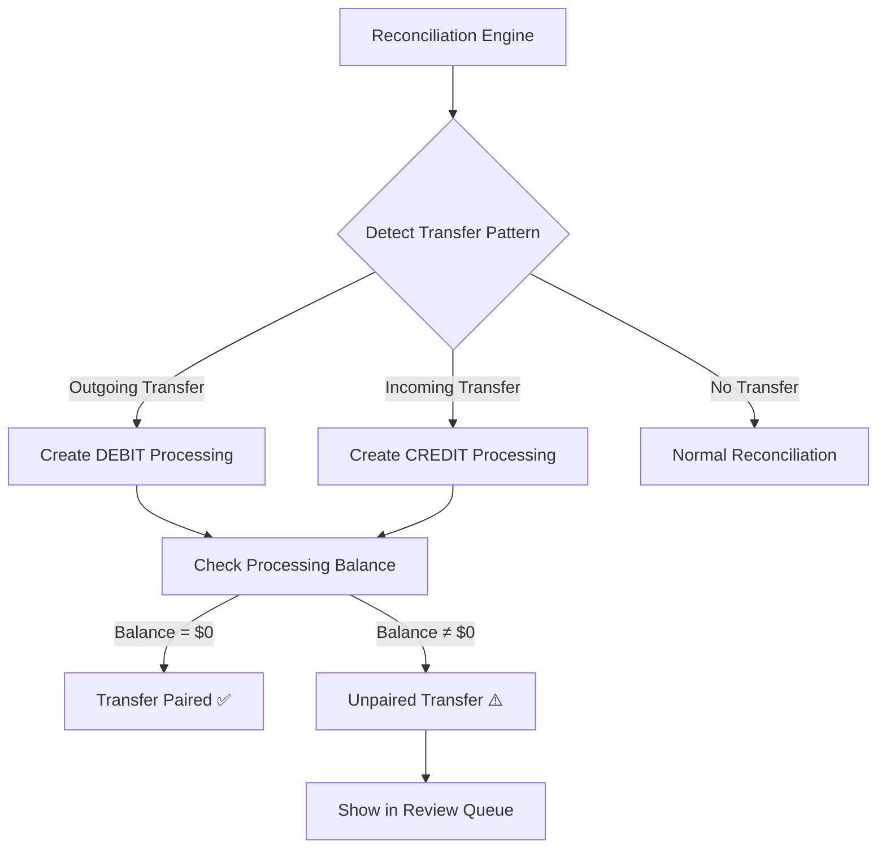
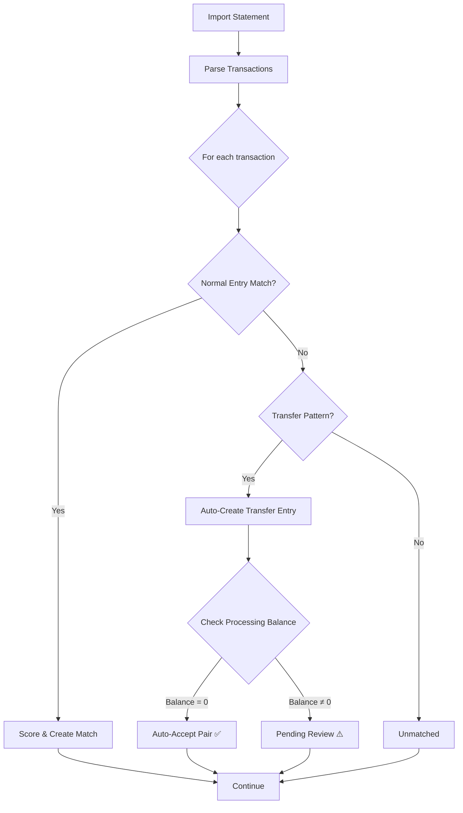

# Processing Virtual Account SSOT

> **SSOT Key**: `processing_account`
> **Core Definition**: Virtual clearing account for in-transit funds during inter-account transfers.

---

## 1. Source of Truth

| Dimension | Physical Location (SSOT) | Description |
|-----------|--------------------------|-------------|
| **Processing Logic** | `apps/backend/src/services/processing_account.py` | Core business |
| **Account Creation** | `apps/backend/src/services/account_service.py` | System account init |
| **Transfer Detection** | `apps/backend/src/services/reconciliation.py` | Transfer pair matching |

---

## 2. Problem Statement (Vision Context)

From `vision.md` Decision 5:

**Problem**: Bank A transfers out on Day 1, Bank B receives on Day 3. Where are the funds on Day 2?

**Without Processing Account**:
```
Day 1: Bank A balance decreases by $10,000
Day 2: Total assets = Bank A + Bank B = $X - $10,000  ❌ (funds "disappeared")
Day 3: Bank B balance increases by $10,000
```

**With Processing Account**:
```
Day 1: 
  DEBIT Processing $10,000
  CREDIT Bank A $10,000
  Total assets = Bank A + Bank B + Processing = $X  ✅ (equation holds)

Day 3:
  DEBIT Bank B $10,000
  CREDIT Processing $10,000
  Total assets = Bank A + Bank B + Processing = $X  ✅ (equation holds)
```

**Key Insight**: Processing account balance represents **unconfirmed in-transit funds**. When Processing balance ≠ 0, there are unpaired transfers.

---

## 3. Architecture Model

### Account Classification

Processing is a **system-managed Asset account** with special properties:

| Property | Value | Reason |
|----------|-------|--------|
| **Type** | ASSET | Holds value temporarily (like a bank account) |
| **Owner** | System (user_id=NULL initially, then per-user) | Auto-created, not user-editable |
| **Name** | "Processing - [User Email]" | Per-user instance |
| **Code** | "1199" | Asset subgroup (following 11xx pattern for current assets) |
| **Normal Balance** | Debit (ideally $0) | Should self-cancel when transfers pair |
| **Visibility** | Hidden in reports by default | Internal clearing mechanism |

### Transfer Detection Flow



### Transfer Matching Logic

**Pattern Recognition**:

| Signal | Weight | Detection Logic |
|--------|--------|-----------------|
| **Amount Match** | 40% | Exact or within 0.5% (accounting for forex/fees) |
| **Description Match** | 30% | Keywords: "transfer", "payment", "withdrawal" → "deposit", "receive" |
| **Date Proximity** | 20% | Within 7 days (T+3 is common) |
| **Account Pair History** | 10% | Same account pair has transfer history |

**Auto-Pairing Threshold**: ≥85 score → automatically create paired entries

**Manual Review**: 60-84 score → show in review queue with suggested pair

---

## 4. Data Model

### Schema Change (Migration)

No new table needed. Processing account is a regular `Account` with special semantics.

**System Initialization** (on user registration):

```sql
INSERT INTO accounts (
    id, 
    user_id, 
    name, 
    type, 
    code, 
    currency, 
    is_active,
    is_system,  -- New column: boolean flag
    description
) VALUES (
    gen_random_uuid(),
    :user_id,
    'Processing - ' || :user_email,
    'ASSET',
    '1199',
    'SGD',  -- Base currency from config
    true,
    true,  -- Mark as system account
    'Virtual clearing account for in-transit funds between accounts'
);
```

**New Model Field**:

```python
# apps/backend/src/models/account.py
class Account(Base):
    # ... existing fields ...
    is_system: Mapped[bool] = mapped_column(Boolean, default=False, nullable=False)
    # System accounts are hidden from user-facing account lists
```

### Journal Entry Pattern

**Outgoing Transfer (Bank A sends $10k)**:

```python
JournalEntry(
    entry_date=date(2026, 1, 1),
    memo="Transfer OUT to Bank B",
    source_type="bank_statement",
    source_id=bank_txn_id,
    status="posted",
    lines=[
        JournalLine(account=processing, direction="DEBIT", amount=10000),  # Processing +10k
        JournalLine(account=bank_a, direction="CREDIT", amount=10000)      # Bank A -10k
    ]
)
```

**Incoming Transfer (Bank B receives $10k)**:

```python
JournalEntry(
    entry_date=date(2026, 1, 3),
    memo="Transfer IN from Bank A",
    source_type="bank_statement",
    source_id=bank_txn_id,
    status="posted",
    lines=[
        JournalLine(account=bank_b, direction="DEBIT", amount=10000),      # Bank B +10k
        JournalLine(account=processing, direction="CREDIT", amount=10000)  # Processing -10k
    ]
)
```

**Result**: Processing balance returns to $0 when paired.

---

## 5. Design Constraints (Dos & Don'ts)

### ✅ Recommended Patterns

- **Pattern A**: Processing account balance SHOULD be $0 under normal circumstances
  - Non-zero balance indicates unpaired transfers requiring review
  
- **Pattern B**: Auto-pair transfers when confidence ≥85
  - Same amount within 0.5%
  - Date within 7 days
  - Description keywords match
  
- **Pattern C**: One Processing account per user
  - Simplifies balance tracking
  - Clear ownership for multi-user scenarios

- **Pattern D**: Hide Processing from default reports
  - Balance Sheet: Show in notes or collapsed by default
  - Income Statement: N/A (Asset account)
  - User-facing account lists: Exclude `is_system=true` accounts

### ⛔ Prohibited Patterns

- **Anti-pattern A**: **NEVER** allow manual journal entries to debit/credit Processing
  - **Reason**: Defeats the purpose of automatic transfer detection
  - **Enforcement**: API validation rejects entries with Processing account unless `source_type='system'`
  
- **Anti-pattern B**: **NEVER** delete unpaired entries to "fix" Processing balance
  - **Reason**: Loses audit trail of in-transit funds
  - **Solution**: Force user to review and either pair or explain discrepancy

- **Anti-pattern C**: **NEVER** assume Processing balance = error
  - **Reason**: Legitimate 2-3 day transfer lag is normal
  - **Alert Threshold**: Only flag if balance ≠ 0 for >7 days

---

## 6. Standard Operating Procedures (Playbooks)

### SOP-001: Auto-Detect and Pair Transfers

```python
def reconcile_with_transfer_detection(
    statement: BankStatement,
    transactions: list[BankStatementTransaction]
) -> list[ReconciliationMatch]:
    matches = []
    
    for txn in transactions:
        # 1. Try normal reconciliation first
        journal_matches = find_journal_entry_candidates(txn)
        if journal_matches:
            matches.append(create_match(txn, journal_matches))
            continue
        
        # 2. Detect transfer pattern
        if is_transfer_pattern(txn):
            processing_account = get_processing_account(user_id)
            
            if txn.direction == "OUT":
                # Create outgoing transfer entry
                entry = create_transfer_out_entry(
                    txn, 
                    source_account=statement.account_id,
                    processing_account=processing_account
                )
            else:  # direction == "IN"
                # Create incoming transfer entry
                entry = create_transfer_in_entry(
                    txn,
                    dest_account=statement.account_id,
                    processing_account=processing_account
                )
            
            matches.append(create_match(txn, [entry]))
    
    return matches

def is_transfer_pattern(txn: BankStatementTransaction) -> bool:
    keywords = ["transfer", "payment to", "fund transfer", "withdrawal", 
                "paynow", "fast", "giro"]
    description_lower = txn.description.lower()
    return any(kw in description_lower for kw in keywords)
```

### SOP-002: Review Unpaired Transfers

**Query for Unpaired Transfers**:

```sql
-- Find non-zero Processing balance entries
SELECT 
    je.entry_date,
    je.memo,
    jl.direction,
    jl.amount,
    je.source_id,
    (SELECT status FROM bank_statement_transactions WHERE id = je.source_id) as txn_status
FROM journal_entries je
JOIN journal_lines jl ON je.id = jl.journal_entry_id
JOIN accounts a ON jl.account_id = a.id
WHERE a.code = '1199'  -- Processing account
  AND je.status = 'posted'
  AND je.user_id = :user_id
ORDER BY je.entry_date DESC;
```

**Manual Review Workflow**:

1. Identify the unpaired side (DEBIT or CREDIT in Processing)
2. Search other user accounts for matching amount + date range
3. Options:
   - **Pair with existing entry**: Link as reconciliation match
   - **Create manual entry**: If missing from statement
   - **Mark as exception**: If truly unresolved (refunds, errors)

### SOP-003: Handle Failed Auto-Pairing

**Scenarios**:

| Scenario | Cause | Resolution |
|----------|-------|------------|
| **Amount mismatch** | Forex spread, fees | Create fee entry for difference, then pair |
| **Date > 7 days** | Delayed transfer | Extend search window, manual review |
| **Description no match** | Generic labels | Use amount + date only, confirm manually |
| **Duplicate transfers** | Same amount, same day | Require manual disambiguation |

---

## 7. Integration Points

### Integration with Reconciliation Engine

**Modified Reconciliation Flow**:



### Integration with Reporting

**Balance Sheet Adjustments**:

```python
def generate_balance_sheet(user_id: UUID, as_of: date) -> BalanceSheet:
    # ... normal balance calculation ...
    
    # Calculate Processing balance
    processing_account = get_processing_account(user_id)
    processing_balance = calculate_account_balance(processing_account, as_of)
    
    if processing_balance != Decimal("0"):
        # Add as footnote or separate line item
        report["assets"]["current"]["in_transit_funds"] = processing_balance
        report["notes"].append(
            f"In-transit funds: ${processing_balance:,.2f} representing unpaired transfers"
        )
    
    return report
```

---

## 8. Verification & Testing (The Proof)

### Test Cases

| Behavior | Test Method | File | Priority |
|----------|-------------|------|----------|
| **Processing account auto-created on user registration** | Integration test | `test_processing_account.py::test_auto_create_on_registration` | P0 |
| **Transfer OUT creates DEBIT Processing** | Unit test | `test_processing_account.py::test_transfer_out_journal_entry` | P0 |
| **Transfer IN creates CREDIT Processing** | Unit test | `test_processing_account.py::test_transfer_in_journal_entry` | P0 |
| **Paired transfers zero out Processing balance** | Integration test | `test_processing_account.py::test_paired_transfer_zeroes_balance` | P0 |
| **Unpaired transfers leave non-zero balance** | Integration test | `test_processing_account.py::test_unpaired_transfer_nonzero_balance` | P0 |
| **Manual entries cannot use Processing account** | Validation test | `test_processing_account.py::test_reject_manual_processing_entry` | P0 |
| **Auto-pairing with 85+ confidence** | Reconciliation test | `test_reconciliation.py::test_auto_pair_transfers` | P0 |
| **Processing hidden from default account list** | API test | `test_accounts_router.py::test_system_accounts_hidden` | P1 |

### Accounting Equation Validation

```python
def test_accounting_equation_with_processing():
    """Verify equation holds during transfer lag period"""
    user = create_test_user()
    bank_a = create_account(user, "Bank A", type="ASSET", balance=10000)
    bank_b = create_account(user, "Bank B", type="ASSET", balance=5000)
    processing = get_processing_account(user.id)
    
    # Day 1: Transfer OUT from Bank A
    transfer_out(bank_a, amount=1000)  # Creates DEBIT Processing, CREDIT Bank A
    
    # Verify equation after Day 1
    assets_day1 = sum_account_balances(user, type="ASSET")  # 9k + 5k + 1k = 15k
    assert assets_day1 == Decimal("15000")  # Equation holds ✅
    
    # Day 3: Transfer IN to Bank B
    transfer_in(bank_b, amount=1000)  # Creates DEBIT Bank B, CREDIT Processing
    
    # Verify equation after Day 3
    assets_day3 = sum_account_balances(user, type="ASSET")  # 9k + 6k + 0k = 15k
    assert assets_day3 == Decimal("15000")  # Equation still holds ✅
    assert get_balance(processing) == Decimal("0")  # Processing cleared ✅
```

---

## 9. Migration Strategy

### Phase 1: Add `is_system` Column (Week 1)

```python
# Alembic migration
def upgrade():
    op.add_column('accounts', sa.Column('is_system', sa.Boolean(), nullable=False, server_default='false'))
```

### Phase 2: Create Processing Accounts (Week 1)

```python
# Data migration: Backfill for existing users
def backfill_processing_accounts():
    users = session.query(User).all()
    for user in users:
        processing = Account(
            user_id=user.id,
            name=f"Processing - {user.email}",
            type="ASSET",
            code="1199",
            currency="SGD",
            is_active=True,
            is_system=True,
            description="Virtual clearing account for in-transit funds"
        )
        session.add(processing)
    session.commit()
```

### Phase 3: Enable Transfer Detection (Week 2)

```python
# Feature flag in config.py
ENABLE_TRANSFER_DETECTION = env.bool("ENABLE_TRANSFER_DETECTION", default=False)

# Gradual rollout via environment variable
```

### Phase 4: Validation Period (Week 3)

- Monitor Processing account balances across all users
- Review any balance > $0 for >7 days
- Tune matching algorithm based on false positives/negatives

---

## 10. Related Documents

- **Vision**: [vision.md Decision 5](../vision.md#decision-5-why-a-processing-account)
- **Accounting**: [accounting.md](./accounting.md) - Double-entry rules
- **Reconciliation**: [reconciliation.md](./reconciliation.md) - Matching algorithm
- **Schema**: [schema.md](./schema.md) - Account table structure

---

## 11. Open Questions

### Q1: What currency should Processing account use?
**Answer**: Use base currency from user settings (default SGD). Multi-currency transfers handled via FX conversion at destination account.

### Q2: Should Processing be visible in account balance totals?
**Answer**: Yes in raw totals, but with explanatory footnote. Hide in user-facing summaries unless balance ≠ 0.

### Q3: How to handle transfer fees?
**Answer**: Create separate "Transfer Fee" expense entry. Do NOT adjust Processing balance directly.

Example:
```
// Bank A charges $5 fee, transfers $1000
Entry 1 (Transfer OUT):
  DEBIT Processing $1000
  CREDIT Bank A $1000

Entry 2 (Fee):
  DEBIT Transfer Fee Expense $5
  CREDIT Bank A $5
```

### Q4: What if user manually transfers between own accounts?
**Answer**: Same mechanism applies. Manual transfer = 2 journal entries (OUT + IN) routed through Processing.

---

*Last updated: February 23, 2026*
