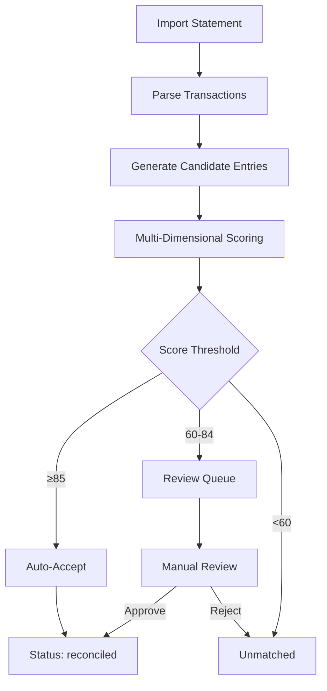
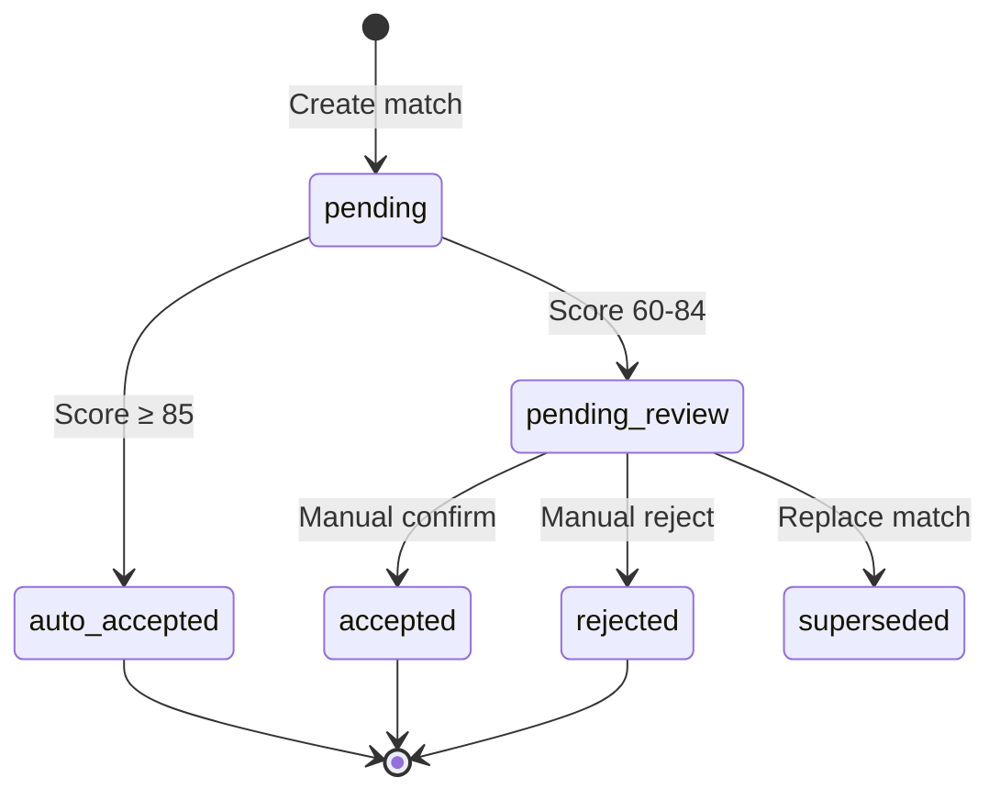

# Reconciliation Engine Domain Model SSOT

> **SSOT Key**: `reconciliation`
> **Core Definition**: Bank reconciliation matching algorithm, confidence scoring, and state machine.

---

## 1. Source of Truth

| Dimension | Physical Location (SSOT) | Description |
|-----------|--------------------------|-------------|
| **Matching Algorithm** | `apps/backend/src/services/reconciliation.py` | Core logic |
| **Scoring Config** | `apps/backend/config/reconciliation.yaml`, `apps/backend/src/services/reconciliation.py` (`DEFAULT_CONFIG`, `load_reconciliation_config`) | Weight, threshold, and tolerance parameters |
| **Model Definition** | `apps/backend/src/models/reconciliation.py` | ORM |

---

## 2. Architecture Model

**Bank transaction entity**: `AtomicTransaction` (DWD, from statement extraction) is the reconciliation input. Reconciliation reads Layer 2 (`AtomicTransaction`) unconditionally and links matches via `ReconciliationMatch.atomic_txn_id`.

### <a id="thresholds"></a>Reconciliation Thresholds

Runtime threshold values are code/config-owned. The default values live in
`apps/backend/src/services/reconciliation.py` (`DEFAULT_CONFIG`) and are loaded
from `apps/backend/config/reconciliation.yaml` when present. Environment
overrides are applied by `load_reconciliation_config()`:
`RECONCILIATION_AUTO_ACCEPT_THRESHOLD` and `RECONCILIATION_REVIEW_THRESHOLD`.
This section explains the default routing semantics; update the config/code and
tests first when changing values.

| Score Range | Action | Status Transition |
|-------------|--------|-------------------|
| ≥ 85 | Auto-Accept | `pending` → `auto_accepted` |
| 60–84 | Review Queue | `pending` → `pending_review` |
| < 60 | Unmatched | stays `pending` |

### Reconciliation Flow


```mermaid
flowchart TB
    A[Import Statement] --> B[Parse Transactions]
    B --> C[Generate Candidate Entries]
    C --> D[Multi-Dimensional Scoring]
    D --> E{Score Threshold}
    E -->|≥85| F[Auto-Accept]
    E -->|60-84| G[Review Queue]
    E -->|<60| H[Unmatched]
    F --> I[Status: reconciled]
    G --> J[Manual Review]
    J -->|Approve| I
    J -->|Reject| H
```

### <a id="state-machine"></a>State Machine


```mermaid
stateDiagram-v2
    [*] --> pending: Create match
    pending --> auto_accepted: Score ≥ 85
    pending --> pending_review: Score 60-84
    pending_review --> accepted: Manual confirm
    pending_review --> rejected: Manual reject
    pending_review --> superseded: Replace match
    auto_accepted --> [*]
    accepted --> [*]
    rejected --> [*]
```

---

## 3. Multi-Dimensional Match Scoring

### Scoring Weight Configuration

```yaml
# apps/backend/config/reconciliation.yaml
scoring:
  weights:
    amount: 0.40      # Amount matching
    date: 0.25        # Date proximity
    description: 0.20 # Description similarity
    business: 0.10    # Business logic
    history: 0.05     # Historical pattern

  thresholds:
    auto_accept: 85   # Auto-accept
    pending_review: 60 # Enter review queue
    
  tolerances:
    amount_percent: 0.005  # Amount tolerance 0.5%
    amount_absolute: 0.10  # Amount absolute tolerance $0.10
    date_days: 7           # Date tolerance days
```

Environment overrides:

- `RECONCILIATION_AUTO_ACCEPT_THRESHOLD`
- `RECONCILIATION_REVIEW_THRESHOLD`

### Scoring Algorithm

```python
def calculate_match_score(
    transaction: AtomicTransaction,
    entries: list[JournalEntry]
) -> MatchScore:
    scores = {}
    
    # 1. Amount matching (40%)
    amount_diff = abs(transaction.amount - entry_total)
    if amount_diff <= Decimal("0.01"):
        scores["amount"] = 100
    elif amount_diff / transaction.amount < Decimal("0.005"):
        scores["amount"] = 90
    elif amount_diff <= Decimal("5.00"):
        scores["amount"] = 70  # Fee split heuristic
    else:
        scores["amount"] = max(0, 100 - float(amount_diff) * 10)
    
    # 2. Date proximity (25%)
    date_diff = min(abs((transaction.date - e.entry_date).days) for e in entries)
    if date_diff == 0:
        scores["date"] = 100
    elif date_diff <= 3:
        scores["date"] = 90
    elif date_diff <= 7:
        scores["date"] = 70
    else:
        scores["date"] = max(0, 100 - date_diff * 10)
    
    # 3. Description similarity (20%)
    scores["description"] = calculate_text_similarity(
        transaction.description,
        " / ".join(e.memo or "" for e in entries)
    )
    
    # 4. Business logic (10%)
    scores["business"] = min(validate_business_logic(transaction, e) for e in entries)
    
    # 5. Historical pattern (5%)
    scores["history"] = check_historical_pattern(transaction)
    
    # Weighted calculation
    total = sum(
        scores[k] * WEIGHTS[k] 
        for k in scores
    )
    
    return MatchScore(
        total=total,
        breakdown=scores
    )
```

Amount matching uses the bank/cash side of each candidate journal entry:

- Statement `IN` transactions match asset debit lines.
- Statement `OUT` transactions match asset credit lines.
- If no bank/cash-side asset line is available, scoring falls back to the entry debit total for backward compatibility.

This prevents split entries, clearing lines, tax lines, and payable/receivable lines from inflating the transaction amount used for bank reconciliation.

### Versioning & Audit Trail

- `ReconciliationMatch` records are immutable; corrections create a new version.
- Use `version` and `superseded_by_id` to link replacements.
- Active matches satisfy: `status != superseded` and `superseded_by_id IS NULL`.

---

## 4. Design Constraints (Dos & Don'ts)

### ✅ Recommended Patterns

- **Pattern A**: Auto-matches must record `score_breakdown` for audit
- **Pattern B**: One-to-many matches must verify amount totals
- **Pattern C**: Cross-period matches extend date tolerance to ±7 days
- **Pattern D**: Review queue updates use row-level locking and increment `version` to prevent concurrent overwrites
- **Pattern E (Performance)**: Matching engine must pre-fetch candidates for the entire statement period and cache historical pattern scores to avoid N+1 database queries.
- **Pattern F**: Amount scoring must compare the statement amount to bank/cash-side asset lines, not the whole journal entry debit total.

### ⛔ Prohibited Patterns

- **Anti-pattern A**: **NEVER** mark as matched without scoring
- **Anti-pattern B**: **NEVER** delete rejected match records (preserve audit trail)
- **Anti-pattern C**: **NEVER** use non-bank split lines to inflate the amount matched to a bank statement transaction.

---

## 5. Standard Operating Procedures (Playbooks)

### SOP-001: Handle Unmatched Transactions

1. Check if there's a delayed corresponding record
2. Try expanding date range to re-match
3. Manually create entry and link

### SOP-002: Batch Review

1. Filter pending review records with same counterparty, similar amounts
2. Sample verify 10% of matches for correctness
3. Batch accept or reject

### SOP-003: Handle Fee Discrepancies

1. Identify difference < tolerance threshold
2. Auto-suggest creating fee entry
3. Link as combined match

---

## 6. Verification & Testing (The Proof)

| Behavior | Verification Method | Status |
|----------|---------------------|--------|
| Exact match score > 85 | `test_execute_matching_auto_accepts_exact_match` | ✅ Done |
| Tolerance match score 60-84 | `test_execute_matching_pending_review_and_unmatched` | ✅ Done |
| One-to-many match | `test_execute_matching_multi_entry_combinations` and audit scenario `one-to-many-fee-split` | ✅ Done |
| Cross-period match | `test_month_end_to_month_start_match` and audit scenario `cross-period` | ✅ Done |
| Deterministic accuracy audit harness | `python tools/reconciliation_audit.py --stdout` and `tests/tooling/test_reconciliation_audit.py` | ✅ CI hard gate |

### Accuracy Audit Harness

EPIC-004 production-quality claims require an audit-grade expected-vs-actual
run, not only individual scoring examples. The harness in
`apps/backend/src/services/reconciliation_audit.py` builds deterministic golden
scenarios for exact matches, similar matches, unrelated transactions,
review-band routing, transfer-shaped transactions, many-to-one settlement,
one-to-many fee splits, and cross-period timing. The command
`python tools/reconciliation_audit.py --stdout` emits:

- `artifacts/reconciliation-audit/reconciliation-audit.json`
- `artifacts/reconciliation-audit/reconciliation-audit.md`

Reports include accuracy, false-positive, false-negative, review-routing,
unmatched, per-scenario score breakdown, and deterministic 10,000-transaction
pair-scoring benchmark metrics. The CI `ac-traceability` job treats the harness
as a hard gate for the `>=95%` accuracy, `<0.5%` false-positive, `<2%`
false-negative, and `<10s` runtime targets. The golden dataset includes the
core exact/review/unmatched/group/cross-period paths plus a 100-transaction
manual false-positive audit.

---

## Used by

- [schema.md](./schema.md)
- [common/ledger/readme.md](https://github.com/wangzitian0/finance_report/blob/main/common/ledger/readme.md)

---

## 7. EPIC-016 Two-Stage Review (New)

EPIC-016 introduces a two-stage review workflow before reconciliation:

### Stage 1: Record-Level Review

**Location**: `/statements/{id}/review`

**Purpose**: Validate extracted transaction data against original document.

**Flow**:
1. Parse statement → `status=PARSED`
2. User reviews transactions with PDF preview
3. Balance chain validation (tolerance: 0.001 USD)
4. Approve → `stage1_status=APPROVED`, `status=APPROVED`
5. Reject → `stage1_status=REJECTED`, `status=REJECTED`

**Balance Validation Logic**:
```
opening_delta = abs(stated_opening - derived_opening)
closing_delta = abs(stated_closing - calculated_closing)
valid = (opening_delta <= 0.001) AND (closing_delta <= 0.001)
```

**New Fields** (StatementSummary):
- `stage1_status`: PENDING_REVIEW | APPROVED | REJECTED | EDITED
- `balance_validation_result`: JSONB with validation details (opening/closing deltas)
- `stage1_reviewed_at`: Timestamp
- `manual_opening_balance`: Manual override for first statement
- `currency_balances`: JSONB array `[{currency, opening, closing}]` for
  multi-currency statements (see below)

### <a id="per-currency-balance-reconciliation"></a>Per-Currency Balance Reconciliation

A statement may hold balances in more than one currency (Wise, IBKR, Futu). The
scalar `opening_balance` / `closing_balance` columns cannot represent that, so a
multi-currency statement also carries a `currency_balances` JSONB array of
`{currency, opening, closing}`. This is **additive**: the scalar columns stay
populated for the single-currency case and backward compatibility, and a
single-currency statement maps to a one-element array.

**Generalized invariant — per account, per currency.** Reconciliation runs
**independently for each currency** and never sums across currencies:

```
for each currency ccy on the statement:
    opening_ccy + Σ(IN_ccy) − Σ(OUT_ccy) ≈ closing_ccy   (within tolerance)
statement is balance_valid  ⟺  every currency balances
```

Transactions are grouped by their own `currency`. The legacy scalar check
(`opening + Σ(IN) − Σ(OUT) ≈ closing`) is the **degenerate one-currency case** of
this rule. A mismatch in one currency flags only that currency; the per-currency
result is surfaced as a `per_currency` list, one entry per currency, so a
multi-currency statement is a set of independent single-currency closed loops.

Implemented by `validate_balance_per_currency` (`services/validation.py`);
schema `CurrencyBalance` (`schemas/extraction.py`). (#1123 AC1)

### <a id="fx-cross-currency-transfer-pairing"></a>FX / Cross-Currency Transfer Pairing

A cross-currency transfer (money leaves `from_account` in currency A and arrives
in `to_account` as currency B at a conversion rate) is **one economic event
spanning two legs**, not two independent income/expense transactions. The paired
multi-leg event is recorded additively in the `fx_conversions` linking table
(`{user_id, from_account, amount_from, currency_from, to_account, amount_to,
currency_to, rate, fee, fee_currency, conversion_date}`).

**Pairing rule (#1123 AC2).** Two legs pair iff ALL of:

1. **Same owner** — identical `user_id`.
2. **Opposite direction** — one `OUT` leg and one `IN` leg.
3. **Time window** — `|out.occurred_at − in.occurred_at| ≤ window` (default 2 days).
4. **Implied-rate match** — `amount_from / amount_to` is within a relative
   `tolerance` (default 0.5%) of the observed market rate (quoted
   `currency_from / currency_to`, matching `services/fx.get_exchange_rate`).

Implemented by `pair_fx_legs` / `build_fx_conversion`
(`services/fx_transfer.py`); rate orientation matches `services/fx.py`. (#1123 AC2)

**Ledger-based auto-discovery (#1123 AC2 live).** A transfer that is recorded
only as RAW journal lines — with no pre-seeded `fx_conversions` row — is still
recognised. `services/fx_transfer_discovery.discover_fx_conversions` scans the
user's `ASSET`-account journal lines in the window, reinterprets each as a
directional `TransferLeg` (asset `DEBIT` = money `IN`, asset `CREDIT` = money
`OUT`), and pairs OUT/IN candidates through the same `pair_fx_legs` rule above
(market rate fetched per candidate via `get_exchange_rate`). The discovery is
**conservative and deterministic**: it materialises a conversion only for an
**unambiguous 1:1 match** — if a leg could pair with more than one counterpart it
is left alone, so discovery biases toward *under*-netting and skips ambiguous
matches — reducing false-positive netting, though it cannot fully eliminate it
without an explicit linkage signal. Discovered conversions are in-memory only (not persisted) and feed the
reporting consumer alongside any recorded rows, deduplicated by the unordered pair
of anchored journal entries.

### Stage 2: Consistency Checks

**Location**: `/reconciliation/review-queue`

**Purpose**: Run deduplication, transfer detection, and anomaly checks before batch approval.

**Check Types**:
| Type | Description | Severity |
|------|-------------|----------|
| `duplicate` | Same amount/date/description within 1 day (global check) | high |
| `transfer_pair` | Matching OUT/IN across accounts (global check) | medium |
| `anomaly` | Large amount, frequency spike, new merchant | varies |

**Constraint**: Batch approve blocked if unresolved checks exist.

Accepted match transitions are idempotent:

- `pending_review -> accepted` is the only transition that may create or
  reconcile journal entries.
- Retrying `accept_match()` or Stage 2 batch approval after a match is already
  `accepted` must return the existing state without incrementing `version` or
  creating duplicate statement-derived journal entries.
- Any missing auto-created entry must be created through the same posting
  invariants used by regular journal posting: double-entry balance, FX-rate
  requirements, active accounts, and system-account restrictions.

The Stage 2 queue response must derive `confidence_tier` from the actual
`ReconciliationMatch.match_score`:

| Score Range | Confidence Tier |
|-------------|-----------------|
| >= 85 | HIGH |
| 60-84 | MEDIUM |
| < 60 or null | LOW |

The `/review/run/[runId]` frontend page currently uses the shared global
`/statements/stage2/queue` endpoint and shows `runId` as navigation context.
Until a backend run-scoped queue contract is introduced, the UI must not imply
that the queue payload is isolated to a persisted batch/run.

## Audit Anchors

`reconciliation_matches.journal_entry_ids` remains a compatibility JSONB field
for existing API responses and historical payloads. The trusted audit anchor is
the normalized `reconciliation_match_journal_entries` table.

Rules:

- A normalized reconciliation link must reference an existing
  `journal_entries.id`.
- The referenced journal entry must belong to the same user as the match's
  `atomic_txn_id`.
- Invalid, missing, or cross-user legacy UUIDs in `journal_entry_ids` must not
  be treated as trusted report/source anchors.

**State Machine**:
```
[*] --> pending: Check detected
pending --> approved: User acknowledges (idempotent)
pending --> rejected: User flags for fix
pending --> flagged: Needs manual review
```

### API Endpoints

| Method | Path | Description |
|--------|------|-------------|
| GET | `/statements/{id}/review` | Stage 1 review data with PDF URL |
| POST | `/statements/{id}/review/approve` | Approve with balance validation |
| POST | `/statements/{id}/review/reject` | Reject and trigger re-parse |
| POST | `/statements/{id}/review/edit` | Unsupported — returns HTTP 400 (reject + re-parse instead) |
| POST | `/statements/{id}/review/opening-balance` | Set manual opening balance |
| GET | `/review/conflicts/{statement_id}` | Stage 1 duplicate and transfer-pair conflict candidates |
| GET | `/statements/stage2/queue` | Stage 2 review queue (global) |
| POST | `/statements/{id}/stage2/run-checks` | Run consistency checks for statement |
| POST | `/statements/consistency-checks/{id}/resolve` | Resolve a check |
| GET | `/statements/consistency-checks/list` | List/filter consistency checks |
| POST | `/statements/batch-approve-matches` | Batch approve matches |
| POST | `/statements/batch-reject-matches` | Batch reject matches |

### Files

| Dimension | Location |
|-----------|----------|
| Model | `apps/backend/src/models/statement_enums.py` (Stage1Status), `apps/backend/src/models/statement_summary.py` (StatementSummary) |
| Model | `apps/backend/src/models/consistency_check.py` |
| Service | `apps/backend/src/services/statement_validation.py` |
| Service | `apps/backend/src/services/consistency_checks.py` |
| Router | `apps/backend/src/routers/statements.py` |
| Frontend | `apps/frontend/src/app/(main)/statements/[id]/review/page.tsx` |
| Frontend | `apps/frontend/src/components/review/Stage2ReviewQueue.tsx` |
| Frontend | `apps/frontend/src/app/(main)/reconciliation/review-queue/page.tsx` |
| Frontend | `apps/frontend/src/app/(main)/review/run/[runId]/page.tsx` |
