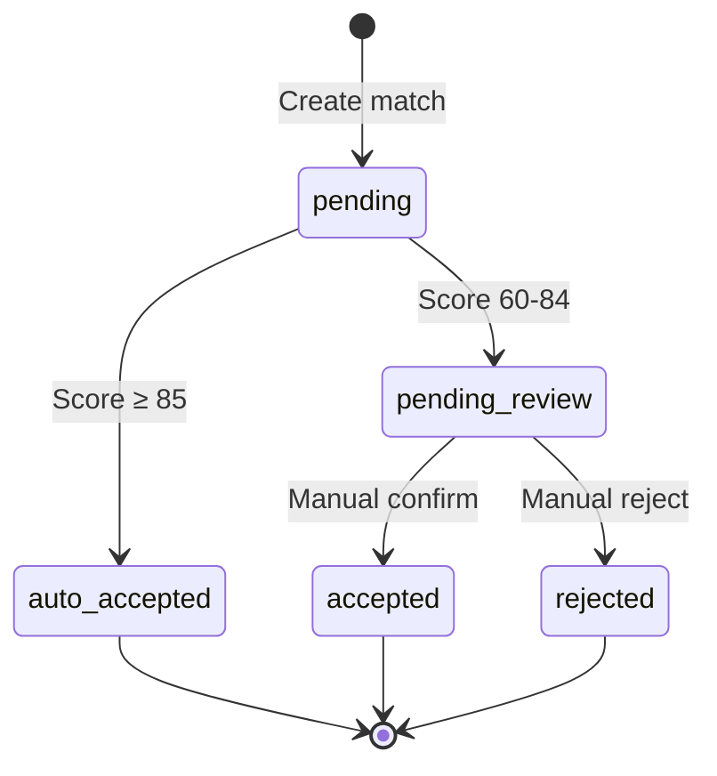

# Reconciliation Engine Domain Model SSOT

> **SSOT Key**: `reconciliation`
> **Core Definition**: Bank reconciliation matching algorithm, confidence scoring, and state machine.

---

## 1. Source of Truth

| Dimension | Physical Location (SSOT) | Description |
|-----------|--------------------------|-------------|
| **Matching Algorithm** | `apps/backend/src/services/reconciliation.py` | Core logic |
| **Scoring Config** | `apps/backend/src/config/reconciliation.yaml` | Weight parameters |
| **Model Definition** | `apps/backend/src/models/reconciliation.py` | ORM |

---

## 2. Architecture Model

### Reconciliation Flow


### State Machine



---

## 3. Multi-Dimensional Match Scoring

### Scoring Weight Configuration

```yaml
# config/reconciliation.yaml
scoring:
  weights:
    amount: 0.40      # Amount matching
    date: 0.25        # Date proximity
    description: 0.20 # Description similarity
    business: 0.10    # Business logic
    history: 0.05     # Historical pattern

  thresholds:
    auto_accept: 85   # Auto-accept
    pending_review: 60 # Enter review queue
    
  tolerances:
    amount_percent: 0.005  # Amount tolerance 0.5%
    amount_absolute: 0.10  # Amount absolute tolerance $0.10
    date_days: 7           # Date tolerance days
```

### Scoring Algorithm

```python
def calculate_match_score(
    transaction: BankTransaction,
    entry: JournalEntry
) -> MatchScore:
    scores = {}
    
    # 1. Amount matching (40%)
    amount_diff = abs(transaction.amount - entry.amount)
    if amount_diff < Decimal("0.01"):
        scores["amount"] = 100
    elif amount_diff / transaction.amount < Decimal("0.005"):
        scores["amount"] = 90
    else:
        scores["amount"] = max(0, 100 - float(amount_diff) * 10)
    
    # 2. Date proximity (25%)
    date_diff = abs((transaction.date - entry.date).days)
    if date_diff == 0:
        scores["date"] = 100
    elif date_diff <= 3:
        scores["date"] = 90
    elif date_diff <= 7:
        scores["date"] = 70
    else:
        scores["date"] = max(0, 100 - date_diff * 10)
    
    # 3. Description similarity (20%)
    scores["description"] = calculate_text_similarity(
        transaction.description,
        entry.memo
    )
    
    # 4. Business logic (10%)
    scores["business"] = validate_business_logic(transaction, entry)
    
    # 5. Historical pattern (5%)
    scores["history"] = check_historical_pattern(transaction)
    
    # Weighted calculation
    total = sum(
        scores[k] * WEIGHTS[k] 
        for k in scores
    )
    
    return MatchScore(
        total=total,
        breakdown=scores
    )
```

---

## 4. Design Constraints (Dos & Don'ts)

### ✅ Recommended Patterns

- **Pattern A**: Auto-matches must record `score_breakdown` for audit
- **Pattern B**: One-to-many matches must verify amount totals
- **Pattern C**: Cross-period matches extend date tolerance to ±7 days

### ⛔ Prohibited Patterns

- **Anti-pattern A**: **NEVER** mark as matched without scoring
- **Anti-pattern B**: **NEVER** delete rejected match records (preserve audit trail)

---

## 5. Standard Operating Procedures (Playbooks)

### SOP-001: Handle Unmatched Transactions

1. Check if there's a delayed corresponding record
2. Try expanding date range to re-match
3. Manually create entry and link

### SOP-002: Batch Review

1. Filter pending review records with same counterparty, similar amounts
2. Sample verify 10% of matches for correctness
3. Batch accept or reject

### SOP-003: Handle Fee Discrepancies

1. Identify difference < tolerance threshold
2. Auto-suggest creating fee entry
3. Link as combined match

---

## 6. Verification & Testing (The Proof)

| Behavior | Verification Method | Status |
|----------|---------------------|--------|
| Exact match score > 85 | `test_exact_match` | ⏳ Pending |
| Tolerance match score 60-84 | `test_fuzzy_match` | ⏳ Pending |
| One-to-many match | `test_one_to_many` | ⏳ Pending |
| Cross-period match | `test_cross_period` | ⏳ Pending |

---

## Used by

- [schema.md](./schema.md)
- [accounting.md](./accounting.md)
