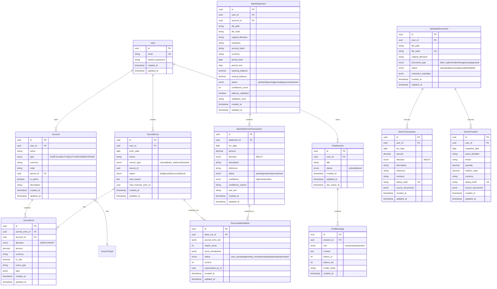

# Database Schema (Source of Truth)

> **SSOT Key**: `schema`
> **Purpose**: PostgreSQL core table structures, relationships, and migration patterns.

---

## 1. Source of Truth

### Physical File Locations

| File | Purpose |
|------|---------|
| `apps/backend/src/models/` | SQLAlchemy ORM models |
| `apps/backend/migrations/` | Alembic migration files |
| `apps/backend/src/schemas/` | Pydantic validation schemas |

> **Note**: Local dev currently calls `init_db()` to create tables; production should apply Alembic migrations.

---

## 2. Architecture Model

### ER Diagram



### Core Tables

#### Users

| Column | Type | Constraint | Description |
|--------|------|------------|-------------|
| id | UUID | PK | Primary key |
| email | VARCHAR(255) | UNIQUE, NOT NULL | Login email |
| hashed_password | VARCHAR(255) | NOT NULL | Password hash |
| created_at | TIMESTAMP | NOT NULL | Creation time |
| updated_at | TIMESTAMP | NOT NULL | Update time |

#### Accounts

| Column | Type | Constraint | Description |
|--------|------|------------|-------------|
| id | UUID | PK | Primary key |
| user_id | UUID | FK -> Users, NOT NULL | Owner user |
| name | VARCHAR(255) | NOT NULL | Account name |
| type | ENUM | NOT NULL | ASSET/LIABILITY/EQUITY/INCOME/EXPENSE |
| currency | CHAR(3) | NOT NULL | Currency code |
| code | VARCHAR(50) | | Account code (e.g., 1110) |
| parent_id | UUID | FK -> Accounts | Parent account |
| is_active | BOOLEAN | DEFAULT true | Is active |
| description | VARCHAR(500) | | Optional account description |
| created_at | TIMESTAMP | NOT NULL | Creation time |
| updated_at | TIMESTAMP | NOT NULL | Update time |

#### JournalEntries

| Column | Type | Constraint | Description |
|--------|------|------------|-------------|
| id | UUID | PK | Primary key |
| user_id | UUID | FK -> Users, NOT NULL | Owner user |
| entry_date | DATE | NOT NULL | Entry date |
| memo | VARCHAR(500) | NOT NULL | Description |
| source_type | ENUM | NOT NULL | manual/bank_statement/system |
| source_id | UUID | | Related source record |
| status | ENUM | NOT NULL | draft/posted/reconciled/void |
| void_reason | TEXT | | Void reason |
| void_reversal_entry_id | UUID | | Reversal entry ID |
| created_at | TIMESTAMP | NOT NULL | Creation time |
| updated_at | TIMESTAMP | NOT NULL | Update time |

#### JournalLines

| Column | Type | Constraint | Description |
|--------|------|------------|-------------|
| id | UUID | PK | Primary key |
| journal_entry_id | UUID | FK -> JournalEntries | Parent entry |
| account_id | UUID | FK -> Accounts | Account |
| direction | ENUM | NOT NULL | DEBIT/CREDIT |
| amount | DECIMAL(18,2) | NOT NULL | Amount |
| currency | CHAR(3) | NOT NULL | Currency |
| fx_rate | DECIMAL(12,6) | | Exchange rate |
| event_type | VARCHAR(100) | | Event type |
| tags | JSONB | | Tags |

**Constraints**:
- Each JournalEntry must have at least 2 JournalLines
- `SUM(DEBIT) = SUM(CREDIT)` (debit/credit balance)
- `JournalLine.amount > 0` (positive_amount check)

#### BankStatements

| Column | Type | Constraint | Description |
|--------|------|------------|-------------|
| id | UUID | PK | Primary key |
| user_id | UUID | FK -> Users, NOT NULL | Owner user |
| account_id | UUID | FK -> Accounts | Linked account (nullable until confirmed) |
| file_path | VARCHAR(500) | NOT NULL | Storage path |
| file_hash | VARCHAR(64) | NOT NULL | SHA256 for dedup |
| original_filename | VARCHAR(255) | NOT NULL | Uploaded filename |
| institution | VARCHAR(100) | NOT NULL | Bank/broker name |
| account_last4 | VARCHAR(4) | | Last 4 digits |
| currency | CHAR(3) | | Currency (nullable while parsing) |
| period_start | DATE | | Statement start (nullable while parsing) |
| period_end | DATE | | Statement end (nullable while parsing) |
| opening_balance | DECIMAL(18,2) | | Opening balance (nullable while parsing) |
| closing_balance | DECIMAL(18,2) | | Closing balance (nullable while parsing) |
| status | ENUM | NOT NULL | uploaded/parsing/parsed/approved/rejected |
| confidence_score | INT | | Extraction confidence (nullable while parsing) |
| balance_validated | BOOLEAN | | Balance check result (nullable while parsing) |
| validation_error | TEXT | | Validation notes |
| created_at | TIMESTAMP | NOT NULL | Creation time |
| updated_at | TIMESTAMP | NOT NULL | Update time |

**Constraints**: `(user_id, file_hash)` unique to prevent duplicate imports

#### BankStatementTransactions

| Column | Type | Constraint | Description |
|--------|------|------------|-------------|
| id | UUID | PK | Primary key |
| statement_id | UUID | FK -> BankStatements | Parent statement |
| txn_date | DATE | NOT NULL | Transaction date |
| amount | DECIMAL(18,2) | NOT NULL | Absolute amount |
| direction | ENUM | NOT NULL | IN/OUT |
| description | TEXT | NOT NULL | Description/merchant |
| reference | VARCHAR(100) | | Reference |
| status | ENUM | NOT NULL | pending/matched/unmatched |
| confidence | ENUM | NOT NULL | high/medium/low |
| confidence_reason | TEXT | | Extraction notes |
| raw_text | TEXT | | OCR raw content |
| created_at | TIMESTAMP | NOT NULL | Creation time |
| updated_at | TIMESTAMP | NOT NULL | Update time |

#### ReconciliationMatches

| Column | Type | Constraint | Description |
|--------|------|------------|-------------|
| id | UUID | PK | Primary key |
| bank_txn_id | UUID | FK -> BankStatementTransactions | Bank transaction |
| journal_entry_ids | JSONB | | Journal entry IDs |
| match_score | INT | NOT NULL | Composite score |
| score_breakdown | JSONB | | Score breakdown |
| status | ENUM | NOT NULL | auto_accepted/pending_review/accepted/rejected/superseded |
| version | INT | NOT NULL | Version number |
| superseded_by_id | UUID | | Next version ID |
| created_at | TIMESTAMP | NOT NULL | Creation time |
| updated_at | TIMESTAMP | NOT NULL | Update time |

#### ChatSessions & ChatMessages

**ChatSessions**

| Column | Type | Constraint | Description |
|--------|------|------------|-------------|
| id | UUID | PK | Primary key |
| user_id | UUID | FK -> Users, NOT NULL | Owner user |
| title | VARCHAR(200) | | Optional session title |
| status | ENUM | NOT NULL | active/deleted |
| created_at | TIMESTAMP | NOT NULL | Creation time |
| updated_at | TIMESTAMP | NOT NULL | Update time |
| last_active_at | TIMESTAMP | | Last message activity |

**ChatMessages**

| Column | Type | Constraint | Description |
|--------|------|------------|-------------|
| id | UUID | PK | Primary key |
| session_id | UUID | FK -> ChatSessions, NOT NULL | Parent session |
| role | ENUM | NOT NULL | user/assistant/system |
| content | TEXT | NOT NULL | Message content |
| tokens_in | INTEGER | | Estimated prompt tokens |
| tokens_out | INTEGER | | Estimated completion tokens |
| model_name | VARCHAR(100) | | Model identifier |
| created_at | TIMESTAMP | NOT NULL | Creation time |

### Layer 1 & 2 Tables (EPIC-011)

#### UploadedDocuments (Layer 1)

Immutable registry of all raw uploaded files.

| Column | Type | Constraint | Description |
|--------|------|------------|-------------|
| id | UUID | PK | Primary key |
| user_id | UUID | FK -> Users, NOT NULL | Owner user |
| file_path | VARCHAR(500) | NOT NULL | MinIO/S3 object key |
| file_hash | VARCHAR(64) | NOT NULL | SHA256 (User + Hash unique) |
| original_filename | VARCHAR(255) | NOT NULL | Uploaded filename |
| document_type | ENUM | NOT NULL | bank_statement/brokerage_statement/esop_grant/property_appraisal |
| status | ENUM | NOT NULL | uploaded/processing/completed/failed |
| extraction_metadata | JSONB | | AI logs, confidence scores |
| created_at | TIMESTAMP | NOT NULL | Creation time |
| updated_at | TIMESTAMP | NOT NULL | Update time |

**Constraints**: `(user_id, file_hash)` unique to prevent duplicate uploads

#### AtomicTransactions (Layer 2)

Deduplicated, immutable financial events from any source.

| Column | Type | Constraint | Description |
|--------|------|------------|-------------|
| id | UUID | PK | Primary key |
| user_id | UUID | FK -> Users, NOT NULL | Owner user |
| txn_date | DATE | NOT NULL | Transaction date |
| amount | DECIMAL(18,2) | NOT NULL | Absolute amount |
| direction | ENUM | NOT NULL | IN/OUT |
| description | TEXT | NOT NULL | Description |
| reference | VARCHAR(100) | | Reference ID |
| currency | CHAR(3) | NOT NULL | Currency code |
| dedup_hash | VARCHAR(64) | NOT NULL | SHA256 of core fields |
| source_documents | JSONB | NOT NULL | List of `{doc_id, doc_type}` |
| created_at | TIMESTAMP | NOT NULL | Creation time |
| updated_at | TIMESTAMP | NOT NULL | Update time |

**Constraints**: `(user_id, dedup_hash)` unique; Append-only `source_documents` array

#### AtomicPositions (Layer 2)

Deduplicated, immutable asset snapshots.

| Column | Type | Constraint | Description |
|--------|------|------------|-------------|
| id | UUID | PK | Primary key |
| user_id | UUID | FK -> Users, NOT NULL | Owner user |
| snapshot_date | DATE | NOT NULL | Snapshot date |
| asset_identifier | VARCHAR(255) | NOT NULL | Ticker/ISIN/Address |
| broker | VARCHAR(100) | | Broker/Custodian name |
| quantity | DECIMAL(18,6) | NOT NULL | Units held |
| market_value | DECIMAL(18,2) | NOT NULL | Total value in currency |
| currency | CHAR(3) | NOT NULL | Currency code |
| dedup_hash | VARCHAR(64) | NOT NULL | SHA256 of core fields |
| source_documents | JSONB | NOT NULL | List of `{doc_id, doc_type}` |
| created_at | TIMESTAMP | NOT NULL | Creation time |
| updated_at | TIMESTAMP | NOT NULL | Update time |

**Constraints**: `(user_id, dedup_hash)` unique

### Index Strategy

```sql
-- User query optimization
CREATE INDEX idx_accounts_user_id ON accounts(user_id);
CREATE INDEX idx_journal_entries_user_id ON journal_entries(user_id);
CREATE INDEX idx_journal_entries_status ON journal_entries(status);

-- Date range queries
CREATE INDEX idx_journal_entries_date ON journal_entries(entry_date);
CREATE INDEX idx_bank_statement_transactions_date ON bank_statement_transactions(txn_date);

-- Status queries
CREATE INDEX idx_bank_statements_status ON bank_statements(status);
CREATE INDEX idx_bank_statement_transactions_status ON bank_statement_transactions(status);
CREATE INDEX idx_recon_match_status ON reconciliation_matches(status);

-- Dedup for statement imports
CREATE UNIQUE INDEX idx_bank_statements_user_file_hash
    ON bank_statements(user_id, file_hash);

-- Layer 1/2 Indexes (EPIC-011)
CREATE UNIQUE INDEX idx_uploaded_documents_dedup ON uploaded_documents(user_id, file_hash);
CREATE INDEX idx_uploaded_documents_status ON uploaded_documents(status);

CREATE UNIQUE INDEX idx_atomic_transactions_dedup ON atomic_transactions(user_id, dedup_hash);
CREATE INDEX idx_atomic_transactions_date ON atomic_transactions(txn_date);

CREATE UNIQUE INDEX idx_atomic_positions_dedup ON atomic_positions(user_id, dedup_hash);
CREATE INDEX idx_atomic_positions_date ON atomic_positions(snapshot_date);
```

---

## 3. Design Constraints

### Naming Conventions

| Rule | Description |
|------|-------------|
| **Explicit Enums** | **ALWAYS** provide a `name` parameter to SQLAlchemy `Enum` types |
| **Migration Length** | Keep Alembic migration descriptions concise (< 100 chars) |
| **Revision ID** | Must be manually set to short string (max 12 chars) if auto-generated IDs collide |

**Enum Example**:
```python
# ✅ Good
status = sa.Column(sa.Enum(Status, name="journal_entry_status"))

# ❌ Bad - Implicit name causes migration issues
status = sa.Column(sa.Enum(Status))
```

### Async Session Management

| Rule | Description |
|------|-------------|
| **Dependency Injection** | Use the `get_db` FastAPI dependency for routers |
| **Transaction Boundary** | Routers handle commit/rollback; Services use `flush()` for ID generation |
| **No Leaks** | Every session is closed (handled by `get_db` generator) |

### Hard Rules

| Rule | Description |
|------|-------------|
| **No FLOAT for Money** | **NEVER** use FLOAT to store monetary amounts — use `DECIMAL(18,2)` |
| **No Direct Deletes** | **NEVER** directly delete posted entries — only void |
| **UUID Primary Keys** | Use UUID primary keys for distributed compatibility |
| **Audit Fields** | Use `created_at`/`updated_at` on mutable records |

### Migration Guardrails (Automated)

CI pipelines enforce via `tests/test_schema_guardrails.py`:

1. **Strict Enum Naming**: All `sa.Enum` fields must have `name="..."` explicitly defined
2. **Revision ID Length**: Alembic revision file names must not have excessively long prefixes

---

## 4. Playbooks (SOP)

### Create a New Migration

```bash
# Generate migration
cd apps/backend
alembic revision --autogenerate -m "add_new_table"

# Review generated migration
cat migrations/versions/*_add_new_table.py

# Apply migration
alembic upgrade head
```

### Add a New Table

1. Create model in `src/models/new_model.py`
2. Add to `src/models/__init__.py`
3. Generate migration
4. Apply migration

```python
# src/models/new_model.py
from sqlalchemy import Column, String, Enum
from src.models.base import Base
import uuid
from sqlalchemy.dialects.postgresql import UUID

class NewModel(Base):
    __tablename__ = "new_models"
    
    id = Column(UUID(as_uuid=True), primary_key=True, default=uuid.uuid4)
    name = Column(String(255), nullable=False)
    status = Column(Enum("active", "inactive", name="new_model_status"), nullable=False)
```

### Add a New Enum Field

```python
# ALWAYS use explicit name parameter
from enum import Enum as PyEnum

class MyStatus(str, PyEnum):
    ACTIVE = "active"
    INACTIVE = "inactive"

# In model
status = Column(
    sa.Enum(MyStatus, name="my_status_enum"),  # ← Explicit name REQUIRED
    nullable=False
)
```

### Check Migration Status

```bash
# View current revision
alembic current

# View migration history
alembic history

# Check pending migrations
alembic heads
```

### Rollback Migration

```bash
# Rollback one step
alembic downgrade -1

# Rollback to specific revision
alembic downgrade <revision_id>
```

---

## 5. Verification (The Proof)

### Run Schema Tests

```bash
# Run all schema/model tests
moon run backend:test -- -k schema

# Run guardrail tests specifically
moon run backend:test -- -k test_schema_guardrails
```

### Verify Enum Naming

```bash
# Check all enums have explicit names
grep -r "sa.Enum" apps/backend/src/models/ | grep -v "name="
# Expected: No output (all enums should have name=)
```

### Verify Migration Applies Cleanly

```bash
# Fresh database with all migrations
cd apps/backend
alembic downgrade base
alembic upgrade head
```

### Check Table Structure

```bash
# Connect to database and inspect
psql $DATABASE_URL -c "\d+ accounts"
psql $DATABASE_URL -c "\d+ journal_entries"
```

### Verify Constraints

```sql
-- Check journal balance constraint
SELECT je.id, 
       SUM(CASE WHEN jl.direction = 'DEBIT' THEN jl.amount ELSE 0 END) as debits,
       SUM(CASE WHEN jl.direction = 'CREDIT' THEN jl.amount ELSE 0 END) as credits
FROM journal_entries je
JOIN journal_lines jl ON je.id = jl.journal_entry_id
GROUP BY je.id
HAVING SUM(CASE WHEN jl.direction = 'DEBIT' THEN jl.amount ELSE 0 END) !=
       SUM(CASE WHEN jl.direction = 'CREDIT' THEN jl.amount ELSE 0 END);
-- Expected: No rows (all entries balanced)
```

---

## 6. API Layer Reference

### Users API

| Method | Path | Description |
|--------|------|-------------|
| POST | `/api/users` | Create new user |
| GET | `/api/users?limit=50&offset=0` | List users with pagination |
| GET | `/api/users/{user_id}` | Get user by ID |
| PUT | `/api/users/{user_id}` | Update user |

### Assets API

| Method | Path | Description |
|--------|------|-------------|
| GET | `/api/assets/positions` | List managed positions |
| GET | `/api/assets/positions/{position_id}` | Get single position |
| POST | `/api/assets/reconcile` | Trigger position reconciliation |

See [assets.md](./assets.md) for detailed asset management documentation.

---

## Used by

- [AGENTS.md](../../AGENTS.md) — Agent behavioral guidelines
- [accounting.md](./accounting.md) — Double-entry bookkeeping rules
- [extraction.md](./extraction.md) — Statement parsing models
- [reconciliation.md](./reconciliation.md) — Matching engine models

---

*Last updated: 2026-01-27*
