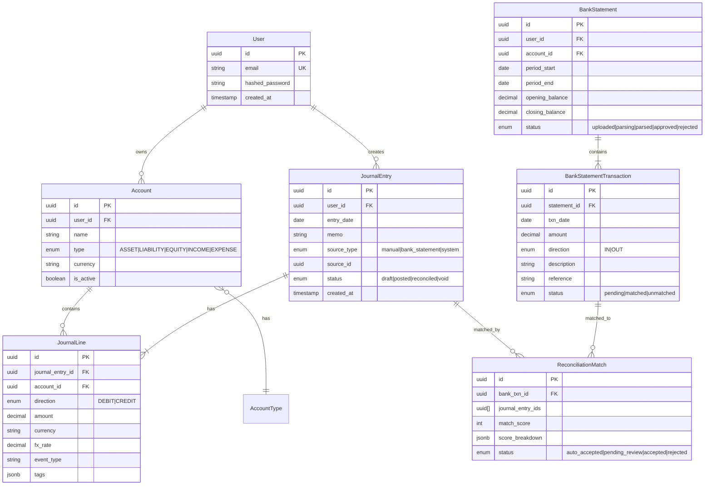

# Database Schema SSOT

> **SSOT Key**: `schema`
> **Core Definition**: PostgreSQL core table structures and relationships.

---

## 1. Source of Truth

| Dimension | Physical Location (SSOT) | Description |
|-----------|--------------------------|-------------|
| **Model Definition** | `apps/backend/src/models/` | SQLAlchemy ORM |
| **Migrations** | `apps/backend/migrations/` | Alembic |
| **Schema Validation** | `apps/backend/src/schemas/` | Pydantic |

---

## 2. ER Model



---

## 3. Core Table Specifications

### Users
User table, supports single-user scenario.

| Column | Type | Constraint | Description |
|--------|------|------------|-------------|
| id | UUID | PK | Primary key |
| email | VARCHAR(255) | UNIQUE, NOT NULL | Login email |
| hashed_password | VARCHAR(255) | NOT NULL | Password hash |
| created_at | TIMESTAMP | NOT NULL | Creation time |

### Accounts
Chart of accounts table, five types.

| Column | Type | Constraint | Description |
|--------|------|------------|-------------|
| id | UUID | PK | Primary key |
| user_id | UUID | FK → Users | Owner user |
| name | VARCHAR(100) | NOT NULL | Account name |
| type | ENUM | NOT NULL | ASSET/LIABILITY/EQUITY/INCOME/EXPENSE |
| currency | CHAR(3) | NOT NULL | Currency code |
| code | VARCHAR(10) | | Account code (e.g., 1110) |
| parent_id | UUID | FK → Accounts | Parent account |
| is_active | BOOLEAN | DEFAULT true | Is active |

### JournalEntries
Journal entry header table.

| Column | Type | Constraint | Description |
|--------|------|------------|-------------|
| id | UUID | PK | Primary key |
| user_id | UUID | FK → Users | Owner user |
| entry_date | DATE | NOT NULL | Entry date |
| memo | TEXT | | Description |
| source_type | ENUM | NOT NULL | manual/bank_statement/system |
| source_id | UUID | | Related source record |
| status | ENUM | NOT NULL | draft/posted/reconciled/void |
| created_at | TIMESTAMP | NOT NULL | Creation time |
| updated_at | TIMESTAMP | NOT NULL | Update time |

### JournalLines
Journal entry line table.

| Column | Type | Constraint | Description |
|--------|------|------------|-------------|
| id | UUID | PK | Primary key |
| journal_entry_id | UUID | FK → JournalEntries | Parent entry |
| account_id | UUID | FK → Accounts | Account |
| direction | ENUM | NOT NULL | DEBIT/CREDIT |
| amount | DECIMAL(18,2) | NOT NULL | Amount |
| currency | CHAR(3) | NOT NULL | Currency |
| fx_rate | DECIMAL(12,6) | | Exchange rate |
| event_type | VARCHAR(50) | | Event type |
| tags | JSONB | | Tags |

**Constraints**:
- Each JournalEntry must have at least 2 JournalLines
- `SUM(DEBIT) = SUM(CREDIT)` (debit/credit balance)

---

## 4. Design Constraints (Dos & Don'ts)

### ✅ Recommended Patterns

- **Pattern A**: Use `DECIMAL(18,2)` for amounts, avoid float precision issues
- **Pattern B**: All tables include `created_at`, `updated_at` audit fields
- **Pattern C**: Use UUID primary keys for distributed compatibility

### ⛔ Prohibited Patterns

- **Anti-pattern A**: **NEVER** use FLOAT to store monetary amounts
- **Anti-pattern B**: **NEVER** directly delete posted entries, only void

---

## 5. Index Strategy

```sql
-- User query optimization
CREATE INDEX idx_accounts_user_id ON accounts(user_id);
CREATE INDEX idx_journal_entries_user_id ON journal_entries(user_id);

-- Date range queries
CREATE INDEX idx_journal_entries_date ON journal_entries(entry_date);
CREATE INDEX idx_bank_txn_date ON bank_statement_transactions(txn_date);

-- Status queries
CREATE INDEX idx_journal_entries_status ON journal_entries(status);
CREATE INDEX idx_recon_match_status ON reconciliation_matches(status);
```

---

## Used by

- [AGENTS.md](../../AGENTS.md)
- [accounting.md](./accounting.md)
