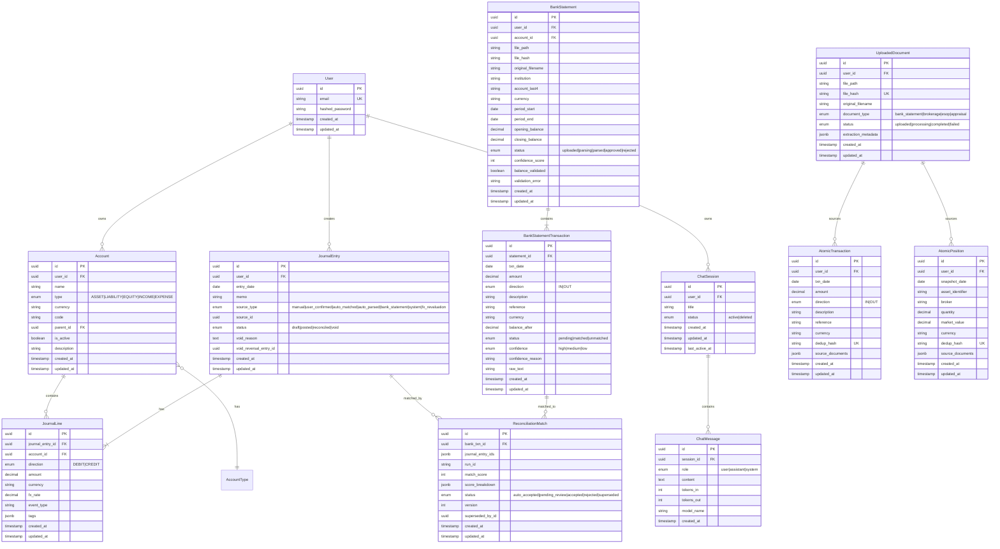

# Database Schema SSOT

> **SSOT Key**: `schema`
> **Core Definition**: PostgreSQL core table structures and relationships.

---

## 1. Source of Truth

| Dimension | Physical Location (SSOT) | Description |
|-----------|--------------------------|-------------|
| **Model Definition** | `apps/backend/src/models/` | SQLAlchemy ORM |
| **Migrations** | `apps/backend/migrations/` | Alembic |
| **Schema Validation** | `apps/backend/src/schemas/` | Pydantic |

> **Note**: Local dev currently calls `init_db()` to create tables; production should apply Alembic migrations.

---

<a id="data-layering"></a>

## 1A. Data Layering Model (ODS / DWD / DWM / DWS / ADS / DIM)

The data tables are classified with a data-warehouse layering vocabulary. This
replaces the earlier ad-hoc "Layer 0/1/2/3/4" numbering. Every data table below
belongs to exactly one layer; cross-cutting application/audit tables are listed
separately. **Code must conform to this classification** — if a table or value
sits in the wrong layer, that is drift to be fixed, not worked around.

### Layer definitions

| Layer | Meaning | Sourced from | Carries `account_id`? | Mutability |
|-------|---------|--------------|-----------------------|------------|
| **DIM** | Conformed reference data the **application** owns, referenced across layers. Non-user data that influences ADS belongs here **as data, not hard-coded in code**. | App / curated | n/a (defines accounts) | Slowly changing |
| **ODS** | **User-side** source data, landed 1:1 as received. No cleaning, no dedup, no account conform. | User uploads / manual entry | No | Append-mostly |
| **DWD** | Cleaned, deduplicated **detail facts**. May carry conformed DIM keys (e.g. `account_id`). The grain is one financial event / one ledger line. | Derived from ODS | Yes (conformed from DIM) | Immutable / posted |
| **DWM** | **Thin** middle layer — only for genuinely complex cross-fact domains. Most domains skip it. | Derived from DWD + DIM | Via DWD | Process state |
| **DWS** | Subject-oriented **summaries** and maintained derived state. | Derived from DWD/DWM | Via DWD | Recomputed |
| **ADS** | **Application/report** outputs consumed by the UI. | Derived from DWS/DWD | n/a | Snapshot |

### Table-to-layer map

| Layer | Tables |
|-------|--------|
| **DIM** | `accounts` (chart of accounts, including the account-type enum column); `classification_rules`; `fx_rates`, `stock_prices`, `market_data_sync_state`, `market_data_overrides`; security / institution master data |
| **ODS** | `uploaded_documents`; `manual_valuation_snapshots`; *(legacy, deprecating)* `bank_statements`, `bank_statement_transactions` |
| **DWD** | `atomic_transactions`, `atomic_positions`; `transaction_classification` (posting-account conform); `statement_summaries` (statement envelope + custody-account conform); `journal_entries`, `journal_lines` (double-entry ledger); `investment_transactions`; `dividend_income` |
| **DWM** | `reconciliation_matches`, `consistency_checks` (matching + transfer-pair / Processing-account resolution) |
| **DWS** | `managed_positions`; `investment_lots`; derived account balances / period aggregates |
| **ADS** | `report_snapshots` (balance sheet, income statement, cash flow) |
| **Cross-cutting** (not a data layer) | `evidence_nodes`, `evidence_edges` (lineage/audit); `users`, `chat_sessions`, `chat_messages`, `workflow_sessions`, `workflow_events`, `ai_feedback`, `corrections`, `ping_state` (application plane) |

### Cross-layer rules

1. **Account is a DIM, conformed at DWD.** `account_id` is assigned when a DWD fact
   is built (`transaction_classification.account_id`, `journal_lines.account_id`),
   conformed from the `accounts` DIM. ODS must not be the source of account
   identity for downstream logic.
2. **DWM/DWS/ADS must resolve dimensions from DWD/DIM, never from ODS.** Reaching
   into `bank_statements.account_id` (ODS) for account context is drift — it only
   appears to work because the legacy ODS row conflates source file and account.
3. **No reference-data-in-code.** Non-user reference that affects ADS (default
   accounts, category/classification mappings, framework policy) belongs in DIM
   tables, not in Python constants.
4. **DWM stays thin.** Add a DWM table only for a genuinely complex cross-fact
   domain (today: reconciliation/transfer matching). Default new work to DWD or DWS.

> **Known drift (being closed):** reconciliation transfer detection (a DWM
> concern) still resolves the source account from ODS
> (`bank_statements.account_id`). PR-A adds the DWD-native custody conform —
> `statement_summaries` (with `resolve_custody_account_id`) — so PR-B can switch
> transfer detection to read the custody account from DWD and flip the read
> cutover. See `docs/project/EPIC-011.asset-lifecycle.md`.

---

<a id="er-model"></a>

## 2. ER Model


```mermaid
erDiagram
    User ||--o{ Account : owns
    User ||--o{ JournalEntry : creates
    User ||--o{ ChatSession : owns

    Account ||--o{ JournalLine : contains
    Account }o--|| AccountType : has

    JournalEntry ||--|{ JournalLine : has
    JournalEntry ||--o{ ReconciliationMatch : matched_by
    ChatSession ||--o{ ChatMessage : contains

    BankStatement ||--|{ BankStatementTransaction : contains
    BankStatementTransaction ||--o{ ReconciliationMatch : matched_to

    UploadedDocument ||--o{ AtomicTransaction : sources
    UploadedDocument ||--o{ AtomicPosition : sources
    
    AtomicTransaction {
        uuid id PK
        uuid user_id FK
        date txn_date
        decimal amount
        enum direction "IN|OUT"
        string description
        string reference
        string currency
        string dedup_hash UK
        jsonb source_documents
        timestamp created_at
        timestamp updated_at
    }

    AtomicPosition {
        uuid id PK
        uuid user_id FK
        date snapshot_date
        string asset_identifier
        string broker
        decimal quantity
        decimal market_value
        string currency
        string dedup_hash UK
        jsonb source_documents
        timestamp created_at
        timestamp updated_at
    }

    UploadedDocument {
        uuid id PK
        uuid user_id FK
        string file_path
        string file_hash UK
        string original_filename
        enum document_type "bank_statement|brokerage|esop|appraisal"
        enum status "uploaded|processing|completed|failed"
        jsonb extraction_metadata
        timestamp created_at
        timestamp updated_at
    }

    User {
        uuid id PK
        string email UK
        string hashed_password
        timestamp created_at
        timestamp updated_at
    }

    Account {
        uuid id PK
        uuid user_id FK
        string name
        enum type "ASSET|LIABILITY|EQUITY|INCOME|EXPENSE"
        string currency
        string code
        uuid parent_id FK
        boolean is_active
        string description
        timestamp created_at
        timestamp updated_at
    }

    JournalEntry {
        uuid id PK
        uuid user_id FK
        date entry_date
        string memo
        enum source_type "manual|user_confirmed|auto_matched|auto_parsed|bank_statement|system|fx_revaluation"
        uuid source_id
        enum status "draft|posted|reconciled|void"
        text void_reason
        uuid void_reversal_entry_id
        timestamp created_at
        timestamp updated_at
    }

    JournalLine {
        uuid id PK
        uuid journal_entry_id FK
        uuid account_id FK
        enum direction "DEBIT|CREDIT"
        decimal amount
        string currency
        decimal fx_rate
        string event_type
        jsonb tags
        timestamp created_at
        timestamp updated_at
    }

    BankStatement {
        uuid id PK
        uuid user_id FK
        uuid account_id FK
        string file_path
        string file_hash
        string original_filename
        string institution
        string account_last4
        string currency
        date period_start
        date period_end
        decimal opening_balance
        decimal closing_balance
        enum status "uploaded|parsing|parsed|approved|rejected"
        int confidence_score
        boolean balance_validated
        string validation_error
        timestamp created_at
        timestamp updated_at
    }

    BankStatementTransaction {
        uuid id PK
        uuid statement_id FK
        date txn_date
        decimal amount
        enum direction "IN|OUT"
        string description
        string reference
        string currency
        decimal balance_after
        enum status "pending|matched|unmatched"
        enum confidence "high|medium|low"
        string confidence_reason
        string raw_text
        timestamp created_at
        timestamp updated_at
    }

    ReconciliationMatch {
        uuid id PK
        uuid bank_txn_id FK
        jsonb journal_entry_ids
        string run_id
        int match_score
        jsonb score_breakdown
        enum status "auto_accepted|pending_review|accepted|rejected|superseded"
        int version
        uuid superseded_by_id
        timestamp created_at
        timestamp updated_at
    }

    ChatSession {
        uuid id PK
        uuid user_id FK
        string title
        enum status "active|deleted"
        timestamp created_at
        timestamp updated_at
        timestamp last_active_at
    }

    ChatMessage {
        uuid id PK
        uuid session_id FK
        enum role "user|assistant|system"
        text content
        int tokens_in
        int tokens_out
        string model_name
        timestamp created_at
    }
```

---

## 3. Core Table Specifications

### Users
User table, supports single-user scenario.

| Column | Type | Constraint | Description |
|--------|------|------------|-------------|
| id | UUID | PK | Primary key |
| email | VARCHAR(255) | UNIQUE, NOT NULL | Login email |
| hashed_password | VARCHAR(255) | NOT NULL | Password hash |
| created_at | TIMESTAMP | NOT NULL | Creation time |
| updated_at | TIMESTAMP | NOT NULL | Update time |

### Accounts
Chart of accounts table, five types.

| Column | Type | Constraint | Description |
|--------|------|------------|-------------|
| id | UUID | PK | Primary key |
| user_id | UUID | FK -> Users, NOT NULL | Owner user |
| name | VARCHAR(255) | NOT NULL | Account name |
| type | ENUM | NOT NULL | ASSET/LIABILITY/EQUITY/INCOME/EXPENSE |
| currency | VARCHAR(3) | NOT NULL | Currency code |
| code | VARCHAR(50) | | Account code (e.g., 1110) |
| parent_id | UUID | FK -> Accounts | Parent account |
| is_active | BOOLEAN | DEFAULT true | Is active |
| description | VARCHAR(500) | | Optional account description |
| created_at | TIMESTAMP | NOT NULL | Creation time |
| updated_at | TIMESTAMP | NOT NULL | Update time |

### JournalEntries
Journal entry header table.

| Column | Type | Constraint | Description |
|--------|------|------------|-------------|
| id | UUID | PK | Primary key |
| user_id | UUID | FK -> Users, NOT NULL | Owner user |
| entry_date | DATE | NOT NULL | Entry date |
| memo | VARCHAR(500) | NOT NULL | Description |
| source_type | ENUM | NOT NULL | manual/user_confirmed/auto_matched/auto_parsed/bank_statement/system/fx_revaluation; `bank_statement` is legacy-normalized to `auto_parsed` |
| source_id | UUID | | Related source record; polymorphic legacy hint that must be resolved with `source_type` and a user-owned typed source record before report traceability treats it as source proof |
| status | ENUM | NOT NULL | draft/posted/reconciled/void |
| void_reason | TEXT | | Void reason |
| void_reversal_entry_id | UUID | | Reversal entry ID |
| created_at | TIMESTAMP | NOT NULL | Creation time |
| updated_at | TIMESTAMP | NOT NULL | Update time |

### JournalLines
Journal entry line table.

| Column | Type | Constraint | Description |
|--------|------|------------|-------------|
| id | UUID | PK | Primary key |
| journal_entry_id | UUID | FK -> JournalEntries | Parent entry |
| account_id | UUID | FK -> Accounts | Account |
| direction | ENUM | NOT NULL | DEBIT/CREDIT |
| amount | DECIMAL(18,2) | NOT NULL | Amount |
| currency | VARCHAR(3) | NOT NULL | Currency |
| fx_rate | DECIMAL(12,6) | | Exchange rate |
| event_type | VARCHAR(100) | | Event type |
| tags | JSONB | | Tags |

### InvestmentTransactions
Auditable brokerage transaction table for buy, sell, and dividend accounting.

| Column | Type | Constraint | Description |
|--------|------|------------|-------------|
| id | UUID | PK | Primary key |
| user_id | UUID | FK -> Users, NOT NULL | Owner user |
| position_id | UUID | FK -> ManagedPositions | Linked position |
| journal_entry_id | UUID | FK -> JournalEntries | Posted ledger entry |
| source_id | UUID | | Upstream statement/parser source |
| transaction_date | DATE | NOT NULL | Trade or payment date |
| transaction_type | ENUM | NOT NULL | buy/sell/dividend |
| asset_identifier | VARCHAR(100) | NOT NULL | Symbol or broker identifier |
| quantity | DECIMAL(18,6) | | Units for buy/sell |
| unit_price | DECIMAL(18,6) | | Per-unit trade price |
| gross_amount | DECIMAL(18,2) | NOT NULL | Posted cash or trade amount |
| fees | DECIMAL(18,2) | NOT NULL | Brokerage fees included in accounting |
| currency | VARCHAR(3) | NOT NULL | Transaction currency |
| cost_basis | DECIMAL(18,2) | | Consumed or created cost basis |
| realized_pnl | DECIMAL(18,2) | | Realized gain/loss for sells |
| cost_basis_method | ENUM | | FIFO/LIFO/AvgCost used for the transaction |
| created_at | TIMESTAMP | NOT NULL | Creation time |
| updated_at | TIMESTAMP | NOT NULL | Update time |

### InvestmentLots
Open lot table used for FIFO, LIFO, and average-cost realized P&L.

| Column | Type | Constraint | Description |
|--------|------|------------|-------------|
| id | UUID | PK | Primary key |
| user_id | UUID | FK -> Users, NOT NULL | Owner user |
| position_id | UUID | FK -> ManagedPositions, NOT NULL | Linked position |
| opening_transaction_id | UUID | FK -> InvestmentTransactions, NOT NULL | Buy transaction that opened the lot |
| asset_identifier | VARCHAR(100) | NOT NULL | Symbol or broker identifier |
| acquisition_date | DATE | NOT NULL | Lot acquisition date |
| original_quantity | DECIMAL(18,6) | NOT NULL | Original units |
| remaining_quantity | DECIMAL(18,6) | NOT NULL | Unsold units |
| unit_cost | DECIMAL(18,6) | NOT NULL | Cost per unit |
| currency | VARCHAR(3) | NOT NULL | Lot currency |
| disposed_date | DATE | | Date the lot was fully consumed |
| created_at | TIMESTAMP | NOT NULL | Creation time |
| updated_at | TIMESTAMP | NOT NULL | Update time |

### ChatSessions
Chat session header table.

| Column | Type | Constraint | Description |
|--------|------|------------|-------------|
| id | UUID | PK | Primary key |
| user_id | UUID | FK -> Users, NOT NULL | Owner user |
| title | VARCHAR(200) | | Optional session title |
| status | ENUM | NOT NULL | active/deleted |
| created_at | TIMESTAMP | NOT NULL | Creation time |
| updated_at | TIMESTAMP | NOT NULL | Update time |
| last_active_at | TIMESTAMP | | Last message activity |

### ChatMessages
Individual chat messages.

| Column | Type | Constraint | Description |
|--------|------|------------|-------------|
| id | UUID | PK | Primary key |
| session_id | UUID | FK -> ChatSessions, NOT NULL | Parent session |
| role | ENUM | NOT NULL | user/assistant/system |
| content | TEXT | NOT NULL | Message content |
| tokens_in | INTEGER | | Estimated prompt tokens |
| tokens_out | INTEGER | | Estimated completion tokens |
| model_name | VARCHAR(100) | | Model identifier |
| created_at | TIMESTAMP | NOT NULL | Creation time |

### BankStatements
Statement header table for imported statements.

| Column | Type | Constraint | Description |
|--------|------|------------|-------------|
| id | UUID | PK | Primary key |
| user_id | UUID | FK -> Users, NOT NULL | Owner user |
| account_id | UUID | FK -> Accounts | Linked account (nullable until confirmed) |
| file_path | VARCHAR(500) | NOT NULL | Storage path |
| file_hash | VARCHAR(64) | NOT NULL | SHA256 for dedup |
| original_filename | VARCHAR(255) | NOT NULL | Uploaded filename |
| institution | VARCHAR(100) | NOT NULL | Bank/broker name |
| account_last4 | VARCHAR(4) | | Last 4 digits |
| currency | VARCHAR(3) |  | Currency (nullable while parsing) |
| period_start | DATE |  | Statement start (nullable while parsing) |
| period_end | DATE |  | Statement end (nullable while parsing) |
| opening_balance | DECIMAL(18,2) |  | Opening balance (nullable while parsing) |
| closing_balance | DECIMAL(18,2) |  | Closing balance (nullable while parsing) |
| status | ENUM | NOT NULL | uploaded/parsing/parsed/approved/rejected |
| confidence_score | INT |  | Extraction confidence (nullable while parsing) |
| balance_validated | BOOLEAN |  | Balance check result (nullable while parsing) |
| validation_error | TEXT | | Validation notes |
| extraction_metadata | JSONB | | Durable parser handoff metadata, including structured brokerage OCR positions used by statement-scoped imports |
| created_at | TIMESTAMP | NOT NULL | Creation time |
| updated_at | TIMESTAMP | NOT NULL | Update time |

**Constraints**:
- `(user_id, file_hash)` unique to prevent duplicate imports

**Derived API Surface**:
- `GET /api/accounts/coverage` derives account-level statement coverage from
  approved `BankStatements` only. It reports the latest confirmed `period_end`
  and `closing_balance` per active account/currency pair, stale status based on
  the caller's `as_of` date and `stale_after_days`, and continuity issues for
  gaps, overlaps, duplicate periods, and adjacent opening/closing mismatches.
- One-day brokerage snapshots (`period_start == period_end`) can update the
  latest confirmed source date and balance without forcing daily continuity;
  monthly statements remain the baseline for gap and overlap detection.

### BankStatementTransactions
Statement transaction table (reconciliation input).

| Column | Type | Constraint | Description |
|--------|------|------------|-------------|
| id | UUID | PK | Primary key |
| statement_id | UUID | FK -> BankStatements | Parent statement |
| txn_date | DATE | NOT NULL | Transaction date |
| amount | DECIMAL(18,2) | NOT NULL | Absolute amount |
| direction | ENUM | NOT NULL | IN/OUT |
| description | TEXT | NOT NULL | Description/merchant |
| reference | VARCHAR(100) | | Reference |
| currency | VARCHAR(3) | | Per-transaction ISO currency code |
| balance_after | DECIMAL(18,2) | | Running balance after this transaction |
| status | ENUM | NOT NULL | pending/matched/unmatched |
| confidence | ENUM | NOT NULL | high/medium/low |
| confidence_reason | TEXT | | Extraction notes |
| raw_text | TEXT | | OCR raw content |
| created_at | TIMESTAMP | NOT NULL | Creation time |
| updated_at | TIMESTAMP | NOT NULL | Update time |

### ReconciliationMatches
Reconciliation match table.

| Column | Type | Constraint | Description |
|--------|------|------------|-------------|
| id | UUID | PK | Primary key |
| bank_txn_id | UUID | FK -> BankStatementTransactions | Bank transaction |
| journal_entry_ids | JSONB | | Journal entry IDs |
| run_id | VARCHAR(128) | nullable, indexed | Optional workflow/session scope for run-scoped Stage 2 review queues and approval |
| match_score | INT | NOT NULL | Composite score |
| score_breakdown | JSONB | | Score breakdown |
| status | ENUM | NOT NULL | auto_accepted/pending_review/accepted/rejected/superseded |
| version | INT | NOT NULL | Version number |
| superseded_by_id | UUID | | Next version ID |
| created_at | TIMESTAMP | NOT NULL | Creation time |
| updated_at | TIMESTAMP | NOT NULL | Update time |

### ConsistencyChecks

Stage 2 blocker table.

| Column | Type | Constraint | Description |
|--------|------|------------|-------------|
| id | UUID | PK | Primary key |
| user_id | UUID | FK -> User | Owner |
| check_type | ENUM | NOT NULL | duplicate/transfer_pair/anomaly |
| status | ENUM | NOT NULL | pending/approved/rejected/flagged |
| run_id | VARCHAR(128) | nullable, indexed | Optional workflow/session scope for run-scoped Stage 2 blockers |
| related_txn_ids | JSONB | NOT NULL | Related transaction IDs |
| details | JSONB | NOT NULL | Check details and display message |
| severity | VARCHAR(20) | NOT NULL | high/medium/low style severity |
| resolved_at | TIMESTAMP | nullable | Resolution timestamp |
| resolution_note | TEXT | nullable | Reviewer note |
| created_at | TIMESTAMP | NOT NULL | Creation time |
| updated_at | TIMESTAMP | NOT NULL | Update time |

**Constraints**:
- Each JournalEntry must have at least 2 JournalLines
    - `SUM(DEBIT) = SUM(CREDIT)` (debit/credit balance)
    - `JournalLine.amount > 0` (positive_amount check)

### ODS: UploadedDocuments (EPIC-011)
Immutable registry of all raw uploaded files (user-side source landing).

| Column | Type | Constraint | Description |
|--------|------|------------|-------------|
| id | UUID | PK | Primary key |
| user_id | UUID | FK -> Users, NOT NULL | Owner user |
| file_path | VARCHAR(500) | NOT NULL | MinIO/S3 object key |
| file_hash | VARCHAR(64) | NOT NULL | SHA256 (User + Hash unique) |
| original_filename | VARCHAR(255) | NOT NULL | Uploaded filename |
| document_type | ENUM | NOT NULL | bank_statement/brokerage_statement/esop_grant/property_appraisal |
| status | ENUM | NOT NULL | uploaded/processing/completed/failed |
| extraction_metadata | JSONB | | AI logs, confidence scores |
| created_at | TIMESTAMP | NOT NULL | Creation time |
| updated_at | TIMESTAMP | NOT NULL | Update time |

**Constraints**:
- `(user_id, file_hash)` unique to prevent duplicate uploads

### DWD: AtomicTransactions (EPIC-011)
Deduplicated, immutable financial events from any source. Source-pure detail
fact; account is **not** stored here (conformed downstream via
`transaction_classification`).

| Column | Type | Constraint | Description |
|--------|------|------------|-------------|
| id | UUID | PK | Primary key |
| user_id | UUID | FK -> Users, NOT NULL | Owner user |
| txn_date | DATE | NOT NULL | Transaction date |
| amount | DECIMAL(18,2) | NOT NULL | Absolute amount |
| direction | ENUM | NOT NULL | IN/OUT |
| description | TEXT | NOT NULL | Description |
| reference | VARCHAR(100) | | Reference ID |
| currency | VARCHAR(3) | NOT NULL | Currency code |
| dedup_hash | VARCHAR(64) | NOT NULL | SHA256 of core fields |
| source_documents | JSONB | NOT NULL | List of `{doc_id, doc_type}` |
| created_at | TIMESTAMP | NOT NULL | Creation time |
| updated_at | TIMESTAMP | NOT NULL | Update time |

**Constraints**:
- `(user_id, dedup_hash)` unique
- Append-only `source_documents` array

### DWD: AtomicPositions (EPIC-011)
Deduplicated, immutable asset snapshots (source-pure detail fact).

| Column | Type | Constraint | Description |
|--------|------|------------|-------------|
| id | UUID | PK | Primary key |
| user_id | UUID | FK -> Users, NOT NULL | Owner user |
| snapshot_date | DATE | NOT NULL | Snapshot date |
| asset_identifier | VARCHAR(255) | NOT NULL | Ticker/ISIN/Address |
| broker | VARCHAR(100) | | Broker/Custodian name |
| quantity | DECIMAL(18,6) | NOT NULL | Units held |
| market_value | DECIMAL(18,2) | NOT NULL | Total value in currency |
| currency | VARCHAR(3) | NOT NULL | Currency code |
| dedup_hash | VARCHAR(64) | NOT NULL | SHA256 of core fields |
| source_documents | JSONB | NOT NULL | List of `{doc_id, doc_type}` |
| created_at | TIMESTAMP | NOT NULL | Creation time |
| updated_at | TIMESTAMP | NOT NULL | Update time |

**Constraints**:
- `(user_id, dedup_hash)` unique

### DIM + DWD: ClassificationRules (DIM) and TransactionClassification (DWD) (EPIC-011)
`classification_rules` are **DIM** reference data (versioned mapping rules,
app/user-owned). `transaction_classification` is the **DWD** account conform:
it maps an immutable DWD atomic transaction to an `account_id` (from the
`accounts` DIM) via a rule version. This is where account identity enters the
DWD fact stream.

| Table | Key Columns | Constraints | Operational Contract |
|-------|-------------|-------------|----------------------|
| classification_rules | user_id, rule_name, version_number, rule_type, rule_config, default_account_id | `(user_id, rule_name, version_number)` unique | Active rules are evaluated by deterministic priority, then descending version number. |
| transaction_classification | atomic_txn_id, rule_version_id, account_id, tags, confidence_score, status | `(atomic_txn_id, rule_version_id)` unique | Re-running the same rule version for the same transaction is idempotent: return the existing classification without inserting a duplicate or surfacing a database uniqueness error. |

**Constraints**:
- Rule priority is deterministic: keyword rules outrank regex rules, regex rules outrank ML rules, and newer versions win within the same rule type.
- One transaction can have multiple classifications only across different rule versions; one transaction plus one rule version has exactly one classification row.

### ODS: ManualValuationSnapshots (EPIC-011)
User-entered valuation snapshots for net worth components that do not arrive
from bank or broker statements (user-side source data; `liquidity_class`
drives presentation downstream).

| Column | Type | Constraint | Description |
|--------|------|------------|-------------|
| id | UUID | PK | Primary key |
| user_id | UUID | FK -> Users, NOT NULL | Owner user |
| component_type | ENUM | NOT NULL | `property_value|mortgage_balance|cpf_balance|long_term_savings|tax_payable|tax_refund|insurance_cash_value|esop|rsu|stock_options|other_asset|other_liability` (name="manual_valuation_component_type_enum") |
| liquidity_class | ENUM | NOT NULL | `liquid|restricted|illiquid|liability` (name="manual_valuation_liquidity_class_enum") |
| as_of_date | DATE | NOT NULL | Snapshot effective date |
| value | DECIMAL(18,2) | NOT NULL | Positive component value in original currency |
| currency | VARCHAR(3) | NOT NULL | ISO currency code |
| source | VARCHAR(120) | NOT NULL | Portal, appraisal, statement, or manual source |
| notes | TEXT | | User notes |
| recurrence_days | INTEGER | | Optional reminder cadence |
| reminder_date | DATE | | Optional next reminder date |
| created_at | TIMESTAMP | NOT NULL | Creation time |
| updated_at | TIMESTAMP | NOT NULL | Update time |

**Constraints**:
- `(user_id, component_type, source, as_of_date)` unique
- Values remain positive; `liquidity_class=liability` controls liability presentation.

---

## 4. Design Constraints (Dos & Don'ts)

### Naming Conventions

- **Explicit Enums**: **ALWAYS** provide a `name` parameter to SQLAlchemy `Enum` types (e.g., `Enum(MyEnum, name="my_enum_type")`). This prevents SQLAlchemy from generating inconsistent default names (like `myenum`) which conflict with Alembic migrations and cause `UndefinedFunctionError` in Postgres.
- **Migration Length**: Keep Alembic migration descriptions concise. File names exceeding 100 characters may fail on certain file systems or Docker volumes.
- **Migration Revision ID**: Must be manually set to a short string (max 12 chars) if auto-generated IDs are too long or collide.

### Migration Guardrails (Automated Checks)

CI pipelines enforce the following rules via `tests/test_schema_guardrails.py`:

1.  <a id="enum-naming"></a>**Strict Enum Naming**: All `sa.Enum` fields in models must have `name="..."` explicitly defined.
    See: `apps/backend/tests/infra/test_schema_guardrails.py::test_enums_have_explicit_names`
    -   ❌ Bad: `sa.Column(sa.Enum(Status))` -> Postgres type: `status` (implicit)
    -   ✅ Good: `sa.Column(sa.Enum(Status, name="journal_entry_status"))` -> Postgres type: `journal_entry_status`
    -   **SSOT**: This is the single authoritative definition for `sa.Enum` naming. Other files should reference: `See: docs/ssot/schema.md#enum-naming`
2.  **Revision ID Length**: Alembic revision file names must not have insanely long prefixes.

### Async Session Management

To prevent connection leaks and data race conditions:

1.  **Dependency Injection**: Use the `get_db` FastAPI dependency for routers.
2.  **Transaction Boundary**:
    *   Routers should handle the high-level transaction (commit/rollback).
    *   Services should use `flush()` if they need to generate IDs, but avoid `commit()` unless they are designed as a "Closed Loop" transaction.
3.  **No Leaks**: Ensure every session is closed (handled by `get_db` generator).

### Recommended Patterns

- **Pattern A**: Use `DECIMAL(18,2)` for amounts, avoid float precision issues
- **Pattern B**: Use `created_at`/`updated_at` audit fields on mutable records
- **Pattern C**: Use UUID primary keys for distributed compatibility

### Prohibited Patterns

- **Anti-pattern A**: **NEVER** use FLOAT to store monetary amounts. See: `apps/backend/tests/accounting/test_decimal_safety.py`
- **Anti-pattern B**: **NEVER** directly delete posted entries, only void

---

## 5. Index Strategy

```sql
-- User query optimization
CREATE INDEX idx_accounts_user_id ON accounts(user_id);
CREATE INDEX idx_journal_entries_user_id ON journal_entries(user_id);
CREATE INDEX idx_journal_entries_status ON journal_entries(status);

-- Date range queries
CREATE INDEX idx_journal_entries_date ON journal_entries(entry_date);
CREATE INDEX idx_bank_statement_transactions_date ON bank_statement_transactions(txn_date);

-- Status queries
CREATE INDEX idx_bank_statements_status ON bank_statements(status);
CREATE INDEX idx_bank_statement_transactions_status ON bank_statement_transactions(status);
CREATE INDEX idx_recon_match_status ON reconciliation_matches(status);

-- Dedup for statement imports
CREATE UNIQUE INDEX idx_bank_statements_user_file_hash
    ON bank_statements(user_id, file_hash);

-- ODS/DWD Indexes (EPIC-011)
CREATE UNIQUE INDEX idx_uploaded_documents_dedup ON uploaded_documents(user_id, file_hash);
CREATE INDEX idx_uploaded_documents_status ON uploaded_documents(status);

CREATE UNIQUE INDEX idx_atomic_transactions_dedup ON atomic_transactions(user_id, dedup_hash);
CREATE INDEX idx_atomic_transactions_date ON atomic_transactions(txn_date);

CREATE UNIQUE INDEX idx_atomic_positions_dedup ON atomic_positions(user_id, dedup_hash);
CREATE INDEX idx_atomic_positions_date ON atomic_positions(snapshot_date);
```

---

## Used by

- [AGENTS.md](https://github.com/wangzitian0/finance_report/blob/main/AGENTS.md)
- [accounting.md](./accounting.md)

---

## 7. API Layer (Assets)

Asset management endpoints for tracking managed positions reconciled from atomic snapshots.

### Endpoints

| Method | Path | Description |
|--------|------|-------------|
| GET | `/api/assets/positions` | List managed positions with optional status filter |
| GET | `/api/assets/positions/{position_id}` | Get single position by ID |
| POST | `/api/assets/reconcile` | Trigger position reconciliation from atomic snapshots |

### Query Parameters

**List Positions Filter**
| Parameter | Type | Default | Values | Description |
|-----------|------|---------|--------|-------------|
| status | string | (all) | `active`, `disposed` | Filter by position status |

### Request/Response Schemas

**ManagedPositionResponse**
```json
{
  "id": "uuid",
  "user_id": "uuid",
  "account_id": "uuid",
  "asset_identifier": "AAPL",
  "quantity": "100.000000",
  "cost_basis": "15000.00",
  "acquisition_date": "2024-01-15",
  "disposal_date": null,
  "status": "active",
  "currency": "USD",
  "position_metadata": {"broker": "Moomoo"},
  "created_at": "2026-01-12T00:00:00Z",
  "updated_at": "2026-01-12T00:00:00Z",
  "account_name": "Moomoo Brokerage"
}
```

**ManagedPositionListResponse (paginated)**
```json
{
  "items": [...],
  "total": 10
}
```

**ReconcilePositionsResponse**
```json
{
  "message": "Reconciled 5 positions from atomic snapshots",
  "reconciled_count": 5
}
```

### Reconciliation Logic

The `POST /api/assets/reconcile` endpoint:

1. **Fetches latest atomic snapshots** - Uses window function to get most recent `AtomicPosition` per `(asset_identifier, broker)` pair
2. **Upserts managed positions** - Creates new `ManagedPosition` or updates existing based on `(user_id, account_id, asset_identifier)`
3. **Handles disposals** - If an existing position has no matching atomic snapshot, marks it as `disposed`
4. **Reactivates disposed positions** - If a disposed position has a matching atomic snapshot, reactivates it

**Key Design Decision**: `cost_basis` uses `market_value` from `AtomicPosition` as a proxy. True cost basis calculation requires lot tracking (FIFO/LIFO) which is out of scope for P0.

### Implementation

| Dimension | Location |
|-----------|----------|
| Router | `apps/backend/src/routers/assets.py` |
| Schemas | `apps/backend/src/schemas/assets.py` |
| Service | `apps/backend/src/services/assets.py` |
| Model | `apps/backend/src/models/layer3.py` (ManagedPosition class) |

### Related Tables

- `atomic_positions` (DWD) - Source of truth for position snapshots
- `managed_positions` (DWS) - Calculated positions from reconciliation
- `accounts` - Optional link to brokerage account

---

## 6. API Layer (Users)

Users API endpoints for user management.

### Endpoints

| Method | Path | Description |
|--------|------|-------------|
| POST | `/api/users` | Create new user |
| GET | `/api/users?limit=50&offset=0` | List users with pagination |
| GET | `/api/users/{user_id}` | Get user by ID |
| PUT | `/api/users/{user_id}` | Update user |

### Query Parameters

**List Users Pagination**
| Parameter | Type | Default | Range | Description |
|-----------|------|---------|-------|-------------|
| limit | int | 50 | 1-100 | Max items to return |
| offset | int | 0 | >=0 | Number of items to skip |

### Request/Response Schemas

**UserCreate**
```json
{
  "email": "user@example.com",
  "password": "securepassword123"
}
```

**UserResponse**
```json
{
  "id": "uuid",
  "email": "user@example.com",
  "created_at": "2026-01-12T00:00:00Z",
  "updated_at": "2026-01-12T00:00:00Z"
}
```

**UserListResponse (paginated)**
```json
{
  "items": [...],
  "total": 100
}
```

### Security Considerations

- **User Enumeration Prevention**: Error messages are generic ("Invalid registration data") to prevent email enumeration
- **Email Validation**: Uses `EmailStr` for format validation
- **Password Storage**: Passwords are hashed with bcrypt before storage

### Implementation

| Dimension | Location |
|-----------|----------|
| Router | `apps/backend/src/routers/users.py` |
| Schemas | `apps/backend/src/schemas/user.py` |
| Model | `apps/backend/src/models/user.py` |
