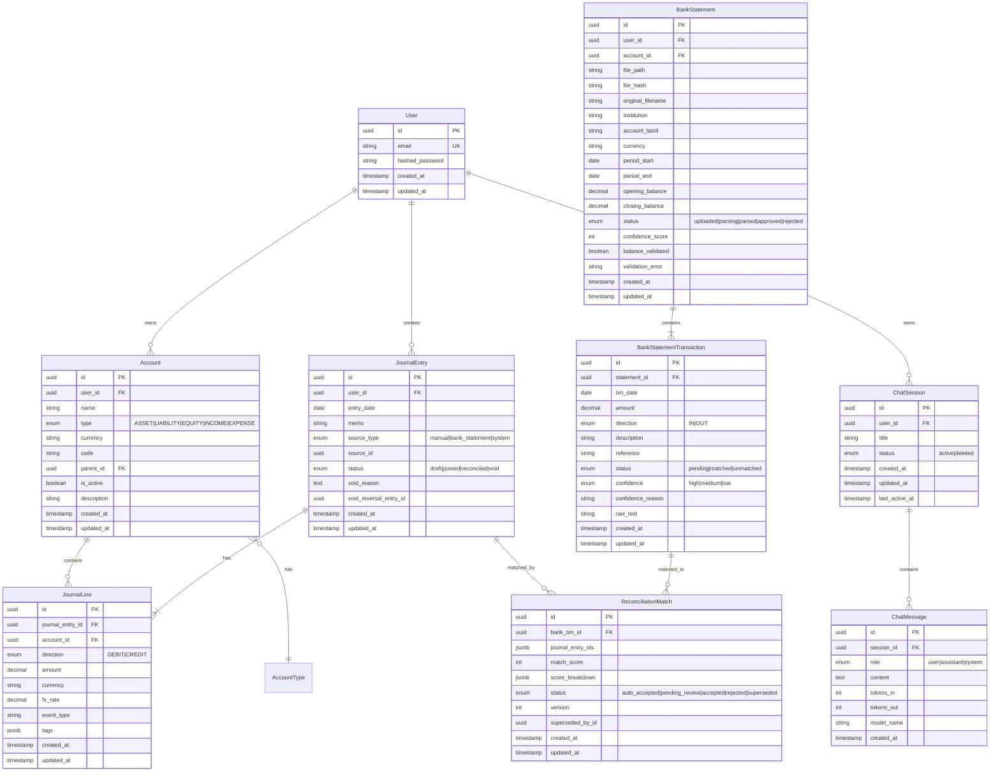

# Database Schema SSOT

> **SSOT Key**: `schema`
> **Core Definition**: PostgreSQL core table structures and relationships.

---

## 1. Source of Truth

| Dimension | Physical Location (SSOT) | Description |
|-----------|--------------------------|-------------|
| **Model Definition** | `apps/backend/src/models/` | SQLAlchemy ORM |
| **Migrations** | `apps/backend/migrations/` | Alembic |
| **Schema Validation** | `apps/backend/src/schemas/` | Pydantic |

> **Note**: Local dev currently calls `init_db()` to create tables; production should apply Alembic migrations.

---

## 2. ER Model



---

## 3. Core Table Specifications

### Users
User table, supports single-user scenario.

| Column | Type | Constraint | Description |
|--------|------|------------|-------------|
| id | UUID | PK | Primary key |
| email | VARCHAR(255) | UNIQUE, NOT NULL | Login email |
| hashed_password | VARCHAR(255) | NOT NULL | Password hash |
| created_at | TIMESTAMP | NOT NULL | Creation time |
| updated_at | TIMESTAMP | NOT NULL | Update time |

### Accounts
Chart of accounts table, five types.

| Column | Type | Constraint | Description |
|--------|------|------------|-------------|
| id | UUID | PK | Primary key |
| user_id | UUID | FK -> Users, NOT NULL | Owner user |
| name | VARCHAR(255) | NOT NULL | Account name |
| type | ENUM | NOT NULL | ASSET/LIABILITY/EQUITY/INCOME/EXPENSE |
| currency | CHAR(3) | NOT NULL | Currency code |
| code | VARCHAR(50) | | Account code (e.g., 1110) |
| parent_id | UUID | FK -> Accounts | Parent account |
| is_active | BOOLEAN | DEFAULT true | Is active |
| description | VARCHAR(500) | | Optional account description |
| created_at | TIMESTAMP | NOT NULL | Creation time |
| updated_at | TIMESTAMP | NOT NULL | Update time |

### JournalEntries
Journal entry header table.

| Column | Type | Constraint | Description |
|--------|------|------------|-------------|
| id | UUID | PK | Primary key |
| user_id | UUID | FK -> Users, NOT NULL | Owner user |
| entry_date | DATE | NOT NULL | Entry date |
| memo | VARCHAR(500) | NOT NULL | Description |
| source_type | ENUM | NOT NULL | manual/bank_statement/system |
| source_id | UUID | | Related source record |
| status | ENUM | NOT NULL | draft/posted/reconciled/void |
| void_reason | TEXT | | Void reason |
| void_reversal_entry_id | UUID | | Reversal entry ID |
| created_at | TIMESTAMP | NOT NULL | Creation time |
| updated_at | TIMESTAMP | NOT NULL | Update time |

### JournalLines
Journal entry line table.

| Column | Type | Constraint | Description |
|--------|------|------------|-------------|
| id | UUID | PK | Primary key |
| journal_entry_id | UUID | FK -> JournalEntries | Parent entry |
| account_id | UUID | FK -> Accounts | Account |
| direction | ENUM | NOT NULL | DEBIT/CREDIT |
| amount | DECIMAL(18,2) | NOT NULL | Amount |
| currency | CHAR(3) | NOT NULL | Currency |
| fx_rate | DECIMAL(12,6) | | Exchange rate |
| event_type | VARCHAR(100) | | Event type |
| tags | JSONB | | Tags |

### ChatSessions
Chat session header table.

| Column | Type | Constraint | Description |
|--------|------|------------|-------------|
| id | UUID | PK | Primary key |
| user_id | UUID | FK -> Users, NOT NULL | Owner user |
| title | VARCHAR(200) | | Optional session title |
| status | ENUM | NOT NULL | active/deleted |
| created_at | TIMESTAMP | NOT NULL | Creation time |
| updated_at | TIMESTAMP | NOT NULL | Update time |
| last_active_at | TIMESTAMP | | Last message activity |

### ChatMessages
Individual chat messages.

| Column | Type | Constraint | Description |
|--------|------|------------|-------------|
| id | UUID | PK | Primary key |
| session_id | UUID | FK -> ChatSessions, NOT NULL | Parent session |
| role | ENUM | NOT NULL | user/assistant/system |
| content | TEXT | NOT NULL | Message content |
| tokens_in | INTEGER | | Estimated prompt tokens |
| tokens_out | INTEGER | | Estimated completion tokens |
| model_name | VARCHAR(100) | | Model identifier |
| created_at | TIMESTAMP | NOT NULL | Creation time |

### BankStatements
Statement header table for imported statements.

| Column | Type | Constraint | Description |
|--------|------|------------|-------------|
| id | UUID | PK | Primary key |
| user_id | UUID | FK -> Users, NOT NULL | Owner user |
| account_id | UUID | FK -> Accounts | Linked account (nullable until confirmed) |
| file_path | VARCHAR(500) | NOT NULL | Storage path |
| file_hash | VARCHAR(64) | NOT NULL | SHA256 for dedup |
| original_filename | VARCHAR(255) | NOT NULL | Uploaded filename |
| institution | VARCHAR(100) | NOT NULL | Bank/broker name |
| account_last4 | VARCHAR(4) | | Last 4 digits |
| currency | CHAR(3) |  | Currency (nullable while parsing) |
| period_start | DATE |  | Statement start (nullable while parsing) |
| period_end | DATE |  | Statement end (nullable while parsing) |
| opening_balance | DECIMAL(18,2) |  | Opening balance (nullable while parsing) |
| closing_balance | DECIMAL(18,2) |  | Closing balance (nullable while parsing) |
| status | ENUM | NOT NULL | uploaded/parsing/parsed/approved/rejected |
| confidence_score | INT |  | Extraction confidence (nullable while parsing) |
| balance_validated | BOOLEAN |  | Balance check result (nullable while parsing) |
| validation_error | TEXT | | Validation notes |
| created_at | TIMESTAMP | NOT NULL | Creation time |
| updated_at | TIMESTAMP | NOT NULL | Update time |

**Constraints**:
- `(user_id, file_hash)` unique to prevent duplicate imports

### BankStatementTransactions
Statement transaction table (reconciliation input).

| Column | Type | Constraint | Description |
|--------|------|------------|-------------|
| id | UUID | PK | Primary key |
| statement_id | UUID | FK -> BankStatements | Parent statement |
| txn_date | DATE | NOT NULL | Transaction date |
| amount | DECIMAL(18,2) | NOT NULL | Absolute amount |
| direction | ENUM | NOT NULL | IN/OUT |
| description | TEXT | NOT NULL | Description/merchant |
| reference | VARCHAR(100) | | Reference |
| status | ENUM | NOT NULL | pending/matched/unmatched |
| confidence | ENUM | NOT NULL | high/medium/low |
| confidence_reason | TEXT | | Extraction notes |
| raw_text | TEXT | | OCR raw content |
| created_at | TIMESTAMP | NOT NULL | Creation time |
| updated_at | TIMESTAMP | NOT NULL | Update time |

### ReconciliationMatches
Reconciliation match table.

| Column | Type | Constraint | Description |
|--------|------|------------|-------------|
| id | UUID | PK | Primary key |
| bank_txn_id | UUID | FK -> BankStatementTransactions | Bank transaction |
| journal_entry_ids | JSONB | | Journal entry IDs |
| match_score | INT | NOT NULL | Composite score |
| score_breakdown | JSONB | | Score breakdown |
| status | ENUM | NOT NULL | auto_accepted/pending_review/accepted/rejected/superseded |
| version | INT | NOT NULL | Version number |
| superseded_by_id | UUID | | Next version ID |
| created_at | TIMESTAMP | NOT NULL | Creation time |
| updated_at | TIMESTAMP | NOT NULL | Update time |

**Constraints**:
- Each JournalEntry must have at least 2 JournalLines
- `SUM(DEBIT) = SUM(CREDIT)` (debit/credit balance)
- `JournalLine.amount > 0` (positive_amount check)

---

## 4. Design Constraints (Dos & Don'ts)

### Naming Conventions

- **Explicit Enums**: **ALWAYS** provide a `name` parameter to SQLAlchemy `Enum` types (e.g., `Enum(MyEnum, name="my_enum_type")`). This prevents SQLAlchemy from generating inconsistent default names (like `myenum`) which conflict with Alembic migrations and cause `UndefinedFunctionError` in Postgres.
- **Migration Length**: Keep Alembic migration descriptions concise. File names exceeding 100 characters may fail on certain file systems or Docker volumes.

### Async Session Management

To prevent connection leaks and data race conditions:

1.  **Dependency Injection**: Use the `get_db` FastAPI dependency for routers.
2.  **Transaction Boundary**:
    *   Routers should handle the high-level transaction (commit/rollback).
    *   Services should use `flush()` if they need to generate IDs, but avoid `commit()` unless they are designed as a "Closed Loop" transaction.
3.  **No Leaks**: Ensure every session is closed (handled by `get_db` generator).

### Recommended Patterns

- **Pattern A**: Use `DECIMAL(18,2)` for amounts, avoid float precision issues
- **Pattern B**: Use `created_at`/`updated_at` audit fields on mutable records
- **Pattern C**: Use UUID primary keys for distributed compatibility

### Prohibited Patterns

- **Anti-pattern A**: **NEVER** use FLOAT to store monetary amounts
- **Anti-pattern B**: **NEVER** directly delete posted entries, only void

---

## 5. Index Strategy

```sql
-- User query optimization
CREATE INDEX idx_accounts_user_id ON accounts(user_id);
CREATE INDEX idx_journal_entries_user_id ON journal_entries(user_id);
CREATE INDEX idx_journal_entries_status ON journal_entries(status);

-- Date range queries
CREATE INDEX idx_journal_entries_date ON journal_entries(entry_date);
CREATE INDEX idx_bank_statement_transactions_date ON bank_statement_transactions(txn_date);

-- Status queries
CREATE INDEX idx_bank_statements_status ON bank_statements(status);
CREATE INDEX idx_bank_statement_transactions_status ON bank_statement_transactions(status);
CREATE INDEX idx_recon_match_status ON reconciliation_matches(status);

-- Dedup for statement imports
CREATE UNIQUE INDEX idx_bank_statements_user_file_hash
    ON bank_statements(user_id, file_hash);
```

---

## Used by

- [AGENTS.md](../../AGENTS.md)
- [accounting.md](./accounting.md)

---

## 6. API Layer (Users)

Users API endpoints for user management.

### Endpoints

| Method | Path | Description |
|--------|------|-------------|
| POST | `/api/users` | Create new user |
| GET | `/api/users?limit=50&offset=0` | List users with pagination |
| GET | `/api/users/{user_id}` | Get user by ID |
| PUT | `/api/users/{user_id}` | Update user |

### Query Parameters

**List Users Pagination**
| Parameter | Type | Default | Range | Description |
|-----------|------|---------|-------|-------------|
| limit | int | 50 | 1-100 | Max items to return |
| offset | int | 0 | >=0 | Number of items to skip |

### Request/Response Schemas

**UserCreate**
```json
{
  "email": "user@example.com",
  "password": "securepassword123"
}
```

**UserResponse**
```json
{
  "id": "uuid",
  "email": "user@example.com",
  "created_at": "2026-01-12T00:00:00Z",
  "updated_at": "2026-01-12T00:00:00Z"
}
```

**UserListResponse (paginated)**
```json
{
  "items": [...],
  "total": 100
}
```

### Security Considerations

- **User Enumeration Prevention**: Error messages are generic ("Invalid registration data") to prevent email enumeration
- **Email Validation**: Uses `EmailStr` for format validation
- **Password Storage**: Passwords are hashed with bcrypt before storage

### Implementation

| Dimension | Location |
|-----------|----------|
| Router | `apps/backend/src/routers/users.py` |
| Schemas | `apps/backend/src/schemas/user.py` |
| Model | `apps/backend/src/models/user.py` |
