# Database Schema SSOT

> **SSOT Key**: `schema`
> **Core Definition**: PostgreSQL core table structures and relationships.

---

## 1. Source of Truth

| Dimension | Physical Location (SSOT) | Description |
|-----------|--------------------------|-------------|
| **Model Definition** | `apps/backend/src/models/` | SQLAlchemy ORM |
| **Migrations** | `apps/backend/migrations/` | Alembic |
| **Schema Validation** | `apps/backend/src/schemas/` | Pydantic |

---

## 2. ER Model

```mermaid
erDiagram
    User ||--o{ Account : owns
    User ||--o{ JournalEntry : creates
    
    Account ||--o{ JournalLine : contains
    Account }o--|| AccountType : has
    
    JournalEntry ||--|{ JournalLine : has
    JournalEntry ||--o{ ReconciliationMatch : matched_by
    
    BankStatement ||--|{ BankStatementTransaction : contains
    BankStatementTransaction ||--o{ ReconciliationMatch : matched_to
    
    User {
        uuid id PK
        string email UK
        string hashed_password
        timestamp created_at
    }
    
    Account {
        uuid id PK
        uuid user_id FK
        string name
        enum type "ASSET|LIABILITY|EQUITY|INCOME|EXPENSE"
        string currency
        string code
        uuid parent_id FK
        boolean is_active
    }
    
    JournalEntry {
        uuid id PK
        uuid user_id FK
        date entry_date
        string memo
        enum source_type "manual|bank_statement|system"
        uuid source_id
        enum status "draft|posted|reconciled|void"
        timestamp created_at
    }
    
    JournalLine {
        uuid id PK
        uuid journal_entry_id FK
        uuid account_id FK
        enum direction "DEBIT|CREDIT"
        decimal amount
        string currency
        decimal fx_rate
        string event_type
        jsonb tags
        timestamp created_at
        timestamp updated_at
    }
    
    BankStatement {
        uuid id PK
        uuid user_id FK
        uuid account_id FK
        string institution
        string account_last4
        string currency
        date period_start
        date period_end
        decimal opening_balance
        decimal closing_balance
        string file_path
        string file_hash
        string original_filename
        int confidence_score
        boolean balance_validated
        string validation_error
        timestamp created_at
        timestamp updated_at
        enum status "uploaded|parsing|parsed|approved|rejected"
    }
    
    BankStatementTransaction {
        uuid id PK
        uuid statement_id FK
        date txn_date
        decimal amount
        enum direction "IN|OUT"
        string description
        string reference
        enum status "pending|matched|unmatched"
        enum confidence "HIGH|MEDIUM|LOW"
        string confidence_reason
        string raw_text
        timestamp created_at
        timestamp updated_at
    }
    
    ReconciliationMatch {
        uuid id PK
        uuid bank_txn_id FK
        uuid[] journal_entry_ids
        int match_score
        jsonb score_breakdown
        enum status "auto_accepted|pending_review|accepted|rejected"
    }
```



---

## 3. Core Table Specifications

### Users
User table, supports single-user scenario.

| Column | Type | Constraint | Description |
|--------|------|------------|-------------|
| id | UUID | PK | Primary key |
| email | VARCHAR(255) | UNIQUE, NOT NULL | Login email |
| hashed_password | VARCHAR(255) | NOT NULL | Password hash |
| created_at | TIMESTAMP | NOT NULL | Creation time |

### Accounts
Chart of accounts table, five types.

| Column | Type | Constraint | Description |
|--------|------|------------|-------------|
| id | UUID | PK | Primary key |
| user_id | UUID | FK → Users | Owner user |
| name | VARCHAR(100) | NOT NULL | Account name |
| type | ENUM | NOT NULL | ASSET/LIABILITY/EQUITY/INCOME/EXPENSE |
| currency | CHAR(3) | NOT NULL | Currency code |
| code | VARCHAR(10) | | Account code (e.g., 1110) |
| parent_id | UUID | FK → Accounts | Parent account |
| is_active | BOOLEAN | DEFAULT true | Is active |
| description | VARCHAR(500) | | Optional account description |
| created_at | TIMESTAMP | NOT NULL | Creation time |
| updated_at | TIMESTAMP | NOT NULL | Update time |

### JournalEntries
Journal entry header table.

| Column | Type | Constraint | Description |
|--------|------|------------|-------------|
| id | UUID | PK | Primary key |
| user_id | UUID | FK → Users | Owner user |
| entry_date | DATE | NOT NULL | Entry date |
| memo | TEXT | | Description |
| source_type | ENUM | NOT NULL | manual/bank_statement/system |
| source_id | UUID | | Related source record |
| status | ENUM | NOT NULL | draft/posted/reconciled/void |
| created_at | TIMESTAMP | NOT NULL | Creation time |
| updated_at | TIMESTAMP | NOT NULL | Update time |

### JournalLines
Journal entry line table.

| Column | Type | Constraint | Description |
|--------|------|------------|-------------|
| id | UUID | PK | Primary key |
| journal_entry_id | UUID | FK → JournalEntries | Parent entry |
| account_id | UUID | FK → Accounts | Account |
| direction | ENUM | NOT NULL | DEBIT/CREDIT |
| amount | DECIMAL(18,2) | NOT NULL | Amount |
| currency | CHAR(3) | NOT NULL | Currency |
| fx_rate | DECIMAL(12,6) | | Exchange rate |
| event_type | VARCHAR(50) | | Event type |
| tags | JSONB | | Tags |
| created_at | TIMESTAMP | NOT NULL | Creation time |
| updated_at | TIMESTAMP | NOT NULL | Update time |

**Constraints**:
- Each JournalEntry must have at least 2 JournalLines
- `SUM(DEBIT) = SUM(CREDIT)` (debit/credit balance)

---

### BankStatements
Statement header table for imported statements.

| Column | Type | Constraint | Description |
|--------|------|------------|-------------|
| id | UUID | PK | Primary key |
| user_id | UUID | FK → Users | Owner user |
| account_id | UUID | FK → Accounts | Linked account (nullable until confirmed) |
| institution | VARCHAR(100) | NOT NULL | Institution name |
| account_last4 | VARCHAR(4) | | Last 4 digits |
| currency | CHAR(3) | NOT NULL | Currency code |
| period_start | DATE | NOT NULL | Statement start |
| period_end | DATE | NOT NULL | Statement end |
| opening_balance | DECIMAL(18,2) | NOT NULL | Opening balance |
| closing_balance | DECIMAL(18,2) | NOT NULL | Closing balance |
| file_path | TEXT | NOT NULL | Storage key |
| file_hash | CHAR(64) | NOT NULL | SHA256 for dedup |
| original_filename | TEXT | | User-provided name |
| confidence_score | INT | | 0-100 |
| balance_validated | BOOLEAN | DEFAULT false | Opening + txns ≈ closing |
| validation_error | TEXT | | Validation failure details |
| created_at | TIMESTAMP | NOT NULL | Creation time |
| updated_at | TIMESTAMP | NOT NULL | Update time |
| status | ENUM | NOT NULL | uploaded/parsing/parsed/approved/rejected |

**Constraints**:
- `(user_id, file_hash)` unique to prevent duplicate imports

### BankStatementTransactions
Statement transaction table.

| Column | Type | Constraint | Description |
|--------|------|------------|-------------|
| id | UUID | PK | Primary key |
| statement_id | UUID | FK → BankStatements | Parent statement |
| txn_date | DATE | NOT NULL | Transaction date |
| amount | DECIMAL(18,2) | NOT NULL | Absolute amount |
| direction | ENUM | NOT NULL | IN/OUT |
| description | TEXT | | Description/merchant |
| reference | VARCHAR(100) | | Optional reference |
| status | ENUM | NOT NULL | pending/matched/unmatched |
| confidence | ENUM | | HIGH/MEDIUM/LOW |
| confidence_reason | TEXT | | Optional confidence rationale |
| raw_text | TEXT | | Original OCR text |
| created_at | TIMESTAMP | NOT NULL | Creation time |
| updated_at | TIMESTAMP | NOT NULL | Update time |

---

## 4. Design Constraints (Dos & Don'ts)

### ✅ Recommended Patterns

- **Pattern A**: Use `DECIMAL(18,2)` for amounts, avoid float precision issues
- **Pattern B**: All tables include `created_at`, `updated_at` audit fields
- **Pattern C**: Use UUID primary keys for distributed compatibility

### ⛔ Prohibited Patterns

- **Anti-pattern A**: **NEVER** use FLOAT to store monetary amounts
- **Anti-pattern B**: **NEVER** directly delete posted entries, only void

---

## 5. Index Strategy

```sql
-- User query optimization
CREATE INDEX idx_accounts_user_id ON accounts(user_id);
CREATE INDEX idx_journal_entries_user_id ON journal_entries(user_id);

-- Date range queries
CREATE INDEX idx_journal_entries_date ON journal_entries(entry_date);
CREATE INDEX idx_bank_txn_date ON bank_statement_transactions(txn_date);

-- Status queries
CREATE INDEX idx_journal_entries_status ON journal_entries(status);
CREATE INDEX idx_recon_match_status ON reconciliation_matches(status);

-- Dedup for statement imports
CREATE UNIQUE INDEX idx_bank_statements_user_file_hash
    ON bank_statements(user_id, file_hash);
```

---

## Used by

- [AGENTS.md](../../AGENTS.md)
- [accounting.md](./accounting.md)
