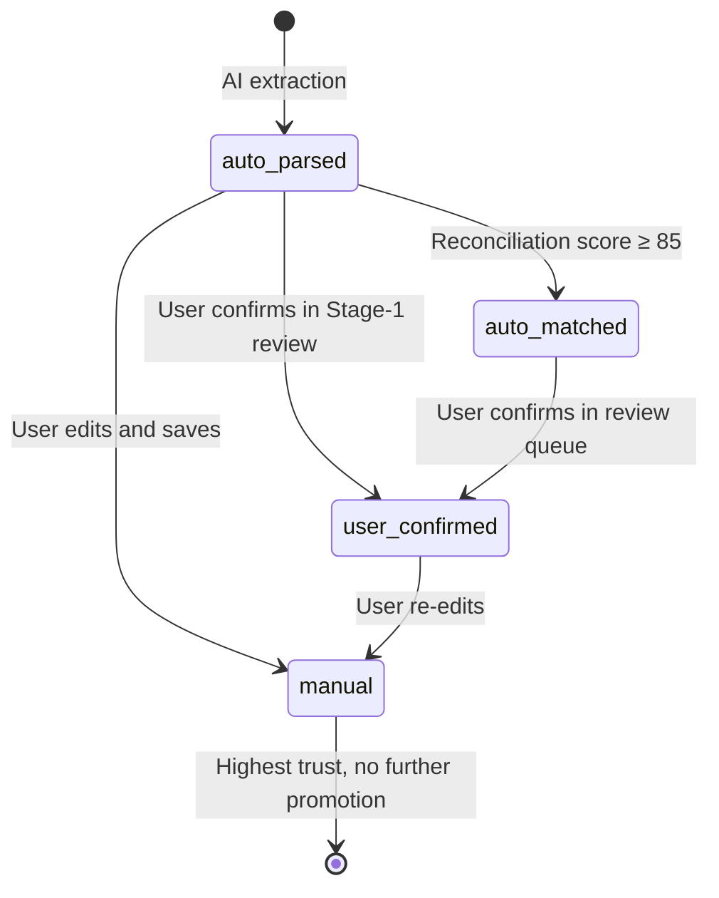

# Source Type Priority SSOT

> **SSOT Key**: `source-type-priority`
> **Core Definition**: Trust hierarchy for journal entry source types — determines which source wins when
> multiple sources report conflicting data for the same transaction.

---

## 1. Source of Truth

| Dimension | Physical Location (SSOT) | Description |
|-----------|--------------------------|-------------|
| **Enum Definition** | `apps/backend/src/models/journal.py` → `JournalEntrySourceType` | ORM enum values — **Note**: values below are the **planned target** enum; see implementation status callout |
| **Trust Logic** | _TBD (not yet implemented)_ | Conflict resolution in matching |
| **Router Usage** | `apps/backend/src/routers/journal.py` | `source_type` set on entry creation |
> ⚠️ **Implementation Status (Planned)**: The four-value trust hierarchy (`manual`, `user_confirmed`, `auto_matched`, `auto_parsed`) is a **design target** for EPIC-013 / EPIC-016, not yet in production code.
> The current `JournalEntrySourceType` enum in `journal.py` has values: `manual`, `bank_statement`, `system`, `fx_revaluation`.
> All verification tests in §6 are marked ⏳ Planned accordingly.
---

## 2. Trust Hierarchy

Defined in [vision.md](../../vision.md) Decision 6.

| Priority | Source Type | Trust Level | Description |
|----------|-------------|-------------|-------------|
| 1 (Highest) | `manual` | TRUSTED | User typed the entry directly — highest confidence |
| 2 | `user_confirmed` | HIGH | Auto-extracted, but user explicitly confirmed it |
| 3 | `auto_matched` | MEDIUM | Reconciliation engine matched at score ≥ 85 |
| 4 (Lowest) | `auto_parsed` | LOW | AI extracted from document, unconfirmed |

### Conflict Resolution Rule

When two sources disagree on the same transaction (amount, date, or classification):
**higher-priority source always wins.**

```
manual > user_confirmed > auto_matched > auto_parsed
```

Example: If `auto_parsed` produces amount = $100.00 and `manual` says $102.50,
the manual entry prevails and the auto-parsed record is flagged as superseded.

---

## 3. State Transitions



---

## 4. Design Constraints

### Recommended Patterns

- **Pattern A**: Always stamp `source_type` at entry creation time — never leave it null.
- **Pattern B**: Reconciliation engine sets `auto_matched` on the journal entry when it auto-accepts; keeps `auto_parsed` if deferred to review queue.
- **Pattern C**: When resolving a conflict, log both the winning and losing source_type in the audit trail (`ReconciliationMatch.score_breakdown`).
- **Pattern D**: UI must surface `source_type` with a trust badge (TRUSTED / HIGH / MEDIUM / LOW) so users know data confidence at a glance.

### Prohibited Patterns

- **Anti-pattern A**: **NEVER** downgrade source_type (e.g., from `manual` back to `auto_parsed`).
- **Anti-pattern B**: **NEVER** silently overwrite a `manual` entry with `auto_matched` data — require explicit user action.
- **Anti-pattern C**: **NEVER** omit `source_type` when creating journal entries via API.

---

## 5. API Contract

`source_type` is an **optional** field on `POST /api/journal-entries` (defaults to `manual` if omitted):

```json
{
  "source_type": "manual"
}
```

Allowed values: `manual`, `user_confirmed`, `auto_matched`, `auto_parsed` (planned target enum — see §1 Implementation Status).
The field is immutable after creation except via explicit promotion endpoints (Stage-1 approve, review queue confirm).

---

## 6. Verification (The Proof)

| Behavior | Test Function | File | Status |
|----------|---------------|------|--------|
| Source type stamped on manual entry creation | `test_source_type_stamped_on_create` | `reconciliation/test_source_type.py` | ⏳ Planned |
| Auto-matched sets source_type=auto_matched | `test_auto_match_sets_source_type` | `reconciliation/test_source_type.py` | ⏳ Planned |
| Stage-1 approve promotes to user_confirmed | `test_stage1_approve_promotes_source_type` | `extraction/test_source_type_promotion.py` | ⏳ Planned |
| Manual entry wins over auto_parsed in conflict | `test_manual_wins_conflict_resolution` | `reconciliation/test_source_type.py` | ⏳ Planned |
| source_type cannot be downgraded | `test_source_type_no_downgrade` | `reconciliation/test_source_type.py` | ⏳ Planned |

---

## Used by

- [reconciliation.md](./reconciliation.md) — Conflict resolution during matching
- [accounting.md](./accounting.md) — Journal entry creation rules
- [schema.md](./schema.md) — `journal_entries.source_type` column
