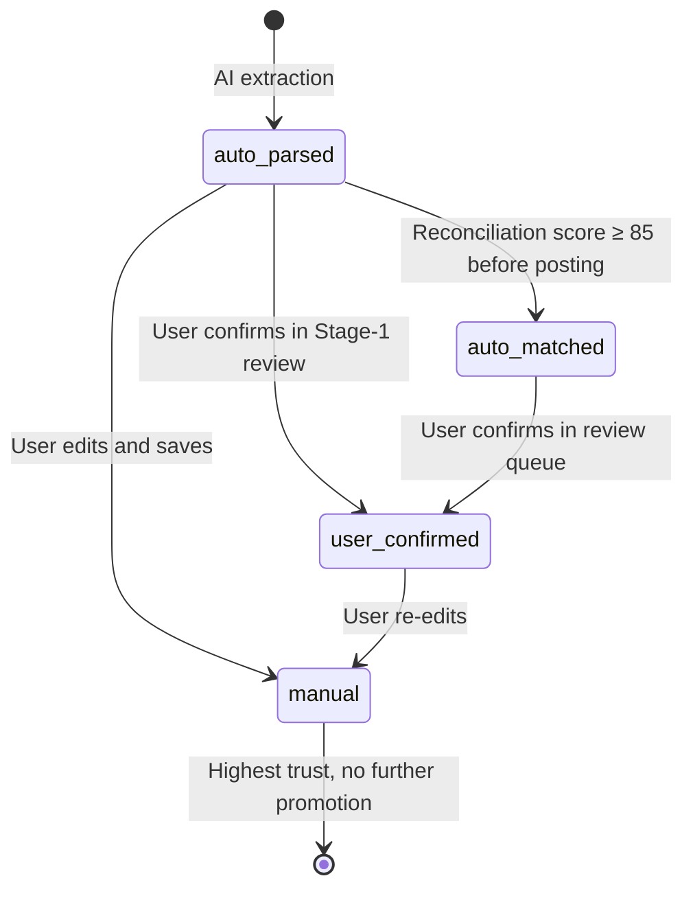

# Source Type Priority SSOT

> **SSOT Key**: `source-type-priority`
> **Core Definition**: Trust hierarchy for journal entry source types — determines which source wins when
> multiple sources report conflicting data for the same transaction.

---

## 1. Source of Truth

| Dimension | Physical Location (SSOT) | Description |
|-----------|--------------------------|-------------|
| **Enum Definition** | `apps/backend/src/models/journal.py` → `JournalEntrySourceType` | ORM enum values for journal source provenance |
| **Trust Logic** | `apps/backend/src/services/source_type_priority.py` | Promotion, no-downgrade, and source-aware tie-break helpers |
| **Router Usage** | `apps/backend/src/routers/journal.py` | `source_type` set on entry creation |

> **Implementation Status**: The four-value user-data trust hierarchy is implemented:
> `manual`, `user_confirmed`, `auto_matched`, `auto_parsed`.
> Internal/system source types remain available as `system` and `fx_revaluation`.
> `bank_statement` was a legacy value, **retired from the enum in migration 0040 (#896)**. Its historical
> rows were migrated to `auto_parsed` in 0018 and no write path emits it. The raw string is still tolerated
> defensively — `normalize_source_type` folds it into `auto_parsed` — so legacy inputs and the immutability
> trigger's text guard stay harmless.
---

## 2. Trust Hierarchy

Defined in [Project Vision](../target.md), under "Manual Data Is Explicitly Trusted".

| Priority | Source Type | Trust Level | Description |
|----------|-------------|-------------|-------------|
| 1 (Highest) | `manual` | TRUSTED | User typed the entry directly — highest confidence |
| 2 | `user_confirmed` | HIGH | Auto-extracted, but user explicitly confirmed it |
| 3 | `auto_matched` | MEDIUM | Reconciliation engine matched at score ≥ 85 before the entry became immutable |
| 4 (Lowest) | `auto_parsed` | LOW | AI extracted from document, unconfirmed |

### Conflict Resolution Rule

When two sources disagree on the same transaction (amount, date, or classification):
**higher-priority source always wins.**

```
manual > user_confirmed > auto_matched > auto_parsed
```

Example: If `auto_parsed` produces amount = $100.00 and `manual` says $102.50,
the manual entry prevails and the auto-parsed record is flagged as superseded.

---

## 3. State Transitions



---

## 4. Design Constraints

### Recommended Patterns

- **Pattern A**: Always stamp `source_type` at entry creation time — never leave it null.
- **Pattern B**: Reconciliation auto-accept records trusted match provenance on `ReconciliationMatch` and its normalized journal-entry anchor. It may set `source_type=auto_matched` only before the journal entry becomes posted/reconciled; immutable posted entries keep their original `source_type`.
- **Pattern C**: When resolving a conflict, log both the winning and losing source_type in the audit trail (`ReconciliationMatch.score_breakdown`).
- **Pattern D**: UI must surface `source_type` with a trust badge (TRUSTED / HIGH / MEDIUM / LOW) so users know data confidence at a glance.

### Prohibited Patterns

- **Anti-pattern A**: **NEVER** downgrade source_type (e.g., from `manual` back to `auto_parsed`).
- **Anti-pattern B**: **NEVER** silently overwrite a `manual` entry with `auto_matched` data — require explicit user action.
- **Anti-pattern C**: **NEVER** omit `source_type` when creating journal entries via API.

---

## 5. API Contract

`source_type` is an **optional** field on `POST /api/journal-entries` (defaults to `manual` if omitted):

```json
{
  "source_type": "manual"
}
```

Allowed user-data values: `manual`, `user_confirmed`, `auto_matched`, `auto_parsed`.
The field is immutable after creation except via explicit promotion endpoints (Stage-1 approve, review queue confirm). Auto-match provenance for already posted entries is represented by `ReconciliationMatch` and normalized anchor links, not by mutating the immutable journal row.

---

## 6. Verification (The Proof)

| Behavior | Test Function | File | Status |
|----------|---------------|------|--------|
| Source type stamped on manual entry creation | `test_source_type_stamped_on_create` | `reconciliation/test_source_type.py` | ✅ Implemented |
| Auto-matched records a trusted anchor without mutating posted source_type | `test_auto_match_records_anchor_without_mutating_posted_source_type` | `reconciliation/test_source_type.py` | ✅ Implemented |
| Stage-1 approve promotes to user_confirmed | `test_stage1_approve_promotes_source_type` | `extraction/test_source_type_promotion.py` | ✅ Implemented |
| Manual entry wins over auto_parsed in conflict | `test_manual_wins_conflict_resolution` | `reconciliation/test_source_type.py` | ✅ Implemented |
| source_type cannot be downgraded | `test_source_type_no_downgrade` | `reconciliation/test_source_type.py` | ✅ Implemented |
| All four source_type values accepted by API | `test_all_four_source_type_values_accepted_by_api` | `reconciliation/test_source_type.py` | ✅ Implemented |

---

## Used by

- [reconciliation.md](./reconciliation.md) — Conflict resolution during matching
- [accounting.md](./accounting.md) — Journal entry creation rules
- [schema.md](./schema.md) — `journal_entries.source_type` column
