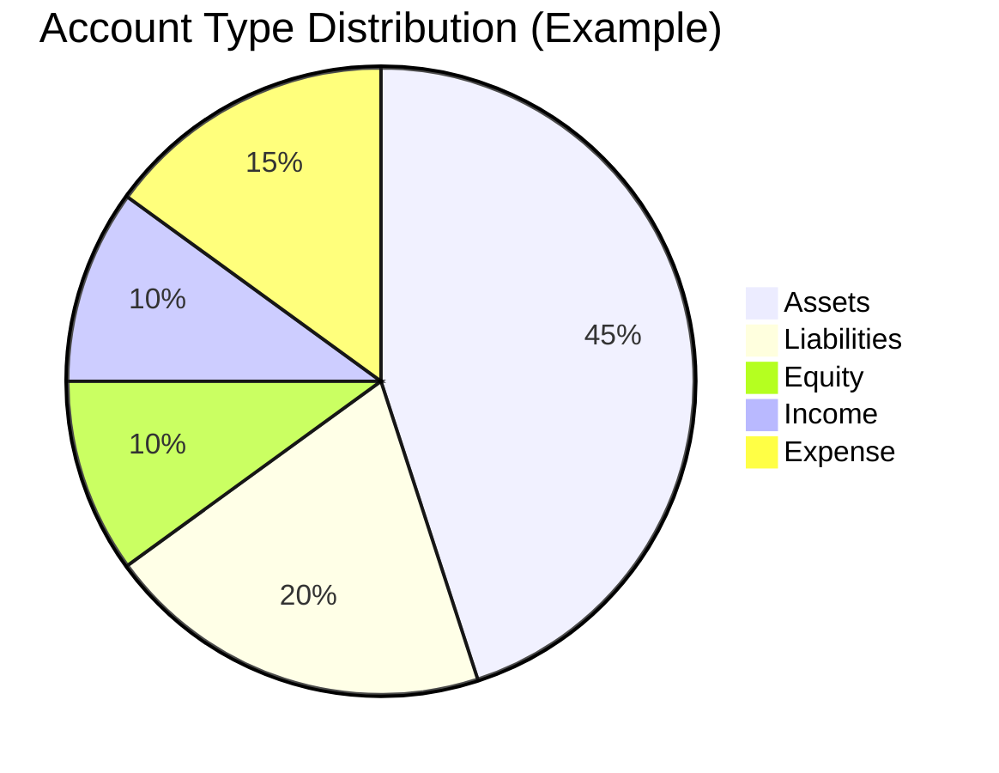

# Account Management

Accounts are the foundation of your financial tracking. This guide explains how to set up and manage your Chart of Accounts.

## Account Types

Finance Report supports five account types, following standard accounting principles:

| Type | Description | Normal Balance | Examples |
|------|-------------|----------------|----------|
| **Asset** | Resources you own | Debit | Bank accounts, Cash, Investments |
| **Liability** | Debts you owe | Credit | Credit cards, Loans, Mortgages |
| **Equity** | Net worth / Owner's stake | Credit | Opening balance, Retained earnings |
| **Income** | Money earned | Credit | Salary, Interest, Dividends |
| **Expense** | Money spent | Debit | Groceries, Rent, Utilities |



## Creating an Account

### Via Web Interface

1. Navigate to **Accounts** → **New Account**
2. Fill in the account details:
   - **Name**: Descriptive name (e.g., "Chase Checking")
   - **Type**: Select from Asset, Liability, Equity, Income, or Expense
   - **Currency**: Default is USD
   - **Description**: Optional notes

3. Click **Create Account**

### Via API

```bash
curl -X POST https://report.zitian.party/api/accounts \
  -H "Content-Type: application/json" \
  -d '{
    "name": "Chase Checking",
    "type": "ASSET",
    "currency": "USD",
    "description": "Primary checking account"
  }'
```

## Recommended Account Structure

### Personal Finance Setup

```
Assets/
├── Checking Account
├── Savings Account
├── Investment Account
└── Cash on Hand

Liabilities/
├── Credit Card - Visa
├── Credit Card - Amex
└── Student Loan

Equity/
└── Opening Balance

Income/
├── Salary
├── Interest Income
├── Dividend Income
└── Other Income

Expenses/
├── Housing/
│   ├── Rent/Mortgage
│   └── Utilities
├── Transportation/
│   ├── Gas
│   └── Car Insurance
├── Food/
│   ├── Groceries
│   └── Dining Out
├── Entertainment
└── Miscellaneous
```

### Small Business Setup

```
Assets/
├── Business Checking
├── Accounts Receivable
├── Inventory
└── Equipment

Liabilities/
├── Accounts Payable
├── Credit Line
└── Loans Payable

Equity/
├── Owner's Capital
└── Retained Earnings

Income/
├── Sales Revenue
├── Service Revenue
└── Interest Income

Expenses/
├── Cost of Goods Sold
├── Payroll
├── Rent
├── Utilities
├── Insurance
└── Office Supplies
```

## Account Properties

| Property | Type | Required | Description |
|----------|------|----------|-------------|
| `name` | string | ✅ | Unique account name |
| `type` | enum | ✅ | ASSET, LIABILITY, EQUITY, INCOME, EXPENSE |
| `currency` | string | ✅ | ISO 4217 code (default: USD) |
| `description` | string | ❌ | Optional notes |
| `is_active` | boolean | ❌ | Whether account can be used (default: true) |
| `parent_id` | UUID | ❌ | Parent account for hierarchy |

## Managing Accounts

### View Account Balance

The account balance is calculated from all posted journal entries:

```
Balance = Sum(Debits) - Sum(Credits)  [for Asset/Expense accounts]
Balance = Sum(Credits) - Sum(Debits)  [for Liability/Equity/Income accounts]
```

### Deactivate an Account

Inactive accounts cannot be used in new journal entries but preserve historical data:

```bash
curl -X PUT https://report.zitian.party/api/accounts/{id} \
  -H "Content-Type: application/json" \
  -d '{"is_active": false}'
```

!!! warning "Cannot Delete"
    Accounts with journal entries cannot be deleted, only deactivated.

### Account Hierarchy

Use parent accounts to organize your Chart of Accounts:

```bash
# Create parent account
curl -X POST https://report.zitian.party/api/accounts \
  -d '{"name": "Bank Accounts", "type": "ASSET"}'

# Create child account
curl -X POST https://report.zitian.party/api/accounts \
  -d '{"name": "Chase Checking", "type": "ASSET", "parent_id": "<parent-id>"}'
```

## Best Practices

!!! tip "Naming Convention"
    Use clear, descriptive names. Include the institution name for bank accounts.

!!! tip "Start Simple"
    Begin with basic accounts. Add more detailed categories as needed.

!!! tip "Consistent Currency"
    Use the same currency for related accounts unless you specifically need multi-currency tracking.

!!! warning "Don't Duplicate"
    Avoid creating multiple accounts for the same purpose. Use descriptions or tags instead.

## Next Steps

- [Create journal entries](journal-entries.md) to record transactions
- [Import bank statements](reconciliation.md) for automatic matching
- [View API reference](../reference/api-accounts.md) for advanced operations
