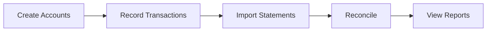

# Getting Started

This guide will help you set up Finance Report and start tracking your finances.

## Prerequisites

- A modern web browser (Chrome, Firefox, Safari, Edge)
- Bank statements in PDF or CSV format (for import)

## Accessing the Application

Visit [report.zitian.party](https://report.zitian.party) to access the live application.

!!! note "Demo Mode"
    The current deployment is in demo mode. Data may be reset periodically.

## First Steps

### 1. Create Your Accounts

Before recording transactions, set up your Chart of Accounts:



**Recommended starter accounts:**

| Account Name | Type | Purpose |
|--------------|------|---------|
| Checking Account | Asset | Primary bank account |
| Savings Account | Asset | Savings |
| Credit Card | Liability | Credit card balance |
| Salary | Income | Employment income |
| Groceries | Expense | Food expenses |
| Utilities | Expense | Bills |

See [Account Management](accounts.md) for detailed setup instructions.

### 2. Record Your First Transaction

Create a journal entry to record a transaction:

=== "Example: Receive Salary"

    | Line | Account | Debit | Credit |
    |------|---------|-------|--------|
    | 1 | Checking Account | $5,000 | |
    | 2 | Salary | | $5,000 |

=== "Example: Pay for Groceries"

    | Line | Account | Debit | Credit |
    |------|---------|-------|--------|
    | 1 | Groceries | $150 | |
    | 2 | Checking Account | | $150 |

See [Journal Entries](journal-entries.md) for more examples.

### 3. Import Bank Statements

Upload your bank statements for automatic transaction extraction:

1. Navigate to **Statements** → **Upload**
2. Select your PDF or CSV file
3. AI will extract transactions automatically
4. Review and confirm extracted data

### 4. Reconcile Transactions

Match your recorded entries with bank statement transactions:

1. Go to **Reconciliation** → **Run Matching**
2. Review auto-matched transactions (score ≥ 85)
3. Manually review pending matches (score 60-84)
4. Handle unmatched transactions

See [Bank Reconciliation](reconciliation.md) for the complete workflow.

## Understanding Double-Entry Bookkeeping

Finance Report uses double-entry bookkeeping, where every transaction affects at least two accounts:

!!! info "The Fundamental Equation"
    ```
    Assets = Liabilities + Equity + (Income - Expenses)
    ```

### Debit and Credit Rules

| Account Type | Debit Increases | Credit Increases |
|--------------|-----------------|------------------|
| **Asset** | ✅ | ❌ |
| **Liability** | ❌ | ✅ |
| **Equity** | ❌ | ✅ |
| **Income** | ❌ | ✅ |
| **Expense** | ✅ | ❌ |

### Example: Paying a Bill

When you pay a $100 utility bill with your checking account:

```
Debit:  Utilities (Expense)  +$100  ← Expense increases
Credit: Checking (Asset)     -$100  ← Asset decreases
```

Both sides equal $100, keeping the books balanced.

## Keyboard Shortcuts

| Shortcut | Action |
|----------|--------|
| `N` | New journal entry |
| `S` | Save current form |
| `Esc` | Cancel / Close dialog |
| `?` | Show help |

## Next Steps

- [Set up your accounts](accounts.md)
- [Learn about journal entries](journal-entries.md)
- [Master bank reconciliation](reconciliation.md)
- [Explore the API](../reference/api-overview.md)

## Need Help?

- Check the [API Documentation](https://report.zitian.party/api/docs)
- Report issues on [GitHub](https://github.com/wangzitian0/finance_report/issues)
