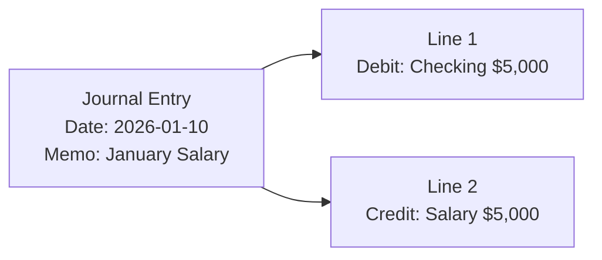
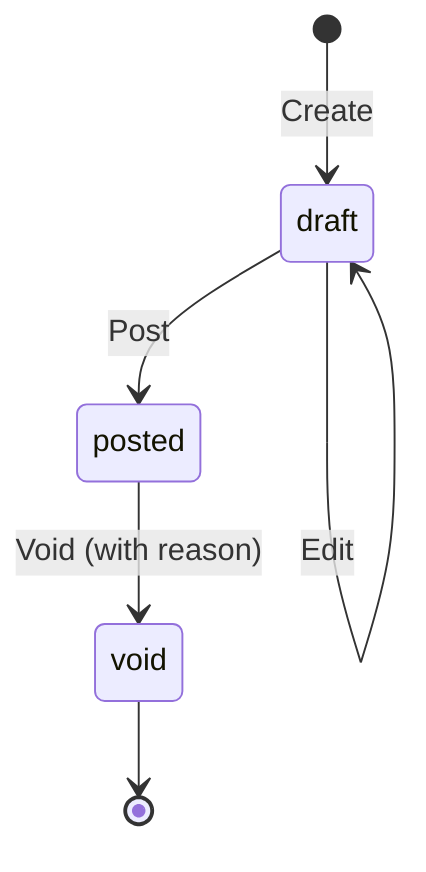

# Journal Entries

Journal entries are the core of double-entry bookkeeping. Every financial transaction is recorded as a journal entry with balanced debits and credits.

## Entry Structure

Every journal entry consists of:

- **Header**: Date, memo, status
- **Lines**: Individual debit/credit entries (minimum 2)



!!! important "Balance Rule"
    Total debits must equal total credits. The system will reject unbalanced entries.

## Entry Lifecycle



| Status | Description | Editable |
|--------|-------------|----------|
| **Draft** | Work in progress | ✅ Yes |
| **Posted** | Finalized, affects balances | ❌ No |
| **Void** | Cancelled with reversal | ❌ No |

## Creating Entries

### Via Web Interface

1. Go to **Journal** → **New Entry**
2. Enter date and memo
3. Add lines:
   - Select account
   - Choose Debit or Credit
   - Enter amount
4. Click **Save as Draft** or **Post**

### Via API

```bash
curl -X POST https://report.zitian.party/api/journal-entries \
  -H "Content-Type: application/json" \
  -d '{
    "entry_date": "2026-01-10",
    "memo": "January salary deposit",
    "lines": [
      {
        "account_id": "<checking-account-id>",
        "direction": "DEBIT",
        "amount": "5000.00",
        "currency": "USD"
      },
      {
        "account_id": "<salary-account-id>",
        "direction": "CREDIT",
        "amount": "5000.00",
        "currency": "USD"
      }
    ]
  }'
```

## Common Transaction Examples

### Receive Income

=== "Salary"

    | Account | Debit | Credit |
    |---------|-------|--------|
    | Checking Account (Asset) | $5,000 | |
    | Salary (Income) | | $5,000 |

=== "Interest"

    | Account | Debit | Credit |
    |---------|-------|--------|
    | Savings Account (Asset) | $50 | |
    | Interest Income (Income) | | $50 |

### Pay Expenses

=== "Rent"

    | Account | Debit | Credit |
    |---------|-------|--------|
    | Rent (Expense) | $2,000 | |
    | Checking Account (Asset) | | $2,000 |

=== "Credit Card Payment"

    | Account | Debit | Credit |
    |---------|-------|--------|
    | Credit Card (Liability) | $500 | |
    | Checking Account (Asset) | | $500 |

### Transfer Between Accounts

=== "Checking to Savings"

    | Account | Debit | Credit |
    |---------|-------|--------|
    | Savings Account (Asset) | $1,000 | |
    | Checking Account (Asset) | | $1,000 |

### Credit Card Purchase

=== "Groceries on Credit"

    | Account | Debit | Credit |
    |---------|-------|--------|
    | Groceries (Expense) | $150 | |
    | Credit Card (Liability) | | $150 |

## Compound Entries

Sometimes a single transaction affects more than two accounts:

### Salary with Deductions

| Account | Debit | Credit |
|---------|-------|--------|
| Checking Account (Asset) | $4,200 | |
| Tax Withholding (Liability) | | $600 |
| Health Insurance (Expense) | | $200 |
| Salary (Income) | | $5,000 |

**Total debits**: $4,200 + $600 + $200 = $5,000  
**Total credits**: $5,000 ✅

## Posting Entries

Draft entries don't affect account balances. To finalize:

```bash
curl -X POST https://report.zitian.party/api/journal-entries/{id}/post
```

!!! warning "Posted entries cannot be edited"
    Once posted, an entry is permanent. To correct, you must void it and create a new entry.

## Voiding Entries

To cancel a posted entry:

```bash
curl -X POST https://report.zitian.party/api/journal-entries/{id}/void \
  -H "Content-Type: application/json" \
  -d '{"reason": "Duplicate entry"}'
```

This creates a **reversal entry** that cancels out the original:

Original entry:
| Account | Debit | Credit |
|---------|-------|--------|
| Groceries | $150 | |
| Checking | | $150 |

Reversal entry (auto-created):
| Account | Debit | Credit |
|---------|-------|--------|
| Checking | $150 | |
| Groceries | | $150 |

## Source Types

Entries can be created from different sources:

| Source | Description |
|--------|-------------|
| `manual` | User-created entry |
| `import` | From bank statement import |
| `system` | Auto-generated (e.g., void reversals) |
| `reconciliation` | Created during reconciliation |

## Entry Properties

| Property | Type | Required | Description |
|----------|------|----------|-------------|
| `entry_date` | date | ✅ | Transaction date |
| `memo` | string | ❌ | Description |
| `status` | enum | ✅ | draft, posted, void |
| `source_type` | enum | ✅ | manual, import, system, reconciliation |
| `lines` | array | ✅ | Journal lines (min 2) |

### Line Properties

| Property | Type | Required | Description |
|----------|------|----------|-------------|
| `account_id` | UUID | ✅ | Target account |
| `direction` | enum | ✅ | DEBIT or CREDIT |
| `amount` | Decimal | ✅ | Positive amount |
| `currency` | string | ✅ | ISO 4217 code |

## Best Practices

!!! tip "Use Descriptive Memos"
    Include payee, purpose, and reference numbers in the memo.

!!! tip "Date Accuracy"
    Use the actual transaction date, not the entry date.

!!! tip "Review Before Posting"
    Double-check accounts and amounts before posting.

!!! tip "Regular Reconciliation"
    Reconcile with bank statements monthly to catch errors.

## Next Steps

- [Reconcile with bank statements](reconciliation.md)
- [View API reference](../reference/api-journal.md)
- [Understand the accounting model](../ssot/accounting.md)
